# Domain trong cPanel

## Quản lý Domain

- Đăng nhập vào trang quản trị cPanel của user, để quản lý Domain, chọn ```Domains``` trong tab ```DOMAINS```

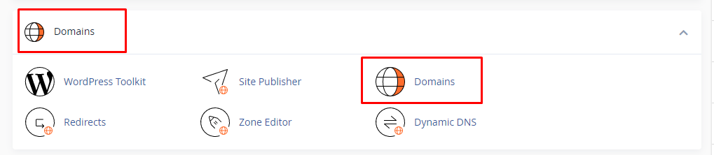

- Ta có thể làm rất nhiều thứ ở đây

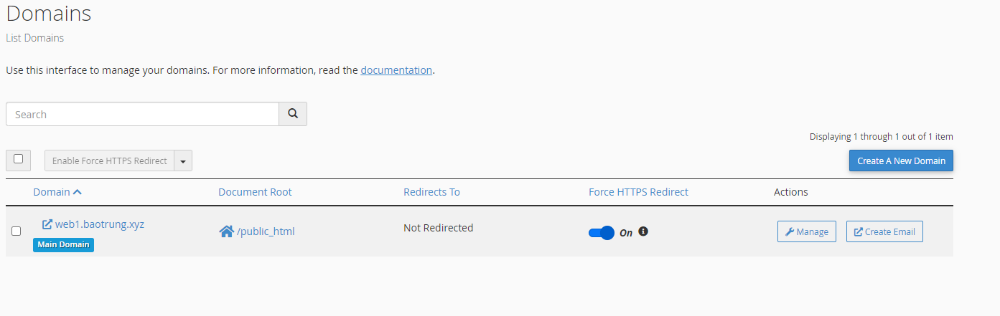

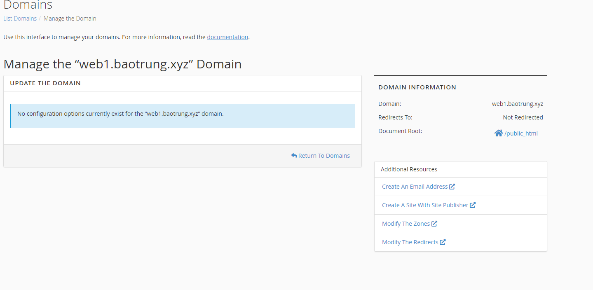

- Để xóa 1 domain, ta vào phần ```Manage``` của domain cần xóa rồi chọn ```Remove Domain```

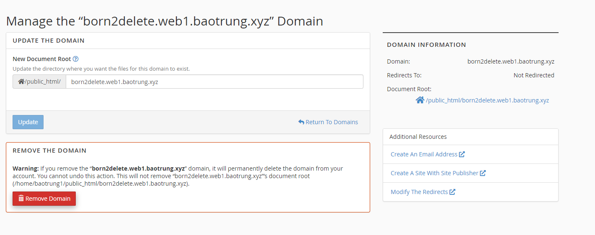

## Aliases

- Alias Domain là tên miền bí danh, hoạt động đồng thời với tên miền chính. Khi truy cập vào tên miền bí danh, nội dung trang web sẽ trỏ về tên miền chính

- Để tạo 1 tên miền trong cPanel, truy cập trang quản lý cPanel, chọn ```Aliases``` ở phần ```DOMAINS```

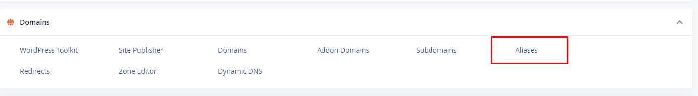

## Redirects

- Redirects là chứng năng cho phép chuyển hướng từ 1 trang web sang 1 trang web khác

- Trên web quản trị cPanel của user, tìm đến mục **DOMAINS**, chọn ```Redirects```

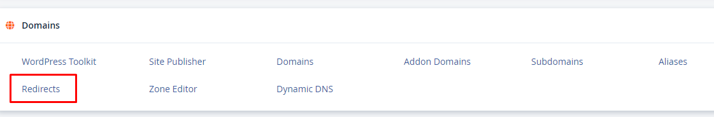

- Nhập thông tin và chọn loại redirect

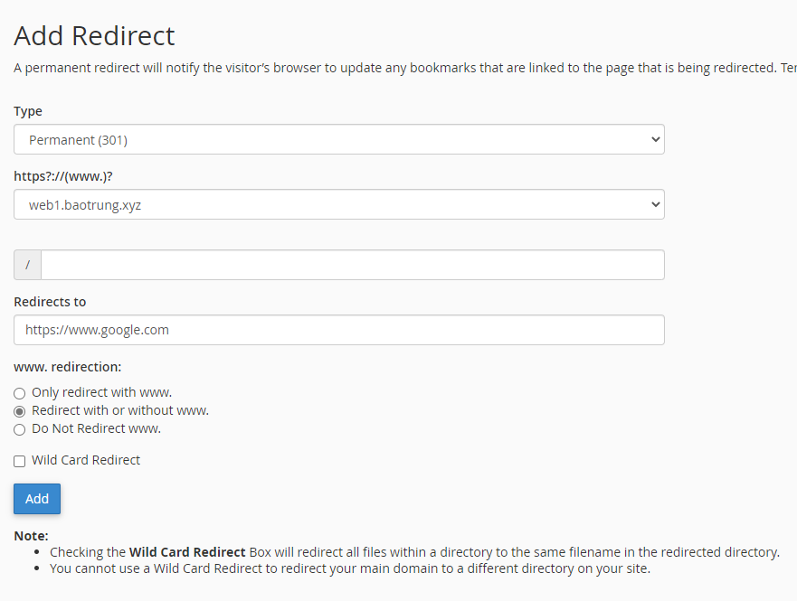

- Muốn xóa thì ấn vào nút ```Delete``` ngay cạnh

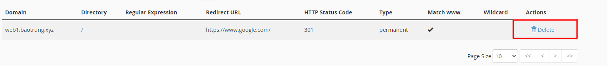

## Addon Domains

- cPanel cho phép người dùng tạo nhiều domain trên cùng 1 tài khoản (account) giúp quản lý đa miền tốt hơn

- Trên web quản trị cPanel của user, tìm đến mục **DOMAINS**, chọn ```Addon Domains```

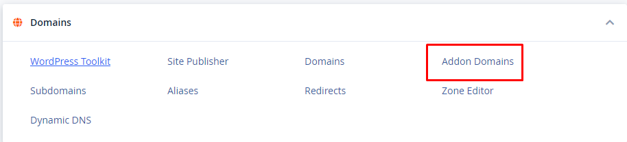

- Nhập tên miền của trang web, mặc định cPanel sẽ tự động điền subdomain và document root, sau đó chọn ```Add Domain``` khi đã hoàn tất

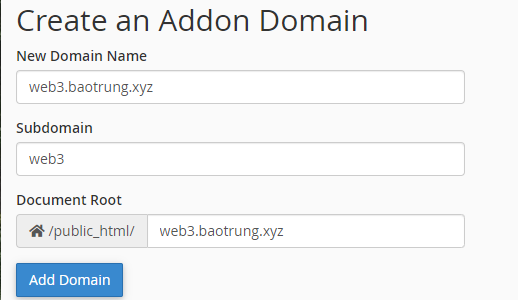

- Trong trường hợp không thể tạo được **Addon Domain**, truy cập trang WHM, trong phần ```Server Configuration```, chọn ```Tweak Settings``` -> ```Domains``` và bật 2 tùy chọn sau

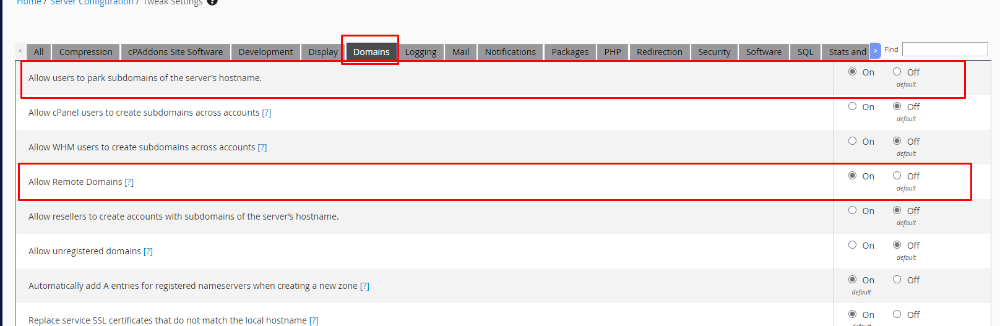

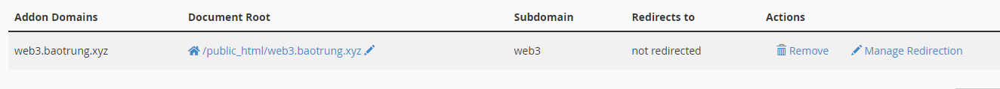

## Subdomain

- Để quản lý subdomain, đăng nhập trang cPanel của user, tại mục ```DOMAINS```, chọn ```Subdomains```

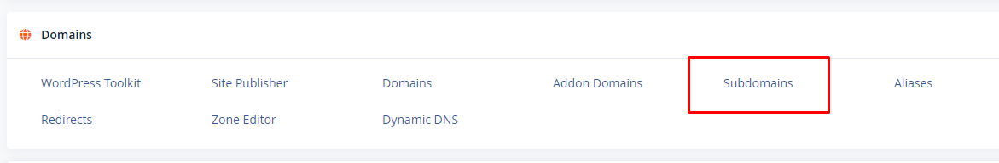

- Nhập thông tin cho subdomain và chọn ```Create``` để tạo, ngay bên dưới là phần quản lý subdomain

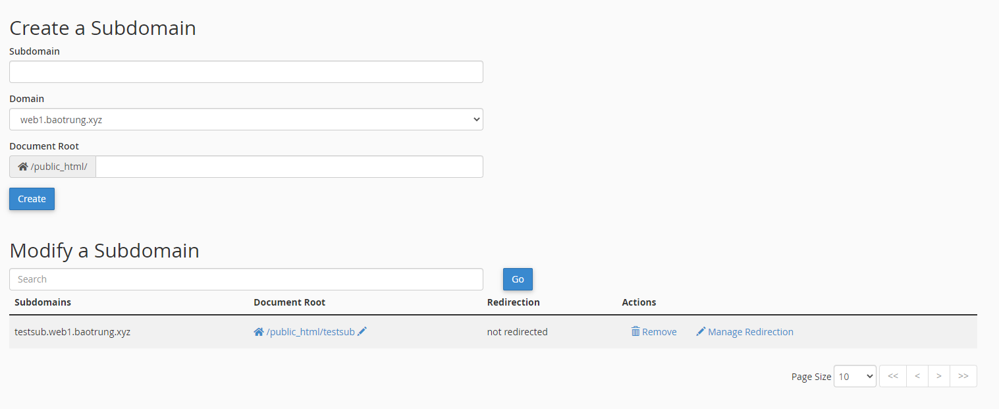