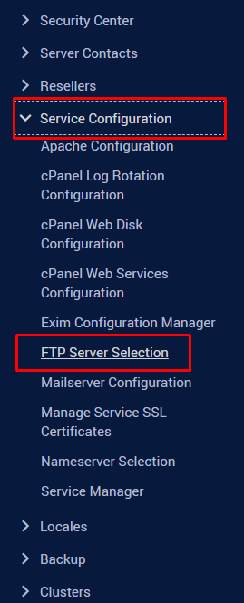
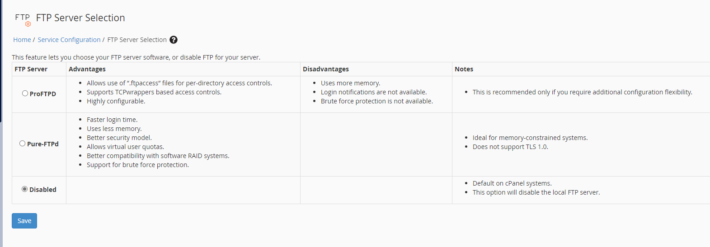
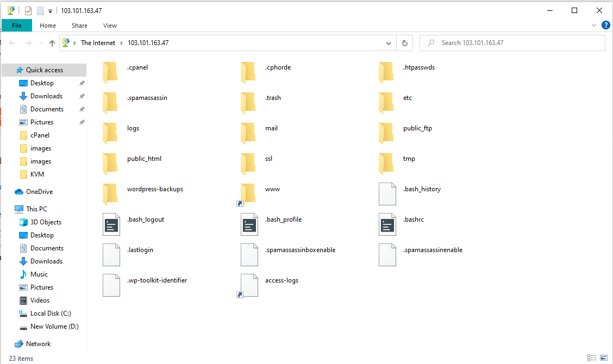

# Cài đặt FTP Server trên cPanel

- Đăng nhập vào trang quản trị WHM

- Trên thanh **Navigation**, chọn ```Service Configuration``` -> ```FTP Server Selection```



- Trên cPanel có 2 loại FTP Server mà ta có thể lựa chọn là **ProFTPD** và **Pure-FTPd**, ở đây cũng có viết rõ ưu nhược điểm của từng loại FTP Server. Dựa vào đó hãy tick chọn cho mình loại FTP Server phù hợp và nhấn ```Save```



- Không phải config gì thêm, FTP thử vào 1 tài khoản:

