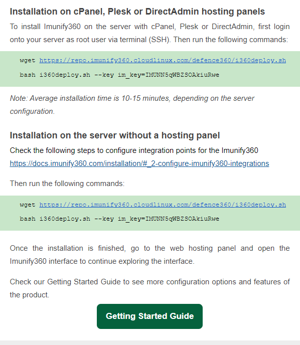
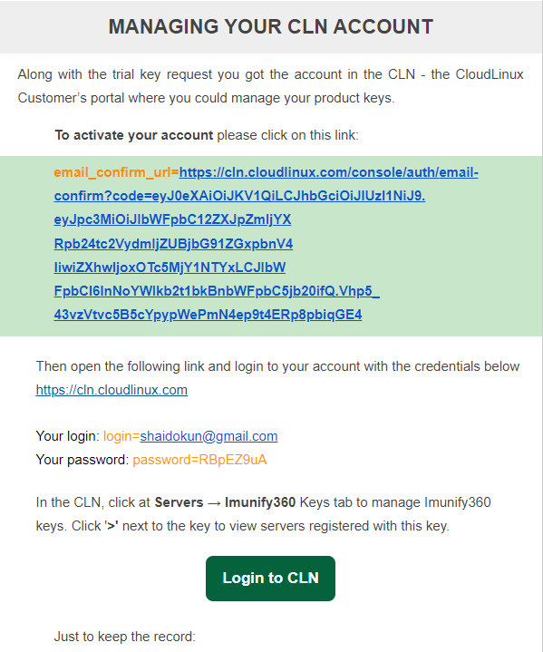
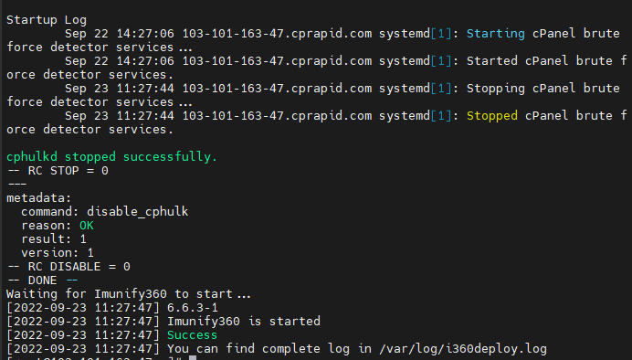
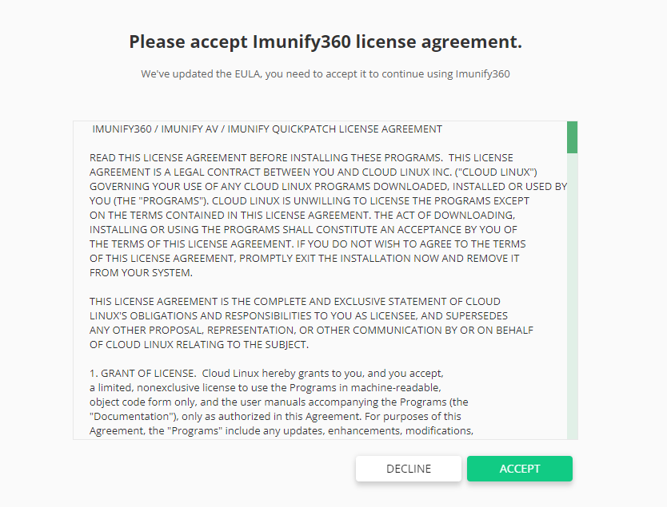
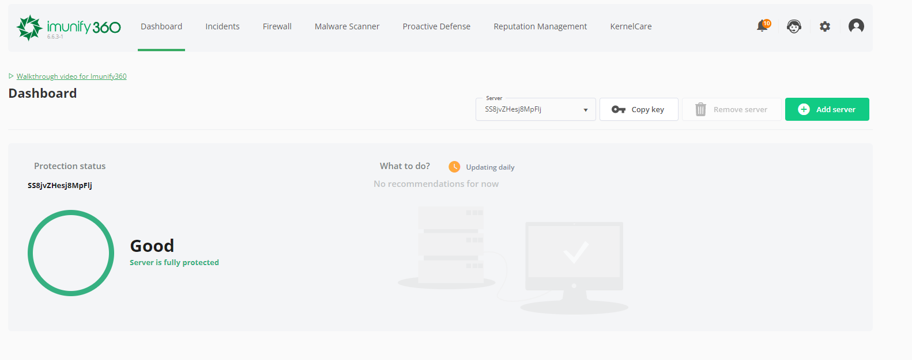

# Imunify360 trong cPanel

Imunify là giải pháp bảo mật thế hệ mới được thiết kế đặc biệt dành cho máy chủ trên nền tảng Linux, Imunify360 được phát triển bởi CloudLinux Inc. Với 6 lớp bảo mật của mình, Imunify360 cung cấp giải pháp bảo mật toàn diện chống lại các cuộc tấn công gây hại đến hệ thống máy chủ

Imunify360 hỗ trợ sẵn trong cPanel, Plesk, DirectAdmin và yêu cầu các trình duyệt Safari, Chrome, Firefox cũng như Edge

### Các bước cài đặt

**Bước 1: Chuẩn bị Key Imunify360**

- Để cài đặt được Imunify360 lên WHM/cPanel, bạn cần có key bản quyền thì mới cài được. Có thể đăng ký bản dùng thử của Imunify360 tại đây [Trial Imunify 360](https://trial4.imunify360.com/)

- Check mail để lấy key và hướng dẫn cài đặt



- Tài khoản và mật khẩu để đăng nhập vào trang quản trị Imunify360



**Bước 2: Cài đặt Imunify360**

- SSH vào VPS và chạy các lệnh như được hướng dẫn trong mail

```sh
cd ~
wget https://repo.imunify360.cloudlinux.com/defence360/i360deploy.sh
bash i360deploy.sh --key IMUNN5qWBZSOAkiuRwe
```

*Quá trình cài đặt có thể sẽ tốn 1 lúc (hoặc nhiều lúc)*



- Update phiên bản Imunify360 mới

```sh
cd ~
wget https://repo.imunify360.cloudlinux.com/defence360/imunify-force-update.sh
bash imunify-force-update.sh
```

- Nếu cần gỡ cài đặt Imunify360, ta có thể sử dụng lệnh ```bash i360deploy.sh --uninstall```

**Bước 3: Thiết lập Imunify360 trên WHM/cPanel**

- Để thiết lập Imunify360 trên cPanel, ta đăng nhập vào trang quản trị WHM qua cổng 2087, trên thanh **Navigation** chọn ```Plugins``` -> ```Imunify360```


- Chấp nhận điều khoản dịch vụ



- Giao diện quản trị chính của Imunify360



- Với tính năng ```Malware Scanner```, ta có thể:
    - ```USERS```: scan theo user
    - ```FILES```: hiển thị file Malware hệ thống scan được
    - ```SCAN```: scan theo đường dẫn được thiết lập cụ thể
    - ```HISTORY```: lịch sử scan
    - ```IGNORE LIST```: thiết lập đường dẫn cho Imunify360 bỏ qua khi scan
