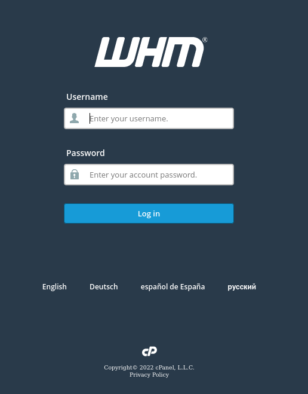
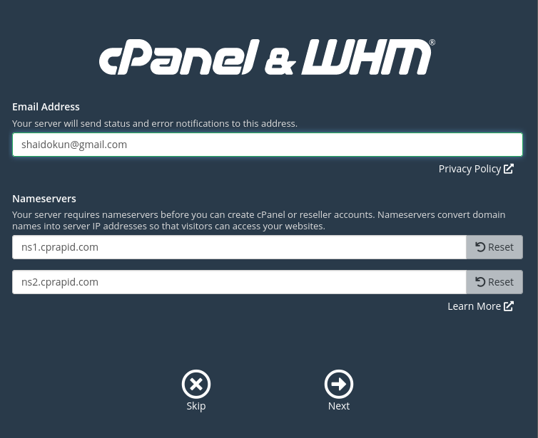
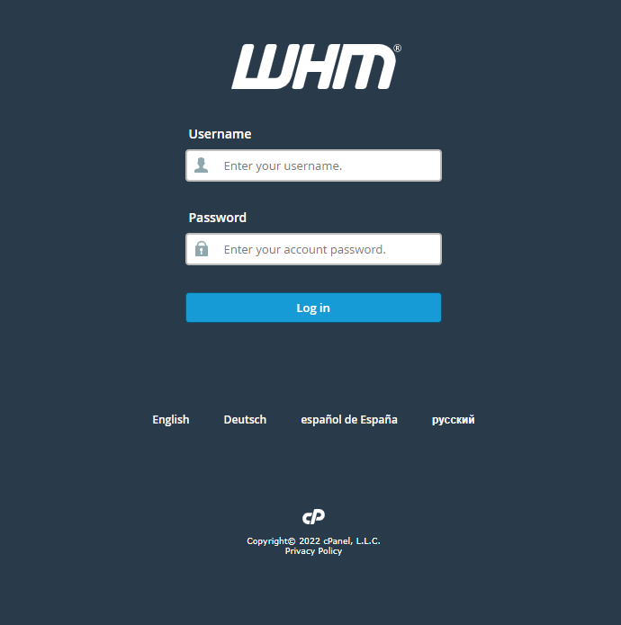
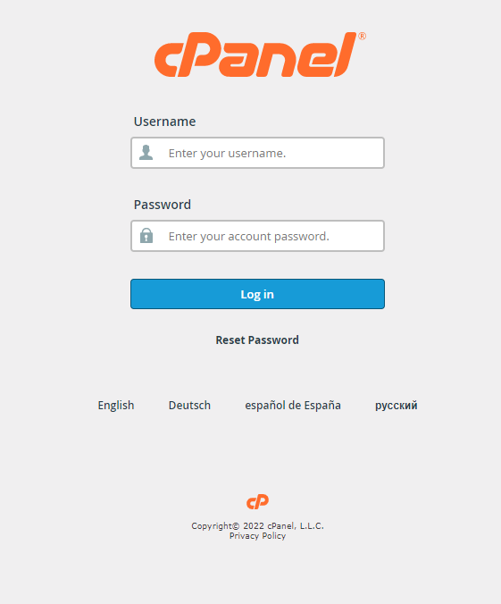

# Cài đặt cPanel trên hđh CentOS 7

#### 1. Cập nhật hệ thống, tắt các dịch vụ không cần thiết

```sh
yum update -y
systemctl stop httpd
systemctl disable httpd
systemctl stop NetworkManager
systemctl disable NetworkManager
## Vào file config card mạng và thêm dòng
NM_CONTROLLED = "no"
```

#### 2. Cài đặt perl và curl

```sh
yum install perl curl -y
```

#### 3. Cài đặt cPanel

```sh
cd /home
curl -o latest -L https://securedownloads.cpanel.net/latest
sh latest
```

#### 4. Sử dụng trình duyệt để truy cập trang quản lý tại cổng 2087 và đăng nhập bằng tên và mật khẩu của tài khoản root trên server



#### 5. Chấp nhận điều khoản

#### 6. Nhập thông tin về email để nhận thông báo lỗi và sửa Nameserver nếu cần thiết



#### 7. Đăng nhập vào tài khoản cPanel Free Trial hoặc bản quyền


#### 8. Kích hoạt quyền dùng thử


#### 9. Trang chính của WHM

- WHM tại cổng 2087



- cPanel tại cổng 2083


