# Tạo và đăng nhập email trên cPanel

- Đăng nhập vào trang quản trị cPanel và chọn ```Email Accounts``` để vào giao diện tạo tài khoản 

- Ở mục **EMAIL**, chọn ```Email Accounts``` để vào giao diện tạo tài khoản

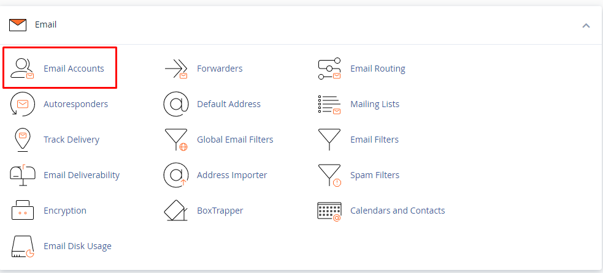

- Nhập thông tin tài khoản mật khẩu

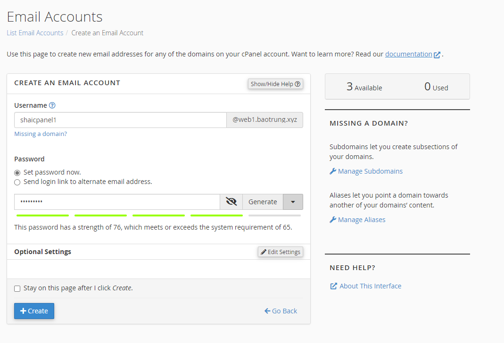

- Nhập dung lượng cho phép trên tài khoản, mặc định là 1 GB. Cuối cùng nhấn ```Create``` để tạo tài khoản

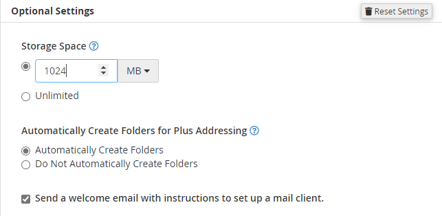

- Nhấn ```Check Email``` để vào webmail client

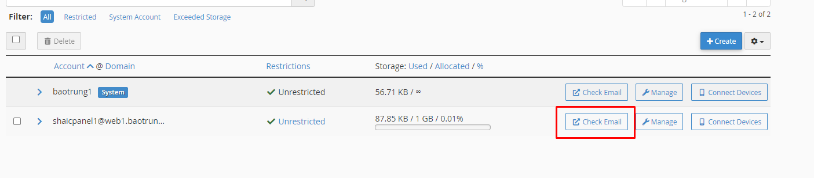

- ```Open```

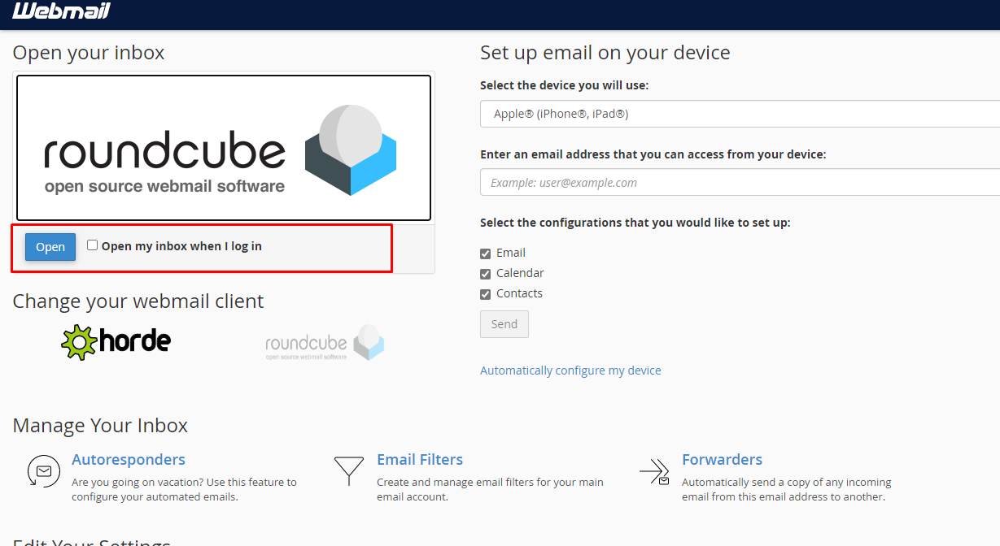

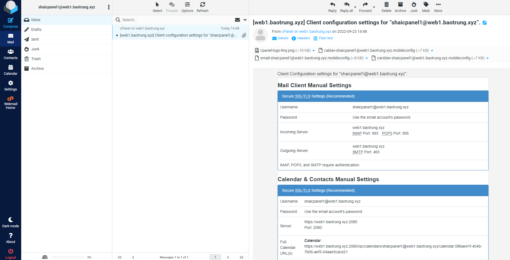

- Hoặc đăng nhập bằng đường dẫn ```webmail.baotrung.xyz:2096```

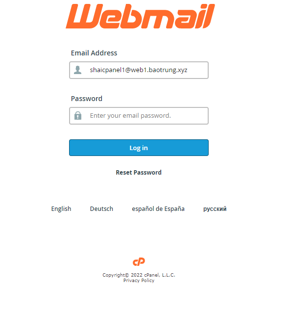

### Lấy bản ghi DKIM và SPF trên cPanel

- Tại giao diện quản trị cPanel của account, tìm đến ```EMAILS``` -> ```Email Deliverability```

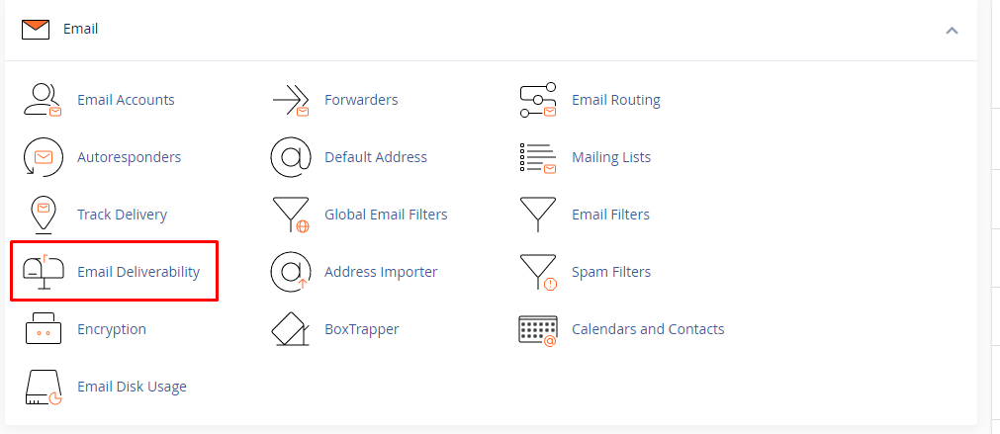

- ```Manage```

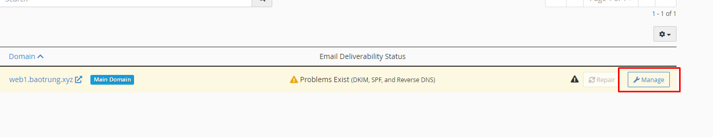

- Tạo bản ghi DKIM trên nameserver như sau (**lưu ý là xóa dấu ";" ở cuối đi**)

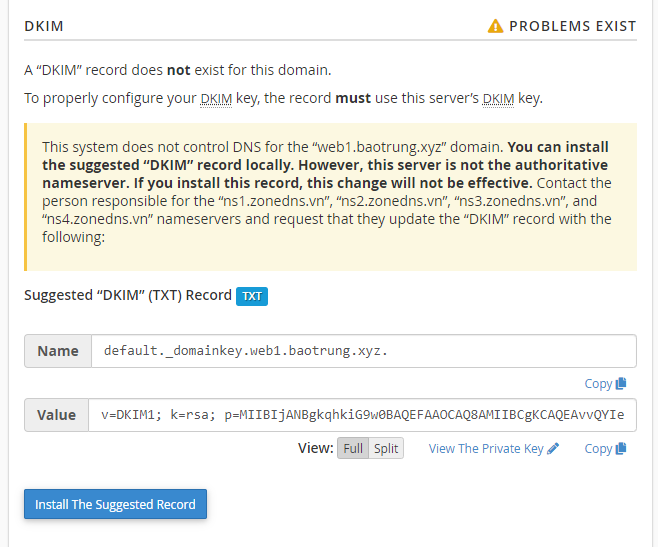

- Tương tự với SPF

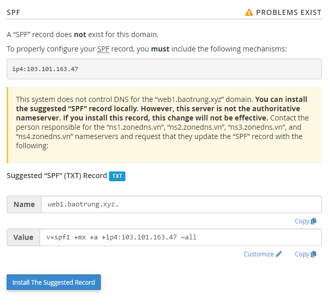

- Gửi thử email

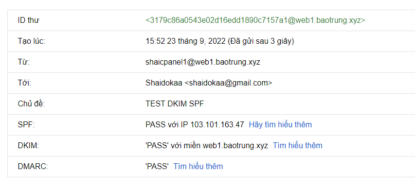