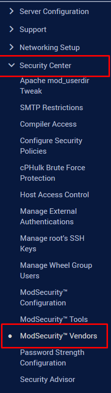
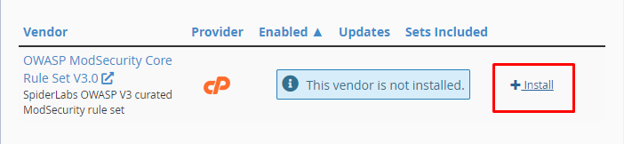
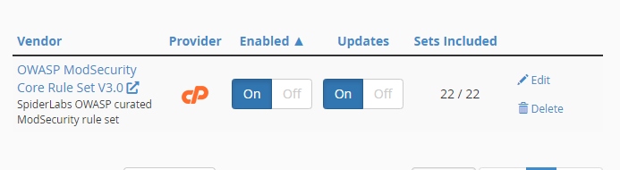
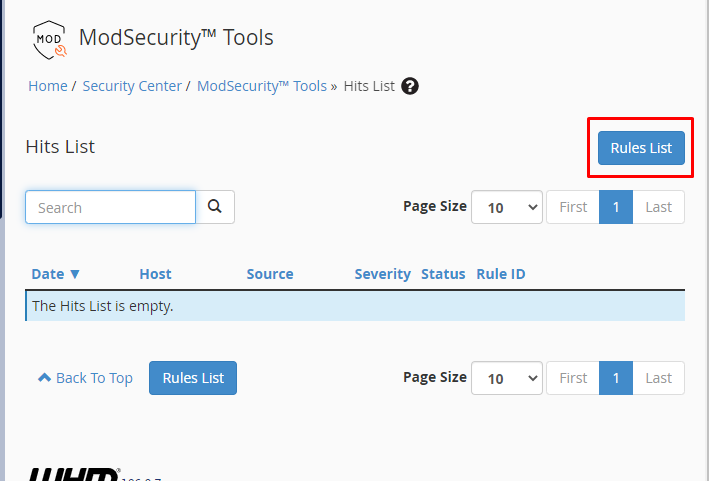
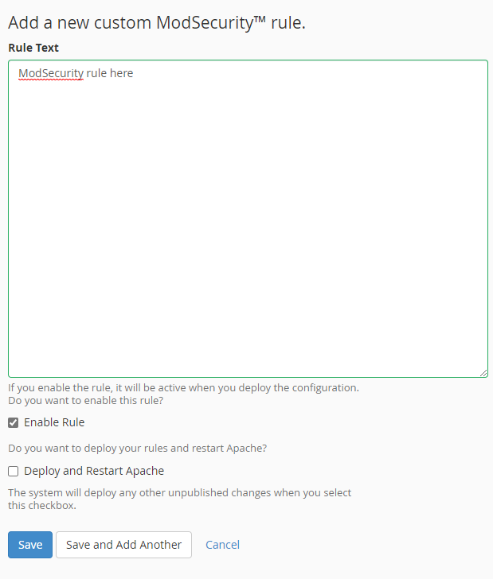

# ModSecurity trong cPanel

ModSecurity là 1 tường lửa cho ứng dụng web theo dõi lưu lượng web theo thời gian thực và chặn các kết nối độc hại trước khi chúng truy cập tới các ứng dụng

ModSecurity là tường lửa dựa trên luật, nó so sánh các yêu cầu với 1 danh sách các luật, tìm các mẫu ứng với các kiểu tấn công như SQL injection, session hijacking, cross-site scripting,...

Mặc dù người dùng có thể tự thêm luật, các luật thường được cung cấp như 1 bộ luật bởi bên thứ 3

So với CSF:
- CSF là 1 tường lửa lớp mạng vốn dùng để giám sát lưu lượng độc hại tại tầng mạng, do đó không thể ngăn chặn các cuộc tấn công ứng dụng web vì chúng giống như các yêu cầu trang web hợp lệ
- Trong khi đó, ModSecurity hay WAF (Web Application Firewall) nói chung có thể xác định các yêu cầu HTTP tiềm ẩn độc hại
- Có thể sử dụng cả 2 loại tường lửa để nâng cao bảo mật cho trang web

### Cài đặt ModSecurity

- Trên thanh **Navigation** của WHM, chọn ```Security Center``` -> ```ModSecurity Vendors```



- ```Install```



- Cài đặt thành công



### Cấu hình luật cho ModSecurity

- Truy cập tab **Security Tools**, tại đây có danh sách lịch sử về các sự kiện của luật
- Để truy cập danh sách luật, chọn ```Rules List```



- Để thêm luật, chọn ```Add Rule```, điền luật vào và chọn ```Add``` để lưu luật



- Cần khởi động lại webserver để áp dụng thay đổi, tick ```Deploy and Restart Apache``` trước khi chọn ```Save```

- Để thêm luật bằng giao diện dòng lệnh, ta vào file ```/etc/apache2/conf.d/modsec/modsec2.user.conf.STAGE``` để thêm luật vào

- Lưu lại những thay đổi và khởi động lại Apache

```sh
systemctl restart httpd
```