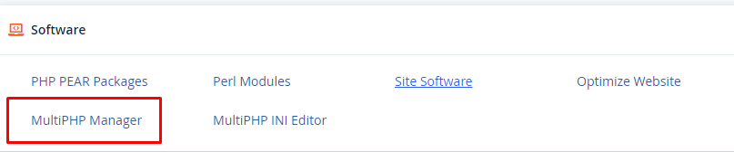
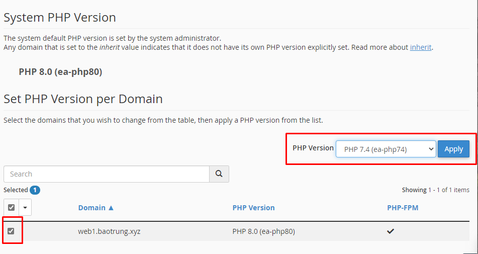
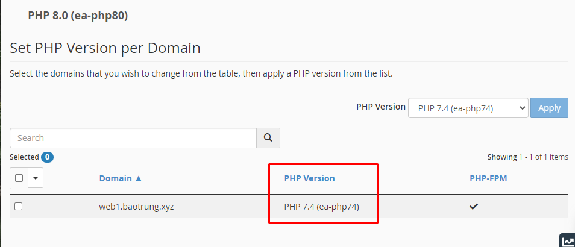
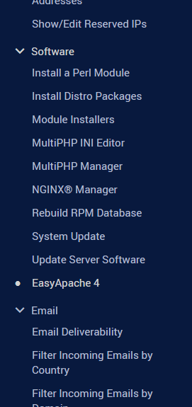
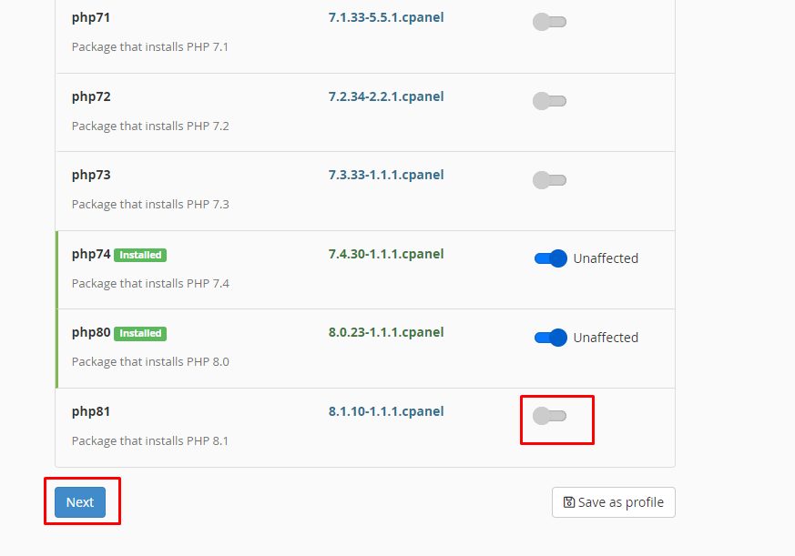
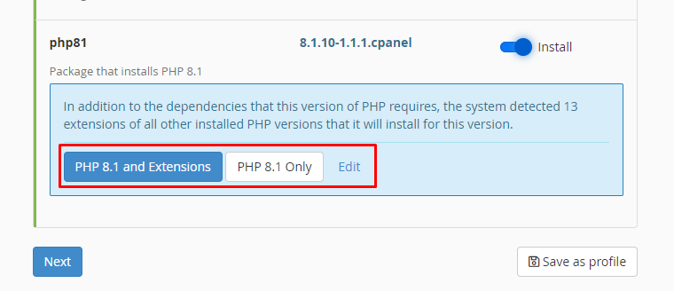
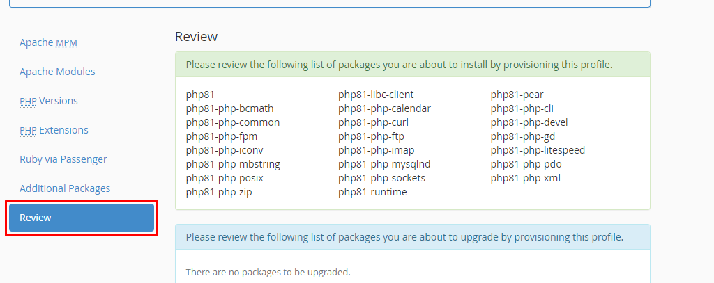
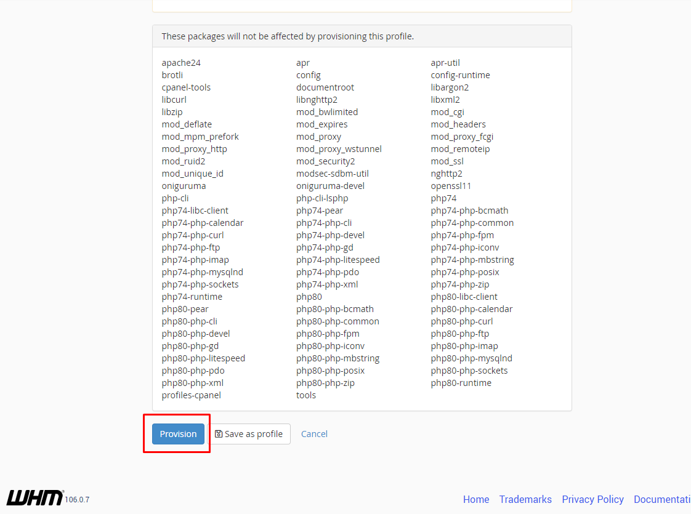
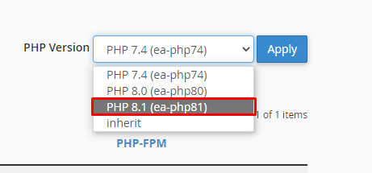

# Quản lý phiên bản PHP trong cPanel

- Truy cập trang quản trị cPanel của user, tại mục ```SOFTWARE```, chọn ```MultiPHP Manager```



- Để thay đổi phiên bản PHP, ta tick vào trang web đó, chọn phiên bản PHP muốn thay đổi rồi nhấn ```Apply```



- OK



### Cài đặt thêm phiên bản PHP

- Đăng nhập vào trang quản trị WHM, trên thanh **Navigation**, chọn ```Software``` -> ```EasyApache 4```



- Chọn ```Customize``` bên cạnh **Currently Installed Packages**


- ```PHP Versions```


- Chọn phiên bản PHP muốn cài



- Chọn cài đặt cả Extensions hay chỉ cài PHP thôi, sau đó chọn ```Next```



- Đến phần ```Review``` để xem phiên bản cũng như extensions mà mình muôn cài đặt



- Cuối cùng, kéo xuống dưới nhấn ```Provision``` để tiến hành cài đặt



- Giờ đã có thể chọn phiên bản PHP mới

