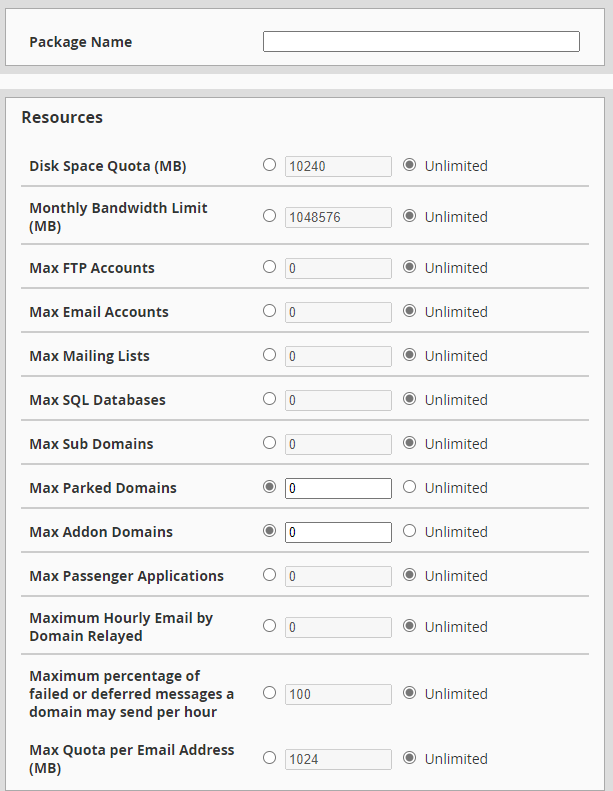
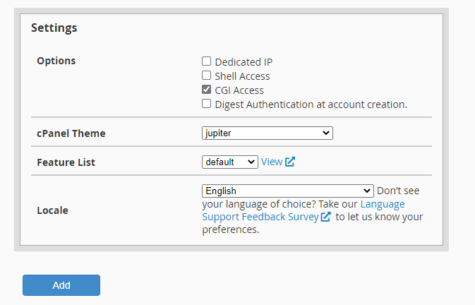
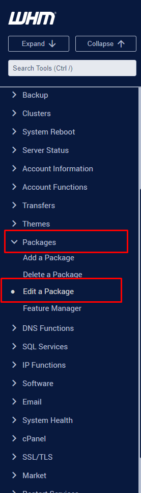
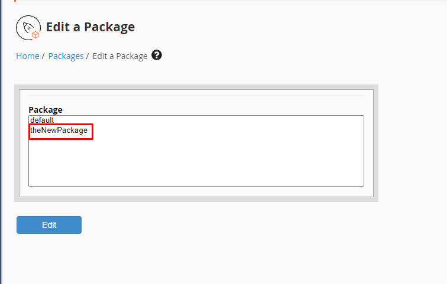
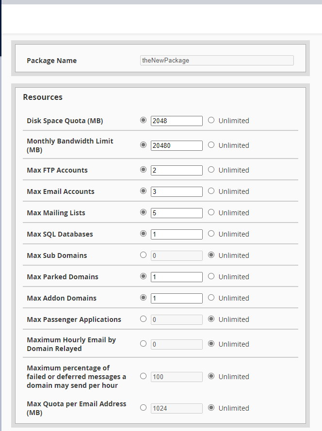
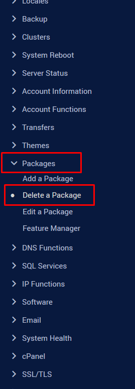
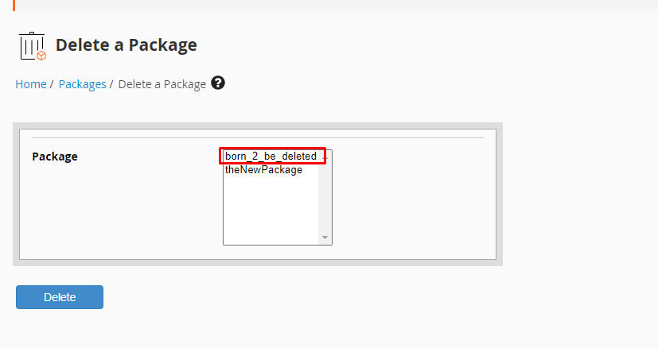
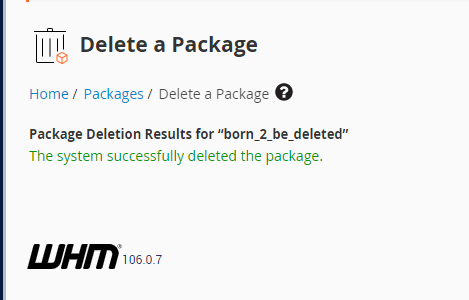

# Các thao tác với Package trong cPanel

#### 1. Tạo Package

- Tại tab **Packages**, chọn ```Add a Package``` và nhập thông số cho Package, cuối cùng nhấn ```Add``` để tạo



- Ngay bên dưới là những setting liên quan đến cPanel



#### 2. Sửa Package

- Trên thanh **Navigation**, chọn ```Packages``` -> ```Edit a Package```



- Chọn package muốn sửa đổi



- Sau khi hoàn tất thì chọn ```Save changes```



#### 3. Xóa Package

- Vẫn tại mục ```Packages```, chọn ```Delete a Package```



- Chọn package cần xóa 



- Xóa thành công

