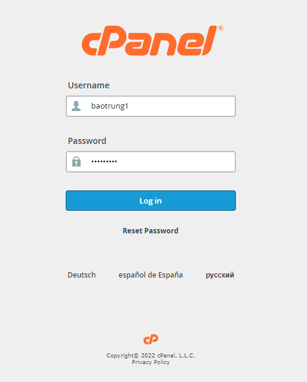
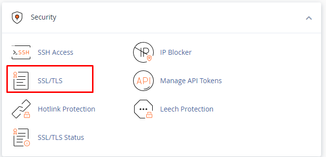
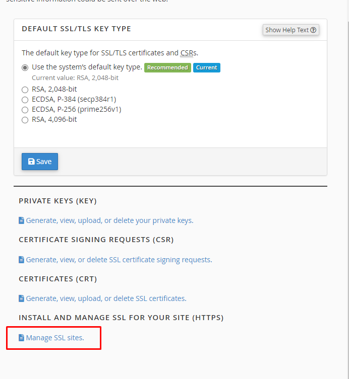
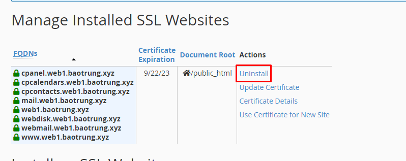
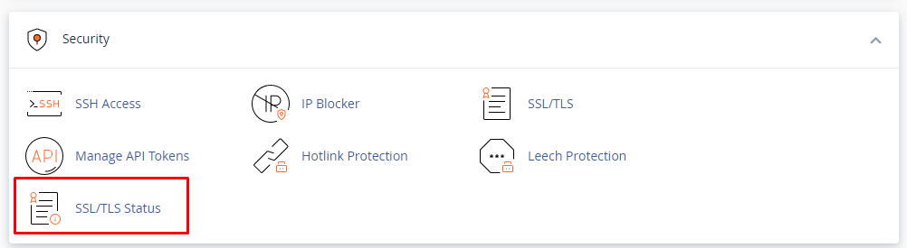
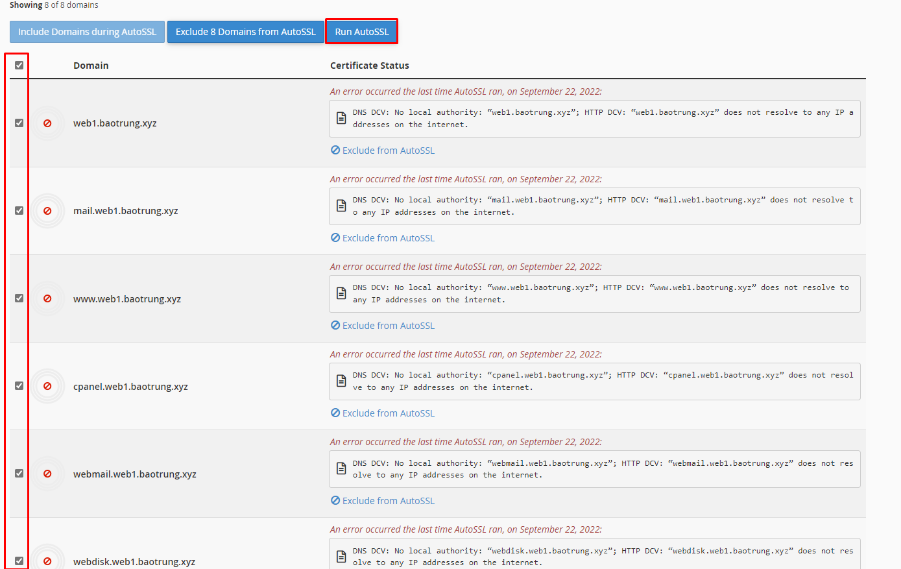
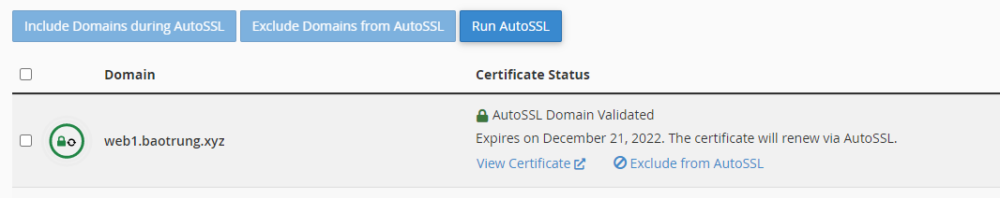
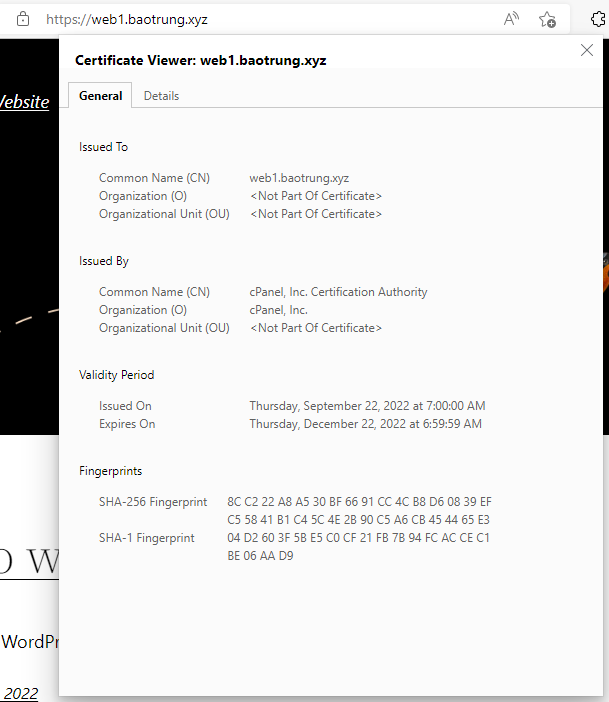

# Cài đặt chứng chỉ SSL Let's Encrypt

- Truy cập trang quản lý của user qua cổng 2083 và đăng nhập với tài khoản tương ứng với tên miền cần cài SSL



- Trước tiên, ta gỡ SSL self-sign có sẵn trên tên miền: tại tab **Security**, chọn ```SSL/TLS```



- Chọn ```Manage SSL sites```



- Chọn ```Uninstall``` để xóa đi các chứng chỉ cũ



- Quay trở lại trang chính, vẫn tại tab **Security**, chọn ```SSL/TLS Status```



- Tick chọn những domain muốn cài SSL rồi nhấn ```Run AutoSSL```



- OK



- Kiểm tra chứng chỉ



