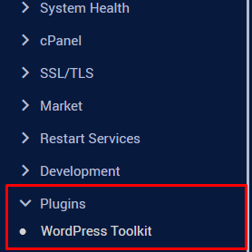
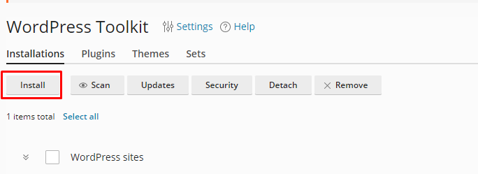
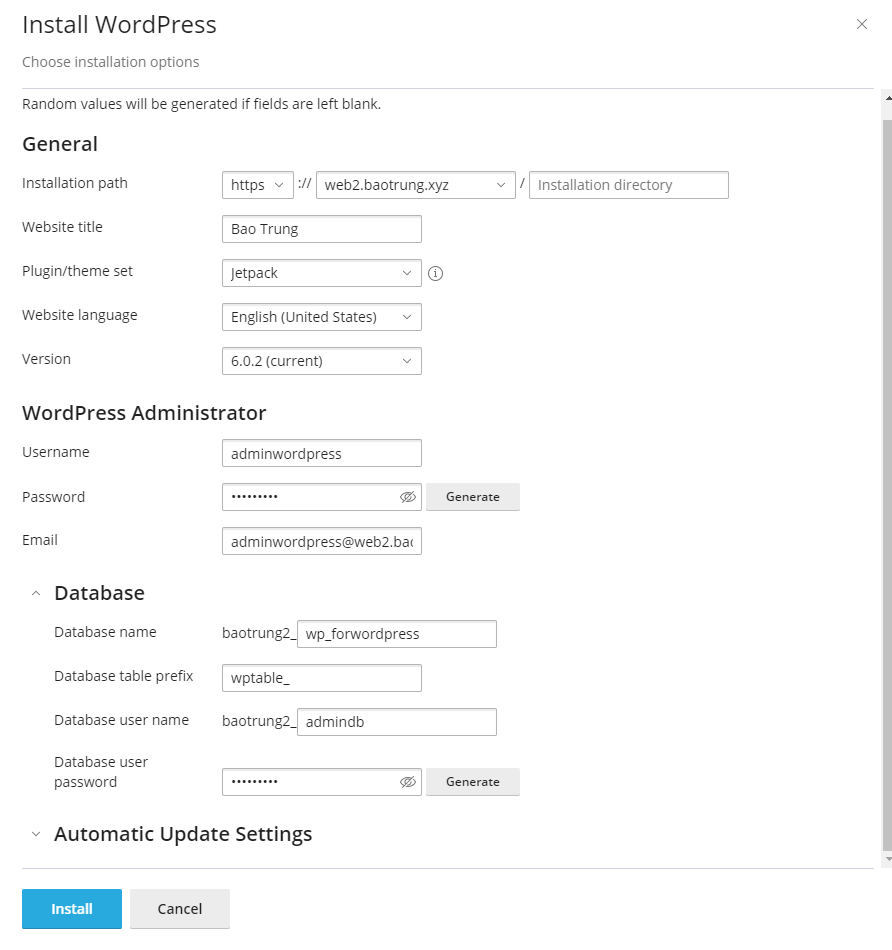
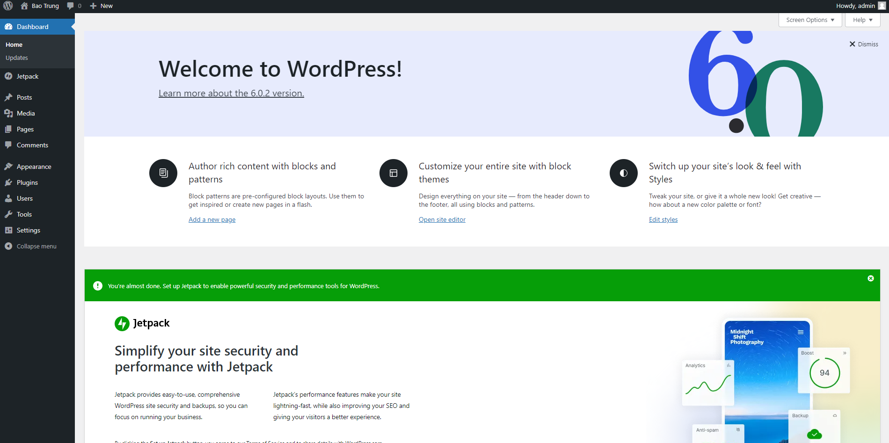

# Cài đặt 1 trang WordPress cơ bản trên cPanel

- Trên thanh **Navigation**, chọn ```Plugins``` -> ```WordPress Toolkit```



- Chọn ```Install``` hoặc ```Install WordPress```



- Nhập thông tin của trang wordpress rồi chọn ```Install```



- OK

