# Một vài thao tác nhỏ nhặt trong cPanel

## Thay đổi thông số PHP bằng file .htaccess

- SSH vào sv (hoặc sử dụng file manager cũng được nhưng ở bài này hướng dẫn sử dụng SSH)

- Truy cập đến thư mục của account user 

```sh
cd /home/<user>
```

- Chỉnh sửa file ```.htaccess``` hoặc tạo mới nếu file này chưa tồn tại

```sh
vi .htaccess
```

- Thêm những dòng sau vào, các thông số có thể thay đổi tùy ý

```sh
php_value upload_max_filesize 512M
php_value post_max_size 512M
php_value memory_limit 512M
php_value max_execution_time 300
php_value max_input_time 300
```

- Tạo file info.php để kiểm tra

```sh
vi info.php
# thêm nội dung sau vào
<?php
phpinfo();
?>
```

*(test không thành công :v)*
*(có thể do .htaccess không cho khai báo php_value như vậy, thêm vào php.ini thử xem ?)*

## Reset Password Admin WordPress bằng phpMyAdmin

- Truy cập vào phpMyAdmin bằng thông tin user/pass database đã tạo trước đó

*Lưu ý: Nếu bạn quên mật khẩu database bạn có thể vào trực tiếp file wp-config.php để xem và file sẽ có định dạng như sau*

```sh
define( 'DB_NAME', 'baotrung1_wp_zhlxe' );

/** MySQL database username */
define( 'DB_USER', 'baotrung1_wp_zi562' );

/** MySQL database password */
define( 'DB_PASSWORD', 'Z305Vfj0CO1$xPq!' );
```


- Chọn user cần Reset Password: sau khi truy cập vào phpMyAdmin, chọn database tương ứng với website WordPress cần reset password và chọn table ```*_user```, sau đó chọn user cần sửa 

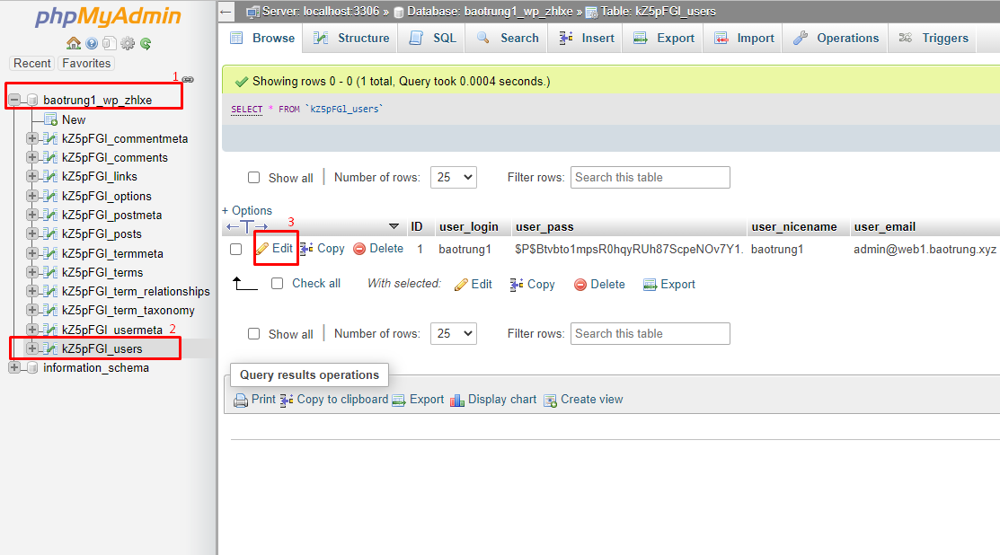

- Điền các thông tin muốn thay đổi, bao gồm:
    - user_login: tên user
    - userpass: mật khẩu đăng nhập (có thể chọn kiểu mã hóa, mặc định là MD5)
    - user_email: email quản trị của user đó

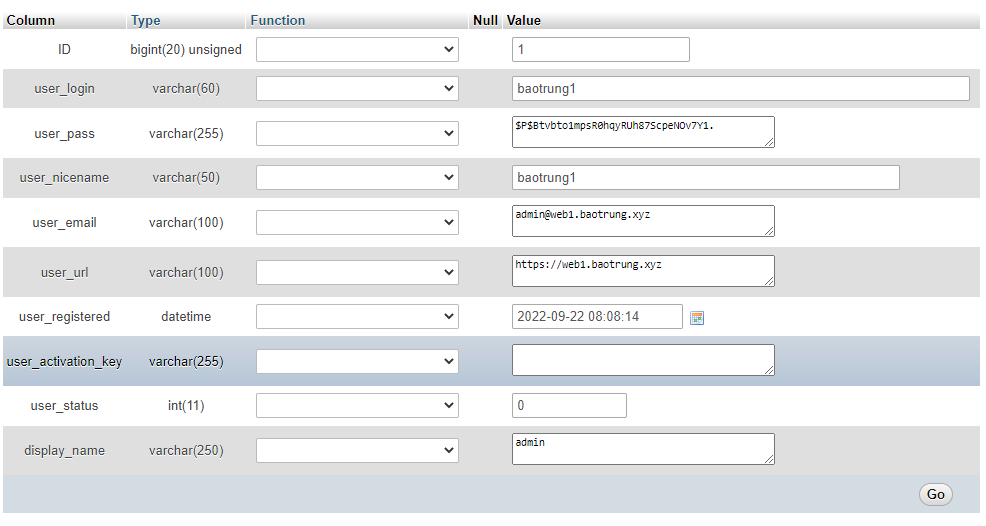

- Sau khi confirm thông tin thì ấn ```Go``` để lưu lại

- Đăng nhập với thông tin tài khoản vừa sửa đổi

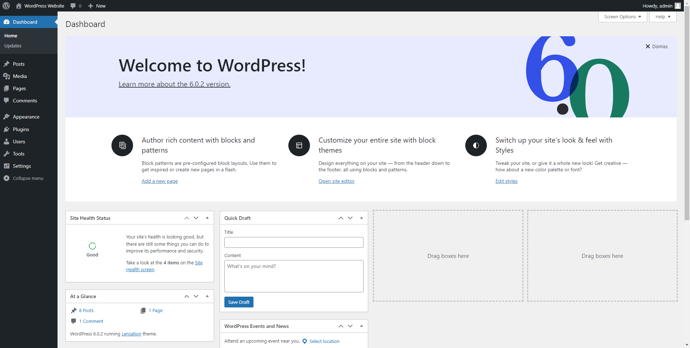

## Cách xóa bỏ 1 domain ra khỏi hosting

- Truy cập trang quản trị cPanel, chọn ```Domains``` trong mục ```Domains```

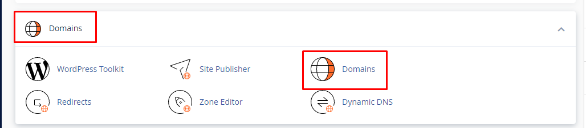

- Vào thư mục chứa file mã nguồn của site

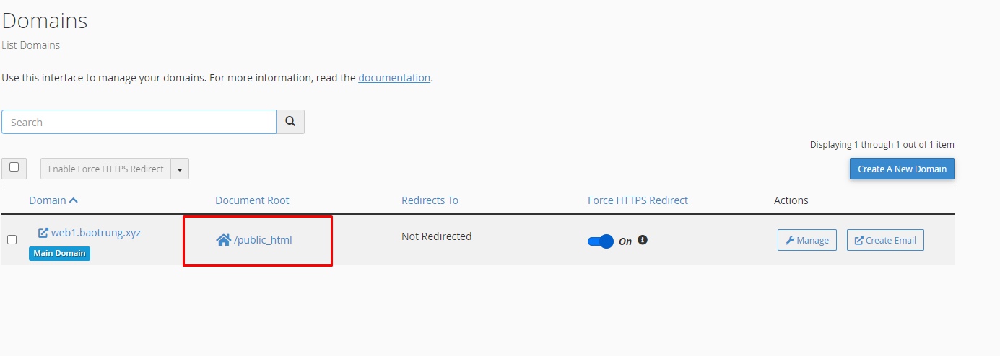

- Chọn site cần xóa và nhấn ```Delete``` (hoặc ```Select All``` rồi ```Delete``` nếu muốn trắng sạch như OMO)

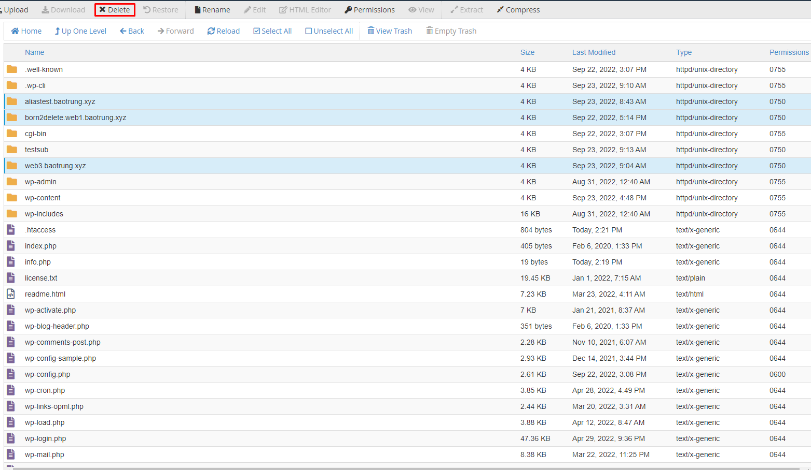

## Hướng dẫn kiểm tra Visitors trên cPanel

Tính năng Latest Visitors trong cPanel cho phép bạn có được thông tin về những lượt truy cập vào website của mình (lên đến 1000 lượt truy cập gần nhất). Điều này sẽ giúp dễ dàng bạn dễ dàng hơn trong việc quản trị, kiểm tra, thống kê lượt truy cập vào website

- Tại giao diện quản trị cPanel của user, chọn ```Visitors``` trong mục ```METRICS```

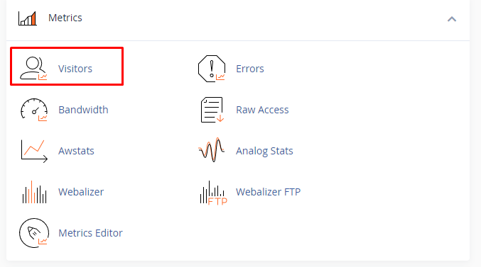

- Chọn domain cần xem thông tin

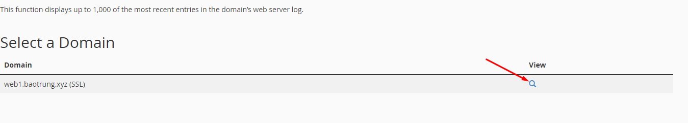

- Xem thông tin chi tiết

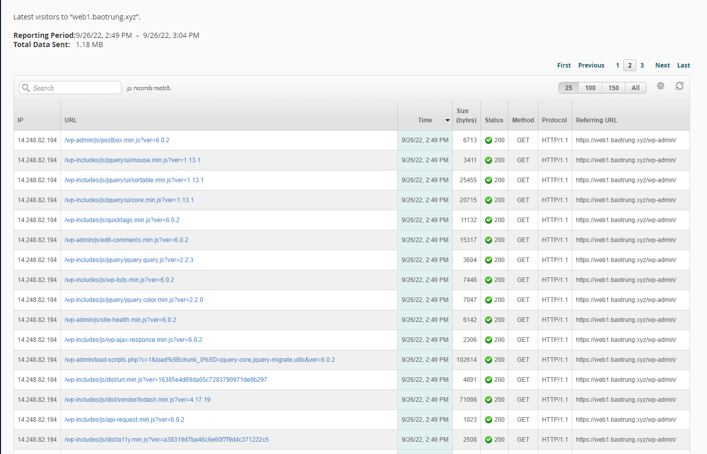

- Phía trên của bảng số liệu là thông tin tóm tắt về khoảng thời gian từ khi bắt đầu đến khi kết thúc ghi số liệu cũng như tổng dung lượng đã gửi. Ta có thể thay đổi số lượng hiển thị trên mỗi trang là 25/100/150 hay hiển thị tất cả

- Ta cũng có thể tìm kiếm 1 lượt truy cập cụ thể nào đó bằng cách sử dụng công cụ Search (Nhập thông tin muốn tìm kiếm vào ô tìm kiếm, hệ thống sẽ tự động lọc các kết quả và thông báo số kết quả phù hợp)

- Nếu muốn thêm hay bớt các cột thông tin hiển thị, ta chỉ cần ấn vào hình bánh răng ở góc phải trên của bảng thống kê và tích hoặc bỏ tích những dòng mong muốn
    - IP: hiển thị IP của người truy cập
    - URL: tên file trên website được truy cập
    - Time: thời điểm truy cập
    - Size: dung lượng sử dụng trong truy cập (tính bằng bytes)
    - Status: trạng thái của tủy cập (thành công hay không thành công)
    - Method: phương thức truy cập (POST hay GET)
    - Protocol: giao thức sử dụng để truy cập

## Hướng dẫn cấu hình Email Forwarders trong cPanel

Email Forwarders là 1 chức năng cho phép chuyển tiếp email sang 1 địa chỉ email khác

- Đăng nhập vào cPanel chọn ```Forwarders``` trong menu ```EMAIL```

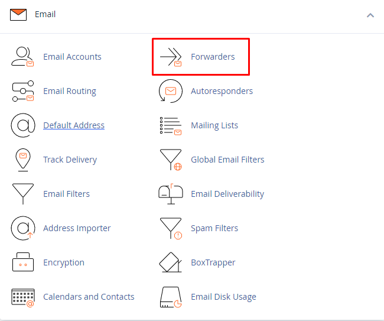

- Chọn ```Add Forwarders```

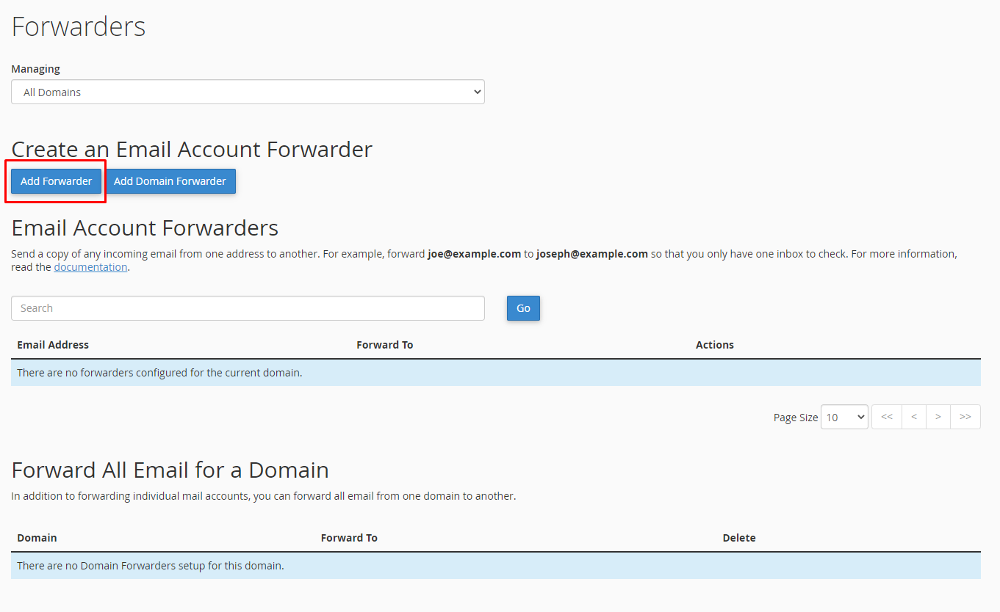

- Tạo email Forwarders:
    - **Address to Forwarders:** địa chỉ email cần chuyển (email nguồn)
    - **Domain:** chọn domain chứa email cần chuyển 
    - **Destination:** Forward to Email Address: địa chỉ muốn gửi mail đến (email đích)

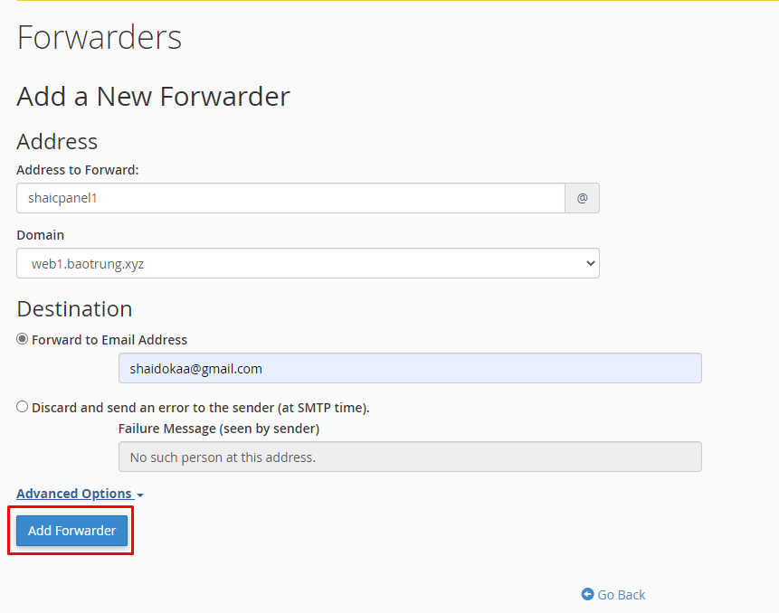

