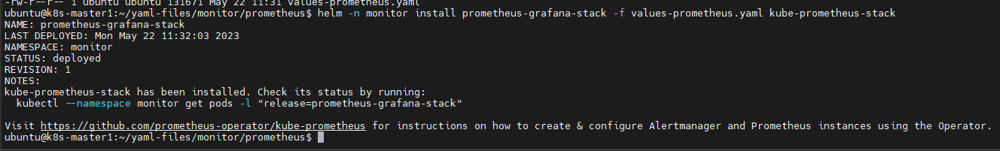
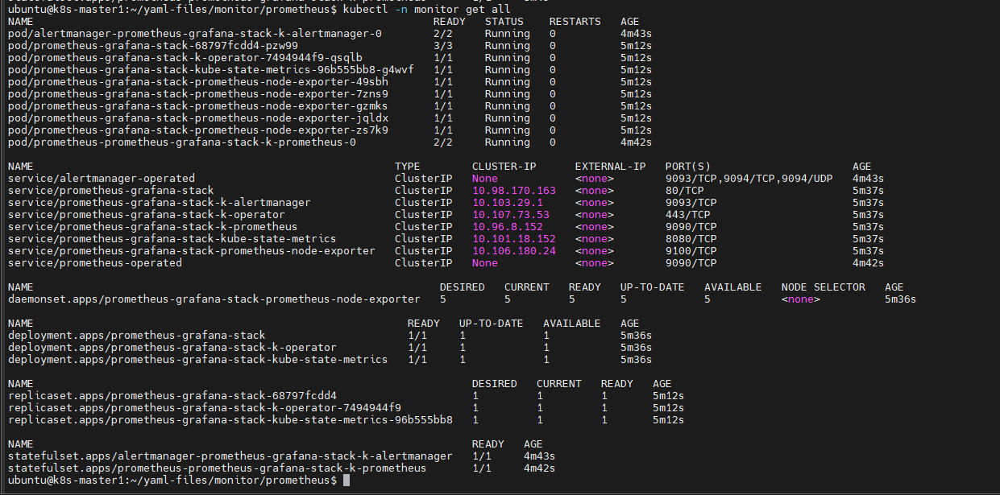
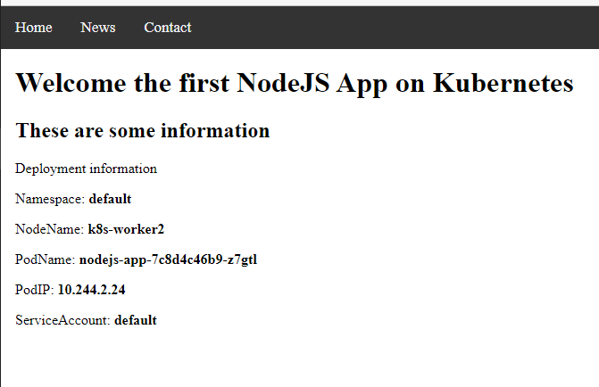
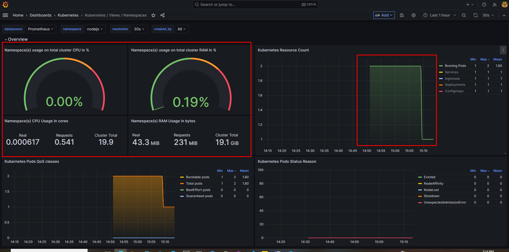
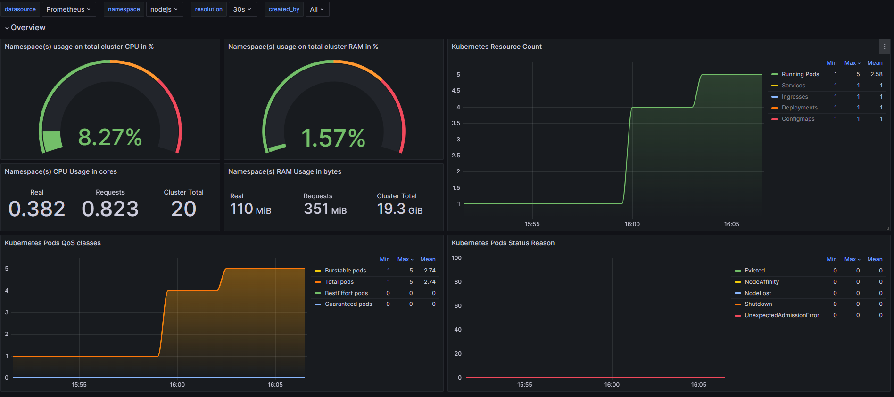
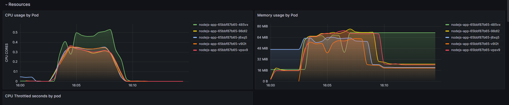
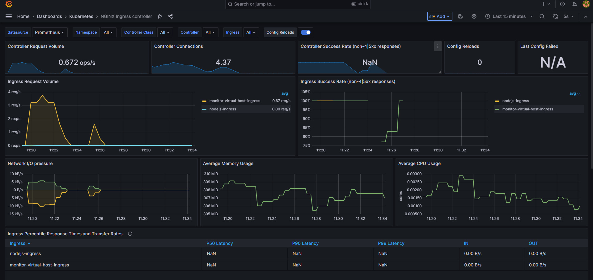

# Báo cáo đồ án tốt nghiệp - Giai đoạn 1

Trong báo cáo này sẽ tập trung vào việc cài đặt các thành phần cũng như kiểm tra tính khả thi của K8s cho đồ án này.

Mô hình tổng quan:
- 2 node master:
   - k8s-master1: IP 103.159.51.184, 4 vCPU, 4 GB RAM, 60 GB Disk
   - k8s-master2: IP 103.101.162.38, 4 vCPU, 4 GB RAM, 60 GB Disk 
- 3 node worker:
   - k8s-worker1: IP 103.159.51.165, 4 vCPU, 4 GB RAM, 60 GB Disk
   - k8s-worker2: IP 103.159.51.229, 4 vCPU, 4 GB RAM, 60 GB Disk 
   - k8s-worker3: IP 103.101.162.159, 4 vCPU, 4 GB RAM, 60 GB Disk
- 1 load-balancer:
   - k8s-loadbalancer: IP 103.101.163.198, 3 vCPU, 3 GB RAM, 50 GB Disk

## I. Cài đặt cluster K8s và các thành phần sẽ sử dụng

### 1. Cài đặt bộ cân bằng tải sử dụng HAProxy

Thay đổi hostname cho LB

```sh
hostnamectl set-hostname k8s-loadbalancer
```

Chỉnh sửa file hosts

```sh
echo << EOF > /etc/hosts
127.0.0.1       localhost k8s-master
103.159.51.184       k8s-master
103.101.162.38       k8s-master2
103.159.51.229       k8s-worker1
103.159.51.165       k8s-worker2
103.101.162.159      k8s-worker3
103.101.163.198      k8s-loadbalancer
EOF
```

Cài đặt HAProxy

```sh
apt-get update -y && apt-get upgrade -y
apt-get install haproxy
```

Chỉnh sửa file cấu hình HAProxy tại ```/etc/haproxy/haproxy.cfg```

```sh
global
  log /dev/log  local0
  log /dev/log  local1 notice
  stats socket /var/lib/haproxy/stats level admin
  chroot /var/lib/haproxy
  user haproxy
  group haproxy
  daemon

defaults
  log global
  mode  http
  option  httplog
  option  dontlognull
        timeout connect 5000
        timeout client 50000
        timeout server 50000

frontend kubernetes
    bind 103.101.163.198:6443
    option tcplog
    mode tcp
    default_backend kubernetes-master-nodes

backend kubernetes-master-nodes
    mode tcp
    balance roundrobin
    option tcp-check
    server k8s-master 103.159.51.184:6443 check fall 3 rise 2
    server k8s-master2 103.101.162.38:6443 check fall 3 rise 2

listen stats
    bind 103.101.163.198:8080
    mode http
    stats enable
    stats uri /
    stats realm HAProxy\ Statistics
    stats auth admin:haproxy
```

Start dịch vụ

```sh
systemctl start haproxy
```

### 2. Bước chuẩn bị trên các node

Các bước sau làm trên cả 5 node (thay đổi cho phù hợp)

- Update và upgrade package của Ubuntu

```sh
apt-get update -y && apt-get upgrade -y
apt-get -y install vim curl wget 
apt-get -y install byobu
```

- Tắt swap

```sh
swapoff -a
```

- Mở ```/etc/fstab``` và đóng dòng mount fstab lại (nếu có)

- Kiểm tra lại bằng lệnh ```free -hm```

- Khai báo các node trong file hosts và đặt hostname cho node

```sh
cat << EOF > /etc/hosts
127.0.0.1       localhost k8s-master1
103.159.51.184       k8s-master1
103.159.51.229       k8s-worker1
103.159.51.165       k8s-worker2
103.101.162.159       k8s-worker3
103.101.162.38       k8s-master2
103.101.163.198       k8s-loadbalancer

EOF
```

```sh
echo k8s-master1 > /etc/hostname
```

- Khởi động lại node

```sh
init 6
```

### 3. Cài đặt docker và các thành phần cần thiết của K8s

Trên tất cả các node sẽ phải có các thành phần: docker, kubelet, kubeadm và kubectl. Trong đó:
- ```docker```: môi trường chạy các container
- ```kubeadm```: được sử dụng để thiết lập cụm cluster cho K8s. Các tài liệu chuyên môn gọi kubeadm là một bootstrap (bootstrap tạm hiểu là 1 tool đóng gói để tự động làm việc gì đó)
- ```kubelet```: là thành phần chạy trên các host, có nhiệm vụ kích hoạt các pod và container trong cụm cluster của K8s
- ```kubectl```: là công cụ cung cấp CLI để tương tác với K8s

Đầu tiên, cài đặt Docker trên tất cả các node

```sh
apt-get -y install docker.io
```

Cài đặt các thành phần của K8s trên tất cả các node

```sh
apt-get update && apt-get install -y apt-transport-https

curl -s https://packages.cloud.google.com/apt/doc/apt-key.gpg | apt-key add

cat <<EOF >/etc/apt/sources.list.d/kubernetes.list
deb http://apt.kubernetes.io/ kubernetes-xenial main
EOF

apt-get update  -y
apt-get install -y kubelet kubeadm kubectl
```

**Lưu ý:** Trước khi cài đặt ta có thể dùng lệnh ```apt-cache madison kubeadm``` để kiểm tra các phiên bản khả dụng trước khi cài đặt nó.

Đánh dấu không update các package liên quan đến kubernetes

```sh
apt-mark hold kubelet
apt-mark hold kubeadm
apt-mark hold kubectl
```

### 4. Khởi tạo cluster

Thiết lập cluster:
- Đứng trên node ```k8s-master1``` thực hiện lệnh dưới để thiết lập cluster

```sh
kubeadm init --apiserver-advertise-address 103.159.51.184 --pod-network-cidr=10.244.0.0/16 --control-plane-endpoint "103.101.163.198:6443" --upload-certs
```

Trong đó:
- ```103.159.51.184```: là IP của node k8s-master
- ```--apiserver-advertise-address```: là địa chỉ của node k8s-master, địa chỉ này cần truyền thông được với các node còn lại của cụm cluster. Trong ví dụ này node k8s master có địa chỉ là 103.159.51.184
- ```--pod-network-cidr```: là dải địa chỉ mạng phụ thuộc mà công nghệ network sẽ sử dụng khi kết hợp với K8s, trong hướng dẫn này sử dụng flannel và flannel sử dụng dải 10.244.0.0/16
- ```--control-plane-endpoint```: khai báo địa chỉ của loadbalancer để các master node kết nối đến

Sau khi thực hiện các bước cài đặt ban đầu, các node sau đó có thể được join vào cluster bằng token và key đã được cấp

- Với node master:

```sh
kubeadm join 103.101.163.198:6443 --token psu04g.j7uznrlicyvaekdb \
        --discovery-token-ca-cert-hash sha256:e3941a25564b7e20f80d30046cfd04cd89b7ab5fa5b60e183f5f1c7db781031d \
        --control-plane --certificate-key 79b9ee328abf9f664d02f662adb4a9ba765f709532f1a30b9eff8534f37861c0
```

- Với node worker:

```sh
kubeadm join 103.101.163.198:6443 --token psu04g.j7uznrlicyvaekdb \
        --discovery-token-ca-cert-hash sha256:e3941a25564b7e20f80d30046cfd04cd89b7ab5fa5b60e183f5f1c7db781031d
```

- Tạo user ```ubuntu``` để thực hiện cấu hình cho K8s. Nếu có user trước đó rồi thì không cần thực hiện bước này

```sh
useradd ubuntu
```

- Nhập thông tin và mật khẩu cho user ```ubuntu```, sau đó phân quyền sudoer bằng lệnh dưới

```sh
echo "ubuntu ALL=(ALL) NOPASSWD: ALL" >> /etc/sudoers
```

- Chuyển sang user ubuntu để thực hiện

```sh
su ubuntu
mkdir -p $HOME/.kube
sudo cp -i /etc/kubernetes/admin.conf $HOME/.kube/config
sudo chown $(id -u):$(id -g) $HOME/.kube/config
```

- Sử dụng thủ thuật dưới để thao tác lệnh trong K8s được thuận lợi hơn nhờ việc tự động hoàn thiện lệnh mỗi khi thao tác

```sh
echo "source <(kubectl completion bash)" >> ~/.bashrc
```

Cài đặt Pod Network
- Đứng trên node K8s-master1 cài đặt Pod network
- K8s có nhiều lựa chọn cho giải pháp network để kết nối các container, trong hướng dẫn này chúng ta sử dụng flannel

```sh
kubectl apply -f https://raw.githubusercontent.com/coreos/flannel/master/Documentation/kube-flannel.yml
```

### 5. Cài đặt helm

Helm là một trình quản lý gói và công cụ quản lý ứng dụng cho K8s, nó đóng gói nhiều tài nguyên K8s vào một đơn vị triển khai logic duy nhất được gọi là Chart. Bên trong của Chart sẽ có phần chính là các template, là định nghĩa các tài nguyên sẽ triển khai lên K8s. Nhờ helm ta có thể đơn giản hóa quá trình cài đặt của rất nhiều thành phần trong K8s.

```sh
curl -fsSL -o get_helm.sh https://raw.githubusercontent.com/helm/helm/main/scripts/get-helm-3
sudo chmod 700 get_helm.sh
./get_helm.sh
```

### 6. Cài đặt metrics server

Metrics server là một add-ons, chứ nó không có sẵn trong K8s cluster của ta, nếu ta muốn sử dụng được tính năng autoscaling, ta cần phải cài đặt metrics server này vào.

```sh
kubectl apply -f https://github.com/kubernetes-sigs/metrics-server/releases/latest/download/components.yaml
```

Kubelet certificate cần phải được ký bởi cluster CA, hoặc tắt nó đi bằng cách

```sh
kubectl edit deployment metrics-server -n kube-system
```
Sau đó tìm đến ```.spec.template.spec.containers[].args[]``` và thêm tham số sau vào ```--kubelet-insecure-tls```

Kiểm tra đã cài đặt thành công chưa bằng lệnh

```sh
kubectl top node
```

### 7. Cài đặt nginx ingress controller

Trong các môi trường cloud truyền thống, nơi mà network load balancer là khả dụng, 1 tệp cấu hình trong K8s có thể cung cấp 1 điểm kết nối để giao tiếp đến Ingress-Nginx Controller với client bên ngoài, và, trực tiếp đối với các ứng dụng bên trong cluster. Môi trường bare-metal lại thiếu đi đối tượng này, do đó nó cần được setup khác đi một chút để có thể cung cấp 1 access point hoạt động tương tự ra các client bên ngoài.

Cài đặt nginx ingress controller:

```sh
kubectl apply -f https://raw.githubusercontent.com/kubernetes/ingress-nginx/controller-v1.8.0/deploy/static/provider/cloud/deploy.yaml
```

Cài đặt metalLB:

```sh
kubectl apply -f https://raw.githubusercontent.com/metallb/metallb/v0.13.9/config/manifests/metallb-native.yaml
```

Lệnh trên sẽ deploy MetalLB vào cluster dưới namespace ```metallb-system```. Các thành phần trong file manifest này bao gồm:
- ```metallb-system/controller``` deployment. Đây là 1 controller toàn cluster sử dụng để xử lý phân phối IP address
- ```metallb-system/speaker``` daemonset. Đây là 1 thành phần mà đưa ra protocol mà bạn sử dụng để giúp service reachable
- Các service account cho controller và speaker, cùng với quyền RBAC mà các thành phần này cần để hoạt động

MetalLB cần 1 pool địa chỉ IP để sử dụng cho ```ingress-nginx``` service. Pool này có thể chỉ định thông qua ```IPAddressPool``` object ở trong cùng namespace với MetalLB controller. 

Tạo 1 object với kind IPAddressPool như sau

```sh
apiVersion: metallb.io/v1beta1
kind: IPAddressPool
metadata:
  name: default
  namespace: metallb-system
spec:
  addresses:
  - 103.159.51.184
  autoAssign: true
---
apiVersion: metallb.io/v1beta1
kind: L2Advertisement
metadata:
  name: default
  namespace: metallb-system
spec:
  ipAddressPools:
  - default
```

```sh
kubectl apply -f ipaddresspool.yaml
```

## II. Cài đặt Prometheus - Grafana - Alertmanger để giám sát cluster

Prometheus là một phần mềm giám sát mã nguồn mở, và đang ngày 1 trở nên phổ biến. Prometheus rất mạnh và lại đặc biệt phù hợp để dùng cho việc giám sát các dịch vụ trên K8s vì nó hỗ trợ sẵn rất nhiều các bộ template giám sát với các service opensource, giúp việc triển khai và cấu hình giám sát nhanh chóng và hiệu quả. Đi kèm với Prometheus (đóng vai trò giám sát) thì cần có thêm Alert Manager (đóng vai trò cảnh báo) giúp người quản trị thuận tiện hơn rất nhiều.

Grafana là phần mềm open source dùng để phân tích và hiển thị trực quan dữ liệu. Giúp việc xử lý dữ liệu trên các dashboard với khả năng tùy biến cao, hỗ trợ rất lớn cho việc theo dõi phân tích dữ liệu theo thời gian. Nó lấy nguồn dữ liệu từ nguồn như Prometheus, Graphite hoặc ElasticSearch...

### 1. Cài đặt Prometheus và Grafana trên K8s bằng Helm

Khai báo repo của Helm và download helm-chart của Prometheus về:

```sh
helm repo add prometheus-community https://prometheus-community.github.io/helm-charts
helm repo add stable https://charts.helm.sh/stable
helm repo update
helm search repo prometheus |egrep "stack|CHART"
helm pull prometheus-community/kube-prometheus-stack --version 45.29.0
tar -xzf kube-prometheus-stack-45.29.0.tgz
cp kube-prometheus-stack/values.yaml values-prometheus.yaml
```

Mở file values mặc định của bộ helm-chart này sẽ thấy nó đã cấu hình Rule cho các thành phần của K8s như etcd, kube-api,..., hay Alert Manager cũng được cài mặc định trong bộ này luôn.

```sh
defaultRules:
  create: true
  rules:
    alertmanager: true
    etcd: true
    configReloaders: true
    general: true
    k8s: true
    kubeApiserverAvailability: true
    kubeApiserverBurnrate: true
    kubeApiserverHistogram: true
    kubeApiserverSlos: true
    kubeControllerManager: true
    kubelet: true
    kubeProxy: true
    kubePrometheusGeneral: true
    kubePrometheusNodeRecording: true
    kubernetesApps: true
    kubernetesResources: true
    kubernetesStorage: true
    kubernetesSystem: true
    kubeSchedulerAlerting: true
    kubeSchedulerRecording: true
    kubeStateMetrics: true
    network: true
    node: true
    nodeExporterAlerting: true
    nodeExporterRecording: true
    prometheus: true
    prometheusOperator: true
```

```sh
alertmanager:

  ## Deploy alertmanager
  ##
  enabled: true

  ## Annotations for Alertmanager
  ##
  annotations: {}

  ## Api that prometheus will use to communicate with alertmanager. Possible values are v1, v2
  ##
  apiVersion: v2
```

Cấu hình tạo ingress cho Alert Manager để kết nối từ bên ngoài vào bằng hostname là alertmanager.baotrung.xyz

```sh
  ingress:
    enabled: true

    # For Kubernetes >= 1.18 you should specify the ingress-controller via the field ingressClassName
    # See https://kubernetes.io/blog/2020/04/02/improvements-to-the-ingress-api-in-kubernetes-1.18/#specifying-the-class-of-an-ingress
    # ingressClassName: nginx

    annotations: {}

    labels: {}

    ## Redirect ingress to an additional defined port on the service
    # servicePort: 8081

    ## Hosts must be provided if Ingress is enabled.
    ##
    hosts:
      - alertmanager.baotrung.xyz

    ## Paths to use for ingress rules - one path should match the alertmanagerSpec.routePrefix
    ##
    paths:
      - /
```

Đổi password mặc định khi login vào web Grafana

```sh
adminPassword: gfbsojrebgoj
```

Cấu hình ingress cho Grafana để kết nối từ ngoài vào với hostname grafana.baotrung.xyz

```sh
  ingress:
    ## If true, Grafana Ingress will be created
    ##
    enabled: true

    ## IngressClassName for Grafana Ingress.
    ## Should be provided if Ingress is enable.
    ##
    # ingressClassName: nginx

    ## Annotations for Grafana Ingress
    ##
    annotations: {}
      # kubernetes.io/ingress.class: nginx
      # kubernetes.io/tls-acme: "true"

    ## Labels to be added to the Ingress
    ##
    labels: {}

    ## Hostnames.
    ## Must be provided if Ingress is enable.
    ##
    hosts:
      - grafana.baotrung.xyz
    #hosts: []

    ## Path for grafana ingress
    path: /
```

Cấu hình ingress cho Prometheus để kết nối từ ngoài vào qua hostname prometheus.baotrung.xyz

```sh
   ingress:
     enabled: true

     # For Kubernetes >= 1.18 you should specify the ingress-controller via the field ingressClassName
     # See https://kubernetes.io/blog/2020/04/02/improvements-to-the-ingress-api-in-kubernetes-1.18/#specifying-the-class-of-an-ingress
     # ingressClassName: nginx

     annotations: {}
     labels: {}

     ## Redirect ingress to an additional defined port on the service
     # servicePort: 8081

     ## Hostnames.
     ## Must be provided if Ingress is enabled.
     ##
     hosts:
       - prometheus.baotrung.xyz
     #hosts: []

     ## Paths to use for ingress rules - one path should match the prometheusSpec.routePrefix
     ##
     paths:
       - /
```

Thêm cấu hình dashboard vào sau thông số .grafana

```sh
grafana:
  # Provision grafana-dashboards-kubernetes
  dashboardProviders:
    dashboardproviders.yaml:
      apiVersion: 1
      providers:
      - name: 'grafana-dashboards-kubernetes'
        orgId: 1
        folder: 'Kubernetes'
        type: file
        disableDeletion: true
        editable: true
        options:
          path: /var/lib/grafana/dashboards/grafana-dashboards-kubernetes
  dashboards:
    grafana-dashboards-kubernetes:
      k8s-system-api-server:
        url: https://raw.githubusercontent.com/dotdc/grafana-dashboards-kubernetes/master/dashboards/k8s-system-api-server.json
        token: ''
      k8s-system-coredns:
        url: https://raw.githubusercontent.com/dotdc/grafana-dashboards-kubernetes/master/dashboards/k8s-system-coredns.json
        token: ''
      k8s-views-global:
        url: https://raw.githubusercontent.com/dotdc/grafana-dashboards-kubernetes/master/dashboards/k8s-views-global.json
        token: ''
      k8s-views-namespaces:
        url: https://raw.githubusercontent.com/dotdc/grafana-dashboards-kubernetes/master/dashboards/k8s-views-namespaces.json
        token: ''
      k8s-views-nodes:
        url: https://raw.githubusercontent.com/dotdc/grafana-dashboards-kubernetes/master/dashboards/k8s-views-nodes.json
        token: ''
      k8s-views-pods:
        url: https://raw.githubusercontent.com/dotdc/grafana-dashboards-kubernetes/master/dashboards/k8s-views-pods.json
        token: ''
```

Thực hiện cài đặt:

```sh
kubectl create ns monitor
helm -n monitor install prometheus-grafana-stack -f values-prometheus.yaml kube-prometheus-stack
```



Kiểm tra

```sh
kubectl -n monitor get all
```



Như trên là helm đã cài đặt xong.

### 2. Cài đặt Nginx-Ingress

Cài đặt NGINX Ingress controller (đã giới thiệu ở bài về Ingress)

Tạo ingress để kết nối vào Service vừa cài bên trên từ domain là **alertmanager.baotrung.xyz**, **grafana.baotrung.xyz**, **prometheus.baotrung.xyz**

```sh
apiVersion: networking.k8s.io/v1
kind: Ingress
metadata:
  name: monitor-virtual-host-ingress
spec:
  ingressClassName: nginx
  rules:
  - host: alertmanager.baotrung.xyz
    http:
      paths:
      - backend:
          service:
            name: prometheus-grafana-stack-k-alertmanager
            port:
              number: 9093
        path: /
        pathType: Prefix
  - host: grafana.baotrung.xyz
    http:
      paths:
      - backend:
          service:
            name: prometheus-grafana-stack
            port:
              number: 80
        path: /
        pathType: Prefix
  - host: prometheus.baotrung.xyz
    http:
      paths:
      - backend:
          service:
            name: prometheus-grafana-stack-k-prometheus
            port:
              number: 9090
        path: /
        pathType: Prefix
```

Apply

```sh
kubectl -n monitor apply -f app.ingress.yaml
```

Trỏ domain về IP trong cluster

```sh
103.159.51.184 grafana.baotrung.xyz
103.159.51.184 alertmanager.baotrung.xyz
103.159.51.184 prometheus.baotrung.xyz
```

## III. Triển khai ứng dụng nodejs đơn giản lên K8s

Các bước cài đặt trong bài này gồm có:
- Cài đặt môi trường để triển khai app nodejs
- Code một module nodejs nhỏ để kiểm thử
- Build và tạo Docker image cho ứng dụng
- Triển khai ứng dụng lên K8s dùng các file manifest yaml

### 1. Cài đặt môi trường để build Nodejs App (centos 7)

Ta cần một máy chủ để cài đặt môi trường giúp build nodejs app, từ đó mới triển khai lên k8s được

Đầu tiên máy chủ này phải có docker, nodejs và npm.

```sh
sudo yum clean all && sudo yum makecache fast
sudo yum install -y gcc-c++ make
sudo yum install -y nodejs
sudo yum install -y npm
```

### 2. Pull code về

Cài github CLI

```sh
curl -OL https://github.com/cli/cli/releases/download/v1.14.0/gh_1.14.0_linux_amd64.rpm
yum localinstall gh_1.14.0_linux_amd64.rpm
# Login vào github
gh auth login
gh repo clone rockman88v/nodejs-demo-k8s
```

Cơ bản thì app này làm nhiệm vụ sau:
- Gọi vào "/" trả về file index.html, trong đó có cập nhật giá trị các biến môi trường liên qua đến triển khai (POD_NAME, POD_IP,...)
- Gọi vào "/about" hay "/about-us" trả về about.html
- Các request khác thì trả về 404.html

Ở đây đã có sẵn node_moduldes rồi, tuy nhiên ta vẫn có thể cài đặt lại bằng ```npm install```

### 3. Build images và push lên registry

Thực hiện build docker:

```sh
docker build -t shaidoka/nodejs-k8s:v1 .
```

Sau đó push lên registry:

```sh
docker push shaidoka/nodejs-k8s:v1
```

### 4. Triển khai lên k8s

Để triển khai lên k8s thì ta sẽ dùng 3 resource chính là deployment, service và ingress:
- Trong cấu hình deployment có gán các biến môi trường lấy từ thông tin metadata của Pod khi deploy lên K8s
- Service cài đặt nodeport 31123 để kết nối trực tiếp qua IP của Node
- Ingress cài đặt ở địa chỉ host là ```nodejs.baotrung.xyz```

Cấu hình **deployment**:

```sh
apiVersion: apps/v1
kind: Deployment
metadata:
  name: nodejs-app
  labels:
    app: nodejs-app
spec:
  replicas: 2
  selector:
    matchLabels:
      app: nodejs-app
  template:
    metadata:
      labels:
        app: nodejs-app
    spec:
      containers:
        - name: node-app
          image: shaidoka/nodejs-k8s:v1
          imagePullPolicy: Always
          resources:
            # Specifying the resourses that we might need for our application
            requests:
              memory: "128Mi"
              cpu: "300m"
          ports:
            - containerPort: 8080
          env:
            - name: MY_NODE_NAME
              valueFrom:
                fieldRef:
                  fieldPath: spec.nodeName
            - name: MY_POD_NAME
              valueFrom:
                fieldRef:
                  fieldPath: metadata.name
            - name: MY_POD_NAMESPACE
              valueFrom:
                fieldRef:
                  fieldPath: metadata.namespace
            - name: MY_POD_IP
              valueFrom:
                fieldRef:
                  fieldPath: status.podIP
            - name: MY_POD_SERVICE_ACCOUNT
              valueFrom:
                fieldRef:
                  fieldPath: spec.serviceAccountName
```

Cấu hình service

```sh
apiVersion: v1
kind: Service
metadata:
  name: nodejs-service
spec:
  selector:
    app: nodejs-app
  type: ClusterIP
  ports:
  - name: http
    port: 80
    targetPort: 8080
```

Cấu hình ingress

```sh
apiVersion: networking.k8s.io/v1
kind: Ingress
metadata:
  name: nodejs-ingress
spec:
  ingressClassName: nginx
  rules:
  - host: nodejs.baotrung.xyz
    http:
      paths:
      - backend:
          service:
            name: nodejs-service
            port:
              name: http
        path: /
        pathType: Prefix
```

Kết quả, truy cập ```nodejs.baotrung.xyz```



### 5. Autoscaling

Ưu điểm lớn nhất mà K8s có là mức độ linh hoạt, đặc biệt là trong việc auto scaling của nó.

Có 2 phương pháp scaling (pod/cluster) là **horizontal scaling** và **vertical scaling**:
- **Horizontal scaling** là cách scale mà ta sẽ tăng số lượng worker (application) đang xử lý công việc hiện tại ra nhiều hơn. Ví dụ ta đang có 2 pod để xử lý tích điểm cho client khi client tạo deal thành công, khi số lượng client tăng đột biến, 2 pod không thể xử lý kịp, ta sẽ scale số lượng pod lên thành 4 chẳng hạn.
- **Vertical scaling** là cách scale thay vì tăng số lượng worker, ta sẽ tăng lượng tài nguyên của pod đó lên, như là tăng số CPU và RAM của pod. Ví dụ ta có một model để train AI, việc train này không thể tách ra 1 model khác để tăng tốc độ train được, mà ta chỉ có thể tăng CPU và memory cho model đó, lúc này ta sẽ cần đến Vertical scaling.

#### a. Trường hợp 1: Scale theo CPU và RAM

Tạo 1 HPA như sau

```sh
apiVersion: autoscaling/v2
kind: HorizontalPodAutoscaler
metadata:
  name: nodejs-hpa
spec:
  scaleTargetRef:
    apiVersion: apps/v1
    kind: Deployment
    name: nodejs-app
  minReplicas: 1
  maxReplicas: 5
  metrics:
  - type: Resource
    resource:
      name: cpu
      target:
        type: Utilization
        averageUtilication: 30
  - type: Resource
    resource:
      name: memory
      target:
        type: Utilization
        averageUtilization: 30
```



Do mức độ sử dụng CPU và RAM luôn ở mức thấp, HPA đã scale down deployment k8s-app xuống chỉ còn 1 replica.

Để kiểm thử khả năng scale up, ta sẽ sử dụng công cụ ```ab```

```sh
apt-get install apache2-utils -y
```

```sh
ab -n 1000000 -c 10000 http://nodejs.baotrung.xyz/
```

Lệnh trên sẽ thực hiện 1000000 request, với 10000 request đồng thời.





Số lượng replicas nhanh chóng tăng lên do mức độ sử dụng CPU và RAM tăng cao.

#### b. Scale theo request

Để trực quan thì phần này ta sẽ cấu hình một chút để theo dõi được lượng request vào ingress nginx

Chỉnh sửa cấu hình service ingress của nginx

```sh
kubectl edit service/ingress-nginx-controller -n ingress-nginx
```

Sửa như sau

```sh
apiVersion: v1
kind: Service
..
spec:
  ports:
    - name: prometheus
      port: 10254
      targetPort: prometheus
      ..
```

Giờ thêm port và annotation vào deployment

```sh
kubectl edit deployment.apps/ingress-nginx-controller -n ingress-nginx
```

```sh
apiVersion: v1
kind: Deployment
..
spec:
  template:
    metadata:
      annotations:
        prometheus.io/scrape: "true"
        prometheus.io/port: "10254"
    spec:
      containers:
        - name: controller
          ports:
            - name: prometheus
              containerPort: 10254
            ..
```

Thêm ServiceMonitor sau để prometheus có thể lấy được metrics mà ingress đưa ra

```sh
apiVersion: monitoring.coreos.com/v1
kind: ServiceMonitor
metadata:
  name: nginx-ingress-monitor
  namespace: monitor
  labels:
    name: nginx-prometheus-servicemonitor
    app.kubernetes.io/instance: service-monitor
    app: kube-prometheus-stack
    release: prometheus-grafana-stack
spec:
  selector:
    matchLabels:
      app.kubernetes.io/name: ingress-nginx
  namespaceSelector:
    matchNames:
    - ingress-nginx
  endpoints:
  - port: prometheus
```

Cuối cùng, lên grafana và import thêm dashboard mới vào, sử dụng json trong link sau: [Dashboard nginx ingress](https://raw.githubusercontent.com/kubernetes/ingress-nginx/main/deploy/grafana/dashboards/nginx.json)

Kết quả:



