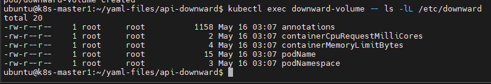
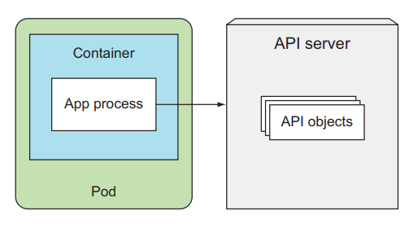
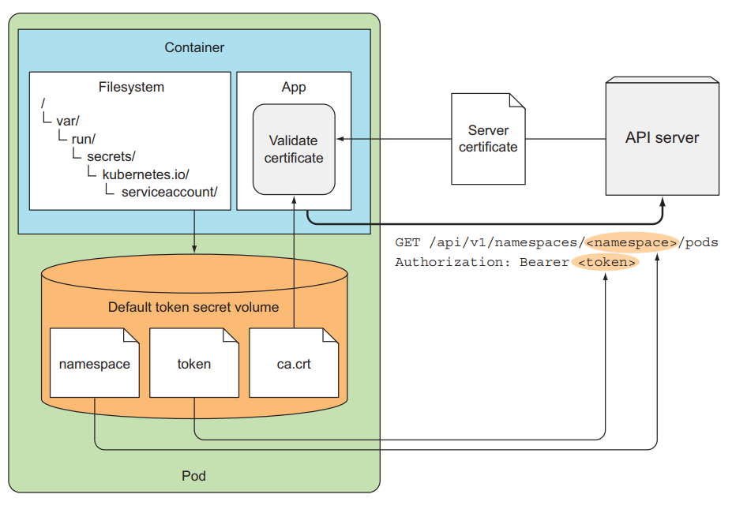
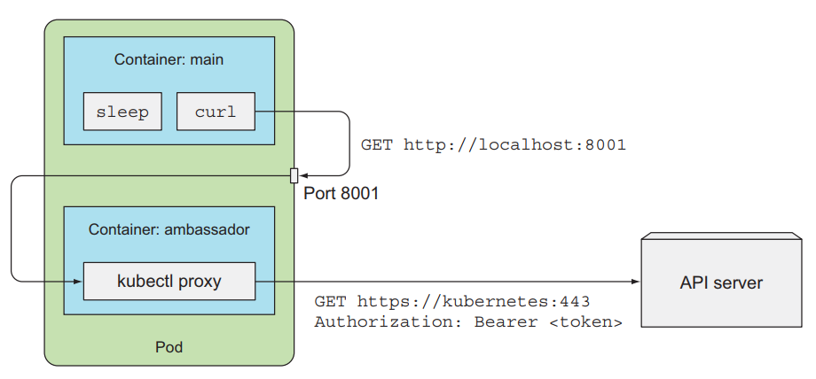

# Downward API: truy cập pod metadata

Trong bài này sẽ nói về cách container có thể truy cập được metadata của pod mà nó thuộc về dùng Downward API, và cách để container có thể truy cập được thông tin của những pod khác bên trong K8s cluster dùng K8s REST API.

Một ứng dụng sẽ cần thông tin về môi trường nó đang chạy, bao gồm cả thông tin chi tiết về chính bản thân nó và cả thông tin về các ứng dụng khác đang chạy cùng 1 môi trường với nó. VD như là web server cần phải biết thông tin về địa chỉ của database, địa chỉ của redis. Một ứng dụng network cần phải biết tên của worker node nó được deploy tới. Một ứng dụng monitor cần phải biết thông tin của các ứng dụng nó cần monitor.

Đối với thông tin về địa chỉ database và redis thì ta có thể biết trước và truyền qua cấu hình env của pod. Nhưng đối với thông tin về tên của worker node mà pod sẽ được deploy tới thì ta không thể biết trước được, ví dụ như ta có 10 worker node, ta không biết được pod đó sẽ được deploy tới node nào để chỉ định env được. Ta chỉ biết pod đó đã được deploy đến node đó mà thôi, vậy làm sao để truyền tên của node vào ứng dụng?

Một ví dụ nữa là ta có một ứng dụng cần phải biết tên của pod của nó thuộc về, nhưng nếu ta deploy pod bằng ReplicaSet thì tên của Pod sẽ là random, ta không thể biết được tên của pod trừ khi nó đã được tạo, vậy thì làm sao ta truyền giá trị đó vào ứng dụng thông qua cấu hình env của pod được.

K8s cung cấp cho ta một đối tượng gọi là Kubernetes Downward API để giải quyết vấn đề này.

## Downward API

Downward API cho phép ta truyền metadata của pod và các thông tin môi trường của nó vào bên trong container. Ta có thể sử dụng những thông tin này và truyền nó qua config env của pod, hoặc config volume của pod để truyền vào container như 1 file. Và không nên để cái tên "Downward API" làm nhầm lẫn, đối tượng này không phải là một REST endpoint, nó chỉ là cách để ta truyền thông tin meta của pod vào trong container thôi.


### Metadata của Pod mà Downward API hỗ trợ

Downward API cho phép ta truyền vào container những thông tin sau:
- Tên của pod
- IP của pod
- Namespace của pod
- Tên của node mà pod đang chạy
- Tên của ServiceAccount của pod
- CPU và memory yêu cầu của mỗi container
- CPU và memory giới hạn của mỗi container
- Labels của pod
- Annotations của pod

Tất cả thuộc tính trên đều có truyền vào Pod thông qua env, chỉ trừ labels và annotations thì phải truyền theo dạng volume file.

### Truyền metadata bằng env

Giờ ta sẽ tạo 1 pod và truyền metadata của pod vào container. Tạo 1 file tên là downward-api-env.yaml với config như sau:

```sh
apiVersion: v1
kind: Pod
metadata:
  name: downward
spec:
  containers:
  - name: main
    image: busybox
    command: ["sleep", "999999"]
    resources:
      requests:
        cpu: 15m
        memory: 100Ki
      limits:
        cpu: 100m
        memory: 8Mi
    env:
      - name: POD_NAME
        valueFrom:
          fieldRef:
            fieldPath: metadata.name
      - name: POD_NAMESPACE
        valueFrom:
          fieldRef:
            fieldPath: metadata.namespace
      - name: POD_IP
        valueFrom:
          fieldRef:
            fieldPath: status.podIP
      - name: NODE_NAME
        valueFrom:
          fieldRef:
            fieldPath: spec.nodeName
      - name: CONTAINER_CPU_REQUEST_MILLICORES
        valueFrom:
          resourceFieldRef:
            resource: requests.cpu
            divisor: 1m
      - name: CONTAINER_MEMORY_LIMIT_KIBIBYTES
        valueFrom:
          resourceFieldRef:
            resource: limits.memory
            divisor: 1Ki
```

Ta sẽ dùng thuộc tính ```fieldRef``` và ```resourceFieldRef``` trong config env của Pod để thông qua Downward API truyền metadata vào container. Với fieldRef ta sẽ chỉ định thuộc tính fieldPath cho nó, và truy cập tên của Pod dùng ```metadata.name```, tên của worker node dùng ```spec.nodeName```.

Đối với env mà truy cập resource requests và limit của container, ta chỉ định thêm trường divisor, giá trị của requests và limit sẽ chia cho số này để ra giá trị ta truyền vào container. Ví dụ, ở config trên ta chỉ định ```requests.cpu``` là 15m, divisor là 1m => giá trị env CONTAINER_CPU_REQUEST_MILLICORES sẽ là 15m/1m = 15, ```limits.memory``` là 8Mi, divisor 1Ki => giá trị CONTAINER_MEMORY_LIMIT_KIBIBYTES env sẽ là 8Mi/1Ki = 8192.

Tạo Pod và kiểm tra thử:

```sh
kubectl apply -f downward-api-env.yaml
```

```sh
kubectl exec downward main -- env
```


Có thể thấy các thông tin về metadata của pod đã nằm trong env của container. Và ứng dụng của ta có thể sử dụng những env mình cần.

### Truyền metadata bằng volume file

Giờ ta sẽ truyền metadata thông qua config volume và mount vào container như 1 file. Tạo 1 file tên là **downward-api-volume.yaml** với config như sau:

```sh
apiVersion: v1
kind: Pod
metadata:
  name: downward-volume
spec:
  containers:
    - name: main
      image: busybox
      command: ["sleep", "999999"]
      resources:
        requests:
          cpu: 15m
          memory: 100Ki
        limits:
          cpu: 100m
          memory: 8Mi
      volumeMounts:
        - name: downward
          mountPath: /etc/downward
  volumes:
    - name: downward
      downwardAPI:
        items:
          - path: "podName"
            fieldRef:
              fieldPath: metadata.name
          - path: "podNamespace"
            fieldRef:
              fieldPath: metadata.namespace
          - path: "annotations"
            fieldRef:
              fieldPath: metadata.annotations
          - path: "containerCpuRequestMilliCores"
            resourceFieldRef:
              containerName: main
              resource: requests.cpu
              divisor: 1m
          - path: "containerMemoryLimitBytes"
            resourceFieldRef:
              containerName: main
              resource: limits.memory
              divisor: 1Ki
```

Ở đây ta chỉ định volume và dùng thuộc tính downwardAPI để truyền metadata vào container ở dạng file nằm ở folder ```/etc/downward```. Khi sử dụng ở dạng volume thì khi khai báo config của ```resourceFieldRef```, ta cần thêm thuộc tính ```containerName``` để chọn container mà muốn lấy request và limit.

Tạo pod và kiểm tra

```sh
kubectl apply -f downward-api-volume.yaml
```

```sh
kubectl exec downward-volume -- ls -lL /etc/downward
```



Có thể thấy Downward API là một object khá dễ dùng trong K8s, nó cho phép ta truyền những thông tin cơ bản của môi trường và những thông tin cần thiết của Pod vào container. Nhưng những dữ liệu nó hỗ trợ thì khá giới hạn, ta không thể truy cập thông tin về những pod khác bằng cách sử dụng Downward API được. Nếu ta cần truy cập nhiều thông tin hơn, thì ta sẽ sử dụng K8s API server.

## Kubernetes API server

Đây là một REST API, cho phép chúng ta gọi tới nó và lấy những thông tin cần thiết về cluster của chúng ta, nhưng cách sử dụng thì không dễ dàng gì.



Để gọi được tới API server thì ta phải cần Authentication thì mới gọi được. Trước khi nói về cách tương tác với API server thì ta hãy nhìn xem nó là cái gì trước.

### Discover API server

Để kiểm tra URL của API server, ta chạy câu lệnh:

```sh
kubectl cluster-info

Kubernetes control plane is running at https://103.101.163.198:6443
```

Tùy vào môi trường, URL này sẽ in ra là một IP hay một DNS, với port là 6443. Nếu ta thử request đến API server thì sẽ nhận được phản hồi như sau:

```sh
curl https://103.101.163.198:6443

curl: (60) SSL certificate problem: unable to get local issuer certificate
More details here: https://curl.haxx.se/docs/sslcerts.html

curl failed to verify the legitimacy of the server and therefore could not
establish a secure connection to it. To learn more about this situation and
how to fix it, please visit the web page mentioned above.
```

Thông báo trên đề cập đến việc lệnh curl không xác thực được SSL, ta truyền thêm option --insecure hoặc -k vào như sau

```sh
curl -k https://103.101.163.198:6443

{
  "kind": "Status",
  "apiVersion": "v1",
  "metadata": {},
  "status": "Failure",
  "message": "forbidden: User \"system:anonymous\" cannot get path \"/\"",
  "reason": "Forbidden",
  "details": {},
  "code": 403
}
```

Giờ ta bị trả về lỗi 403 do không có authentication. Trước hết để test thì ta sẽ expose API server ra localhost để kiểm tra bằng lệnh

```sh
kubectl proxy
```

Sau đó mở terminal khác và request

```sh
curl 127.0.0.1:8001

{
  "paths": [
    "/.well-known/openid-configuration",
    "/api",
    "/api/v1",
    "/apis",
    "/apis/",
    "/apis/admissionregistration.k8s.io",
    "/apis/admissionregistration.k8s.io/v1",
    "/apis/apiextensions.k8s.io",
    "/apis/apiextensions.k8s.io/v1",
    "/apis/apiregistration.k8s.io",
    "/apis/apiregistration.k8s.io/v1",
    "/apis/apps",
    "/apis/apps/v1",
...
```

Có thể thấy kết quả trả về là các apiServer mà ta gọi tới khi tạo các object trong K8s.

### Tương tác với API server

Trong mảng paths bên trên, ta có thể thấy đường dẫn ```/api/v1```, đây là đường dẫn chứa những resource cơ bản trong K8s. 

Ví dụ như khi khai báo Pod, ta cần chỉ định ```apiVersion: v1```, điều này cho thấy Pod resource sẽ nằm trong API ```/api/v1```. Nếu gọi thử đến đường dẫn này thì kết quả trả về sẽ như sau:

```sh
curl 127.0.0.1:8001/api/v1

{
  "kind": "APIResourceList",
  "groupVersion": "v1",
  "resources": [
    {
      "name": "bindings",
      "singularName": "binding",
      "namespaced": true,
      "kind": "Binding",
      "verbs": [
        "create"
      ]
    },
...
    {
      "name": "pods",
      "singularName": "pod",
      "namespaced": true,
      "kind": "Pod",
      "verbs": [
        "create",
        "delete",
        "deletecollection",
        "get",
        "list",
        "patch",
        "update",
        "watch"
      ],
...
```

Có rất nhiều resource trong /api/v1 được list ra. Ví dụ để list hết các pod trong 1 namespace thì ta gọi đến đường dẫn sau

```sh
curl 127.0.0.1:8001/api/v1/namespaces/default/pods

{
  "kind": "PodList",
  "apiVersion": "v1",
  "metadata": {
    "resourceVersion": "3145848"
  },
  "items": []
```

Nếu có pods nào thì nó sẽ được mô tả ở mục items. Tương tự, để lấy thông tin về 1 pod cụ thể ta dùng cú pháp ```curl 127.0.0.1:8001/api/v1/namespaces/default/pods/<pod_name>```

### Tương tác với API server bên trong container của Pod

Để tương tác với API server bên trong Pod thì ta cần biết URL của nó, K8s cung cấp ch ta một ClusterIP mặc định cho API server

```sh
kubectl get svc
NAME         TYPE        CLUSTER-IP   EXTERNAL-IP   PORT(S)   AGE
kubernetes   ClusterIP   10.96.0.1    <none>        443/TCP   10d
```

Service trên có tên là ```kubernetes```, vậy bên trong container, ta có thể gọi tới API server bằng URL ```https://kubernetes```. Ta tạo 1 pod mới để kiểm tra:

```sh
kubectl run curl-pod --image=curlimages/curl --command -- sleep 999999
```

```sh
kubectl exec curl-pod -it -- sh
curl https://kubernetes

curl: (60) SSL certificate problem: unable to get local issuer certificate
More details here: https://curl.se/docs/sslcerts.html

curl failed to verify the legitimacy of the server and therefore could not
establish a secure connection to it. To learn more about this situation and
how to fix it, please visit the web page mentioned above.
```

Ta đã truy cập được vào trong pod, vấn đề bây giờ là làm sao để gửi request API server, ở trên thì ta truyền option -k vào nhưng trong thực tế thì ta không làm vậy. Ta sẽ sử dụng certificate để verify với HTTPS server, file này thường nằm ở ```/var/run/secrets/kubernetes.io/serviceaccount/``` bên trong 1 container, sẽ có 3 file mà được tự động mount vào container khi container được tạo ra, thông tin của 3 file này nằm trong một ServiceAccount, giờ ta sẽ sử dụng nó để authenticate tới API server.

```sh
# Trong pod vừa tạo
cd /var/run/secrets/kubernetes.io/serviceaccount/
ls

ca.crt     namespace  token
```

Sử dụng file cert bên trên và curl đến apiserver sẽ có kết quả như sau

```sh
curl --cacert ca.crt  https://kubernetes

{
  "kind": "Status",
  "apiVersion": "v1",
  "metadata": {},
  "status": "Failure",
  "message": "forbidden: User \"system:anonymous\" cannot get path \"/\"",
  "reason": "Forbidden",
  "details": {},
  "code": 403
}
```

Tiếp tục sử dụng token để authenticate

```sh
TOKEN=$(cat token)
curl --cacert ca.crt -H "Authorization: Bearer $TOKEN" https://kubernetes

{
  "paths": [
    "/.well-known/openid-configuration",
    "/api",
    "/api/v1",
    "/apis",
    "/apis/",
    ...
  ]
}
```

Và đó là cách chúng ta request tới API server, dưới đây là hình minh họa



*Lưu ý:* Với một số cluster thì sẽ cần kích hoạt RBAC trước thì mới có thể authenticate tới API server được

## AMBASSADOR containers pattern trong K8s

Thay vì phải làm nhiều thứ như dùng ca.crt và token file, ta có thể dùng một pattern với tên là ambassador. Pattern này sẽ deploy thêm một container cùng Pod với container chính, container phụ này được gọi là sidecar container, có tác dụng bổ sung chức năng cho container chính. Ở đây thì sidecar container này sẽ phụ trách việc authentication tới API server. Container chính chỉ cần gọi tới sidecar container và nó sẽ gửi request của main container tới API server. Mô hình như sau:




## Sử dụng SDK để tương tác với API server

Nếu ta chỉ thực hiện các tác vụ đơn giản với API server như list resource, thì ta có thể gọi qua REST API cho đơn giản. Nhưng nếu ta muốn tương tác nhiều hơn API server thì nên sử dụng client library. K8s có một số SDK tương ứng với các ngôn ngữ mà ta có thể xài để làm việc với API server. Chi tiết tại [đây](https://kubernetes.io/docs/reference/using-api/client-libraries/)

Ví dụ đoạn code tạo namespace dùng nodejs sdk:

```sh
const k8s = require('@kubernetes/client-node');

const kc = new k8s.KubeConfig();
kc.loadFromDefault();

const k8sApi = kc.makeApiClient(k8s.CoreV1Api);

var namespace = {
    metadata: {
        name: 'test',
    },
};

k8sApi.createNamespace(namespace).then(
    (response) => {
        console.log('Created namespace');
        console.log(response)
        k8sApi.readNamespace(namespace.metadata.name).then((response) => {
            console.log(response);
            k8sApi.deleteNamespace(namespace.metadata.name, {});
        });
    },
    (err) => {
        console.log('Error!: ' + err);
    },
);
```
