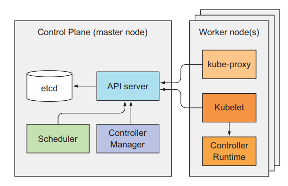
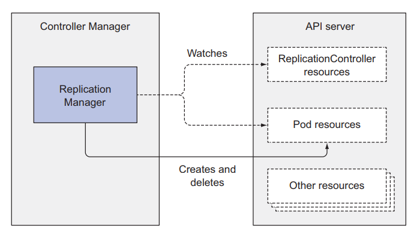
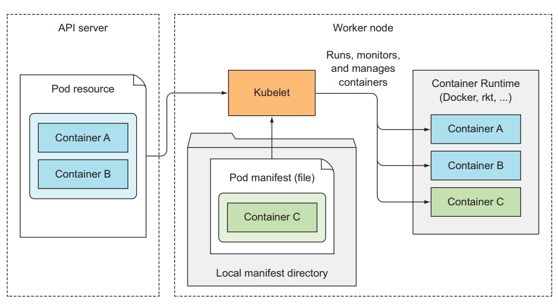
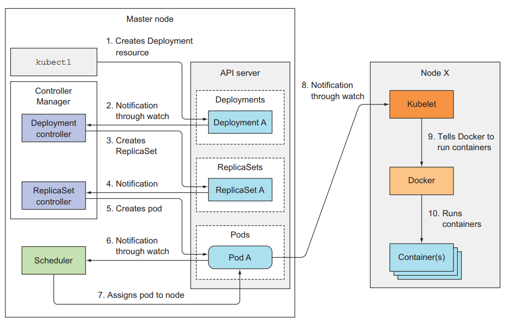

# Kubernetes internals architecture

## I. Kiến trúc của Kubernetes

Trước khi nói về cách làm sao K8s vận hành, ta sẽ nói qua về kiến trúc và các thành phần bên trong nó. Như tất cả mọi người đều biết, k8s cluster có 2 thành phần chính là:
- K8s master (control plane)
- K8s worker nodes

K8s master bao gồm 4 thành phần:
- etcd
- API server
- Controller Manager
- Scheduler

K8s worker node sẽ bao gồm 3 thành phần:
- kubelet
- kube-proxy
- container runtime

Bên cạnh những component chính, thì còn có một số add-on component phụ phục vụ cho các chức năng khác của K8s cluster như:
- Kubernetes DNS Server
- Dashboard
- Ingress controller
- Container Network Interface network plugin



Tất cả những component đều độc lập và có chức năng riêng, một K8s cluster muốn chạy được thì cần tất cả component ở master và worker node đều phải hoạt động. Ta có thể kiểm tra trạng thái của các components ở Control Plane bằng cách dùng câu lệnh:

```sh
kubectl get componentstatuses

NAME                STATUS   MESSAGE             ERROR
scheduler           Healthy  ok
controller-manager  Healthy  ok
etcd-0              Healthy  {"health": "true"}
```

### Những component này giao tiếp với nhau như thế nào?

Tất cả những system component trên đều giao tiếp với nhau thông qua API server, chúng không giao tiếp trực tiếp với nhau. API server là thành phần duy nhất tương tác với etcd, không có component nào ngoài API server được quyền tương tác với etcd.

Ở worker node, container runtime được tạo và quản lý bởi kubelet, chúng đóng vai trò giao tiếp giữa master và worker node thông qua API server.

### Những component này chạy như thế nào trong cluster?

Tất cả những component trong K8s cluster sẽ không phải chạy như một ứng dụng cài trực tiếp trên server. Những component này được chạy như 1 pod, chúng sẽ được deploy tới master hoặc worker node và chạy như 1 pod bình thường và nằm trong namespace tên là **kube-system**. Ta có thể kiểm tra bằng lệnh

```sh
kubectl get pods -n kube-system
```

Chúng ta sẽ không thể thấy được component **kubelet** vì nó là component duy nhất chạy như 1 service trên server chứ không phải 1 pod trong K8s. 

## II. Etcd

Tất cả các resource ta đã biết như pod, replicaset, deployment, service,... tất cả chúng đều được lưu trong etcd. Etcd là một database mà được dùng để lưu trữ thông tin về các resource bên trong K8s. Etcd là database dạng key-value store và tất cả các component khác sẽ đọc ghi dữ liệu từ etcd thông qua API server.

Ngoài ra etcd còn là một distributed storage. Có nghĩa là ta có thể có nhiều hơn 1 etcd database trong 1 cluster và tất cả dữ liệu trong từng instance của etcd đều giống hệt nhau. Để khi một database die thì ta vẫn có các database khác chạy, giúp cluster vẫn chạy bình thường được.

### Resource được lưu trong etcd như thế nào?

Như đã nói thì etcd là dạng key-value store. Thì từng key trong etcd sẽ là một path, key đó có thể chứa key khác hoặc là chứa value. K8s lưu tất cả các resource ở đường dẫn /registry. Ta có thể list dữ liệu bên dưới /registry xem thử như sau:

```sh
etcd /registry

/registry/configmaps
...
/registry/deployments
...
/registry/pods
...
```

Có thể thấy những resource được lưu trữ trong từng path tương ứng. Ta thử xem dữ liệu bên dưới /registry/pods

```sh
etcd /registry/pods

/registry/pods/default
/registry/pods/kube-system
```

Có 2 dữ liệu của pods thuộc 2 namespace là default và kube-system, ta list dữ liệu bên dưới default namespace

```sh
etcd /registry/pods/default

/registry/pods/default/kubia-159041347-xk0vc
/registry/pods/default/kubia-159041347-wt6ga
/registry/pods/default/kubia-159041347-hp2o5
```

Từng dòng sẽ tương ứng với 1 pod, ta xem dữ liệu được lưu trữ trong etcd của 1 pod

```sh
etcdctl get /registry/pods/default/kubia-159041347-wt6ga

{"kind":"Pod","apiVersion":"v1","metadata":{"name":"kubia-159041347-wt6ga",
"generateName":"kubia-159041347-","namespace":"default","selfLink":...
```

Đây là dữ liệu của 1 pod sau khi được tạo ra. Khi ta dùng câu lệnh ```kubectl get pod kubia-159041347-wt6ga``` thì những thứ hiển thị ra được lấy ở bên trong etcd này.

## III. API server

API server là component trung tâm mà được sử dụng bởi hầu hết các component khác hoặc bởi client. API server cung cấp cho ta một REST API để ta thực hiện các hành động CRUD (create, read, update, delete) lên cluster state (thông tin về toàn bộ resource trong cluster), đọc, ghi, thay đổi cluster state. Và lưu cluster state vào etcd.

API server sẽ chịu trách nhiệm Authentication, Authorization client, validation config của resource, chuyển đổi resource thành dạng có thể lưu vào trong etcd. Một API server client mà chúng ta hay sử dụng nhất là kubectl.

Khi ta dùng kubectl để tạo một resource, kubectl này sẽ tạo một POST request kèm theo body là config của resource tới API server. Sau đó API server sẽ kiểm tra xem client này có được phép gọi tới nó hay không qua Authentication plugin, sau đó API sẽ kiểm tra quyền của client này có được thực hiện hành động này hay không qua Authorization plugin. Tiếp theo API server sẽ thực hiện chuyển đổi config resource ban đầu thành dạng format nó có thể đọc thông qua các Admission control plugin. Bước tiếp theo API server sẽ validation config của resource này có đúng hay không, nếu ổn thì resource này sẽ được lưu vào etcd.

### Authentication plugins

Đây là công việc đầu tiên của API server, nó thực hiện authentication với client thông qua một hay nhiều authentication plugins được config bên trong API server. API server sẽ thực hiện từng plugin một, cho tới khi nó xác định được request này là của ai. Token được sử dụng để thực hiện bước authentication này nằm ở trong header với key là Authorization. Các plugin này sẽ tách thông tin về username, userid, và groups bên trong token. Nếu thông tin chính xác, request sẽ được chuyển đến bước authorization, nếu không sẽ bị trả về lỗi 403.

### Authorization plugins

Đây là công việc thứ 2 của API server, sau khi xác định được client là ai, thì nó sẽ kiểm tra quyền của client này có được thực hiện một hành động lên trên một resource hay không thông qua các authorization plugins, quyền này ta sẽ thiết lập ở RBAC. Nếu có quyền thì request sẽ đưa đến bước chuyển đổi format, nếu không thì trả về lỗi 403.

### Admission control plugin

Nếu một request mà thực hiện việc create, update hoặc delete resource, thì nó sẽ được chuyển qua bước này. Tại đây thì config resource ban đầu, bất kể là viết theo dạng YAML hay JSON, thì đều được chuyển sang dạng mà API server có thể validation và lưu vào etcd được, thông qua các admission control plugin. Ngoài ra các plugin này còn modify một số thông tin của resource trước khi lưu vào etcd nếu ta có cài đặt trong API server.

Ví dụ, có một resource mà sẽ config limit cpu và memory của toàn bộ Pod khi Pod được tạo ra, bất kể trong Pod của ta có config limit này hay không. Đó là LimitRange resource.

```sh
apiVersion: v1
kind: LimitRange
metadata:
  name: mem-limit-range
spec:
  limits:
  - default:
      memory: 512Mi
    type: Container
```

LimitRange resource trên sẽ giới hạn limit memory của toàn bộ Pod trong default namespace là 512Mi. Khi ta tạo resource này thì trong API server sẽ enable plugin là Admission Control LimitRange plugins. Tất cả config của pod sẽ được modify để thêm vào thuộc tính limit trước khi nó được tạo. Sau bước này thì request sẽ được chuyển đến bước validation.

### Validation resource và lưu vào etcd

Đây là bước mà sẽ kiểm tra config resource có đúng hay không, nếu có thì API server lưu resource này vào etcd, tương đương với việc resource đã được tạo ra.

**API server sẽ chỉ làm những việc mà ta nói ở trên, lưu ý là nó không thực hiện việc tạo ra Pod, hoặc tạo ra ReplicaSet, tất cả những gì nó làm là lưu resource vào etcd, sau đó nó sẽ gửi thông báo tới component phụ trách việc tạo ra resource đó.**

Component đó là Controller Manager.

## IV. Controller Manager

Đây là component phụ trách việc tạo, deploy các resource thông qua API server. Component này sẽ chứa nhiều controller khác nhau, mỗi controller sẽ thực hiện công việc riêng của nó. Một số container như:
- Replication controller
- Deployment controller
- StatefulSet controller
- ...

Từ tên của các controller thì ta cũng có thể đoán được là controller đó làm gì. Các controller này sẽ lắng nghe thông báo từ API server về các sự kiện mà thay đổi một resource như là create, update hoặc delete và thực hiện hành động tương ứng với thay đổi đó. 

### Replication controller

Đây là controller làm những công việc liên quan tới ReplicationController resource. Nó lắng nghe thông báo từ API server về những thứ thay đổi liên quan đến ReplicationController resource, và thực hiện việc theo dõi số lượng pod hiện tại có bằng với thuộc tính replcas của nó hay không. Khi phát hiện số lượng Pod ít hơn so với thuộc tính replicas của nó hay không. Khi phát hiện số lượng Pod ít hơn so với thuộc tính replicas của nó, nó sẽ tạo 1 post request tới API server, để một Pod mới được tạo ra.



### Deployment controller

Đây là controller lắng nghe những thay đổi liên quan tới Deployment resource, bên cạnh đó, nó cũng sẽ thực hiện các công việc như rollout update, và quản lý các ReplicaSet bên dưới nó.

### StatefulSet controller

Controller này cũng tương tự như replication controllers, nó sẽ quản lý Pod, nhưng bên cạnh đó, nó sẽ quản lý thêm PVC template cho mỗi Pod.

Từng controller sẽ quản lý và lắng nghe thay đổi về resource liên quan tới nó. Lưu ý là ta không có Pod controller, thay vào đó, sẽ có 1 component khác để thực hiện việc worker nào sẽ được chọn để deploy Pod tới đó.

## V. Scheduler

Đây là component phụ trách việc sẽ chọn worker nào mà Pod sẽ được deploy tới. Công việc nó làm là lắng nghe thông báo từ API server về việc Pod nào đã được lưu vào etcd xong, mà chưa có thuộc tính node. Nó sẽ lựa chọn worker node phù hợp, sau đó nó update thuộc tính node của Pod resource thông qua API server. API server sẽ phụ trách việc thông báo tới kubelet ở worker node đó để tạo ra container runtime tương ứng với Pod đó.

Mặc dù công việc của Scheduler nghe có vẻ đơn giản, chọn worker node thích hợp Pod. Nhưng công việc thực sự cần làm để chọn worker node thích hợp nhất thì không đơn giản tí nào, như các thuật toán hoặc áp dụng machine learning model để chọn đúng node worker.

### Scheduling algorithn đơn giản

Thuật toán mặc định để chọn worker node đơn giản sẽ như sau:
- Chọn ra node có thể chấp nhận Pod từ những node có sẵn
- Sắp xếp các node đó theo thứ tự ưu tiên, và chọn node có thứ tự ưu tiên lớn nhất

### Chọn ra node có thể chấp nhận Pod

Ở bước này thì Scheduler sẽ kiểm tra những tiêu chí sau:
- Node đó có đáp ứng được request của Pod về CPU và memory hay không
- Node có chạy quá tài nguyên hay không
- Node có label trùng với thuộc tính nodeSelector (nếu có) của Pod hay không
- Nếu Pod cần 1 port trên worker node, thì liệu port đó của worker node đã được xài chưa
- Nếu Pod có cấu hình volume, node có đáp ứng được volume phù hợp hay không
- Xem xét pod affinity và/hoặc anti-affinity, xem xét taints của node xem có tolerate được không

### Chọn node có thứ tự ưu tiên lớn nhất

Mặc dù có nhiều node có thể deploy pod, nhưng sẽ có node tốt hơn các node còn lại, nên Scheduler cần sắp xếp các node đó lại, tính điểm và lập lịch pod tới node có điểm cao nhất. Nếu ta chạy trên môi trường cloud, thì Scheduler này còn có thể chọn ra node mà tiết kiệm tiền nhất để gắn pod.

## VI. Kubelet

Đây là component sẽ chịu trách nhiệm tương tác với master node và quản lý container runtime. Khi join 1 worker node vào master, thì công việc đầu tiên của kubelet này sẽ là tạo 1 post request với body là node config tới API server để tạo 1 node resource.

Sau đó nó sẽ lắng nghe thông báo từ API server về Pod mà được scheduled tới nó để tạo container runtime tương ứng. Ngoài ra kubelet còn giám sát container và gửi thông tin đó lên API server. Khi pod bị xóa khỏi API server, API server sẽ thông báo tới kubelet và nó sẽ thực hiện xóa container đó ra khỏi node, sau khi xong thì nó sẽ gửi thông báo lại cho API server là container tương ứng với Pod đó đã được xóa xong.



## VII. Kube proxy

Đây là component quản lý traffic và network của worker node mà liên quan tới Pod. Ở các bài trước ta tạo Service để client có thể tương tác được với Pod của chúng ta, thì kube-proxy sẽ dựa vào config của service để cấu hình network tương ứng ở worker node để một request có thể gửi được tới Pod mà nằm phía sau Service. Kube-proxy có 3 mode: userspace, iptable và ipvs, để tìm hiểu sâu hơn thì xem lại bài về Service.

## VIII. Các component làm việc với nhau như thế nào?

Ví dụ khi ta tạo 1 Deployment, các component sẽ hoạt động như sau:

- Đầu tiên, kubelet sẽ extract config file và gán nó vào body của POST request, sau đó kubelet sẽ gửi post request này tới API server
- API server sau khi thực hiện hết các việc của nó và lưu được được deployment resource vào bên trong etcd, lúc này API server sẽ gửi thông báo tới Deployment controller. 
- Deployment controller nhận được thông báo rằng deploymemnt mới đã được tạo, thì nó sẽ tìm config về template ReplicaSet bên trong config của nó để gửi request tạo ra ReplicaSet tới API server.
- Sau khi API server lưu ReplicaSet resource vào trong etcd thì nó sẽ gửi thông báo cho ReplicaSet controller.
- ReplicaSet controller lúc này sẽ gửi request tạo Pod đến API server
- API lưu Pod resource và thông báo tới Scheduler
- Scheduler chọn node và báo lại với API server. API server thông báo tới kubelet ở worker node tương ứng để tạo container runtime cho Pod.



Ta có thể lắng nghe các event tương ứng bằng câu lệnh sau:

```sh
kubectl get events --watch
```

Đây là cách mà các component keesthowjp với nhau để tạo ra 1 resource, các bạn có thể thấy từng component trong K8s cluster sẽ có chức năng riêng và hoạt động đọc lập với nhau, và khi kết hợp chúng lại ta sẽ có một flow rất chặt chẽ