# Automatic scaling

Có 2 phương pháp scaling (pod/cluster) là **horizontal scaling** và **vertical scaling**:
- **Horizontal scaling** là cách scale mà ta sẽ tăng số lượng worker (application) đang xử lý công việc hiện tại ra nhiều hơn. Ví dụ ta đang có 2 pod để xử lý tích điểm cho client khi client tạo deal thành công, khi số lượng client tăng đột biến, 2 pod không thể xử lý kịp, ta sẽ scale số lượng pod lên thành 4 chẳng hạn.
- **Vertical scaling** là cách scale thay vì tăng số lượng worker, ta sẽ tăng lượng tài nguyên của ứng dụng đó lên, như là tăng số CPU và RAM của ứng dụng đó. Ví dụ ta có một model để train AI, việc train này không thể tách ra 1 model khác để tăng tốc độ train được, mà ta chỉ có thể ăng CPU và memory cho model đó.

Trong K8s, ta horizontal scale bằng cách tăng số lượng ở thuộc tính replicas của ReplicationController như ReplicaSet/Deployment. Vertical scale bằng cách tăng resource requests và limits của Pod. Ta có thể làm việc này thủ công, nhưng sẽ rất bất tiện, do không thể ngồi cả ngày để kiểm tra lúc nào ứng dụng có nhiều client thì ta scale được.

K8s cung cấp cho ta cách autoscaling dựa vào việc phát hiện CPU và Memory ta chỉ định đạt tới ngưỡng scale. Nếu ta xài cloud, nó còn có thể tự động tạo thêm worker node khi phát hiện không còn đủ node để deploy pod

## Horizontal pod autoscaling

Horizontal pod autoscaling là cách ta tăng giá trị replicas ở trong các scalable resource (Deployment, ReplicaSet, ReplicationController, hay StatefulSet) để scale số lượng Pod. Công việc này được thực hiện bởi Horizontal controller khi ta tạo 1 HorizontalPodAutoscaler (HPA) resource. Horizontal controller sẽ thường xuyên kiểm tra metric của pod, tính toán số lượng pod replicas phù hợp dựa vào metric kiểm tra của pod hiện tại với giá trị metric mà ta đã chỉ định ở trong HPA resource, sau đó sẽ thay đổi trường replicas của các scalable resource (Deployment, ReplicaSet, ReplicationController, or StatefulSet) nếu nó thấy cần thiết.

Ví dụ 1 file config HPA sẽ như sau:

```sh
apiVersion: autoscaling/v2
kind: HorizontalPodAutoscaler
metadata:
  name: micro-services-autoscale
spec:
  scaleTargetRef:
    apiVersion: apps/v1
    kind: Deployment
    name: microservice-user-products
  minReplicas: 2
  maxReplicas: 5
  metrics:
  - type: Resource
    resource:
      name: memory
      target:
        type: Utilization
        averageUtilization: 70
```

Với config trên, ta chỉ định scalable resource bằng thuộc tính scaleTargetRef, ta chọn resource ta muốn scale là Deployment và tên của Deployment đó, ta chỉ định số lượng min và max replicas bằng 2 thuộc tính minReplicas, maxReplicas. Metric mà ta muốn thu thập là memory, với giá trị ngưỡng là 70%. Khi metric thu thập được từ Pod vượt qua giá trị này, quá trình autoScaling sẽ được thực thi.

### 1. Quá trình Autscaling 

Quá trình autoscaling được chia thành 3 giai đoạn như sau:
- Thu thập metrics của tất cả các pod được quản lý bởi scalable resource mà ta chỉ định trong HPA
- Tính toán số lượng Pod cần thiết dựa vào metrics thu thập được
- Cập nhật lại trường replicas của scalable resource

### 2. Thu thập metrics

Horizontal controller sẽ không trực tiếp thu thập metrics của Pod, mà nó sẽ lấy thông qua một đối tượng khác, được gọi là metrics server. Ở trên từng worker node, sẽ có 1 đối tượng được gọi là **cAdvisor**, đây là một component của kubelet, có nhiệm vụ thu thập metric của Pod và node, sau đó những metric này sẽ được tổng hợp ở metrics server, và horizontal controller sẽ lấy metric từ metrics server ra.

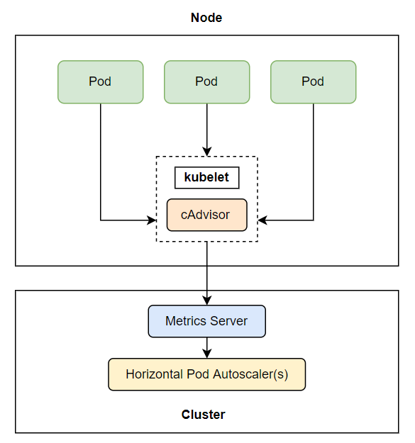

Ta cần lưu ý một điều ở đây là metrics server này là một add-ons, chứ nó không có sẵn trong K8s cluster của ta, nếu ta muốn sử dụng được tính năng autoscaling, ta cần phải cài metrics server này vào. Tài liệu gốc ở [đây](https://github.com/kubernetes-sigs/metrics-server). Nhìn chung là ta chạy lệnh sau để install bản mới nhất (support K8s v1.21+)

```sh
kubectl apply -f https://github.com/kubernetes-sigs/metrics-server/releases/latest/download/components.yaml
```

Kubelet certificate cần phải được ký bởi cluster CA, hoặc tắt nó đi bằng cách

```sh
kubectl edit deployment metrics-server -n kube-system
```
Sau đó tìm đến ```.spec.template.spec.containers[].args[]``` và thêm tham số sau vào ```--kubelet-insecure-tls```

Kiểm tra đã cài đặt thành công chưa bằng lệnh

```sh
kubectl top node
```

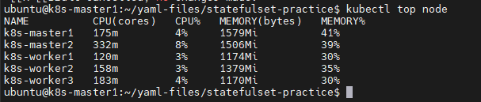

### 3. Tính toán số lượng pod cần thiết

Sau khi horizontal controller thu thập được metric, nó sẽ tiến hành giai đoạn tiếp theo là tính toán số lượng Pod dựa theo metric thu thập được với số metric ta chỉ định trong HPA, nó sẽ tính toán theo công thức có sẵn với đầu vào là pod metrics và đầu ra là số replicas. Công thức đơn giản hóa như sau:

```sh
desiredReplicas = ceil[currentReplicas * ( currentMetricValue / desiredMetricValue )]
```

#### Ví dụ 1: Với 1 metric

Khi 1 HPA cấu hình chỉ có 1 metric (chỉ có CPU hoặc memory) thì việc tính toán số lượng pod chỉ có một bước là sử dụng công thức trên. Ví dụ ta có giá trị current metric hiện tại là 200m, giá trị desired là 100m, current replicas là 2, ta sẽ có:

```sh
currentMetricValue / desiredMetricValue = 200m / 100m = 2

desiredReplicas = ceil[2 * 2] = 4
```

Số lượng replicas của ta bây giờ sẽ được scale từ 2 lên 4. Một ví dụ khác là ta có giá trị curent metric là 50m, giá trị desired là 100m, ta sẽ có:

```sh
currentMetricValue / desiredMetricValue = 50m / 100m = 0.5

disiredReplicas = ceil[2 * 0.5] = 1
```

#### Ví dụ 2: Với nhiều metric

Khi HPA của ta cấu hình mà có nhiều metric, ví dụ có cả cpu và queries-per-second (QPS), thì việc tính toán cũng không khác là mấy, horizontal controller sẽ tính ra giá trị replicas của từng metric riêng lẻ, sau đó lấy giá trị replicas lớn nhất

Ví dụ ta có replicas sau khi tính ra của CPU là 4, QPS là 3, thì max(4,3) = 4, số lượng replica sẽ được scale lên 4


### 4. Cập nhật trường Replicas

Đây là bước cuối cùng của quá trình autoscaling, horizontal controller sẽ cập nhật lại giá trị replicas của resource ta chỉ định trong HPA, và để resource đó tự động thực hiện việc tăng số lượng Pod. Hiện tại thì autoscaling chỉ hỗ trợ các resource sau đây:
- Deployments
- ReplicaSets
- ReplicationController
- StatefulSets

## Thực hành Scale Horizontal

### 1. Scale theo CPU

Giờ ta sẽ tạo 1 deployment và 1 HPA, lưu ý là deploy buộc phải có .resources.requests

```sh
cat << EOF > deploy-scaling-horizontal.yaml
apiVersion: apps/v1
kind: Deployment
metadata:
  name: kubia
spec:
  replicas: 3
  selector:
    matchLabels:
      app: kubia
  template:
    metadata:
      labels:
        app: kubia
    spec:
      containers:
      - image: luksa/kubia:v1
        name: nodejs
        resources:
          requests:
            cpu: 100m
EOF
```

Ở file config trên, ta tạo Deployment với số lượng replicas là 3, và cpu requests là 100m. Giờ ta sẽ tạo HPA, tạo 1 file tên là ```hpa.yaml``` với config như sau:

```sh
apiVersion: autoscaling/v2
kind: HorizontalPodAutoscaler
metadata:
  name: kubia
spec:
  scaleTargetRef:
    apiVersion: apps/v1
    kind: Deployment
    name: kubia
  minReplicas: 1
  maxReplicas: 5
  metrics:
  - type: Resource
    resource:
      name: cpu
      target:
        type: Utilization
        averageUtilization: 30
```

Tạo và kiểm thử

```sh
kubectl apply -f deploy-scaling-horizontal.yaml
kubectl apply -f hpa.yaml
kubectl get hpa
```

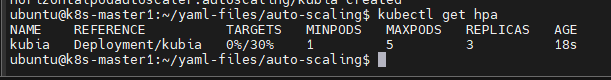

Do CPU đang sử dụng ~0%, vài phút sau ta get lại sẽ thấy replica scale xuống 1

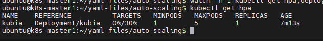

Hoặc ta có thể dùng lệnh sau để theo dõi trực quan hơn quá trình scaling

```sh
watch -n 1 kubectl get hpa,deployment
```

Để trigger scaleup, đầu tiên ta cần expose deployment

```sh
kubectl expose deployment kubia --port=80 --target-port=8080
kubectl run -it --rm --restart=Never loadgenerator --image=busybox -- sh -c "while true; do wget -O - -q http://kubia; done"
```

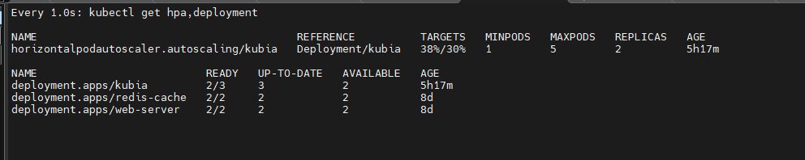

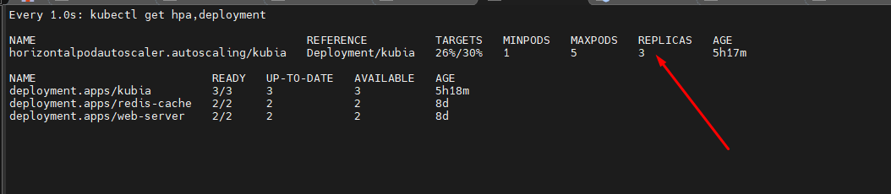

Thử 1 cách khác, ta thêm container sau vào pod

```sh
- name: stress-container
  image: progrium/stress
  command: ["stress", "--cpu", "0.1"]
  resources:
    requests:
      cpu: 100m
```

Và theo dõi kết quả

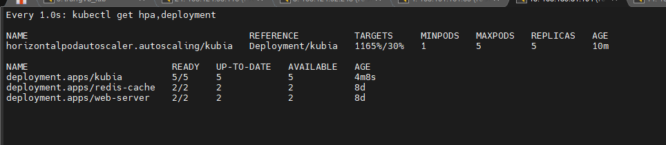

Như vậy số pod đã tăng lên max khi ta đẩy CPU lên cao. Giờ ta xóa container stress đi và xem kết quả:


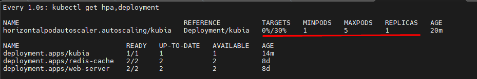

**Chú ý:** AutoScaling có 1 thông số gọi là Maximum rate of scaling, thông số này giới hạn số replica có thể scale trong 1 lần, mặc định là **gấp 2 lần số lượng replicas hiện tại**, nếu số lượng relicas hiện tại là 1 hoặc 2 thì tối đa replicas được scale là 4.

### 2. Scale theo memory

Việc config scale memory không khác gì so với CPU. Tuy nhiên ta cần phải lưu ý rằng việc release và sử dụng memory sẽ phụ thuộc vào ứng dụng bên trong container. Khi ta scale up số lượng Pod lên dựa vào memory, system không thể chắc chắn rằng số lượng sử dụng memory của từng ứng dụng sẽ giảm đi, vì điều này phụ thuộc vào cách ta viết ứng dụng, nếu sau khi ta scale up Pod, ứng dụng vẫn sử dụng memory nhiều như trước hoặc thậm chí nhiều hơn, quá trình scale sẽ lặp lại và đạt tới ngưỡng maximum Pod của worker node và có thể dẫn tới die worker node. Vì vậy khi scale Pod dựa vào memory thì ta phải xem xét nhiều yếu tố hơn chứ không phải chỉ config HPA là xong.

Phần này sẽ kiểm thử với deployment tương tự như bên trên nhưng thêm RAM xem sao.

Đầu tiên là chỉnh sửa 1 chút ở Deployment:

```sh
cat << EOF > deploy-scaling-ram.yaml
apiVersion: apps/v1
kind: Deployment
metadata:
  name: kubia-2
spec:
  replicas: 3
  selector:
    matchLabels:
      app: kubia
  template:
    metadata:
      labels:
        app: kubia
    spec:
      containers:
      - image: luksa/kubia:v1
        name: nodejs
        resources:
          requests:
            cpu: 100m
            memory: 100Mi
EOF
```

```sh
apiVersion: autoscaling/v2
kind: HorizontalPodAutoscaler
metadata:
  name: kubia-2
spec:
  scaleTargetRef:
    apiVersion: apps/v1
    kind: Deployment
    name: kubia
  minReplicas: 1
  maxReplicas: 5
  metrics:
  - type: Resource
    resource:
      name: cpu
      target:
        type: Utilization
        averageUtilization: 30
  - type: Resource
    resource:
      name: memory
      target:
        type: Utilization
        averageUtilization: 30
```

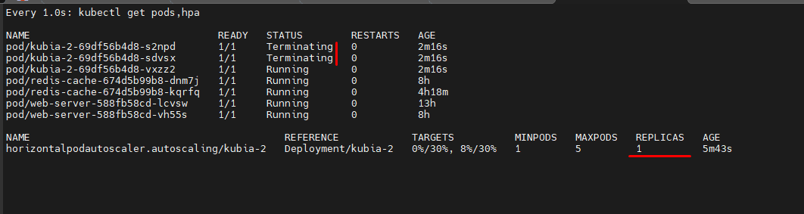

Nếu stress test cả CPU và RAM thì không trực quan lắm vì các công cụ test memory sẽ sử dụng cả CPU để tạo process, do đó CPU sẽ bị ảnh hưởng và HPA sẽ scale theo CPU lên mức tối đa. Còn nếu ta tăng CPU request lên cao thì HPA sẽ không scale theo CPU nữa do không đủ Utilization => Rất khó để stress test cả CPU và RAM cùng 1 lúc mà nó trực quan được.

Còn nếu AutoScaling với RAM thì không khác gì CPU cả:

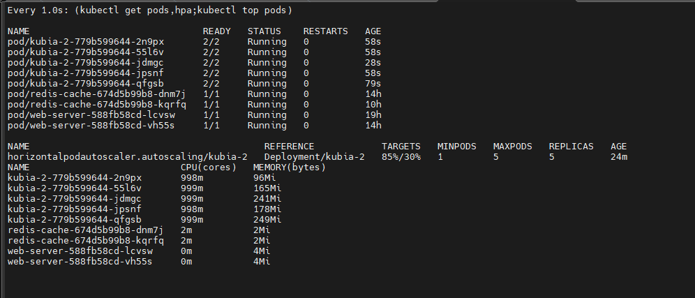

### 3. Scale theo metric khác

Ngoài CPU và memory, K8s cũng có hỗ trợ 1 số metric khác mà ta cũng hay xài, ở trên ta đã sử dụng ```type: Resource``` với CPU và memory, còn 2 ```type``` khác là ```Pods``` và ```Object```

Ví dụ: với type Pods, ta có thể theo dõi Queries-Per-Second và number of messages trong queue, chẳng hạn như:

```sh
metrics:
- type: Pods
  resource:
    metricName: qps
    targetAverageValue: 100
```

Object metric là những metric mà không liên quan trực tiếp tới Pod, mà sẽ liên quan tới những resource khác của cluster. Ví dụ như ingress:

```sh
metrics:
- type: Object
  object:
    metric:
      name: requests-per-second
    describedObject:
      apiVersion: networking.k8s.io/v1
      kind: Ingress
      name: main-route
    target:
      type: Value
      value: 2000
```

## Vertical pod AutoScaling

Ta đã thấy horizontal scaling giúp ta giải quyết được nhiều vấn đề performance của ứng dụng, nhưng không phải ứng dụng nào ta cũng có thể scale theo kiểu horizontal được, như việc train AI mà ta đã đề cập ở đầu bài viết. Vì vậy ta cần phải scale để tăng tài nguyên của Pod lên (hoặc giảm)

Ta cần lưu ý hiện tại K8s không hỗ trợ resource Vertical có sẵn mà phải cài thêm add-ons như hướng dẫn ở [đây](https://github.com/kubernetes/autoscaler/tree/master/vertical-pod-autoscaler). Hoặc làm theo các bước dưới đây:

**Điều kiện:**
- ```kubectl``` và ```metrics server``` phải được cài đặt
- Nếu đã có 1 phiên bản khác của VPA được cài đặt thì phải xóa bỏ nó đi bằng lệnh ```./hack/vpa-down.sh```

Để cài đặt VPA, ta thực hiện các lệnh sau:

```sh
git clone https://github.com/kubernetes/autoscaler.git
cd autoscaler/vertical-pod-autoscaler/
./hack/vpa-up.sh
```

Ví dụ 1 file cấu hình VerticalPodAutoscaler như sau:

```sh
apiVersion: autoscaling.k8s.io/v1
kind: VerticalPodAutoscaler
metadata:
  name: my-app-vpa
spec:
  targetRef:
    apiVersion: "apps/v1"
    kind: Deployment
    name: my-app-vpa
  updatePolicy:
    updateMode: "Auto"
```

Với ```targetRef``` ta sẽ chọn resource ta thu thập để scale, và ```updatePolicy.updateMode``` có 3 chế độ là ```Off```, ```Initial``` và ```Auto```

### 1. VPA Component

VPA sẽ có 3 component như sau
- **Recommender**: component này sẽ monitor các tài nguyên đã tiêu thụ để cung cấp giá trị CPU và memory requests gợi ý
- **Updater**: component này sẽ kiểm tra Pod được quản lý bởi scalable resource có CPU và memory đúng với giá trị của Recommender cung cấp ở trên hay không, nếu không, nó sẽ kill Pod đó và tạo lại Pod mới với CPU và memory requests đã được cập nhật đúng theo Recommender
- **Admission Plugin**: đây là admission plugin của VPA thêm vào các Admission Plugin có sẵn API Server, có nhiệm vụ sẽ thay đổi resource requests của Pod khi nó được tạo để đúng với giá trị của Recommender

### 2. Update Policy

Policy này sẽ điều khiển cách VPA áp dụng thay đổi lên Pod, được chỉ định thông qua thuộc tính **updatePolicy.updateMode**. Có 3 giá trị là:
- **Off**: Ở mode này, VPA chỉ tạo ra một recommendations, mà không áp dụng giá trị recommendations đó lên Pod, ta chọn mode này khi chỉ muốn xem giá trị requests được gợi ý cho chúng ta, và ta sẽ quyết định xem có cập nhật lại CPU và memory requests giống với giá trị gợi ý cho ta hay không
- **Initial**: Ở mode này, sau khi recommendations được tạo ra, thì chỉ những Pod nào được tạo mới sau này mới được áp dụng giá trị CPU/Memory requests recommend, những Pod hiện tại không thay đổi
- **Auto**: Ở mode này, sau khi recommendation được tạo ra, thì không chỉ những Pod mới được áp dụng giá trị gợi ý này, mà kể cả những Pod hiện tại mà có giá trị không đúng với giá trị của recommedations, thì nó cũng sẽ bị restart lại.

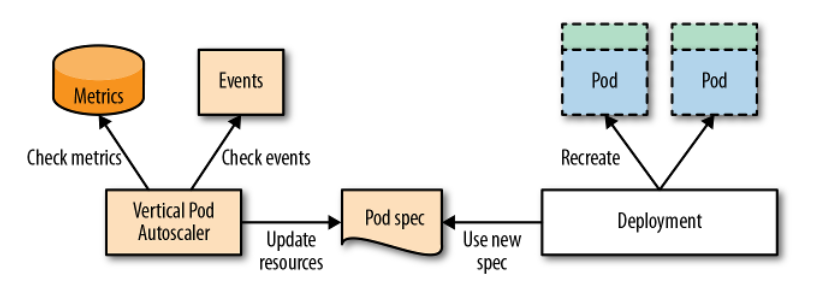

### 3. Kiểm thử

Tạo 1 file yaml như sau:

```sh
apiVersion: "autoscaling.k8s.io/v1"
kind: VerticalPodAutoscaler
metadata:
  name: hamster-vpa
spec:
  targetRef:
    apiVersion: "apps/v1"
    kind: Deployment
    name: hamster
  resourcePolicy:
    containerPolicies:
      - containerName: '*'
        minAllowed:
          cpu: 100m
          memory: 50Mi
        maxAllowed:
          cpu: 1
          memory: 500Mi
        controlledResources: ["cpu", "memory"]
---
apiVersion: apps/v1
kind: Deployment
metadata:
  name: hamster
spec:
  selector:
    matchLabels:
      app: hamster
  replicas: 2
  template:
    metadata:
      labels:
        app: hamster
    spec:
      securityContext:
        runAsNonRoot: true
        runAsUser: 65534 # nobody
      containers:
        - name: hamster
          image: registry.k8s.io/ubuntu-slim:0.1
          resources:
            requests:
              cpu: 100m
              memory: 50Mi
          command: ["/bin/sh"]
          args:
            - "-c"
            - "while true; do timeout 0.5s yes >/dev/null; sleep 0.5s; done"
```

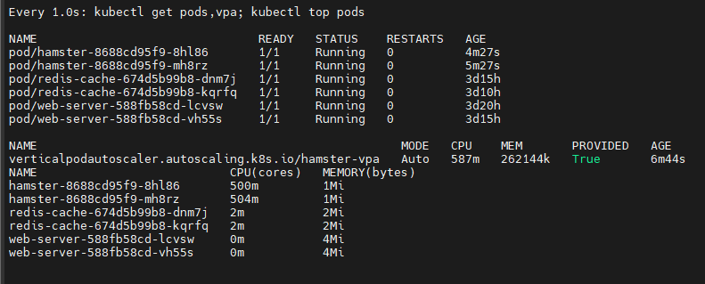

File yaml này sẽ tạo ra 1 deployment với 2 pod, mỗi pod chạy 1 container mà sẽ yêu cầu 100m cpu và nó sẽ cố gắng để sử dụng khoảng hơn 500m cpu. File yaml này cũng tạo 1 VPA trỏ tới deployment trên. VPA sẽ theo dõi hành vi của pod, và sau khoảng 5 phút, chúng sẽ được cập nhật với 1 lượng CPU request cao hơn (lưu ý là VPA không thay đổi trực tiếp template của deployment, nhưng nó sẽ request thực sự của pod sẽ được cập nhật).

**Lưu ý:** Nếu cluster có lượng tài nguyên trống nhỏ hơn lượng yêu cầu, những pod này sẽ không được schedule.

Thử thay đổi 1 chút, ta thêm thuộc tính ```limits``` vào resources của containers

```sh
limits:
  cpu: 300m
  memory: 50Mi
```

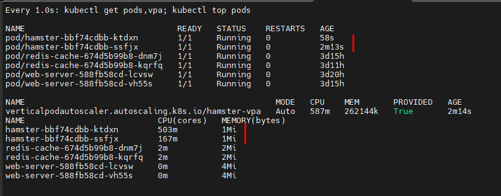

Trong trường hợp này, do có sự xung đột về giới hạn tài nguyên giữa pod và VPA, nên VPA đã sử dụng giới hạn được định nghĩa của nó.

Một vài trường hợp khác:

**Giữ lượng limit tỉ lệ thuận với request**

Container template chỉ định resource request là 500m CPU và 1 GB RAM, với tham số limit là 2 GB RAM. VPA recommenation là 1000m CPU  và 2 GB RAM. Khi VPA áp dụng recommendation, nó sẽ thiết lập memory limit thành 4 GB

**Giới hạn limit range**

Container template chỉ định resource request là 500m CPU và 1 GB RAM, với limit 2 GB RAM. 1 limit range thiết lập 1 giới hạn là 3 GB RAM mỗi container. VPA recommendation là 1000m CPU và 2 GB RAM. Khi áp dụng VPA recommendation này, nó sẽ thiết lập memory limit của container thành 3 GB (tuân thủ theo limit range) và memory request là 1.5 GB (để giữ tỉ lệ 2:1 limit/request)

**Resource policy ghi đè limit range**

Container template chỉ định resource request là 500m CPU và 1 GB RAM, với limit 2 GB RAM. 1 limit range thiết lập 1 giới hạn là 3 GB RAM mỗi container. VPA container resource policy yêu cầu VPA thiết lập container request thấp nhất là 750m CPU và 2 GB RAM. VPA recommendation là 1000m CPU và 2 GB RAM. Khi áp dụng recommendation, VPA sẽ thiết lập RAM request là 2 GB (tuân theo resource policy) và RAM limit là 4 GB (để giữ tỉ lệ 2:1 limit/request)

**Multiple recommenders**

Việc có nhiều hơn 1 recommender là hoàn toàn có thể, việc này nhằm để sử dụng các tỉ lệ khác nhau trên các workload profiles khác nhau. Ví dụ, ta có 3 profile tên là **frugal**, **standard** và **performance** sử dụng TargetCPUPercentile khác nhau để tính toán recommendation của chúng. Ví dụ:

```sh
apiVersion: v1
kind: ServiceAccount
metadata:
  name: vpa-recommender
  namespace: kube-system
---
apiVersion: apps/v1
kind: Deployment
metadata:
  name: vpa-recommender-performance
  namespace: kube-system
spec:
  replicas: 1
  selector:
    matchLabels:
      app: vpa-recommender-performance
  template:
    metadata:
      labels:
        app: vpa-recommender-performance
    spec:
      serviceAccountName: vpa-recommender
      securityContext:
        runAsNonRoot: true
        runAsUser: 65534 # nobody
      containers:
      - name: recommender
        image: registry.k8s.io/autoscaling/vpa-recommender:0.13.0
        imagePullPolicy: Always
        args:
          - --name=performance
          - --target-cpu-percentile=0.95
        resources:
          limits:
            cpu: 200m
            memory: 1000Mi
          requests:
            cpu: 50m
            memory: 500Mi
        ports:
        - name: prometheus
          containerPort: 8942
```

Lưu ý rằng các tham số sau sẽ ghi đè lên default name và percentile
- --name=performance
- --target-cpu-percentile=0.95

Ta có thể chọn sử dụng recommender nào bằng cách thiết lập ```recommenders``` trong phần VPA spec.

### 4. Hạn chế của VPA

- Khi VPA cập nhật tài nguyên cho pod, pod sẽ được tái tạo, tức là toàn bộ container sẽ ngừng hoạt động và tạo lại, pod sau đó cũng có thể phải lập lịch ở node khác
- VPA không thể chắc chắn rằng pod mà nó thu hồi để tái tạo sẽ có thể được lập lịch thành công (đa phần do không đủ tài nguyên trống trong cluster). Điều này có thể phần nào giải quyết bằng Cluster Autoscaler
- VPA không thu hồi pod mà không nằm dưới sự quản lý của 1 controller. Do đó các pod này hoạt động ở chế độ ```Auto``` tương đương với ```Initial```
- VPA **không nên** được sử dụng cùng HPA đối với CPU hay memory cùng 1 lúc. Tuy nhiên, ta vẫn có thể áp dụng VPA cùng HPA với custom và external metrics
- VPA admission controller là 1 admission webhook. Nếu ta cần thêm các admission webhooks khác vào cluster, ta nên chắc chắn rằng chúng không conflict với nhau. Thứ tự của admission controller được định nghĩa ở API server
- VPA phản hồi với hầu hết OOM event, nhưng không phải mọi trường hợp
- VPA performance chưa được kiểm chứng đối với cluster lớn
- Nhiều VPA cùng áp dụng vào 1 pod có thể dẫn đến những hành vi không tính trước được

## Cluster Autoscaler 

Như đã đề cập nhiều lần ở các phần bên trên, đôi khi sẽ có những trường hợp ta scale tới mức không còn node để scale nữa. Tất nhiên lúc này cách duy nhất là join thêm worker node vào cluster. Khi ta chạy K8s trên cloud, ta có thể config quá trình này tự động. Khi  pod được tạo ra mà không còn node nào để chứa được nữa, Cluster Autoscaler sẽ tự động tạo thêm node cho chúng ta.


Và khi đó, Pod mà trước đó không thể schedule được của chúng ta sẽ được deploy tới worker node mới này. Đó là quá trình scale up, vậy còn scale down sẽ được thực hiện khi:
- Nhiều hơn một nửa capacity không được sử dụng, cộng tất cả request CPU và memory của pod lại, nếu nhỏ hơn 50% là đúng với yêu cầu này
- Tất cả các pod hiện tại của node đó, có thể được di chuyển qua node khác mà không gặp vấn đề gì
- Không có gì ngăn cản việc node đó bị xóa đi
- Không còn pod nào mà không thể di chuyển còn ở trên node đó

Nếu tất cả các điều kiện trên đều đúng, mặc định trong vòng 10 phút thì node đó sẽ bị xóa khỏi cluster. Quá trình xóa này gồm 2 bước, đầu tiên CA sẽ đánh dấu là node đó unschedulable và move toàn bộ pod qua node khác, tương tự câu lệnh ```kubectl drain <node>``` và sau đó node sẽ bị xóa đi.

CA được hỗ trợ bởi:
- Google Kubernetes Engine (GKE)
- Google Compute Engine (GCE)
- Amazon Web Services (AWS)
- Microsoft Azure

Với GKE ta có thể bật autoscaling như sau:

```sh
gcloud container clusters update kubia --enable-autoscaling --min-nodes=3 --max-nodes=5
```

Chi tiết về Cluster Autoscaler được đề cập ở [đây](https://github.com/kubernetes/autoscaler/blob/master/cluster-autoscaler/FAQ.md#basics)

## Scaling levels

Dưới đây là minh họa về các kỹ thuật scale có thể ứng dụng trong K8s:

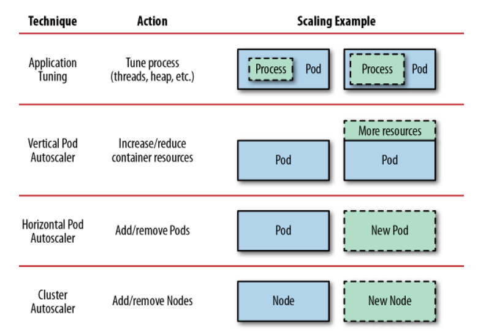

Application Tuning không được đề cập đến ở bài này do nó tùy thuộc vào cách ta viết ứng dụng, ở cách này ta sẽ scale process bên trong 1 container.

HPA như đã nói sẽ tăng số lượng Pod lên để thực hiện cùng 1 tác vụ nào đó

VPA tăng mức độ sử dụng tài nguyên của Pod lên, áp dụng cho những Pod nào không thể tách ra để chạy song song được

CA thì sẽ tăng số lượng worker node lên, khi ta không thể scale bằng cách HPA hay VPA được nữa

