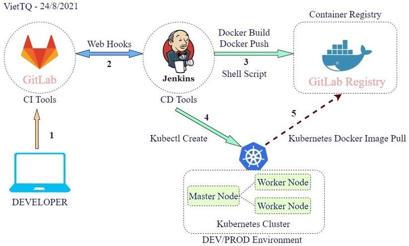
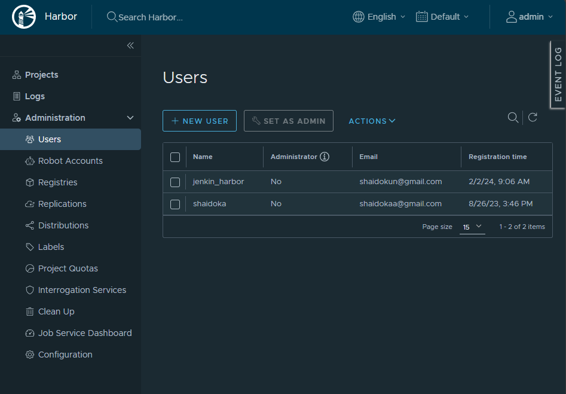

# Xây dựng luồng CICD với Gitlab và Jenkins

Một lợi thế lớn mà K8s đem lại đó là khả năng CICD vô cùng thuận tiện cho developer. Là một người phát triển phần mềm, hẳn chúng ta không muốn cứ mỗi lần thay đổi một điều gì đó nhỏ nhặt trong code là lại phải compile, đóng chart, rồi deploy lên server tốn kém rất nhiều thời gian. CICD sinh ra để giải quyết bài toán này.

Trong bài trước chúng ta đã tìm hiểu cách để đóng gói ứng dụng thành helmchart và triển khai lên K8s. Sau khi dựng được helmchart thì việc áp dụng vào luồng CICD sẽ trở nên đơn giản và thuận tiện hơn nhiều.

Khi áp dụng CICD thì ngay trong môi trường dev ta đã thấy được lợi ích to lớn mà nó mang lại. Dev sau khi commit xong muốn test deploy lên môi trường Dev thì chỉ cần 1 click và ngồi chờ kết quả.

## Mô hình CICD cơ bản

Mô hình CICD được tham khảo có dạng như sau:



*Nguồn: Trịnh Quốc Việt - viblo.asia's content writer*

Trong đó tùy theo yêu cầu mà có thể tích hợp thêm các bước scan code, automation test nhưng trong phạm vi bài viết này không đề cập tới. Ngoài Gitlab và Jenkins, chúng ta hoàn toàn có thể sử dụng các công cụ có chung mục đích, như AWS Code Commit, Azure Repos, Gitlab Runner,...

Ý tưởng của bài viết này như sau:
- Commit code lên gitlab
- Pull source về Jenkins server để build
- Build docker image và push image lên registry
- Triển khai/cập nhật lên K8s bằng kubectl/helm

Do đó, các bước cần thực hiện trong bài này là:
- Tạo helmchart cho ứng dụng
- Cài đặt và cấu hình gitlab để quản lý source code
- Cài đặt và cấu hình Jenkins để tạo luồng CICD
- Tạo job pipline cho Jenkins, thực hiện và test từng bước nhỏ trong cả luồng CICD
- Thay đổi code và chạy CICD job để kiểm tra kết quả

## Tạo helmchart cho ứng dụng

Đã giới thiệu ở bài trước rồi.

## Cài đặt và cấu hình Gitlab

Cách cài đặt Gitlab được đề cập ở [đây](https://github.com/shaidoka/thuctap-NhanHoa/blob/main/k8s/K8s_CICD/K8s_Gitlab_Install.md)

Thực hiện các bước sau:
- Tạo user Jenkins
- Tạo repo demo

```sh
git clone https://github.com/rockman88v/nodejs-helm-demo.git
cd nodejs-helm-demo/
git remote remove origin
git remote add gitlab http://gitlab.baotrung.xyz/Jenkins/nodejs-demo
git push gitlab --mirror
```

## Cài đặt và cấu hình Harbor Registry

*Phần này có thể thay thế bằng bất kỳ private registry nào cũng được*

Cách cài đặt Harbor Registry được đề cập ở [đây](https://github.com/shaidoka/thuctap-NhanHoa/blob/main/k8s/K8s_CICD/K8s_Harbor_Registry.md)

Sau khi cài đặt thì thực hiện thêm 1 vài bước:

- Tạo project mới để lưu các image. Ở đây mình tạo project **nodejs-demo** và để là public project. Khi push lên (từ Jenkins) thì cần user và password, còn pull về (từ k8s) thì không cần.
- Tạo user trên Harbor để Jenkins kết nối và push image lên. Vào mục Users tạo user mới. Ở đây mình tạo user **jenkin_harbor** với password là **Admin@123**
- Gán quyền cho user này có thể push lên repo: Vào mục Project -> chọn project **nodejs_demo** -> chọn Member -> Add member jenkin_harbor với role là **Developer**

**Kết quả:**



## Cài đặt và cấu hình Jenkins

Chi tiết các bước cài đặt Jenkins các bạn có thể tham khảo ở [đây](https://github.com/shaidoka/thuctap-NhanHoa/blob/main/k8s/K8s_CICD/K8s_Jenkins.md)

Sau khi cài đặt thì thực hiện 1 vài bước:

- Cài đặt các plugin cần thiết (nếu chưa cài): Git, Docker Pipeline. Đây là 2 plugin chính dùng cho việc pull code từ git về Jenkins, và cho việc build docker và push lên registry (Vào Manage Jenkins -> Manage Plugins -> Chọn Available -> Tìm các plugin theo tên, sau đó tick chọn và ấn Install without restart -> Chờ kết quả successful)
- Tạo credential để kết nối vào Gitlab và Harbor: Vào ```Manage Jenkins``` -> ```Manage Credentials``` -> Click vào domain global màu xanh -> Add Credential -> Username with Password -> Điền user và password như đã tạo ở các bước trước. Lưu ý đặt ID trùng với Username, ID này cần dùng để khai báo trong pipeline ở bước sau
- Cấu hình cho user jenkins có quyền chạy docker mà không cần sudo

```sh
sudo usermod -aG docker jenkins
sudo service jenkins restart
```

- Cấu hình để Jenkins có thể pull/push image lên Harbor:

Khai báo file host trên Jenkins:

```sh
103.101.162.5 harbor.baotrung.xyz
```

