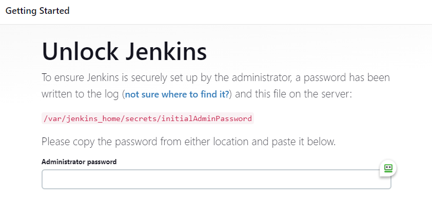
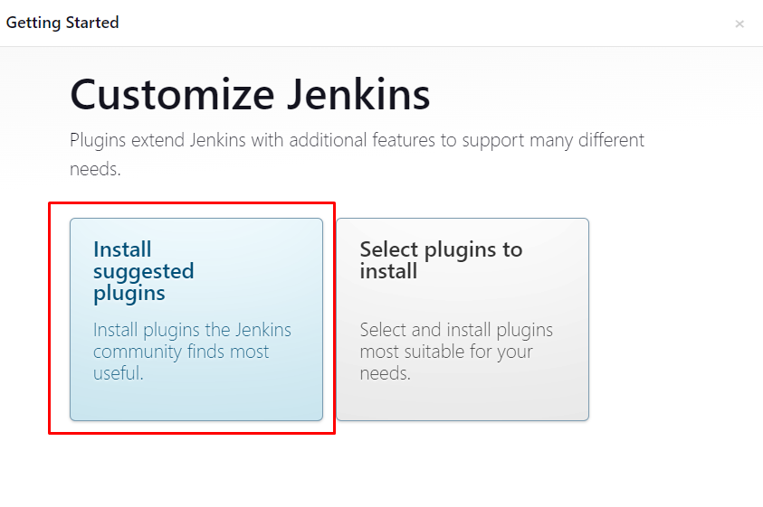
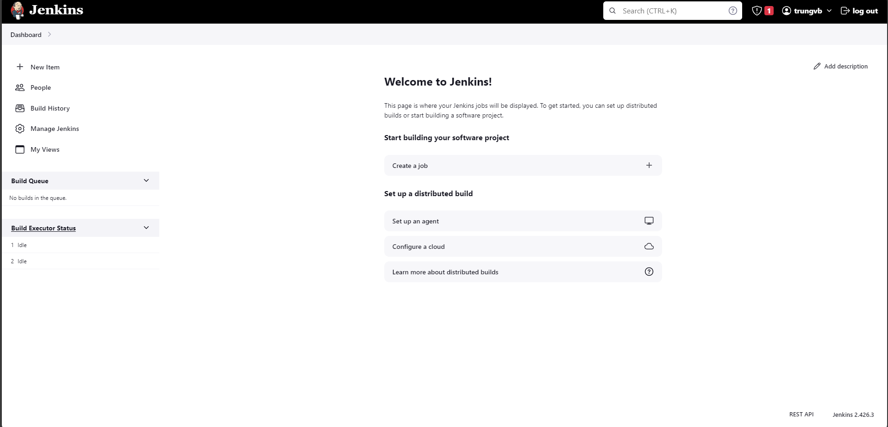

# Cài đặt Jenkins trên Kubernetes

## I. Kubernetes

Kubernetes (K8s) là 1 hệ thống mã nguồn mở để tự động triển khai, mở rộng, và quản lý các ứng dụng đặt trong container.

Một K8s cluster thêm vào 1 lớp tự động hóa mới vào Jenkins. K8s đảm bảo rằng tài nguyên được sử dụng có hiệu quả và máy chủ của bạn sẽ không bị quá tải. Kubernetes cho phép điều phối container giúp Jenkins luôn luôn có đủ lượng tài nguyên cần thiết để hoạt động.

Cài đặt Jenkins trên Kubernetes Cluster phù hợp với những triển khai dựa trên Kubernetes và container. Trong bài viết này, chúng ta sẽ tìm hiểu từng bước để cài đặt Jenkins trên cụm K8s.

## II. Cài đặt Jenkins trên Kubernetes

Tổng quan, để cài đặt Jenkins trên K8s, chúng ta sẽ cần các bước sau:

1. Tạo 1 **Namespace**

2. Tạo 1 **service account** với quyền Kubernetes **admin**

3. Tạo **local persistent volume** để lưu dữ liệu cho Jenkins

4. Tạo 1 **deployment** để triển khai Jenkins

5. Tạo 1 **service** truy cập vào Jenkins

**Lưu ý:** Bên trên là các bước cơ bản để deploy Jenkins, tuy nhiên trong bài này sẽ **không** sử dụng persistent volume

### Jenkins Kubernetes Manifest files

Tất cả các tệp manifest của Jenkins Kubernetes được sử dụng trong bài này đều công khai trên GitHub. Bạn hoàn toàn có thể clone nó về với git

```sh
git clone https://github.com/scriptcamp/kubernetes-jenkins
```

### Kubernetes Jenkins Deployment

Hãy bắt đầu với việc triển khai Jenkins lên K8s

**Bước 1:** Tạo 1 Namespace cho Jenkins. Phân chia rạch ròi từng công cụ DevOps trên các namespaces khác nhau là 1 thói quen tốt, hãy ghi nhớ điều đó.

```sh
kubectl create ns devops-tools
```

**Bước 2:** Tạo 1 tệp ```serviceAccount.yaml``` với nội dung như dưới đây

```sh
apiVersion: rbac.authorization.k8s.io/v1
kind: ClusterRole
metadata:
  name: jenkins-admin
rules:
  - apiGroups: [""]
    resources: ["*"]
    verbs: ["*"]
---
apiVersion: v1
kind: ServiceAccount
metadata:
  name: jenkins-admin
  namespace: devops-tools
---
apiVersion: rbac.authorization.k8s.io/v1
kind: ClusterRoleBinding
metadata:
  name: jenkins-admin
roleRef:
  apiGroup: rbac.authorization.k8s.io
  kind: ClusterRole
  name: jenkins-admin
subjects:
- kind: ServiceAccount
  name: jenkins-admin
  namespace: devops-tools
```

Tệp manifest bên trên tạo 1 ClusterRole, ServiceAccount, ClusterRoleBinding với cùng tên ```jenkins-admin```.

Cluster Role ```jenkins-admin``` sẽ có tất cả quyền để quản lý các thành phần trong cụm. Bạn có thể hạn chế điều này bằng cách chỉ định chính xác resource và action (verb) mong muốn.

Áp dụng tệp manifest trên bằng lệnh:

```sh
kubectl apply -f serviceAccount.yaml
```

**Bước 3:** Tạo ```volume.yaml``` và copy file manifest cho PV sau

```sh
kind: StorageClass
apiVersion: storage.k8s.io/v1
metadata:
  name: local-storage
provisioner: kubernetes.io/no-provisioner
volumeBindingMode: WaitForFirstConsumer
---
apiVersion: v1
kind: PersistentVolume
metadata:
  name: jenkins-pv-volume
  labels:
    type: local
spec:
  storageClassName: local-storage
  claimRef:
    name: jenkins-pv-claim
    namespace: devops-tools
  capacity:
    storage: 10Gi
  accessModes:
    - ReadWriteOnce
  local:
    path: /mnt
  nodeAffinity:
    required:
      nodeSelectorTerms:
      - matchExpressions:
        - key: kubernetes.io/hostname
          operator: In
          values:
          - k8s-worker1
---
apiVersion: v1
kind: PersistentVolumeClaim
metadata:
  name: jenkins-pv-claim
  namespace: devops-tools
spec:
  storageClassName: local-storage
  accessModes:
    - ReadWriteOnce
  resources:
    requests:
      storage: 3Gi
```

**Lưu ý:** Thay thế ```k8s-worker1``` với worker hostname của bạn

Với volume, chúng ta đang sử dụng local storage class cho mục đích kiểm thử. Đoạn cấu hình trên sẽ tạo 1 PersistentVolume ở node k8s-worker1 và đặt tại ```/mnt```

Vì local storage class yêu cầu node selector, bạn cần phải chỉ định worker node name chính xác cho Jenkins pod để lập lịch đến node cụ thể.

Nếu pod bị delete hoặc restart, dữ liệu sẽ giữ nguyên ở node volume. Tuy nhiên, nếu node bị hỏng hóc, xóa,... thì dữ liệu sẽ vẫn mất như thường.

Tốt nhất là bạn nên sử dụng PV được cung cấp bởi storage class của các cloud provider hoặc cluster administrator.

Tạo volume:

```sh
kubectl apply -f volume.yaml
```

**Bước 4:** Tạo deployment ```deployment.yaml``` và copy file manifest sau:

```sh
apiVersion: apps/v1
kind: Deployment
metadata:
  name: jenkins
  namespace: devops-tools
spec:
  replicas: 1
  selector:
    matchLabels:
      app: jenkins-server
  template:
    metadata:
      labels:
        app: jenkins-server
    spec:
      securityContext:
            fsGroup: 1000
            runAsUser: 1000
      serviceAccountName: jenkins-admin
      containers:
        - name: jenkins
          image: jenkins/jenkins:lts
          resources:
            limits:
              memory: "2Gi"
              cpu: "1000m"
            requests:
              memory: "500Mi"
              cpu: "500m"
          ports:
            - name: httpport
              containerPort: 8080
            - name: jnlpport
              containerPort: 50000
          livenessProbe:
            httpGet:
              path: "/login"
              port: 8080
            initialDelaySeconds: 90
            periodSeconds: 10
            timeoutSeconds: 5
            failureThreshold: 5
          readinessProbe:
            httpGet:
              path: "/login"
              port: 8080
            initialDelaySeconds: 60
            periodSeconds: 10
            timeoutSeconds: 5
            failureThreshold: 3
          volumeMounts:
            - name: jenkins-data
              mountPath: /var/jenkins_home
      volumes:
        - name: jenkins-data
          persistentVolumeClaim:
              claimName: jenkins-pv-claim
```

Trong deployment Jenkins này, chúng ta đã sử dụng:

- ```securityContext```: để cho phép ghi vào local PV
- ```liveness``` và ```readiness``` probe để giám sát trạng thái của Jenkins pods
- Local PV dựa trên local storage class để lưu trữ dữ liệu của Jenkins tại ```/var/jenkins_home```

Khởi tạo deployment:

```sh
kubectl apply -f deployment.yaml
```

### Jenkins Kubernetes Service

Đến thời điểm này, Jenkins đã hoạt động. Tuy nhiên, để truy cập vào ứng dụng từ bên ngoài cụm, ta sẽ cần phải tạo cho nó 1 service.

Tạo ```service.yaml``` và copy file service manifest sau:

```sh
apiVersion: v1
kind: Service
metadata:
  name: jenkins-service
  namespace: devops-tools
  annotations:
    prometheus.io/scrape: 'true'
    prometheus.io/path: /
    prometheus.io/port: '8080'
spec:
  selector:
    app: jenkins-server
  type: ClusterIP
  ports:
    - port: 8080
      targetPort: 8080
      name: http
```

Tạo ```ingress.yaml``` và copy file service manifest như sau (**lưu ý**: trong bài này chúng ta sẽ sử dụng ```nginx ingress controller```):

```sh
apiVersion: networking.k8s.io/v1
kind: Ingress
metadata:
  name: jenkins-ingress
  namespace: devops-tools
spec:
  ingressClassName: nginx
  rules:
  - host: jenkins.baotrung.xyz
    http:
      paths:
      - backend:
          service:
            name: jenkins-service
            port:
              name: http
        path: /
        pathType: Prefix
```

Khởi tạo service và ingress:

```sh
kubectl apply -f service.yaml
kubectl apply -f ingress.yaml
```



Bạn có thể đăng nhập Jenkins bằng tài khoản ```Admin``` và password bằng cách thực hiện lệnh dưới đây:

```sh
kubectl exec -it jenkins-56b6774bb6-958pg cat /var/jenkins_home/secrets/initialAdminPassword -n devops-tools
```

**Lưu ý:** Thay ```jenkins-559d8cd85c-cfcgk``` bằng tên pod Jenkins của bạn

Chọn ```Install suggested plugins```



