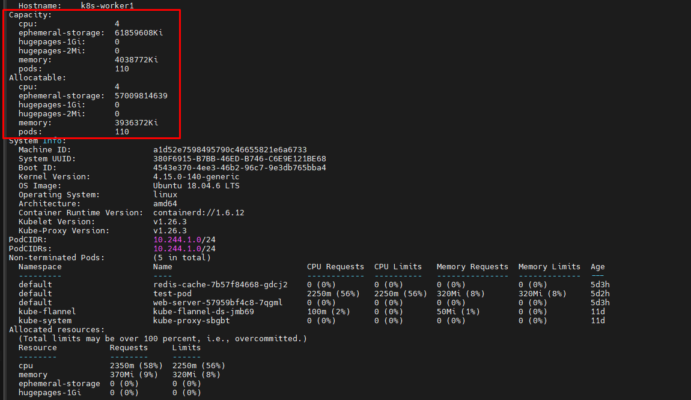

# Quản lý tài nguyên cho container

Khi ta cấu hình một Pod, ta có thể tùy ý chỉ định số lượng mỗi tài nguyên mà Container cần. Các tài nguyên phổ biến nhất để chỉ định **CPU** và bộ nhớ **RAM**

Khi ta chỉ định yêu cầu tài nguyên cho Container trong Pod, Scheduler sẽ sử dụng thông tin này để quyết định node nào để đặt Pod. Khi ta chỉ định ```limit``` tài nguyên cho Container, kubelet sẽ thực thi các giới hạn đó để container đang chạy không được phép sử dụng nhiều tài nguyên đó hơn giới hạn ta đã đặt. Kubelet cũng dự trữ ít nhất lượng tài nguyên yêu cầu (request) cụ thể của hệ thống đó cho container sử dụng.

## Yêu cầu và giới hạn

Nếu node nơi Pod đang chạy có đủ tài nguyên có sẵn, thì container có thể (và được phép) sử dụng nhiều tài nguyên hơn ```request``` của nó. Tuy nhiên, một container không được phép sử dụng nhiều hơn mức ```limit```. Ví dụ: nếu ta thiết lập ```request``` memory cho container là 256 MiB và container đó nằm trong Pod được lập lịch ở 1 node có 8 GiB bộ nhớ và không có các Pod khác thì container có thể cố gắng sử dụng thêm RAM.

Nếu ta thiết lập limit bộ nhớ là 4GiB cho container đó thì **kubelet** (và **runtime** của container) sẽ áp đặt giới hạn này. Runtime sẽ ngăn không cho container sử dụng nhiều hơn giới hạn tài nguyên đã được cấu hình. Ví dụ: khi một tiến trình trong container cố gắng sử dụng nhiều hơn dung lượng bộ nhớ cho phép thì kernel hệ thống sẽ kill process cố phân bổ đó, với lỗi ```out of memory```

Các giới hạn được cài đặt có thể bằng cách **phản ứng** (hệ thống **can thiệp** khi nó thấy vi phạm) hoặc bằng cách **ép buộc** (hệ thống **ngăn** không cho container vượt quá giới hạn). Các runtime khác nhau có thể có những cách khác nhau để cài đặt các giới hạn.

## Loại tài nguyên

CPU và bộ nhớ chính là loại tài nguyên. Một loại tài nguyên có một đơn vị cơ sở. CPU đại diện cho xử lý tính toán và được chỉ định theo đơn vị của K8s CPU. Bộ nhớ được chỉ định theo đơn vị **byte**. Nếu ta đang sử dụng K8s v1.14 hoặc mới hơn, ta có thể chỉ định tài nguyên **huge page**. Các **huge page** là một tính năng dành riêng cho Linux, trong đó kernel của node phân bổ các khối bộ nhớ lớn hơn nhiều so với kích thước page mặc định.

Ví dụ: trên hệ thống có kích thước page mặc định là 4KiB, ta có thể chỉ định giới hạn ```hugepages-2Mi: 80Mi```. Nếu container cố gắng phân bổ hơn 40 2MiB huge page (tổng cộng 80MiB), thì việc phân bổ đó không thành công.

CPU và bộ nhớ được gọi chung là tài nguyên tính toán, hoặc chỉ đơn giản là tài nguyên. Tài nguyên tính toán là có thể **đo lường** được và có thể được **yêu cầu**, **phân bổ** và **sử dụng**. Chúng khác với các tài nguyên API. Tài nguyên API chẳng hạn như Pods, Services là các đối tượng có thể **đọc** và **chỉnh sửa** thông qua máy chủ API của K8s

## Yêu cầu và giới hạn tài nguyên của Pod và Container

Mỗi Container của một Pod có thể chỉ định một hoặc nhiều trường sau đây:
- ```.spec.containers[].resources.limits.cpu```
- ```.spec.containers[].resources.limits.memory```
- ```.spec.containers[].resources.limits.hugepages-<size>```
- ```.spec.containers[].resources.requests.cpu```
- ```.spec.containers[].resources.requests.memory```
- ```.spec.containers[].resources.requests.hugepages-<size>```

## Đơn vị tài nguyên trong K8s

### 1. Ý nghĩa của CPU

Giới hạn và yêu cầu đối với tài nguyên CPU thường được đo bằng đơn vị **cpu**. Một vpu, trong K8s, tương đương với 1 **vCPU/core** đối với các nhà cung cấp đám mây và 1 **hyperthread** trên bộ xử lý Intel bare-metal.

Ta cũng có thể yêu cầu số lẻ dạng thập phân (fractional). Một Container có ```spec.containers[].resource.requests.cpu``` là ```0.5``` sẽ được đảm bảo bằng một nửa CPU. Biểu thức ```0.1``` tương đương với biểu thức ```100m```, có thể được đọc là **một trăm milicpu**, đôi lúc cũng được đọc là **một trăm milicores**. Yêu cầu có dấu thập phân, như ```0.1```, được API chuyển đổi thành ```100m``` và độ chính xác chi tiết hơn ```1m``` là không được phép. Vì lý do này, ```100m``` được sử dụng nhiều hơn.

### 2. Ý nghĩa của Memory

Giới hạn và yêu cầu cho bộ nhớ được đo bằng **byte**. Ta có thể biểu thị bộ nhớ dưới dạng **số nguyên thuần túy** hoặc **số nguyên fixed-point** sử dụng một trong các hậu tố như: E, P, T, G, M, K. Ta cũng có thể sử dụng các dạng tương đương của lũy thừa 2 như: Ei, Pi, Ti, Gi, Mi, Ki. Ví dụ: ```12818351859; 129e6; 129M; 123Mi```.

Dưới đây là một ví dụ. Pod sau đây có 2 Container. Mỗi Container có **request** ```0.25 cpu``` và ```64MiB``` bộ nhớ. Mỗi Container có **limit** ```0.5 cpu``` và ```128MiB``` bộ nhớ. Như vậy, ta có thể nói Pod có request ```0.5 cpu``` và ```128MiB``` bộ nhớ, limit ```1 cpu``` và ```256MiB``` bộ nhớ (request/limit của Pod chính là TỔNG của tất cả các container trong pod)

```sh
apiVersion: v1
kind: Pod
metadata:
  name: frontend
spec:
  containers:
  - name: db
    image: mysql
    env:
    - name: MYSQL_ROOT_PASSWORD
      value: "password"
    resources:
      requests:
        memory: "64Mi"
        cpu: "250m"
      limits:
        memory: "128Mi"
        cpu: "500m"
  - name: wp
    image: wordpress
    resources:
      requests:
        memory: "64Mi"
        cpu: "250m"
      limits:
        memory: "128Mi"
        cpu: "500m"
```

## Cách Pod với yêu cầu tài nguyên được lập lịch

Khi ta tạo ra Pod, scheduler trong K8s sẽ chọn một node để Pod chạy. Mỗi khi node có dung lượng tối đa cho từng loại tài nguyên: lượng **CPU** và **bộ nhớ** mà nó có thể cung cấp cho Pods. Scheduler đảm bảo rằng, đối với mỗi loại tài nguyên, TỔNG các yêu cầu tài nguyên của các Container được lập lịch NHỎ hơn dung lượng của node.

Lưu ý rằng mặc dù mức độ sử dụng cpu hoặc bộ nhớ thực tế trên các node rất thấp, scheduler vẫn từ chối đặt Pod trên một node nếu việc kiểm tra dung lượng không thành công. Điều này bảo vệ khỏi sự thiếu hụt tài nguyên trên 1 node khi việc sử dụng tài nguyên có tăng lên, ví dụ tại thời điểm tỉ lệ yêu cầu đạt đỉnh.

## Cách Pod với giới hạn tài nguyên được chạy

Khi kubelet khởi động Container của Pod, nó sẽ chuyển giới hạn CPU và bộ nhớ cho runtime của container.

Khi sử dụng Docker:
- ```spec.containers[].resource.requests.cpu``` được chuyển đổi thành số cỏe (có khả năng là số lẻ thập phân và cần được nhân với 1024). Phần lớn hơn của số này hoặc 2 sẽ được sử dụng để làm giá trị của cờ ```--cpu-shares``` trong lệnh ```docker run```.
- ```spec.containers[].resource.limits.cpu``` được chuyển đổi thành số milicore và nhân với 100. Giá trị kết quả là tổng thời gian CPU mà một container có thể sử dụng sau mỗi 100ms. Một container không thể sử dụng nhiều hơn thời gian CPU trong khoảng thời gian này.
- ```spec.containers[].resource.limits.memory``` được chuyển đổi thành 1 số nguyên và được sử dụng làm giá trị của cờ ```--memory``` trong lệnh ```docker run```

Nếu một container vượt quá giới hạn bộ nhớ, nó có thể bị kết thúc. Nếu nó có thể khởi động lại, kubelet sẽ khởi động lại nó như với bất kỳ loại lỗi runtime nào khác.

Nếu một Container vượt quá yêu cầu bộ nhớ của nó, có khả năng Pod của nó sẽ bị thu hồi (trục xuất) bất cứ khi nào node hết bộ nhớ. Container có thể hoặc không được phép vượt quá giới hạn CPU của nó trong thời gian dài. Tuy nhiên, nó sẽ không bị kill vì sử dụng CPU quá mức.

Việc xác định liệu container không thể được lập lịch hoặc bị kill do giới hạn tài nguyên sẽ được đề cập sau.

**Giám sát mức độ sử dụng tài nguyên tính toán và bộ nhớ**

Việc sử dụng tài nguyên của Pod được báo cáo như là một phần của trạng thái Pod.

Chúng ta có thể tham khảo về các công cụ giám sát tại [đây](https://kubernetes.io/docs/tasks/debug-application-cluster/resource-usage-monitoring/). Nếu chúng có sẵn trong cluster thì mức độ sử dụng tài nguyên của Pod có thể lấy về trực tiếp từ [API Metrics](https://kubernetes.io/docs/tasks/debug-application-cluster/resource-metrics-pipeline/#the-metrics-api)

## Lưu trữ cục bộ tạm thời 

Các node có bộ lưu trữ cục bộ tạm thời (**ephemeral**), đứng sau (backed) là các thiết bị có thể ghi được gắn cục bộ hoặc đôi khi có thể là RAM. "Tạm thời" (ephemeral) có nghĩa là không có sự đảm bảo lâu dài về tính bền vững.

Pods sử dụng bộ nhớ cục bộ tạm thời cho không gian nháp (scratch space), bộ nhớ đệm **cache** và cho **log** (nhật ký). Các kubelet có thể cung cấp scratch space cho Pods bằng cách sử dụng bộ lưu trữ cục bộ tạm thời để mount emptyDir volume vào các container.

Các kubelet cũng sử dụng loại lưu trữ này để giữ log của container ở cấp độ node, **container image** và các **writable layer** của các container đang chạy.

Là một tính năng beta, K8s cho phép ta theo dõi, dự trữ và giới hạn dung lượng lưu trữ cục bộ tạm thời mà một Pod có thể sử dụng.

*Chi tiết về ephemeral storage sẽ được tìm hiểu sau*

## Tài nguyên mở rộng

Tài nguyên mở rộng là tài nguyên đủ tiêu chuẩn (fully-qualified) có tên bên ngoài domain ```kubernetes.io```. Chúng cho phép cluster operator quảng bá và người dùng sử dụng các tài nguyên không được tích hợp sẵn trong k8s.

Có 2 bước cần thiết để sử dụng tài nguyên mở rộng:
- Đầu tiên, cluster operator phải quảng báo tài nguyên mở rộng
- Thứ hai, người dùng phải yêu cầu tài nguyên mở rộng trong pod.

### 1. Quản lý tài nguyên mở rộng

**Tài nguyên rộng cấp Node**

Tài nguyên mở rộng cấp node được gắn liền với node

**Tài nguyên quản lý Device plugin**

Cách quảng bá tài nguyên quản lý device plugin được mô tả ở đầy đủ ở [đây](https://kubernetes.io/docs/concepts/extend-kubernetes/compute-storage-net/device-plugins/)

**Tài nguyên khác**

Để quảng bá 1 tài nguyên mở rộng cấp node mới, cluster operator có thể gửi yêu cầu HTTP ```PATCH``` đến API server để chỉ định dung lượng khả dụng trong trường ```status.capacity``` cho một node trong cluster. Sau thao tác này, trường ```status.capacity``` của node sẽ bao gồm cả tài nguyên mới.

Trường ```status.allocatable``` của node sẽ được cập nhật tự động để thêm tài nguyên mới một cách không đồng bộ bởi kubelet. Lưu ý rằng vì scheduler sử dụng giá trị ```status.allocatable``` của node khi đánh giá mức độ phù hợp của Pod nên có thể có một độ trễ ngắn giữa việc patch dung lượng node với tài nguyên mới và Pod đầu tiên yêu cầu tài nguyên được lập lịch trên node đó.

Ví dụ: Dưới đây là một ví dụ cho thấy cách sử dụng lệnh ```curl``` để tạo một yêu cầu HTTP để quảng bá 5 tài nguyên "example.com/foo" trên node ```k8s-node-1``` có master node là ```k8s-master```

```sh
curl --header "Content-Type: application/json-patch+json" \
--request PATCH \
--data '[{"op": "add", "path": "/status/capacity/example.com~1foo", "value": "5"}]' \
http://k8s-master:8080/api/v1/nodes/k8s-node-1/status
```

**Tài nguyên mở rộng cấp Cluster**

Tài nguyên mở rộng cấp cluster không được gắn với Node. Chúng thường được quản lý bởi các **scheduler extender** (bộ mở rộng trình lập lịch), quản lý việc tiêu thụ tài nguyên và quota tài nguyên.

Ta có thể chỉ định các tài nguyên mở rộng được xử lý bởi các scheduler extender trong cấu hình chính sách cho scheduler

Ví dụ: Cấu hình sau đây của chính sách lập lịch cho biết rằng tài nguyên mở rộng ở cấp độ cluster "example.com/foo" được xử lý bởi scheduler extender.
- Scheduler chỉ gửi một Pod đến scheduler extender nếu pod yêu cầu "example.com/foo"
- Trường ```ignoredByScheduler``` chỉ định rằng scheduler không kiểm tra tài nguyên "example.com/foo" trong ```PodFitsResources```

```sh
{
    "kind": "Policy",
    "apiVersion": "v1",
    "extenders": [
        {
            "urlPrefix": "<extender-endpoint>",
            "bindVerb": "bind",
            "managedResources": [
                {
                    "name": "example.com/foo"
                    "ignoredByScheduler": true
                }
            ]
        }
    ]
}
```

**Sử dụng tài nguyên mở rộng**

Người dùng có thể sử dụng tài nguyên mở rộng trong đặc tả của Pod cũng giống như sử dụng CPU và bộ nhớ. Scheduler (Bộ lập lịch) sẽ quản lý số dư tài nguyên sao cho không có nhiều hơn dung lượng khả dụng (**available amount**) được phân bổ đồng thời cho Pod.

API server sẽ hạn chế số lượng tài nguyên mở rộng là 1 số nguyên. Ví dụ về số lượng hợp lệ là ```3```, ```3000m``` và ```3Ki```. Ví dụ về số lượng không hợp lệ là ```0.5``` và ```1500m``` (1500m là 1.5 nên không hợp lệ)

Để sử dụng tài nguyên mở rộng trong Pod, hãy đưa tên tài nguyên làm key trong ```spec.containers[].resource.limits``` trong đặc tả của container.

**Lưu ý:** Tài nguyên mở rộng không thể bị thừa, tức là phần **request** và **limit** phải bằng nhau nếu cả 2 đều có trong đặc tả của container.

Một Pod chỉ được lập lịch nếu tất cả các yêu cầu tài nguyên được thỏa mãn, bao gồm CPU, bộ nhớ và bất kỳ tài nguyên mở rộng nào. Pod vẫn sẽ ở trạng thái ```Pending``` chừng nào yêu cầu tài nguyên không thể được thỏa mãn.

Ví dụ: Pod bên dưới yêu cầu 2 CPU và 1 "example/foo" (tài nguyên mở rộng)

```sh
apiVersion: v1
kind: Pod
metadata:
  name: my-pod
spec:
  containers:
  - name: my-container
    image: myimage
    resources:
      requests:
        cpu: 2
        example.com/foo: 1
      limits:
        example.com/foo: 1
```

## Khắc phục sự cố

### 1. Pod bị pending với thông điệp sự kiện ```failedScheduling```

Nếu scheduler không thể tìm thấy bất kỳ node nào phù hợp với Pod thì Pod sẽ không được lập lịch cho đến khi có thể tìm thấy một node phù hợp. Một sự kiện được tạo ra mỗi khi scheduler không tìm được địa điểm cho Pod, ví dụ:

```sh
kubectl describe pod frontend | grep -A 3 Events
```

Đầu ra có dạng:

```sh
Events:
  FirstSeen LastSeen   Count  From          Subobject   PathReason      Message
  36s   5s     6      {scheduler }              FailedScheduling  Failed for reason PodExceedsFreeCPU and possibly others
```

Trong ví dụ trên, Pod có tên ```frontend``` không được lập lịch do không đủ tài nguyên CPU trên node. Các thông báo lỗi tương tự cũng có thể sinh ra lỗi do không đủ bộ nhớ (```PodExceedsFreeMemoty```). Nói chung, nếu một Pod bị pending với một thông điệp thuộc loại này, ta nên thử:
- Thêm node mới do tài nguyên hiện tại của cluster không còn đủ
- Kết thúc các Pod không cần thiết để nhường chỗ cho các Pod đang chờ xử lý
- Kiểm tra xem yêu cầu tài nguyên của Pod không lớn hơn tất cả các node. Ví dụ: nếu tất cả các node có dung lượng ```cpu: 1``` thì một Pod có yêu cầu ```cpu: 1.1``` sẽ không bao giờ được lập lịch

Ta có thể kiểm tra dung lượng và số lượng được phân bổ bằng lệnh ```kubectl describe nodes```. Ví dụ:



Như ảnh trên ta thấy, nếu có Pod nào yêu cầu hơn ```1650m``` cpu (4000 - 2350) hoặc/và ```3574Ki``` ((4038772 / 1024) - 370) thì nó sẽ không vừa với node

Bằng cách nhìn vào phần Pods (```Non-terminated Pod```), ta có thể thấy Pods nào đang chiếm dung lượng trên node.

Lượng tài nguyên có sẵn cho Pods (allocatabled) ít hơn dung lượng node (capacity), bởi vì các **system daemon** đã sử dụng 1 phần tài nguyên có sẵn. Trường ```allocatable``` của NodeStatus cho biết lượng tài nguyên có sẵn cho Pods.

Tính năng resource quota có thể được cấu hình để giới hạn tổng số tài nguyên có thể được sử dụng. Nếu tính năng resource quota được sử dụng cùng với namespace, ta có thể ngăn một team chiếm dụng tất cả các tài nguyên.

### 2. Container bị kết thúc

Container của ta có thể bị kết thúc (terminate) nếu nó bị thiếu tài nguyên. Để kiểm tra xem Container có bị terminate vì đạt resource limit hay không, hãy chạy lệnh ```kubectl describe pod```

```sh
Name:                           simmemleak-hra99
Namespace:                      default
Image(s):                       saadali/simmemleak
Node:                           kubernetes-node-tf0f/10.240.216.66
Labels:                         name=simmemleak
Status:                         Running
Reason:
Message:
IP:                             10.244.2.75
Replication Controllers:        simmemleak (1/1 replicas created)
Containers:
  simmemleak:
    Image:  saadali/simmemleak
    Limits:
      cpu:                      100m
      memory:                   50Mi
    State:                      Running
      Started:                  Tue, 07 Jul 2015 12:54:41 -0700
    Last Termination State:     Terminated
      Exit Code:                1
      Started:                  Fri, 07 Jul 2015 12:54:30 -0700
      Finished:                 Fri, 07 Jul 2015 12:54:33 -0700
    Ready:                      False
    Restart Count:              5
Conditions:
  Type      Status
  Ready     False
Events:
  FirstSeen                         LastSeen                         Count  From                              SubobjectPath                       Reason      Message
  Tue, 07 Jul 2015 12:53:51 -0700   Tue, 07 Jul 2015 12:53:51 -0700  1      {scheduler }                                                          scheduled   Successfully assigned simmemleak-hra99 to kubernetes-node-tf0f
  Tue, 07 Jul 2015 12:53:51 -0700   Tue, 07 Jul 2015 12:53:51 -0700  1      {kubelet kubernetes-node-tf0f}    implicitly required container POD   pulled      Pod container image "k8s.gcr.io/pause:0.8.0" already present on machine
  Tue, 07 Jul 2015 12:53:51 -0700   Tue, 07 Jul 2015 12:53:51 -0700  1      {kubelet kubernetes-node-tf0f}    implicitly required container POD   created     Created with docker id 6a41280f516d
  Tue, 07 Jul 2015 12:53:51 -0700   Tue, 07 Jul 2015 12:53:51 -0700  1      {kubelet kubernetes-node-tf0f}    implicitly required container POD   started     Started with docker id 6a41280f516d
  Tue, 07 Jul 2015 12:53:51 -0700   Tue, 07 Jul 2015 12:53:51 -0700  1      {kubelet kubernetes-node-tf0f}    spec.containers{simmemleak}         created     Created with docker id 87348f12526a
```

Trong ví dụ trên, thông tin ```Resstart Count: 5``` chỉ ra rằng Container ```simmemleak``` trong Pod đã bị chấm dứt và khởi động 5 lần.

Ta có thể chạy lệnh ```kubectl get pod``` với tùy chọn ```-o go-template=...``` để lấy về trạng thái của các Container đã kết thúc trước đó. Ví dụ:

```sh
kubectl get pod -o go-template='{{range.status.containerStatuses}}{{"Container Name: "}}{{.name}}{{"\r\nLastState: "}}{{.lastState}}{{end}}'  simmemleak-hra99
```

Đầu ra có dạng:

```sh
Container Name: simmemleak
LastState: map[terminated:map[exitCode:137 reason:OOM Killed startedAt:2015-07-07T20:58:43Z finishedAt:2015-07-07T20:58:43Z containerID:docker://0e4095bba1feccdfe7ef9fb6ebffe972b4b14285d5acdec6f0d3ae8a22fad8b2]]
```

Ta có thể thấy rằng Container bị kill vì ```reason:OOM``` hay out of memory