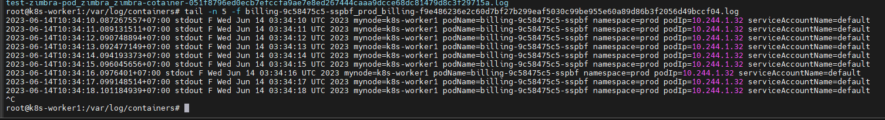

# Logging trong K8s - Phần 2

## Xây dựng môi trường

- Cài đặt ứng dụng order bằng deployment với 5 replicas
- Cài đặt ứng dụng billing bằng deployment với 3 replicas
- Mỗi container của ứng dụng trên, mỗi giây sẽ thực hiện ghi log ra output các thông tin node, pod name, pod IP, namespace,...
- Cài đặt opensource gồm vernemq, kafka/zookeeper

## Xây dựng giải pháp

- **Filebeat:**
   - Cài bằng helm chart, nó sẽ được deploy dưới dạng daemonset để được chạy trên tất cả các worker node để làm nhiệm vụ collect logs
   - Cấu hình input của filebeat để lấy log của các ứng dụng order
   - Cấu hình input của filebeat để lấy log của vernemq, kafka và zookeeper và gán tags là "myopensource" trước khi đẩy sang logstash
   - Input của filebeat là đường dẫn tới file log, ta sẽ cấu hình theo tên bắt đầu của file
   - Output của filebeat là địa chỉ của logstash

- **Logstash:**
   - Cài bằng helm chart, nó sẽ được deploy dưới dạng deployment, làm nhiệm vụ lấy log từ filebeat gửi tới, thực hiện xử lý dữ liệu và đẩy output ra elasticsearch
   - Cấu hình input nhận dữ liệu từ filebeat
   - Xử lý dữ liệu:
      - Với input có tag là "myservice" thì đẩy vào index có tên **logstash-myservice-{YYYY-MM-dd}**
      - Với input có tag là "myopensource" thì đẩy vào index có tên **logstash-myopensource-{YYYY-MM-dd}**
   - Output của logstash là địa chỉ của elastic search và index mà nó sẽ ghi dữ liệu vào

Lý do ta cần tách biệt index của myservice và myopensource do myservice lưu dữ liệu trong 30 ngày, còn myopensource thì chỉ lưu 7 ngày. Do đó ta cần tách chúng ra để tiện cho việc log rotation.

- **Elastic search:**
   - Cài bằng helmchart, elastic search là nơi lưu trữ log gửi từ logstash
   - Việc xóa dữ liệu cũ trên elastic search được thực hiện bằng cách xóa các indices cũ
   - Việc xóa indices có thể thực hiện tự động bằng một phần mềm gọi là "elastic-curator"

- **Kibana:**
   - Cài bằng helm chart. Kibana là giao diện web để thực hiện các thao tác xem log và thực hiện các tác vụ thống kê
   - Cấu hình input của Kibana là thông tin của elastic search và tạo các index pattern để đọc dữ liệu từ elastic search
   - Ta sẽ filter log của từng ứng dụng bằng các keyword tương ứng

**Cơ bản ta sẽ thực hiện xây dựng hệ thống theo phương án như thế này:**
- **Filebeat** lấy log trong container của worker node tại đường dẫn ```/var/log/containers```. Ta cấu hình filebeat thực hiện đọc các file log có tên dạng "order*" thì nó sẽ gán thêm tags là "myservice", và đọc các file log có dạng (vernemq* | kafka* | zookeeper*) thì gán tag là "myopensource"

- **Logstash** đọc dữ liệu từ filebeat gửi về. Với các dữ liệu có gắng tag "myservice" thì nó chuyển tới output là index có tên ```logstash-myservice-{YYYY-MM-dd}``` trên elastic search. Với các dữ liệu có gắng tags "myopensource" thì nó chuyển tới output là index có tên ```logstash-myopensource-{YYYY-MM-dd}```

Sau nếu có nhu cầu parse log thì ta sẽ bổ sung các rule filter vào pipeline của logstash sau mà không cần thay đổi cấu hình của các thành phần khác của hệ thống.

## Cài đặt môi trường

Tất cả các bước cài đặt này ta sẽ thực hiện trên namespace là ```prod```.

```sh
kubectl create ns prod
kubectl config set-context --current --namespace=prod
```

### Cài đặt vernemq

Với mục đích là cài đặt để demo phần logging nên các opensource này chúng ta sẽ cài ở mức đơn giản nhất có thể, không dùng PV và cũng như chỉ dùng 1 replica. Lưu ý đến tên deployment vì nó sẽ là từ keyword của tên file log sau này dùng để gather log.

```sh
helm repo add vernemq https://vernemq.github.io/docker-vernemq
helm search repo vernemq
helm pull vernemq/vernemq --version 1.9.0
tar -xzf vernemq-1.9.0.tgz
cp vernemq/values.yaml value-vernemq.yaml
```

Cấu hình file value của vernemq thêm 1 vài tham số

```sh
additionalEnv:
  - name: DOCKER_VERNEMQ_ALLOW_REGISTER_DURING_NETSPLIT
    value: "on"
  - name: DOCKER_VERNEMQ_ALLOW_PUBLISH_DURING_NETSPLIT
    value: "on"
  - name: DOCKER_VERNEMQ_ALLOW_SUBSCRIBE_DURING_NETSPLIT
    value: "on"
  - name: DOCKER_VERNEMQ_ALLOW_UNSUBSCRIBE_DURING_NETSPLIT
    value: "on"
  - name: API_KEY
    value: "xxxxxyyyyzzzz"
  - name: DOCKER_VERNEMQ_USER_vernemq
    value: "xxxxxyyyyzzzz"
  - name: DOCKER_VERNEMQ_ACCEPT_EULA
    value: "yes"
  - name: ALLOW_UNSECURED_MODE
    value: "true"
```

Cài đặt chart

```sh
helm install vernemq -f value-vernemq.yaml vernemq/vernemq
```

### Cài đặt zookeeper

Tải helm chart

```sh
helm repo add bitnami https://charts.bitnami.com/bitnami
helm search repo zookeeper
helm pull bitnami/zookeeper --version 11.4.2
tar -xzf zookeeper-11.4.2.tgz
cp zookeeper/values.yaml value-zookeeper.yaml
```

Với mục đích là lab, ta sẽ chỉ cấu hình đơn giản để công cụ hoạt động

```sh
persistence:
  enabled: false
  # storageClass: "-"
  accessModes:
    - ReadWriteOnce
  size: 8Gi
  annotations: {}
```

Cài đặt

```sh
helm install zookeeper -f value-zookeeper.yaml bitnami/zookeeper
```

### Cài đặt kafka

Tải chart

```sh
helm search repo kafka
helm pull bitnami/kafka --version 22.1.5
tar -xzf kafka-22.1.5.tgz
cp kafka/values.yaml value-kafka.yaml
```

Chỉnh sửa file value để disable persistence volumes và zookeeper (zookeeper mặc định của chart này)

```sh
persistence:
  enabled: false
zookeeper:
  enabled: false
kraft:
  enabled: false
```

Và enable Zookeeper mà ta đã cài đặt ở trên

```sh
externalZookeeper:
    ## Server or list of external zookeeper servers to use.
    ##
   servers: zookeeper.prod.svc.cluster.local
```

Cài đặt

```sh
helm install kafka -f value-kafka.yaml bitnami/kafka
```

Cài đặt Kafka Client để test thử pub/sub tới kafka:

```sh
kubectl run kafka-client --restart='Never' --image docker.io/bitnami/kafka:2.8.0-debian-10-r0 --command -- sleep infinity
```

Public và subscribe vào topic test:

```sh
kubectl exec --tty -i kafka-client -- bash
kafka-console-producer.sh --broker-list kafka-0.kafka-headless.prod.svc.cluster.local:9092 --topic test
>hello
>hello1
>hello2
>test2
>test1
>^C
kafka-console-consumer.sh --bootstrap-server kafka.prod.svc.cluster.local:9092 --topic test --from-beginning
hello
hello1
hello2
test2
test1
```

Kết quả trả về đủ message như trên là thành công.

## Cài đặt myservice

Cấu hình cho ```order-deployment.yaml``` như sau

```sh
apiVersion: apps/v1
kind: Deployment
metadata:
  annotations:
    meta.helm.sh/release-name: order
    meta.helm.sh/release-namespace: prod
  labels:
    app.kubernetes.io/name: order
  name: order
  namespace: prod
spec:
  progressDeadlineSeconds: 600
  replicas: 5
  tolerations:
  - key: "node-role.kubernetes.io/control-plane"
    operator: "Exists"
    effect: "NoSchedule"
  selector:
    matchLabels:
      app.kubernetes.io/instance: order
      app.kubernetes.io/name: order
  template:
    metadata:
      annotations:
      labels:
        app.kubernetes.io/instance: order
        app.kubernetes.io/name: order
    spec:
      containers:
        - name: order
          image: busybox
          imagePullPolicy: IfNotPresent
          args: [/bin/sh, -c, while true; do echo "$(date) mynode=$MY_NODE_NAME podName=$MY_POD_NAME namespace=$MY_POD_NAMESPACE podIp=$MY_POD_IP serviceAccountName=$MY_POD_SERVICE_ACCOUNT";  sleep 1;  done]
          env:
          - name: MY_NODE_NAME
            valueFrom:
              fieldRef:
                fieldPath: spec.nodeName
          - name: MY_POD_NAME
            valueFrom:
              fieldRef:
                fieldPath: metadata.name
          - name: MY_POD_NAMESPACE
            valueFrom:
              fieldRef:
                fieldPath: metadata.namespace
          - name: MY_POD_IP
            valueFrom:
              fieldRef:
                fieldPath: status.podIP
          - name: MY_POD_SERVICE_ACCOUNT
            valueFrom:
              fieldRef:
                fieldPath: spec.serviceAccountName
```

Cấu hình cho ```billing-deployment.yaml``` như sau:

```sh
apiVersion: apps/v1
kind: Deployment
metadata:
  annotations:
    meta.helm.sh/release-name: billing
    meta.helm.sh/release-namespace: prod
  labels:
    app.kubernetes.io/name: billing
  name: billing
  namespace: prod
spec:
  progressDeadlineSeconds: 600
  replicas: 3
  selector:
    matchLabels:
      app.kubernetes.io/instance: billing
      app.kubernetes.io/name: billing
  template:
    metadata:
      annotations:
      labels:
        app.kubernetes.io/instance: billing
        app.kubernetes.io/name: billing
    spec:
      containers:
        - name: billing
          image: busybox
          imagePullPolicy: IfNotPresent
          args: [/bin/sh, -c, while true; do echo "$(date) mynode=$MY_NODE_NAME podName=$MY_POD_NAME namespace=$MY_POD_NAMESPACE podIp=$MY_POD_IP serviceAccountName=$MY_POD_SERVICE_ACCOUNT";  sleep 1;  done]
          env:
          - name: MY_NODE_NAME
            valueFrom:
              fieldRef:
                fieldPath: spec.nodeName
          - name: MY_POD_NAME
            valueFrom:
              fieldRef:
                fieldPath: metadata.name
          - name: MY_POD_NAMESPACE
            valueFrom:
              fieldRef:
                fieldPath: metadata.namespace
          - name: MY_POD_IP
            valueFrom:
              fieldRef:
                fieldPath: status.podIP
          - name: MY_POD_SERVICE_ACCOUNT
            valueFrom:
              fieldRef:
                fieldPath: spec.serviceAccountName
```

Thực hiện cài đặt 2 deployment này:

```sh
kubectl apply -f order-deployment.yaml
kubectl apply -f billing-deployment.yaml
```

Kiểm tra log file sinh ra trên các worker node: Ví dụ pod ```billing-9c58475c5-sspbf``` đang chạy trên k8s-worker1 thì ta vào ```/var/log/containers``` của node đó kiểm tra

```sh
tail -n 5 -f billing-9c58475c5-sspbf_prod_billing-f9e486236e2c60d7bf27b299eaf5030c99be955e60a89d86b3f2056d49bccf04.log
```



Như vậy việc setup môi trường đã xong. Trong bài này ta đã cài đặt 3 opensource là VerneMQ, Kafka và Zookeeper, cùng 2 service là order và billing. Trong phần tiếp theo ta sẽ cài đặt ELK