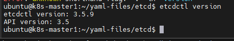
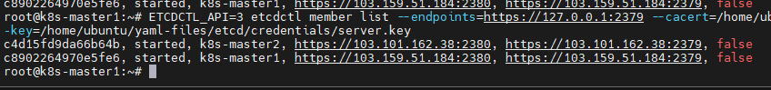
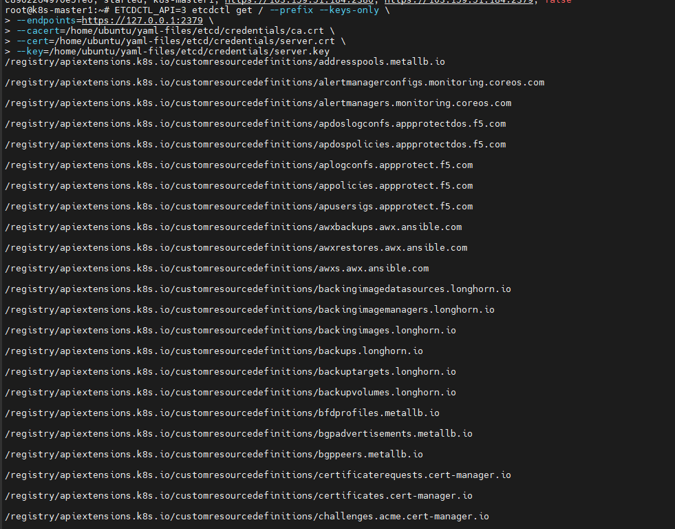
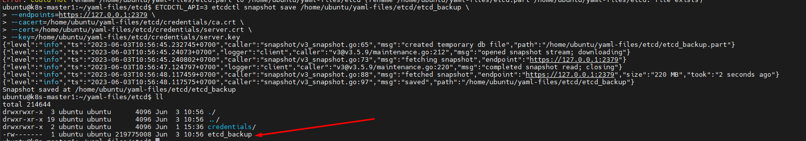
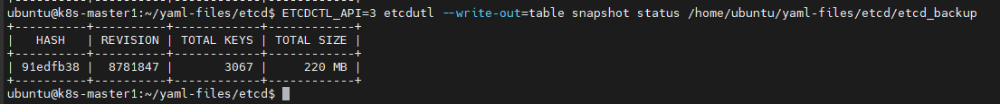
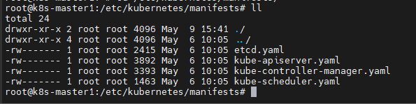
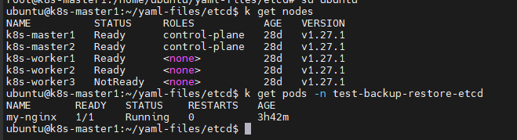

# Etcdctl và cách backup restore etcd trên K8s

Trong bài này sẽ giới thiệu cách backup hệ thống cơ sở dữ liệu của cụm k8s bằng snapshot etcd, giúp dễ dàng khôi phục khi hệ thống gặp sự cố.

# Etcd

Etcd là một dạng CSDL dạng key-value được dùng để lưu trữ dữ liệu hệ thống, tài nguyên và cấu hình k8s cluster. Khi ta tạo mới ứng dụng bao gồm những deployment, pod, service,... thì những thông tin định nghĩa này sẽ được lưu vào etcd

Etcd được chạy dưới dạng cluster và số lượng lớn member trong cluster là lẻ. Theo tài liệu của etcd thì recommend cho production là nên cài 5 node etcd để đảm bảo tính sẵn sàng.

Để thao tác với etcd thì ta nên sử dụng **etcdctl**, nó tương tự như công cụ dòng lệnh kubectl để giao tiếp với k8s. Để sử dụng etcdctl thì ta cần cài đặt và cấu hình certificate cho nó có thể giao tiếp được với etcd cluster.

Cú pháp sử dụng etcdctl như sau:

```sh
ETCDCTL_API=3 etcdctl <etcd-command> \
--endpoints=https://127.0.0.1:2379 \
--cacert=<trusted-ca-file> \
--cert=<cert-file> \
--key=<key-file>
```

## Cài đặt và sử dụng etcdctl

### Cài đặt etcdctl

Cài đặt các gói phụ trợ

```sh
apt -y install wget curl jq
```

Download gói cài đặt của etcd trên centos:

```sh
curl -s https://api.github.com/repos/etcd-io/etcd/releases/latest \
  | grep browser_download_url \
  | grep linux-amd64 \
  | cut -d '"' -f 4 \
  | wget -i -
```

Copy các file binary vào thư mục chứa file thực thi của hệ điều hành:

```sh
tar -xzvf etcd-v*.tar.gz
cd etcd-*/
sudo cp etcd* /usr/local/bin/
sudo cp etcd* /usr/bin/
cd ..
rm -rf etcd*
```

Kiểm tra

```sh
etcdctl version
```



### Cấu hình etcdctl

Để kết nối tới etcd cluster ta cần các thông tin như: IP/Port của etcd endpoints, các file cert sử dụng để kết nối

Để lấy các thông tin này, ta có thể lấy từ mô tả của pod **kube-api-server**, vì nó là thành phần duy nhất kết nối trực tiếp với etcd trong K8s cluster

Thực hiện lệnh sau để lấy các tham số command của kube-api-server (lưu ý tên pod đúng trong cluster)

```sh
kubectl -n kube-system get pod kube-apiserver-k8s-master1 -o=jsonpath='{.spec.containers[0].command}' | jq '.' | grep etcd
```

Kết quả trả về có dạng:

```sh
  "--etcd-cafile=/etc/kubernetes/pki/etcd/ca.crt",
  "--etcd-certfile=/etc/kubernetes/pki/apiserver-etcd-client.crt",
  "--etcd-keyfile=/etc/kubernetes/pki/apiserver-etcd-client.key",
  "--etcd-servers=https://127.0.0.1:2379",
```

*Note: Ở đây đường dẫn etcd cert và key file phải là /etc/kubernetes/pki/etcd/server.crt chứ không phải như trên kia*

Như vậy ta đã có thông tin về endpoint và đường dẫn tới các file cert trên node master1. Nhưng các file này có owner là root, do đó user mà ta đang dùng không phải root thì sẽ không đọc được. Ta chỉ cần đơn giản copy nó sang 1 đường dẫn khác và chown thành user mà bản thân sử dụng

Giờ ta có thể sử dụng lệnh etcd bằng cú pháp như sau:

```sh
ETCDCTL_API=3 etcdctl [some-command] \
--endpoints=https://127.0.0.1:2379 \
--cacert=/home/ubuntu/yaml-files/etcd/credentials/ca.crt \
--cert=/home/ubuntu/yaml-files/etcd/credentials/server.crt \
--key=/home/ubuntu/yaml-files/etcd/credentials/server.key
```

Nhưng làm như sau thì sẽ ngắn gọn hơn nhiều

```sh
export ETCDCTL_CACERT=/home/ubuntu/yaml-files/etcd/credentials/ca.crt
export ETCDCTL_CERT=/home/ubuntu/yaml-files/etcd/credentials/server.crt
export ETCDCTL_KEY=/home/ubuntu/yaml-files/etcd/credentials/server.key
export ETCDCTL_API=3
etcdctl [some-command]
```

Trước hết, ta kiểm tra danh sách node trong etcd cluster bằng lệnh "member list" như sau:

```sh
etcdctl member list
````



Lấy danh sách resource (key) được lưu trong etcd

```sh
ETCDCTL_API=3 etcdctl get / --prefix --keys-only \
--endpoints=https://127.0.0.1:2379 \
--cacert=/home/ubuntu/yaml-files/etcd/credentials/ca.crt \
--cert=/home/ubuntu/yaml-files/etcd/credentials/server.crt \
--key=/home/ubuntu/yaml-files/etcd/credentials/server.key
```



Ta lấy một key bất kỳ và thực hiện lệnh get

```sh
ETCDCTL_API=3 etcdctl get /registry/apiextensions.k8s.io/customresourcedefinitions/awxrestores.awx.ansible.com \
--endpoints=https://127.0.0.1:2379 \
--cacert=/home/ubuntu/yaml-files/etcd/credentials/ca.crt \
--cert=/home/ubuntu/yaml-files/etcd/credentials/server.crt \
--key=/home/ubuntu/yaml-files/etcd/credentials/server.key
```

Đó là cách ta lấy dữ liệu của 1 đối tượng lưu trữ trong Etcd. Như vậy là ta đã biết cách sử dụng etcdctl cơ bản rồi. Tiếp theo hãy cùng tìm hiểu cách backup/restore cho etcd.

## Backup và restore etcd

Trong phần này chúng ta sẽ:
- Tạo 1 pod bất kỳ
- Thực hiện backup
- Sửa/xóa pod đã cài ở bước trên
- Thực hiện restore

### 1. Cài đặt pod bất kỳ

Tạo namespace mới cho chắc

```sh
kubectl create ns test-backup-restore-etcd
```

Tạo pod trên namespace này

```sh
kubectl -n test-backup-restore-etcd run my-nginx --image=nginx --restart=Always
```

### 2. Backup etcd dùng snapshot

Thực hiện backup etcd như sau:

```sh
ETCDCTL_API=3 etcdctl snapshot save /home/ubuntu/yaml-files/etcd/etcd_backup \
--endpoints=https://127.0.0.1:2379 \
--cacert=/home/ubuntu/yaml-files/etcd/credentials/ca.crt \
--cert=/home/ubuntu/yaml-files/etcd/credentials/server.crt \
--key=/home/ubuntu/yaml-files/etcd/credentials/server.key
```



Kết quả của lệnh backup trên là lưu snapshot của etcd ra file ```/home/ubuntu/yaml-files/etcd/etcd_backup```

Kiểm tra lại kết quả backup:

```sh
ETCDCTL_API=3 etcdutl --write-out=table snapshot status /home/ubuntu/yaml-files/etcd/etcd_backup
```



### 3. Xóa pod

Chơi lớn xóa luôn namespace 

```sh
kubectl delete ns test-backup-restore-etcd
```

Kiểm tra

```sh
kubectl get pods -n test-backup-restore-etcd
```

### 4. Restore etcd từ bản backup

Các bước để restore etcd được tóm tắt như sau:
- Dùng etcdctl để restore etcd-data từ file snapshot đã backup ở bước trên
- Stop tất cả các instance của kube-api-server trên K8s cluster
- Thay thế etcd-data hiện tại bằng data từ bản backup
- Restart các service của k8s
- Kiểm tra tính toàn vẹn dữ liệu

### Restore etcd data

Chúng ta sẽ dùng file snapshot ở bước trước để restore, nhưng có điểm khác là restore sẽ ra local chứ không phải restore thẳng vào etcd cluster

Câu lệnh restore như sau:

```sh
mkdir dir_restore
etcdutl snapshot restore etcd_backup --data-dir /home/ubuntu/yaml-files/etcd/dir_restore/
```

### Stop các control plane instance

Để restore etcd thì ta phải stop lại tất cả các instance của kube-api-server, restore etcd ở tất cả các etcd instance sau đó start tất cả kube-api-server.

Việc dừng kube-api-server không phải là stop lại pod của apiServer, do các thành phần trong control plane đều được triển khai dưới dạng **Static Pods**. Chúng không được quản lý bởi bất kỳ loại Replication Controller nào cả, mà ở dạng "tĩnh" trong file yaml ở ```/etc/kubernetes/manifests/``` trên master node:



Các file cấu hình này được đọc và xử lý bởi kubelet chạy trên các master node. Do đó để stop/delete các static pod này ta đơn giản chỉ cần move chúng ra khỏi thư mục mặc định. Kubelet sẽ scan định kỳ để tìm kiếm sự thay đổi và apply nó. Khi ta remove file khỏi thư mục thì tương ứng kubelet sẽ remove pod đi và ngược lại.

Ta sẽ tạo thư mục ```/k8s-backup``` để move các file yaml ra đó, sau khi restore etcd xong ta sẽ move lại để restore service

```sh
mkdir /k8s-backup
mv /etc/kubernetes/manifests/*.yaml /k8s-backup/
```

**Hành động trên phải được thực hiện ở tất cả các node master**

Sau khi thực hiện xong mà kubectl ngừng hoạt động là được.

### Restore etcd-data từ bản backup

Trước tiên ta cần chuẩn bị sẵn file backup lên các node master. Ta có thể dùng rsync, scp hoặc bất kỳ cách thức nào cũng được.

```sh
rsync -avzhe ssh --progress /home/ubuntu/yaml-files/etcd/dir_restore/ root@103.101.162.38:/k8s-backup/
```

Tiếp theo ta sẽ thay thế dữ liệu của etcd hiện tại với dữ liệu từ bản backup (thực hiện trên tất cả master node)

```sh
mv /var/lib/etcd/member /var/lib/etcd/member.bak
mv /k8s-backup/member /var/lib/etcd/
```

**Lưu ý:** Điều chỉnh đường dẫn cho phù hợp!

### Start lại các control plane instance

Chúng ta chỉ đơn giản move lại các file yaml đã backup ở thư mục ```/k8s-backup``` về lại thư mục ```/etc/kubernetes/manifests/```

```sh
mv /k8s-backup/*.yaml /etc/kubernetes/manifests/
systemctl restart docker
```

Kiểm tra pods lúc nãy ta xóa đã được khôi phục chưa:



Done!