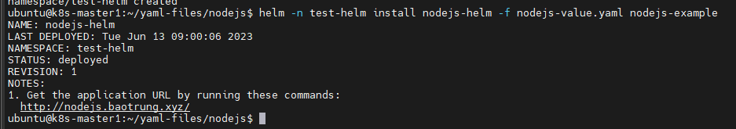
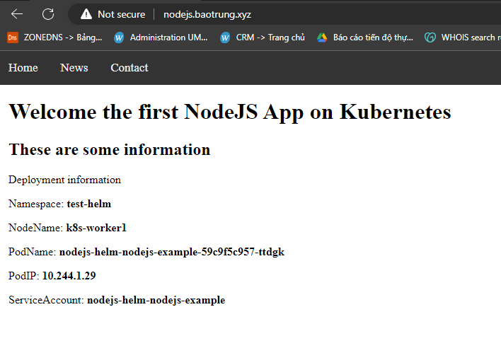

# Đóng gói ứng dụng thành helmchart để triển khai lên k8s

Helm là một trình quản lý gói và công cụ quản lý ứng dụng cho K8s, nó đóng gói nhiều tài nguyên K8s vào một đơn vị triển khai logic duy nhất được gọi là Chart. Bên trong của Chart sẽ có phần chính là các template, là định nghĩa các tài nguyên sẽ triển khai lên K8s.

Cụ thể, ở bài trước để deploy một app lên k8s ta cần tạo 3 file yaml **deployment.yaml**, **service.yaml** và **ingress.yaml**. Các file này định nghĩa rõ ràng các tham số cấu hình cho việc triển khai ứng dụng. Tuy nhiên khi cần thay đổi tham số thì việc sử dụng các file đó trở nên cồng kềnh và khó kiểm soát, không có quản lý version trên k8s.

Còn khi dùng helm, thì ta sẽ có các file tương tự như vậy nhưng ở dạng template, tức là mức độ linh động cao hơn. Khung của các file mô tả deployment khi service cơ bản vẫn vậy, nhưng thay vì các giá trị cụ thể như ban đầu chúng ta thực hiện, thì nó sẽ kết hợp với các giá trị được khai báo từ file value để sinh ra file yaml cuối cùng apply vào hệ thống.

## Cách tạo helmchart

Để tạo helmchart, trước tiên ta phải cài helm và kubectl sau đó cấu hình kết nối tới k8s. Cuối cùng tạo helmchart bằng lệnh ```helm create [chart-name]```

```sh
helm create nodejs-example
```

Kết quả sinh ra một thư mục chứa helm-chart mới. File values.yaml chứa các tham số mặc định ban đầu, ta sẽ copy file này ra thêm một file mới để điều chỉnh giá trị theo thực tế.

Trước đó ta nên quan tâm tới thư mục templates

```sh
$ ls -l

-rw-r--r-- 1 ubuntu ubuntu 1775 Jun 12 16:45 NOTES.txt
-rw-r--r-- 1 ubuntu ubuntu 1852 Jun 12 16:45 _helpers.tpl
-rw-r--r-- 1 ubuntu ubuntu 1895 Jun 12 16:45 deployment.yaml
-rw-r--r-- 1 ubuntu ubuntu  937 Jun 12 16:45 hpa.yaml
-rw-r--r-- 1 ubuntu ubuntu 2093 Jun 12 16:45 ingress.yaml
-rw-r--r-- 1 ubuntu ubuntu  382 Jun 12 16:45 service.yaml
-rw-r--r-- 1 ubuntu ubuntu  334 Jun 12 16:45 serviceaccount.yaml
drwxr-xr-x 2 ubuntu ubuntu 4096 Jun 12 16:45 tests
```

Mặc định khi tạo helmchart ta sẽ có các template cho: deployment, service, serviceaccount, ingress, hpa và các tests. So sánh với phần trước khi cài đặt ứng dụng bằng các manifest file thì ta đã viết 3 file gồm: deployment, service và ingress.

Thay vì phải tự viết từng tham số trong file deployment, thì khi dùng helmchart ta sẽ có một file template gần như đầy đủ các thành phần của một deployment, còn dùng những thành phần cụ thể nào thì ta định nghĩa qua file value.

**Lưu ý:**
- Trong phần trước ta có gán thêm các biến môi trường vào deployment, cái này trong template mặc định của deployment không có, nên ta phải thay đổi để đạt nhu cầu.
- Trong cấu hình mặc định của deployment template này chỉ có 1 container và sử dụng port mặc định là 80, port này sẽ dùng cho các phần kiểm tra liveness và readiness của port. Ứng dụng hiện tại ta đang sử dụng port 8080 nên không ảnh hưởng gì.

Copy file value ra ngoài

```sh
cp nodejs-example/values.yaml nodejs-value.yaml
```

Chỉnh sửa file value thành như sau:

```sh
# Default values for app-demo.
# This is a YAML-formatted file.
# Declare variables to be passed into your templates.

replicaCount: 2 # Tương ứng số lượng replicas trong file deployment.yaml

image:
  repository: shaidoka/nodejs-k8s #Tương ứng image trong file deployment.yaml
  pullPolicy: Always #Tương ứng imagePullPolicy trong file deployment.yaml
  # Overrides the image tag whose default is the chart appVersion.
  tag: "v1"

imagePullSecrets: []
nameOverride: ""
fullnameOverride: ""

serviceAccount:
  # Specifies whether a service account should be created
  create: true
  # Annotations to add to the service account
  annotations: {}
  # The name of the service account to use.
  # If not set and create is true, a name is generated using the fullname template
  name: ""

podAnnotations: {}

podSecurityContext: {}
  # fsGroup: 2000

securityContext: {}

service:
  type: ClusterIP #Tương ứng service/type trong file service.yaml
  port: 80 #Tương ứng service/port trong file service.yaml
  targetPort: 8080

ingress:
  enabled: true
  className: "nginx" #Tương ứng ingressClass trong file ingress.yaml
  annotations: {}
    # kubernetes.io/ingress.class: nginx
    # kubernetes.io/tls-acme: "true"
  hosts:
    - host: nodejs.baotrung.xyz #Tương ứng ingress/host trong file ingress.yaml
      paths:
        - path: / #Tương ứng ingress/path trong file ingress.yaml
          pathType: Prefix
  tls: []
resources: {}
autoscaling:
  enabled: false
  minReplicas: 1
  maxReplicas: 100
  targetCPUUtilizationPercentage: 80
  # targetMemoryUtilizationPercentage: 80

nodeSelector: {}
tolerations: []
affinity: {}
```

Với template của service thì ta cần sửa lại tham số ```targetPort```

```sh
spec:
  type: {{ .Values.service.type }}
  ports:
    - port: {{ .Values.service.port }}
      targetPort: {{ .Values.service.targetPort }}
  selector:
    {{- include "nodejs-example.selectorLabels" . | nindent 4 }}
```

Trong file template của deployment, ta thêm 1 vài biến môi trường cần thiết vào trong container

```sh
          ports:
            - name: http
              containerPort: {{ .Values.service.targetPort }}
              protocol: TCP
          env:
            - name: MY_NODE_NAME
              valueFrom:
                fieldRef:
                  fieldPath: spec.nodeName
            - name: MY_POD_NAME
              valueFrom:
                fieldRef:
                  fieldPath: metadata.name
            - name: MY_POD_NAMESPACE
              valueFrom:
                fieldRef:
                  fieldPath: metadata.namespace
            - name: MY_POD_IP
              valueFrom:
                fieldRef:
                  fieldPath: status.podIP
            - name: MY_POD_SERVICE_ACCOUNT
              valueFrom:
                fieldRef:
                  fieldPath: spec.serviceAccountName
```

Cuối cùng, cài đặt helmchart này bằng lệnh

```sh
kubectl create ns test-helm
helm -n test-helm install nodejs-helm -f nodejs-value.yaml nodejs-example
```

Trong đó cú pháp là ```helm -n <namespace> install <release-name> -f <value-file> <chart>```



Kiểm tra website



Để mở rộng, ta hoàn toàn có thể thêm các template tùy ý như statefulset, daemonset hay nhiều đối tượng khác vào helmchart này. Ta cũng có thể bổ sung volumes như persistentVolumes, configMap, secret,... trong template của deployment.