# Cài đặt K8s

## Chuẩn bị

- 3 server đều sử dụng Ubuntu 18.04 LTS, cấu hình 4 vCPU và 4 GB RAM
- Node master IP 103.159.51.184, 2 node worker lần lượt có IP 103.159.51.229, 103.159.51.165

## Cài đặt K8s

### 1. Bước chuẩn bị

Các bước sau làm trên cả 3 node (thay đổi cho phù hợp)

- Update và upgrade package của Ubuntu

```sh
apt-get update -y && apt-get upgrade -y
apt-get -y install vim curl wget 
apt-get -y install byobu
```

- Tắt swap

```sh
swapoff -a
```

- Mở ```/etc/fstab``` và đóng dòng mount fstab lại (nếu có)

- Kiểm tra lại bằng lệnh ```free -hm```

- Khai báo các node trong file hosts và đặt hostname cho node

```sh
cat << EOF > /etc/hosts
127.0.0.1       localhost k8s-master
103.159.51.184       k8s-master
103.159.51.229       k8s-worker1
103.159.51.165       k8s-worker2
EOF
```

```sh
echo k8s-master > /etc/hostname
```

- Khởi động lại node

```sh
init 6
```

### 2. Cài đặt docker và các thành phần cần thiết của K8s

Trên tất cả các node sẽ phải có các thành phần: docker, kubelet, kubeadm và kubectl. Trong đó:
- ```docker```: môi trường chạy các container
- ```kubeadm```: được sử dụng để thiết lập cụm cluster cho K8s. Các tài liệu chuyên môn gọi kubeadm là một bootstrap (bootstrap tạm hiểu là 1 tool đóng gói để tự động làm việc gì đó)
- ```kubelet```: là thành phần chạy trên các host, có nhiệm vụ kích hoạt các pod và container trong cụm cluster của K8s
- ```kubectl```: là công cụ cung cấp CLI để tương tác với K8s

Đầu tiên, cài đặt Docker trên tất cả các node

```sh
apt-get -y install docker.io
```

Cài đặt các thành phần của K8s trên tất cả các node

```sh
apt-get update && apt-get install -y apt-transport-https

curl -s https://packages.cloud.google.com/apt/doc/apt-key.gpg | apt-key add

cat <<EOF >/etc/apt/sources.list.d/kubernetes.list
deb http://apt.kubernetes.io/ kubernetes-xenial main
EOF

apt-get update  -y
apt-get install -y kubelet kubeadm kubectl
```

**Lưu ý:** Trước khi cài đặt ta có thể dùng lệnh ```apt-cache madison kubeadm``` để kiểm tra các phiên bản khả dụng trước khi cài đặt nó.

Thiết lập cluster:
- Đứng trên node ```k8s-master``` thực hiện lệnh dưới để thiết lập cluster

```sh
kubeadm init --apiserver-advertise-address 103.159.51.184 --pod-network-cidr=10.244.0.0/16
```

Trong đó:
- ```103.159.51.184```: là IP của node k8s-master
- ```--apiserver-advertise-address```: là địa chỉ của node k8s-master, địa chỉ này cần truyền thông được với các node còn lại của cụm cluster. Trong ví dụ này node k8s master có địa chỉ là 103.159.51.184
- ```--pod-network-cidr```: là dải địa chỉ mạng phụ thuộc mà công nghệ network sẽ sử dụng khi kết hợp với K8s, trong hướng dẫn này sử dụng flannel và flannel sử dụng dải 10.244.0.0/16

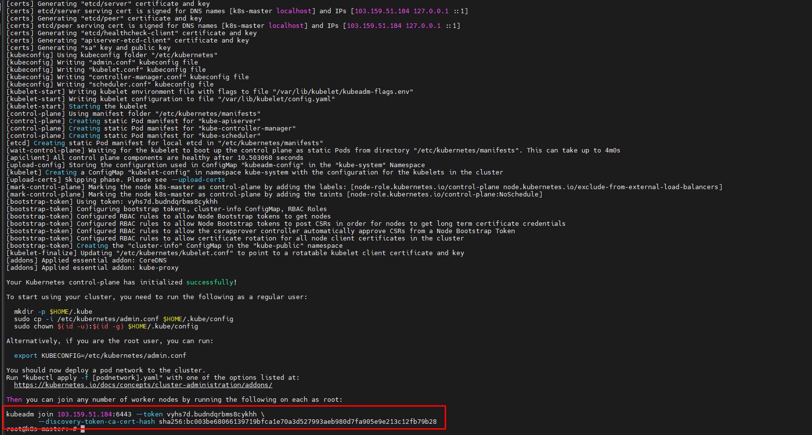

Quan sát cửa sổ SSH và thực hiện theo hướng dẫn, lúc này ta sẽ cần cấu hình node master để có thể sử dụng kubectl

Có 2 lựa chọn để thao tác với K8s, lựa chọn 1 là sử dụng tài khoản root, lựa chọn 2 là sử dụng một tài khoản khác, hướng dẫn này sử dụng ```ubuntu```

**Lựa chọn 1: Sử dụng tài khoản root để thao tác với K8s. Có 2 cách:**

- Cách 1: Trong mỗi phiên SSH bằng tài khoản root, để sử dụng được lệnh của K8s thì cần thực hiện lệnh dưới để khai báo các biến môi trường

```sh
export KUBECONFIG=/etc/kubernetes/admin.conf
```

- Cách 2: Khai báo cố định biến môi trường bằng các lệnh dưới đây. Lúc này ta không cần export mỗi phiên SSH nữa

```sh
mkdir -p $HOME/.kube
sudo cp -i /etc/kubernetes/admin.conf $HOME/.kube/config
sudo chown $(id -u):$(id -g) $HOME/.kube/config
```

**Lựa chọn 2: Sử dụng một tài khoản khác tài khoản root**

- Tạo user ```ubuntu``` để thực hiện cấu hình cho K8s. Nếu có user trước đó rồi thì không cần thực hiện bước này

```sh
useradd ubuntu
```

- Nhập thông tin và mật khẩu cho user ```ubuntu```, sau đó phân quyền sudoer bằng lệnh dưới

```sh
echo "ubuntu ALL=(ALL) NOPASSWD: ALL" >> /etc/sudoers
```

- Chuyển sang user ubuntu để thực hiện

```sh
su ubuntu
mkdir -p $HOME/.kube
sudo cp -i /etc/kubernetes/admin.conf $HOME/.kube/config
sudo chown $(id -u):$(id -g) $HOME/.kube/config
```

- Sử dụng thủ thuật dưới để thao tác lệnh trong K8s được thuận lợi hơn nhờ việc tự động hoàn thiện lệnh mỗi khi thao tác

```sh
echo "source <(kubectl completion bash)" >> ~/.bashrc
```

Cài đặt Pod Network
- Đứng trên node K8s-master cài đặt Pod network
- K8s có nhiều lựa chọn cho giải pháp network để kết nối các container, trong hướng dẫn này chúng ta sử dụng flannel

```sh
kubectl apply -f https://raw.githubusercontent.com/coreos/flannel/master/Documentation/kube-flannel.yml
```

Từ bản 1.9 trở lên, thực hiện lệnh dưới để tạo token trên node k8s-master, kết quả trả về được sử dụng để thực hiện các k8s-worker1 và k8s-worker2

```sh
sudo kubeadm token create --print-join-command
```

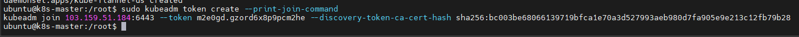

Giá trị trên sẽ được sử dụng cho việc join các k8s-node1 và k8s-node2 vào cụm cluster, do đó hãy lưu nó lại

Giờ ta thực hiện join 2 node ```k8s-worker1``` và ```k8s-worker2``` vào cluster. Đứng trên cả 2 node worker, thực hiện

```sh
kubeadm join 103.159.51.184:6443 --token m2e0gd.gzord6x8p9pcm2he --discovery-token-ca-cert-hash sha256:bc003be68066139719bfca1e70a3d527993aeb980d7fa905e9e213c12fb79b28
```


Sau khi thực hiện join cả 2 node thì ta quay trở về master và kiểm tra bằng lệnh

```sh
kubectl get nodes
```


Có thể thấy cả 3 node đều đã ở trạng thái ```Ready```. Giờ ta sẽ thực hiện lệnh dưới để download hoặc kiểm tra trạng thái của các thành phần trong K8s trên các node đã hoạt động hay chưa

```sh
kubectl get pod --all-namespaces
```

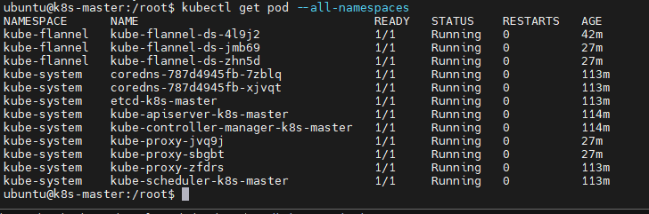

Trong một vài trường hợp cột ```STATUS``` sẽ có trạng thái ```Pending, ContainerCreating, ImagePullBackOf``` đối với một số thành phần, có thể chờ hoặc kiểm tra bằng lệnh

```sh
kubectl describe pod <pod_name> --namespace=<namespace>
```

### Chạy thử ứng dụng

Phần này sẽ giới thiệu thêm các thao tác cơ bản để quản lý các tài nguyên và tạo ra các ứng dụng hoàn chỉnh để giải đáp sự tò mò và giúp người mới có thể hiểu được các bước cơ bản sau quá trình cài đặt K8s

Có 2 cách để tạo ra các tài nguyên để phục vụ các ứng dụng trên cụm cluster K8s:
- Cách 1: sử dụng trực tiếp lệnh ```kubectl```
- Cách 2: sử dụng file cấu hình (file .yml) và thực thi chúng bằng lệnh ```kubectl apply```. Có nghĩa là ta sẽ soạn các file theo cú pháp của .yml và thực hiện lệnh ```kubectl apply``` để thực thi các tác vụ

Trong phạm vi phần này chúng ta sẽ sử dụng cách 1:
- Sau đây, chúng ta sẽ học cách tạo ra một ứng dụng là web server trên K8s, chúng ta sẽ thực hiện lần lượt qua các bước và dần tiếp cận với các khái niệm trong quá trình thực hiện. Trong quá trình thực hiện các bước để tạo ra ứng dụng như người dùng mong muốn, chúng ta sẽ thực hiện thêm các lệnh để quan sát và kiểm chứng lại kết quả
- Khi các ứng dụng được tạo xong, ta sẽ thử truy cập từ các môi trường như local (chính các máy trong cụm cluster, từ bên ngoài bằng máy tính khác các cụm cluster)
- Cuối cùng, ta sẽ thực hiện xóa hoặc hủy các ứng dụng để sẵn sàng cho phần tiếp theo.

**Tạo ứng dụng web server với image là nginx trên K8s**
- Lưu ý phần này sẽ sử dụng cách tạo ứng dụng và tài nguyên trực tiếp từ dòng lệnh
- Như đã nói ở trên, chúng ta sẽ tạo ra một ứng dụng với vai trò là web server, sau đó sẽ thực hiện các thao tác quản trị container, truy cập vào ứng dụng đó từ các môi trường bên trong để kiểm tra hoạt động
- Thường thì các ứng dụng trên K8s phải trả qua các bước ở dưới:

**Bước 1:** Tạo container

- Tạo 2 container với images là nginx, 2 container này chạy dự phòng cho nhau, port của các container là 80

```sh
kubectl create deployment test-nginx --image=nginx --replicas=2 --port=80
```

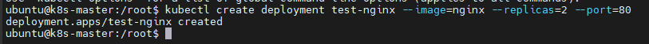

- Tới đây, ta mới tạo ra các container và chỉ có thể truy cập từ các máy trong cụm cluster, bởi vì các container này chưa được mở các port để ánh xạ các IP của các máy trong cụm K8s.

- Ta có thể kiểm tra lại các container nằm trong pod bằng lệnh

```sh
kubectl get pods -o wide
```

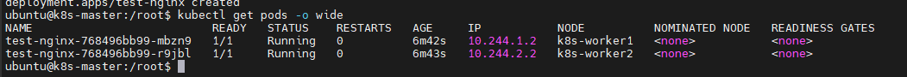

- Trong kết quả trên, ta có thể quan sát thấy trạng thái các container ở cột ```STATUS``` và ở cột ```NODE``` - nơi các container được phân phối, số lượng container sẽ là 2 vì chúng ta đã có tùy chọn ```--replicas=2```, việc phân phối số lượng container này một phần là do thành phần scheduler trong K8s thực hiện. Ngoài ra, trong các phần sau, chúng ta sẽ thực hành việc thay đổi số lượng replicas sau khi đã tạo chúng hoặc sau khi deploy các ứng dụng

- Ngoài ra ta có thể sử dụng lệnh dưới để xem các service nào đã sẵn sàng để deployment 

```sh
kubectl get deployment
```

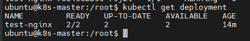

Kết quả ở cột ```AVAILABLE``` sẽ thay đổi khi ta thực hiện quá trình deploy các service này

**Bước 2:** Thực hiện deploy ứng dụng

- Đây là bước publish các port của container

- Sau bước trước, ta chưa thể truy cập vào các container được, cần thực hiện thêm bước deploy các container với tùy chọn phù hợp, cụ thể như sau

```sh
kubectl expose deploy test-nginx --port 80 --target-port 80 --type NodePort
```

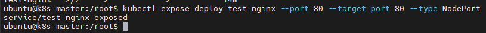

- Ngoài các tùy chọn ```--port 80``` và ```target-port 80``` thì ta lưu ý tùy chọn ```--type NodePort```, đây là tùy chọn để ánh xạ port của máy cài K8s vào container vừa tạo, sử dụng các lệnh dưới để biết được port mà host ánh xạ là bao nhiêu

```sh
kubectl describe service test-nginx
```

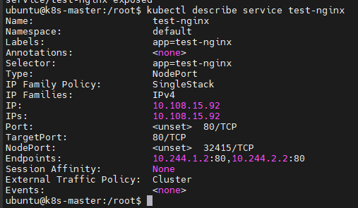

- Trong kết quả này, ta có thể chú ý các tham số sau:
  - ```IP: 10.108.15.92```: là địa chỉ được cấp phát cho ứng dụng ```test-nginx``` vừa tạo ở trên, địa chỉ này có ý nghĩa local
  - ```Endpoints: 10.244.1.2:80,10.244.2.2:80```: đây là địa chỉ thuộc dải mạng nội tại và liên kết các container khi chúng thuộc một pod. Ta có thể đứng trên một trong các node của cluster K8s và thực hiện lệnh curl để truy cập web, ví dụ ```curl 10.244.1.2```. Kết quả trả về html của webserver
  - ```Port và TargetPort```: là các port nằm trong chỉ định ở lệnh khi ta deploy ứng dụng
  - ```NodePort: <unset> 32415/TCP```: đây chính là port mà ta dùng để truy cập vào web server được tạo ở trên thông qua một trong các IP của các máy trong cụm cluster. Ta sẽ có các kiểm chứng ở dưới

- Đứng trên node master hoặc worker curl vào một trong các IP sau: 10.108.15.92, 10.244.1.2, 10.244.2.2

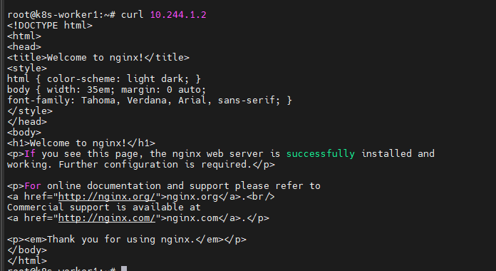

- Đứng trên máy tính cá nhân truy cập vào IP của 1 trong các node thuộc cluster theo node port là 32415

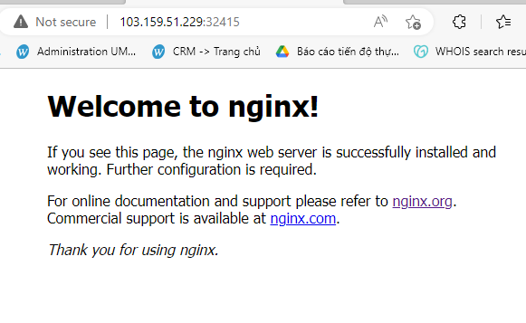

- Lúc này thực hiện lệnh ```kubectl get deployment``` sẽ thấy ```AVAILABLE``` là 2:

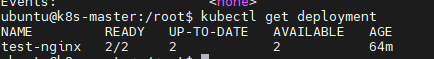

- Sử dụng lệnh ```kubectl get services``` để biết được các service được deploy và ánh xạ với port bao nhiêu (đây có thể là cách xem port được ánh xạ với các node)

```sh
kubectl get servcies
```

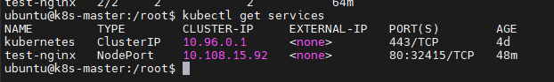

- Cuối cùng, hãy thử thực hiện xóa các service vừa tạo ở trên

```sh
kubectl delete service test-nginx
kubectl delete deployment test-nginx
```

Tới đây, ta đã kết thúc các bước cơ bản để tạo và quản lý một ứng dụng cơ bản trên cụm K8s.

**Ví dụ tạo các ứng dụng với file yaml**

- Trong phần trước, ta đã thử tạo 1 ứng dụng bằng lệnh của K8s. Cách thức này chủ yếu là để kiểm thử một số thành phần hoặc container cơ bản, trong thực tế triển khai các ứng dụng thì kỹ thuật sử dụng file template mới thực sự đem lại hữu dụng, tạo 1 lần sử dụng nhiều lần

- Sau đây sẽ lấy ví dụ về cách triển khai một ứng dụng trên K8s bằng cách sử dụng file yaml

- Sử dụng nội dung như bên dưới và lưu lại thành file với đuôi mở rộng là ```.yaml``` hoặc ```.yml```, ví dụ file ```apache-app.yml```

```sh
apiVersion: apps/v1
kind: Deployment
metadata:
  name: apache2
spec:
  selector:
    matchLabels:
      app: apache2
  template:
    metadata:
      labels:
        app: apache2
    spec:
      containers:
      - name: apache2
        image: httpd
        ports:
        - containerPort: 80
---
apiVersion: v1
kind: Service
metadata:
  app: apache2
spec:
  selector:
    name: apache2
  ports:
  - port: 5555
    targetPort: 80
  type: NodePort
```

- Sau đó thực hiện lệnh dưới để deploy ứng dụng 

```sh
kubectl create -f apache-app.yml
```

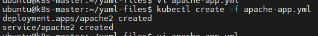

Kiểm tra truy cập

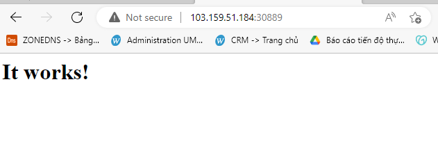

## Cài đặt Dashboard

### 1. Cài đặt

Sau khi cài đặt k8s theo hướng dẫn bên trên, sẽ chưa có giao diện ngay để sử dụng. Ta chạy lệnh sau để cài đặt thêm container cung cấp giao diện

```sh
kubectl apply -f https://raw.githubusercontent.com/kubernetes/dashboard/v2.7.0/aio/deploy/recommended.yaml
```

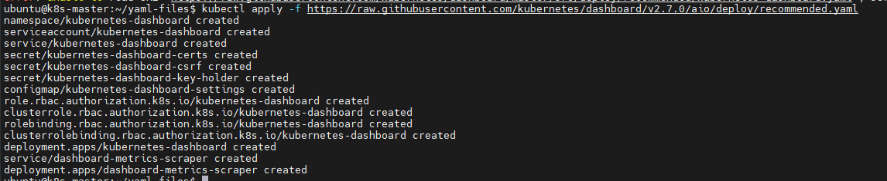

container này sẽ chạy trong namespace là ```kubernetes-dashboard```

### 2. Cấu hình

Chạy lệnh sau để bắt đầu vào giao diện website

```sh
kubectl proxy
```

Bây giờ, có thể đứng trên master node và truy cập ```http://localhost:8001``` hoặc ```http://127.0.0.1:8001``` để vào giao diện

Để truy cập từ nơi khác thông qua IP của master, ta có thể làm theo các bước dưới đây

Đầu tiên chỉnh sửa lại một chút trong cấu hình ```kubernetes-dashboard```. Sử dụng lệnh sau để mở

```sh
kubectl -n kubernetes-dashboard edit service kubernetes-dashboard
```

Tìm dòng ```type: ClusterIP``` và đổi nó thành ```type: NodePort```. Sau đó lưu lại và thoát

Lúc này, service ```kubernetes-dashboard``` đã lấy một port trên master node để NAT vào port 443 của service. Kiểm tra:

```sh
kubectl -n kubernetes-dashboard get service kubernetes-dashboard
```

Từ trình duyệt hãy truy cập vào URL và port như đã check, nhớ sử dụng ```HTTPS```


Tới đây sẽ có 2 tùy chọn là ```Token``` và ```Kubeconfig```. Chúng ta sẽ sử dụng token.

Tạo 1 file yaml với tên ```dashboard-adminuser.yml``` và nội dung như sau để tạo 1 service account

```sh
apiVersion: v1
kind: ServiceAccount
metadata:
  name: admin-user
  namespace: kubernetes-dashboard
```

```sh
kubectl apply -f dashboard-adminuser.yml
```

Trong đa số trường hợp sau khi tạo cluster bằng ```kops```, ```kubeadm``` hay bất kỳ công cụ phổ biến nào khác, ```ClusterRole``` tên ```cluster-admin``` đã được tạo ra trong cluster rồi. Chúng ta có thể sử dụng nó và tạo 1 ```ClusterRoleBinding``` cho ```ServiceAccount``` của ta. Nếu nó chưa tồn tại thì ta phải tạo nó ra trước và cấp các quyền cần thiết thủ công

Tạo file yaml với tên ```dashboard-clusterrole``` và nội dung như sau để tạo 1 ClusterRoleBinding

```sh
apiVersion: rbac.authorization.k8s.io/v1
kind: ClusterRoldBinding
metadata:
  name: admin-user
roleRef:
  apiGroup: rbac.authorization.k8s.io
  kind: ClusterRole
  name: cluster-admin
subjects:
- kind: ServiceAccount
  name: admin-user
  namespace: kubernetes-dashboard
```

```sh
kubectl apply -f dashboard-clusterrole.yml
```

Sau đó, ta dùng lệnh sau để tạo token sử dụng cho viêc login

```sh
kubectl -n kubernetes-dashboard create token admin-user --duration=720h
```

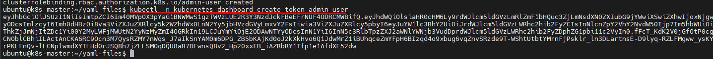

Paste đầu ra vào Dashboard và nhấn ```Sign in```

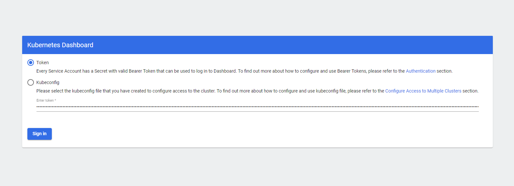

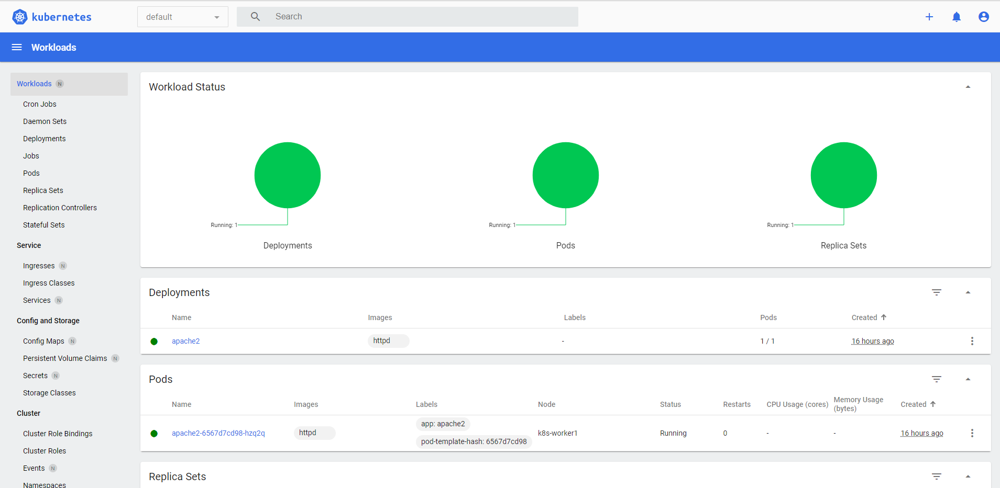

Cuối cùng, nếu muốn xóa ```ServiceAccount``` hay ```ClusterRoleBinding``` thì ta sử dụng lệnh sau

```sh
kubectl -n kubernetes-dashboard delete serviceaccount admin-user
kubectl -n kubernetes-dashboard delete clusterrolebinding admin-user
```

