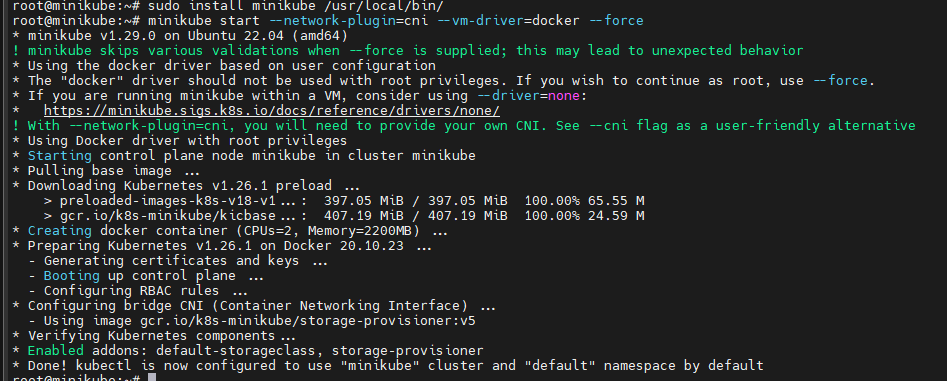
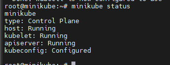
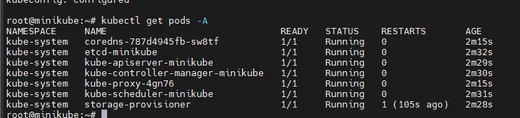
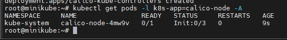

# Cài đặt K8s cluster bằng minikube

## I. Tổng quan

Minikube là một công cụ cho phép bạn xây dựng một K8s cục bộ. Minikube sẽ chạy một cụm K8s bao gồm 1 node trên server hoặc máy tính cá nhân

Minikube là một công cụ hoàn hảo để người dùng có thể học, làm quen và phát triển trên môi trường K8s

Hướng dẫn này sử dụng bản phân phối là Ubuntu 22.02

## II. Hướng dẫn cài đặt

### 1. Thiết lập hostname

Sử dụng lệnh sau đây để đặt hostname cho server

```sh
hostnamectl set-hostname minikube.baotrung.xyz
```

Hostname nên được thiết lập đầy đủ cả hostname và domain name

Cấu hình hostname trong file /etc/hosts

```sh
[IP_Address] <host.domain> <host>
```

Restart lại server để nhận đầy đủ hostname đã thiết lập

### 2. Cài đặt docker

Thực hiện cài đặt 

```sh
apt install -y docker.io
```

Nếu muốn chọn đúng phiên bản để install thì có thể sử dụng ```apt search docker.io``` và ```apt-cache show docker.io | grep "Version"``` để tìm được phiên bản khả dụng

Sau khi cài đặt có thể kiểm tra version bằng lệnh

```sh
docker version
```

### 3. Cài đặt kubectl

Download bản mới nhất bằng lệnh

```sh
curl -LO "https://dl.k8s.io/release/$(curl -L -s https://dl.k8s.io/release/stable.txt)/bin/linux/amd64/kubectl"
```

Cài đặt kubectl với lệnh sau

```sh
sudo install -o root -g root -m 0755 kubectl /usr/local/bin/kubectl
```

Kiểm tra bằng lệnh

```sh
kubectl version --short
```

### 4. Cài đặt conntrack với lệnh sau

```sh
apt-get install -y conntrack
```

### 5. Cài đặt Minikube

Download file cài đặt và cấp quyền thực thi bằng lệnh

```sh
curl -Lo minikube https://storage.googleapis.com/minikube/releases/latest/minikube-linux-amd64 && chmod +x minikube
```

Tiến hành cài đặt minikube

```sh
sudo mkdir -p /usr/local/bin/
sudo install minikube /usr/local/bin/
```

Chạy minikube trên server với lệnh

```sh
minikube start --network-plugin=cni --vm-driver=docker --force
```



Kiểm tra trạng thái 

```sh
minikube status
```



hoặc 

```sh
kubectl get pods -A
```



### 6. Cài đặt calico

Thực hiện lệnh cài đặt

```sh
kubectl apply -f https://raw.githubusercontent.com/projectcalico/calico/master/manifests/calico.yaml
```

Kiểm tra kết quả

```sh
kubectl get pods -l k8s-app=calico-node -A
```



### 7. Các lệnh kiểm tra trạng thái

Kiểm tra trạng thái minikube

```sh
minikube status
```

Kiểm tra thông tin k8s cluster

```sh
kubectl cluster-info
```

Kiểm tra các node trong cluster

```sh
kubectl get nodes -A
```

Để kiểm tra log quá trình cài đặt

```sh
minikube logs
```