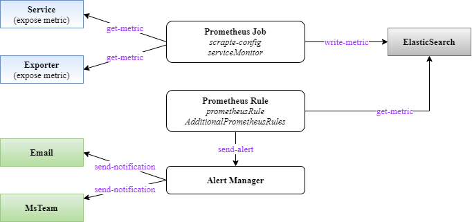
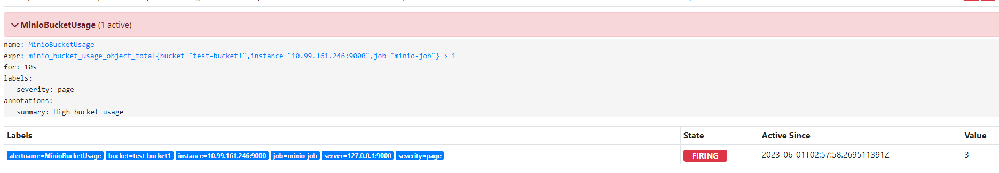
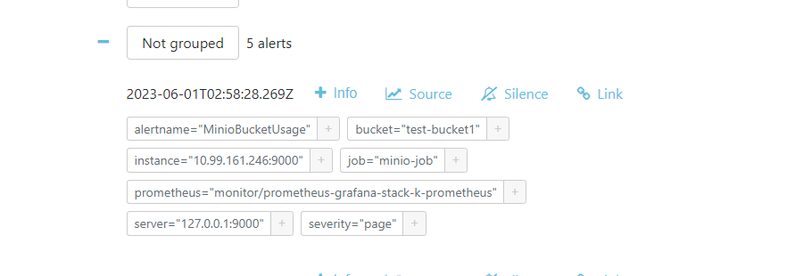
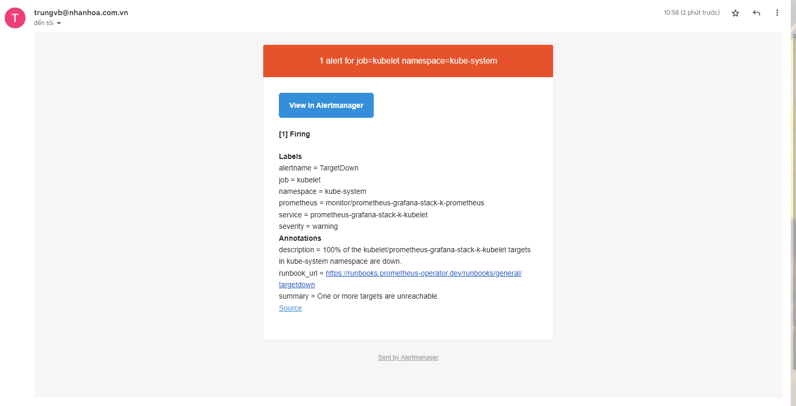

# Alert Manager

Tiếp tục về monitoring, trong bài viết này sẽ giới thiệu về cách sử dụng Alert Manager trong Grafana-Prometheus stack

## Giới thiệu

Mục tiêu trong bài viết này:
- Tìm hiểu cách cấu hình rule cho service
- Tìm hiểu cách sử dụng Prometheus rule để cấu hình rule cho service
- Tìm hiểu cách cấu hình Alert Manager để gửi cảnh báo
- Cách troubleshoot vấn đề phát sinh trong khi cấu hình

Hãy xem lại về luồng hoạt động của Prometheus stack:



Trong đó:
- Prometheus lấy thông tin metric từ các đối tượng cần giám sát và lưu vào database của nó (một database dạng Time Series)
- Prometheus đọc các rule (là các hàm so sánh giá trị metric với các ngưỡng xác định) để đẩy về Alert Manager. Có 2 cách để cấu hình rule cho Prometheus trong bộ kube-prometheus-stack này, đều bằng cách tùy biến file helm value của stack:
   - Cách 1: Cấu hình trực tiếp vào tham số ```additionalPrometheusRules```, ví dụ:

```sh
additionalPrometheusRules:
- name: my-rule-file
groups:
  - name: my_group
    rules:
    - record: my_record
      expr: 100 * my_record
```

   - Sử dụng đối tượng PrometheusRule để khai báo rule cho service. Để làm được việc này thì ta cần cấu hình tham số ```ruleNamespaceSelector``` và ```ruleSelector``` để chỉ định cách Prometheus đọc các PrometheusRule của K8s
- Alert Manager sẽ có config riêng của nó để thực hiện phân luồng cảnh báo tới các người nhận khác nhau, việc này gọi là route. Thông tin người nhận (gọi là receiver) được cấu hình ở Alert Manager, hỗ trợ khá đa dạng từ email, slack, mstream, telegram,...

## Cấu hình rule trực tiếp vào helm value

Là cách 1 đề cập bên trên, ta có thể cấu hình trực tiếp các rule và trong cấu hình ```additionalPrometheusRules```

Cách này có 1 số vấn đề:
- Khi số lượng rule lớn, file helm value sẽ trở nên rất lớn, cồng kềnh và khó quản lý
- Mỗi khi cần tạo thêm file lại phải update lại file helm value và upgrade lại stack, tốn rất nhiều thời gian
- Khó troubleshoot khi cấu hình bị sai lỗi cú pháp

## Cấu hình rule bằng cách sử dụng Prometheus Rule

Cách sử dụng của PrometheusRule giống với serviceMonitor, có thể mô tả như sau:
- Ta sẽ cấu hình Prometheus đọc các PrometheusRule ở các namespace nhất định mà khớp với các label nhất định
- Với mỗi service cần khai báo rule, ta sẽ tạo 1 file PrometheusRule dạng yaml, trong đó có 2 phần quan trọng:
   - Label gán cho đối tượng Prometheus này phải match với cấu hình ruleSelector đã cấu hình ban đầu để đảm bảo nó được tạo ra thì sẽ tự động load vào cấu hình rule của Prometheus
   - Các cấu hình rule cảnh báo của service (là các biểu thức so sánh các metric với các tham số ngưỡng để sinh cảnh báo)

Như vậy cách làm này sẽ giải quyết triệt để được các vấn đề bên trên. Lúc này ta sẽ quản lý các file yaml là các bộ rule cho các service, khi cần update thì áp dụng file yaml này là được. Và hoàn toàn có thể tái sử dụng các rule này cho cùng service khi triển khai cho các dự án khác.

## Cấu hình ruleSelector cho Prometheus

Về lý thuyết cần cấu hình 2 tham số:
- **ruleNamespaceSelector:** để chỉ định sẽ đọc các PrometheusRule ở những ns nào. Mặc định là tất cả ns
- **ruleSelector:** là cấu hình cách filter các đối tượng PrometheusRule sẽ được load vào Prometheus. Ở đây dùng cách filter theo label và đọc tất cả các PrometheusRule có gán label gồm cặp key là **app** cùng value **kube-prometheus-stack** hoặc **prometheus-rule**

Giải thích thêm một chút ở đây là khi cài bộ **kube-prometheus-stack** thì đi kèm với nó đã có các rule mặc định và gán label **app=kube-prometheus-stack**, còn label **app=prometheus-rule** là ta gán vào để lab

Giờ cấu hình tham số trong file helm value:

```sh
ruleNamespaceSelector: {}

ruleSelector:
  matchExpressions:
  - key: app
    operator: In
    values:
    - prometheus-rule
    - kube-prometheus-stack
```

Sau đó upgrade release bằng lệnh helm

```sh
helm -n monitoring upgrade prometheus-stack -f values-prometheus-clusterIP.yaml kube-prometheus-stack
```

Sau bước này thì Prometheus sẽ hiểu là nó sẽ đọc tất cả các đối tượng PrometheusRule ở tất cả các namespace mà có gán một trong các label là ```app=kube-prometheus-stack``` hoặc ```app=prometheus-rule```

Ta khai báo file minio-AlertRule.yaml có nội dung như sau:

```sh
apiVersion: monitoring.coreos.com/v1
kind: PrometheusRule
metadata:
  labels:
    app: kube-prometheus-stack
    role: alert-rules
  name: minio-prometheus-rule
spec:
  groups:
  - name: minio-rule
    rules:
    - alert: MinioDiskOffline
      for: 1m
      expr: |-
        minio_cluster_nodes_offline_total >= 1
      annotations:
        description: Minio Disk Offline
```

Sau đó apply nó vào namespace **monitoring**:

```sh
kubectl -n monitor apply -f minio-AlertRule.yaml
```

Giải thích:
- Sau bước trên, ta đã tạo một đối tượng PrometheusRule trên K8s có tên là **minio-prometheus-rule** ở namespace monitoring

```sh
kubectl -n monitor get PrometheusRule

NAME                                                       AGE
minio-prometheus-rule                                      24h
```

- Đối tượng PrometheusRule này có gán label ```app=prometheus-rule``` nên sẽ được load vào cấu hình rule của prometheus
- Phần spec của nó khai báo một rule có nội dung là cảnh báo nếu thấy có disk offline

Giờ vào kiểm tra ở Prometheus mục Rules:



Kiểm tra trên AlertManager:



## Cấu hình Alert Manager gửi cảnh báo qua gmail

Trong bài này sẽ sử dụng mật khẩu ứng dụng, do đó hãy chắc chắn đã cấu hình thành phần này cho tài khoản gmail trước.

Cấu hình Alert Manager có 2 tham số quan trọng là **route** và **receiver**. Nó là các cấu hình điều hướng làm nhiệm vụ phân tích các cảnh báo theo các label để chuyển hướng tới nơi nhận khác nhau

Cấu hình **route** có thể giải thích theo một vài usecase như sau:
- Routing theo namespace để điều hướng người nhận cảnh báo tới người quản lý namespace tương ứng đó
   - Cấu hình các cảnh báo đến từ namespace ```dev``` tới **receiver** là **dev-team**, receiver này sẽ gửi email tới nhóm dev
   - Cấu hình các cảnh báo đến từ namespace ```prod``` tới **receiver** là **ope-team**, receiver này gửi email tới nhóm operation
- Routing theo loại service để điều hướng người nhận cảnh báo tới người quản lý service tương ứng đó:
   - Cấu hình các cảnh báo liên quan tới database tới nhóm DBA
   - Cấu hình các cảnh báo liên quan tới opensource khác (ngoài db) tới nhóm devops
   - Cấu hình các cảnh báo liên quan tới ứng dụng inhouse tới nhóm dev

Trong cấu hình **receiver** thì tùy từng loại (email, webhook,...) mà có các tham số cấu hình khác nhau nhưng nói chung là chứa thông tin để gửi cảnh báo tới nơi nhận đó.

Để cấu hình gửi cảnh báo qua email cho Alert Manager thì ta cần update lại file helm value của Prometheus stack như sau:

```sh
alertmanger:
  enabled: true
  config:
    global:
      resolve_timeout: 5m
    route:
      group_by: ['namespace', 'job']
      group_wait: 5s
      group_interval: 5s
      repeat_interval: 5m
      receiver: 'gmail'
      routes:
      - receiver: 'gmail'
        group_wait: 10s
        matchers:
        - namespace="monitor"
    receivers:
    - name: 'gmail'
      email_configs:
      - to: trungvb@nhanhoa.com.vn
        from: trungvb@nhanhoa.com.vn
        smarthost: smtp.gmail.com:587
        auth_username: 'trungvb@nhanhoa.com.vn'
        auth_identity: 'trungvb@nhanhoa.com.vn'
        auth_password: 'fhbirsabgjkv'
    templates:
    - '/etc/alertmanager/config/*.tmpl'
```

Upgrade lại release

```sh
helm -n monitor upgrade prometheus-grafana-stack -f values-prometheus.yaml kube-prometheus-stack
```

OK

