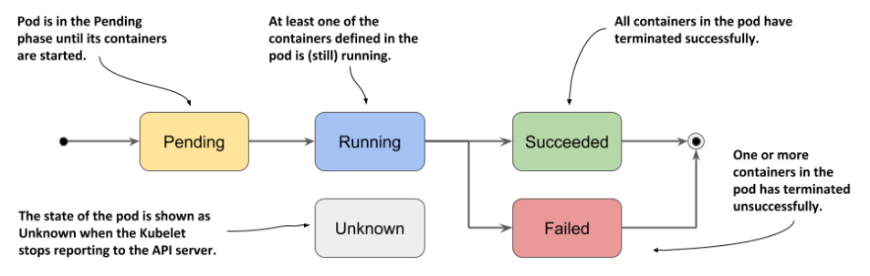
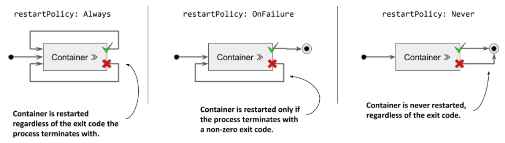
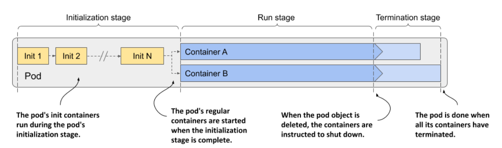
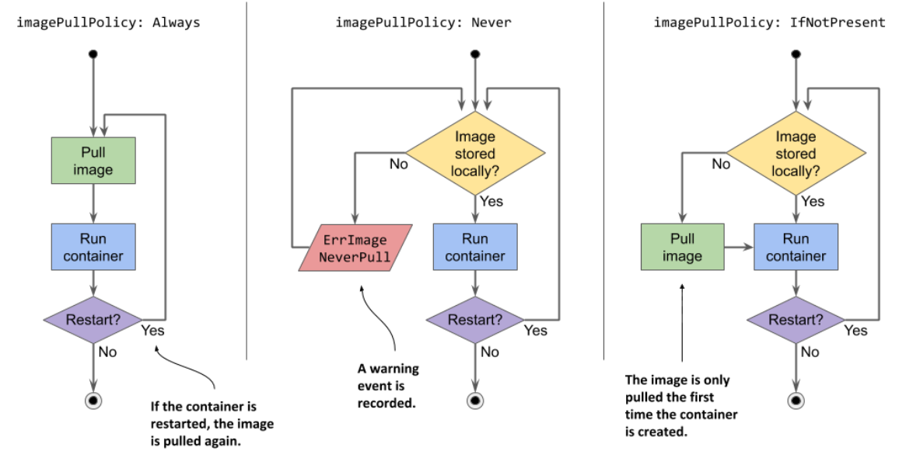
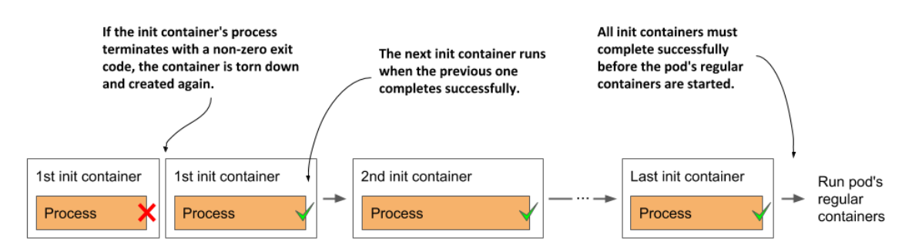
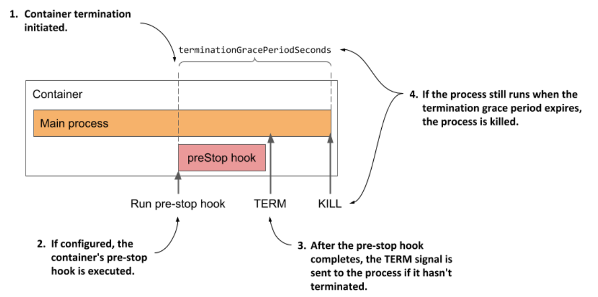
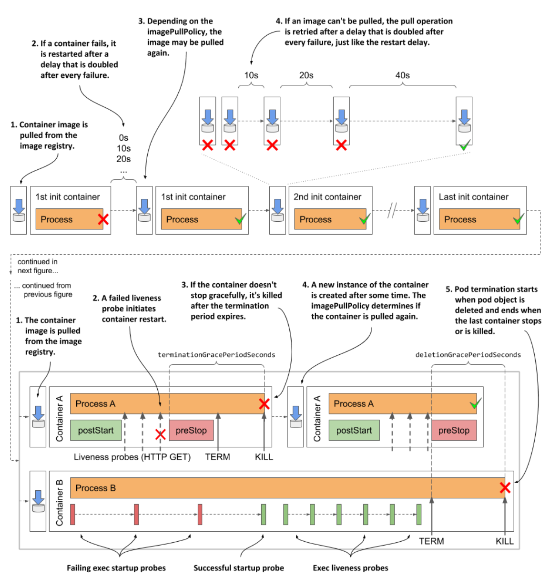

# Tìm hiểu về cấu trúc của Pod

## I. Pod's tatus

Pod status là một trường bên trong manifest của Pod mà chứa các thông tin về Pod sau khi nó được tạo ra, trường Pod status này là một object mà chứa các thông tin sau:
- Địa chỉ IP của Pod và worker node Pod deploy tới
- Thời gian Pod đã được chạy
- Pod's QoS class
- Pod's phase
- Pod's conditions
- Trạng thái của từng container trong Pod

### Pod's phase

Đây là thông tin ta cần quan tâm trong trường status của Pod, trường này sẽ thể hiện cho ta biết Pod đang ở giai đoạn nào trong một life cycle, khi một Pod được tạo ra cho tới khi nó bị xóa đi thì trạng thái của nó sẽ nằm ở 1 trong các giai đoạn sau đây:



- Pending phase: Pod sẽ ở trạng thái Pending cho tới khi nó được schedule tới một worker node và started
- Running phase: Pod sẽ ở trạng thái này khi 1 container trong Pod được running thành công và vẫn duy trì running
- Succeeded phase: Pod sẽ ở trạng thái này khi tất cả container của Pod kết thúc quá trình chạy thành công hoặc/và bị terminate
- Failed phase: Chỉ cần 1 container chạy thất bại thì Pod sẽ ở trạng thái này
- Unknown phase: đây là trạng thái khi mà kubelet ở một worker node không thể gửi report của Pod về cho K8s master

### Pod's conditions

Đây là thuộc tính của Pod mà báo cho ta biết Pod đã đạt đến trạng thái mong muốn hay chưa. Thuộc tính này là một array chứa các conditión của Pod. Có 4 condition như sau:
- PodScheduled: Pod đã được scheduled tới node hay chưa
- Initialized: tất cả các container đã được khởi tạo thành công chưa
- ContainersReady: tất cả các container trong Pod đã chạy xong hết chưa
- Ready: tất cả container Pod đã chạy xcng và có thể nhận request chưa

Từng condition sẽ là một object trong mảng array Pod conditions, với các thuộc tính quan trọng sau:
- Type: tên của condition
- Status: True, False, hoặc Unknown
- Reason: machine readable text chỉ định lý do tại sao condition này pass hoặc không pass
- Message: human readable message chỉ định định lý do chi tiết tại sao condition này pass hoặc không pass

Từng condition này sẽ có message riêng, mà ta sẽ thường xuyên xem trường message này để biết được lý do tại sao một Pod của chúng ta không thể chạy được thành công, rất hữu ích khi ta debug.

Ta có thể list condition của Pod bằng câu lệnh sau:

```sh
kubectl describe po <pod-name> | grep Conditions: -A 5
```

Hiện condition chi tiết:

```sh
kubectl get pods <pod-name> -o json | jq .status.conditions
```

### Trạng thái của từng container trong Pod

Bên cạnh Pod phase, kube còn track trạng thái của từng container bên trong Pod. Khi một Pod được deploy tới một node, kubelet tạo container runtime, sau đó một container sẽ có những state sau:
- Waiting: đây là trạng thái của container khi nó chưa được chạy
- Running: đây là trạng thái của container được chạy thành công và process bên trong nó được chạy mà không có vấn đề gì xảy ra
- Terminated: đây là trạng thái của container khi mà process đang chạy bên trong container bị kết thúc. Ví dụ process trả về exit code
- Unknown: đây là khi K8s không thể xác định được trạng thái của container

Ta có thể kiểm tra state của container trong Pod bằng câu lệnh ```kubectl describe pod <pod-name>```

Ưu điểm đầu tiên khi ta dùng Pod chạy container so với chạy container bình thường là khi dùng Pod, ta có thể init container để khởi tạo resource cho container chính, khi init container chạy xong thì nó sẽ bị xóa đi, không chiếm resource của cluster, và việc này là tự động. Ngoài ra container bên trong Pod sẽ có lifecycle riêng của nó, và ta có thể config lifecycle hook để thực hiện chức năng ta muốn khi container đang khởi tạo hoặc nó bị xóa đi, trong khi ta chạy container bình thường thì sẽ không có được chức năng này.

Container sẽ có 2 lifecycle hook là post-start hook và pre-stop hook, post-start hook sẽ được kích hoạt khi container vừa bước vào trạng thái running, pre-stop hook được kích hoạt khi contianer vừa bước vào trạng thái Terminated.

### Sử dụng container lifecycle hook

Như đã nói ở trên thì ta xài lifecycle hook khi muốn kích hoạt một hành động khi container start hoặc shutdown.

Để sử dụng lifecycle hook, ta chỉ định ở thuộc tính lifecycle khi khai báo config của pod như sau:

```sh
...
image: nginx:alpine
lifecycle:
  postStart:
    exec:
      command:
      - sh
      - c
      - "apk add fortune && fortune > /usr/share/nginx/html/quote"
...
```

```sh
...
image: nginx:alpine
lifecycle:
  preStop:
    exec:
      command:
      - nginx
      - -s
      - quit
...
```

Để sử dụng post-start hook thì ta chỉ định thuộc tính postStart ở trường lifecycle khi cấu hình Pod. Tương tự khi ta muốn sử dụng pre-stop hook.

### Giữ container health sử dụng container probes

Ưu điểm thứ 2 khi ta sử dụng Pod để chạy container là kube có cung cấp cho chúng ta một số phương thức để kiểm tra container của chúng ta có health hay không bằng cách sử dụng container probes.

1. Cách container auto restart

Kubernetes sẽ thường xuyên check container và mặc định restart lại nó khi có container ở trạng thái failed. Cách kube restart một container phụ thuộc vào cách ta khai báo trường restartPolicy khi viết config của Pod, có 3 giá trị là:
- Always: giá trị mặc định, sẽ restart container khi process bên trong nó trả về exit code, bất kể là giá trị nào.
- OnFailure: chỉ restart container khi process trả về exit code khác 0.
- Never: không bao giờ restart



Nhưng sẽ có một vài trường hợp, process bên trong container của chúng ta có vấn đề và không thể chạy được nữa, mà nó không trả về exit code, nên container của chúng ta sẽ không chuyển qua trạng thái failed. Nếu gặp trường hợp này thì process bên trong container của ta không chạy được nữa mà container vẫn ở trạng thái running bình thường, không có bị kube restart.

Ví dụ trong ứng dụng nodejs, khi kết nối tới DB mà bị nghẽn mạng chẳng hạn, nếu không được try/catch cẩn thận thì lúc này nó sẽ văng ra lỗi và làm ứng dụng crash, không thể nhận thê request được nữa, nhưng nó không trả về exit code nên container của chúng ta vẫn ở trạng thái healthy trong khi process bên trong đã die rồi. Một ví dụ khác nữa là một ứng dụng Java mà bị OOM, nhưng JVM process nó vẫn chạy bình thường, nên container của chúng ta vẫn ở trạng thái running trong khi ứng dụng Java lại không hoạt động.

Thì để phát hiện những vấn đề trên, kube có cung cấp những container probes, mỗi probe có 3 phương thức để thực hiện health checks là:
- HTTP probe thực hiện HTTP GET request tới container và mong nhận HTTP response code ở giữa 200 và 399
- TCP Socket probe để check TCP connection (thường dùng cho web socket)
- Exec probe thực hiện 1 command line và mong nhận về successful exit code (0)

Mỗi probe ở trên khi thực hiện health check sẽ trả về 1 trong 3 kết quả sau: Success, Failure, Unknown

Hai probe mà hay được sử dụng nhất là Liveness Probes và Readiness Probes

2. Liveness Probes

Probe này kiểm tra process bên trong container có còn chạy hay không bằng cách sử dụng một trong 3 phương thức health checks trên. Nếu nó phát hiện process trong container không còn healthy nữa, nó sẽ report về kube để thực hiện restart container đó lại. Ví dụ:

```sh
apiVersion: v1
kind: Pod
metadata:
  name: pod-with-liveness-check
spec:
  containers:
    - image: k8spatterns/random-generator:1.0
      name: random-generator
      env:
        - name: DELAY_STARTUP
          value: "20"
      ports:
        - containerPort: 8080
      livenessProbe:
        httpGet:
          path: /
          port: 8080
        initialDelaySeconds: 30
```

Để sử dụng Liveness Probe thì ta dùng thuộc tính livenessProbe, ở file config trên, ta sử dụng giao thức health check là HTTP, phương thức là GET, URI là "/", nếu trả về status 200-399 thì ứng dụng vẫn healthy, thuộc tính intialDelaySeconds sử dụng để delay lần thực hiện health check đầu tiên, có một số ứng dụng cần thời gian khởi động lâu, nên ta cần phải delay thời gian thích hợp để chờ ứng dụng đã khởi động xong ta mới thực hiện health check, nếu không container của ta sẽ restart liên tục.


3. Readiness Probes

Liveness Probe được dùng để phát hiện process không healthy và restart nó, còn Readiness Probes thì ta sẽ sử dụng cho một mục đích khác. Nếu Readiness Probes phát hiện process bên trong container không healthy, thì nó sẽ remove container đó ra khỏi network. Ví dụ là khi ta có 3 pod nằm phía sau một Service, khi request gửi tới Service thì nó sẽ được gửi random tới một trong những Pod phía sau, nếu ta không dùng Readiness Probes thì khi có một container không healthy thì request vẫn gửi tới Pod đó, ngược lại, Readiness Probes có thể phát hiện container không healthy để remove ra khỏi Service. Ví dụ:

```sh
apiVersion: v1
kind: Pod
metadata:
  name: pod-with-readiness-check
spec:
  containers:
  - image: k8spatterns/random-generator:1.0
    name: random-generator
  readinessProbe:
    exec:
      command: [ "state", "/var/run/random-generator-ready" ]
```

Để sử dụng Readiness Probe thì ta dùng thuộc tính readinessProbe, ở file config trên thì ta dùng phương thức exec để thực hiện health check.

**KL: Ta sử dụng Liveness Probe để restart container, Readiness Probe để remove Pod ra khỏi Service nếu nó không healthy**

### Zero downtime deploy với Readiness Probe

Ta có thể kết hợp Deployment dùng thuộc tính strategy RollingUpdate với Pod config Readiness Probe để làm được Zero downtime deploy

```sh
apiVersion: apps/v1
kind: Deployment
metadata:
  name: socket-server
  labels:
    component: socket-server
spec:
  replicas: 3
  selector:
    matchLabels:
      component: socket-server
  template:
    metadata:
      labels:
        component: socket-server
    spec:
      containers:
        - name: socket-server
          image: registry.kala.ai/web-crm/socket-server
          ports:
            - containerPort: 3001
          envFrom:
            - configMapRef:
                name: backend
          readinessProbe:
            initialDelaySeconds: 2
            periodSeconds: 5
            tcpSocket:
              port: 3001
```

Ở file config trên, ta sử dụng Deployment với strategy deploy là RollingUpdate (default), với Readiness Probe để check web socket server có healthy để nhận request hay chưa. Khi Deployment tiến hành deploy 1 pod mới, lúc này ta sẽ có Readiness Probe check giùm ta Pod mới được tạo ra có thể nhận request chưa, nếu có thì Deployment mới tiến hành xóa pod cũ đi. Với cách này thì ta có thể giảm tối đa downtime của ứng dụng.

## II. Pod's lifecycle

Ở trong phần pod status ta có nói về init container, thì init container sẽ chạy khi 1 pod được tạo ra hoặc xóa đi, có 3 stages trong 1 lifecycle:
- Initialization stage: ở stage này sẽ tiến hành pull image của các container xuống và các init container sẽ được chạy trong stage này.
- Run stage: khi tất cả các init container chạy xong và main container started
- Termination stage: khi pod bị xóa đi thì nó sẽ ở stage này



### Initialization stage

Ở phần initialization stage này Pod sẽ thực hiện 2 công việc là pull image và chạy hết tất cả init container theo thứ tự.

Ở phần pull image thì ta sẽ có một thuộc tính là imagePullPolicy để chỉ định hành động image sẽ được pull như thế nào, có 3 giá trị là:
- Always: giá trị mặc định, luôn luôn kết nối tới container registry để pull image xuống khi một Pod được tạo ra
- Never: ở giá trị này thì Pod sẽ không kết nối với container registry để pull image, mà cần image nnawfm sẵn ở dưới worker, có thể là lúc ta build image thì image này đã nằm trên worker rồi, điều này thường được thực hiện khi server CI/CD với server chạy ứng dụng là 1.
- IfNotPresent: chỉ kết nối tới registry để pull image khi image không tồn tại ở worker node



Sau khi image pull xong thì pod sẽ thực hiện việc chạy các init container, cần tất cả các init container này chạy thành công thì pod mới chuyển sang Run stage được.



### Run stage

Sau khi tất cả các init container chạy xong, Pod sẽ chuyển sang run stage, lúc này thì tất cả các container được định nghĩa trong Pod sẽ được tạo synchronously dựa vào thứ tự ta định nghĩa trong Pod (trong tương lai có thể sẽ khác, có thể tất cả các container trong Pod sẽ được tạo song song với nhau để tăng performance)

**Cẩn thận khi sử dụng post-start hook**, nếu một post-start hook block quá trình tạo ra một container, các container tiếp theo có thể sẽ không được tạo ra.

### Termination stage

Khi một Pod bị xóa thì nó sẽ bước vào stage này, ở stage này thì trước khi các container trong pod bị xóa sẽ có 1 khoảng thời gian chờ để container thực hiện pre-stop hook, và grace-full shutdown. Khoảng thời gian này ta có thể định nghĩa được ở trong trường ```spec.terminationGracePeriodSeconds``` khi khai báo config cho Pod. Nếu kết thúc thời gian ```terminationGracePeriodSeconds```, bất kể pre-stop có chạy xong hay chưa thì container cũng sẽ bị kill đi.



### Minh họa của toàn bộ Pod Lifecycle


