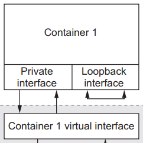
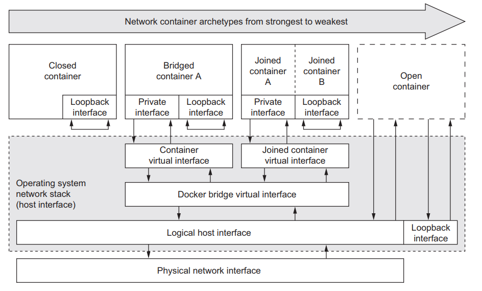
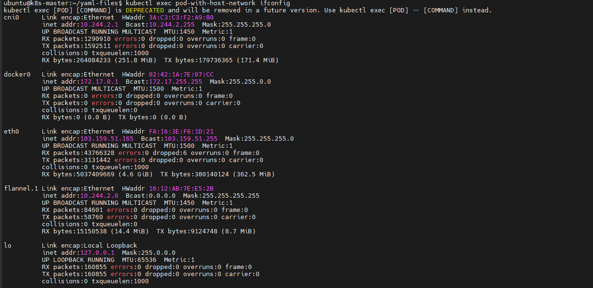
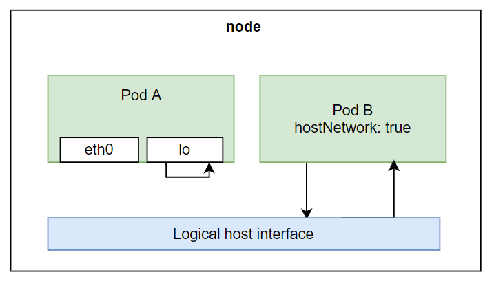

# Pod security

Mặc dù khi chúng ta sử dụng container thì môi trường bên trong container sẽ hoàn toàn riêng biệt với server bên ngoài, tuy nhiên K8s lại cho phép ta config để một container có thể truy cập ra ngoài node server được. Đó là lý do tại sao ta cần phải quản lý pod nào có thể truy cập ra ngoài được, pod nào không.

## Truy cập host network của node server từ bên trong container của Pod

Để hiểu cách một container bên trong Pod sẽ truy host network của node ra sao, trước tiên ta sẽ xem network của một container sẽ được tổ chức ra sao. Tùy vào từng công cụ ta dùng để chạy container thì sẽ có những khác biệt, tuy nhiên kiến trúc chung thì tương tự nhau. Ở đây ta nói về container network của docker.

### 1. Docker container networking

Mỗi container sẽ có 1 loopback interface và private Ethernet interface riêng. Ethernet interface là một điểm nối được dùng để kết nối với một Ethernet interface hoặc network bên ngoài, để mội container có thể thông qua nó để đi ra ngoài internet. Loopback interface là một virtual interface, cho phép các ứng dụng bên trong container có thể nói chuyện được với nhau bằng http protocol thông qua localhost, **đây là lý do tại sao khi mà ở bên trong một container, nếu ta dùng localhost trong container để kết nối với một ứng dụng bên ngoài server thì nó lại không hoạt động**, vì loopback interface này nó chỉ nằm trong container thôi.



Network của 1 container được chia thành 4 dạng là:
- Closed containers
- Bridged containers
- Joined containers
- Open containers



Trong đó:
- ```Clsoed containers```: Dạng container network này sẽ không cho phép một traffic nào truy cập vào nóe, kể cả ứng dụng bên trong nó truy cập ra ngoài internet. Tất cả các ứng dụng trong container này chỉ có thể nói chuyện với nhau thông qua loopback interface, không thể nói chuyện với bên ngoài.
- ```Bridge containers```: Ở dạng container network này thì các ứng dụng bên trong container đã có thể nói chuyện được với internet bên ngoài thông qua một Ethernet interface.
- ```Open containers```: Ở dạng container network này thì hoàn toàn mở, bản thân container không có interface nào riêng cả mà sử dụng chung với node server. Nếu ở dạng container network này, ta có thể dùng localhost để kết nối ứng dụng giữa container và node server như bình thường.

### 2. Truy cập host network từ Pod

K8s cho phép ta cấu hình Pod để container bên trong có thể sử dụng host network của node được. Thuộc tính này được gọi là ```hostNetwork```. Ví dụ như sau:

```sh
apiVersion: v1
kind: Pod
metadata:
  name: pod-with-host-network
spec:
  hostNetwork: true
  containers:
  - name: main
    image: alpine
    command: ["/bin/sleep", "9999999"]
```

Khi ta tạo pod và truy cập vào trong container, gõ ifconfig ta sẽ thấy lúc này container đã sử dụng host network của node

```sh
kubectl exec pod-with-host-network ifconfig
```





Như vậy container bên trong Pod hoàn toàn có thể sử dụng localhost để truy cập ứng dụng bên ngoài node

## Truy cập node's PID và IPC

Tương tự như hostNetwork, ta sẽ có 2 thuộc tính là hostPID và hostIPC để container bên trong Pod có thể truy cập được PID và IPC của node. Khi ta làm vậy thì ứng dụng bên trong container có thể thấy được các ứng dụng đang chạy trên worker node của ta, và cũng có thể giao tiếp được với các ứng dụng đó thông qua IPC (Inter-process communication). Có nghĩa là nếu chúng ta chạy container với 2 thuộc tính trên thì khi ta list process bên trong container, ta có thấy được toàn bộ PID của các process khác trên worker node. Ví dụ ta có pod config như sau:

```sh
apiVersion: v1
kind: Pod
metadata:
  name: pod-with-host-pid-ipc
spec:
  hostPID: true
  hostIPC: true
  containers:
  - name: main
    image: alpine
    command: ["/bin/sleep", "999999"]
```

```sh
kubectl exec pod-with-host-pid-ipc ps aux
```

## Sử dụng container's security context

Bên cạnh một số thuộc tính để container truy cập được ra node server. Thì k8s có cung cấp cho ta thuộc tính ```secutiryContext```, cho phép có thể config một số thuộc tính container như sau:
- Chỉ định userid và groupid cho container
- Ngăn container run với root user
- Chạy container với privileged mode, cho phép container có toàn quyền với node's kernel
- Cấu hình fine-grained privileges
- Chặn process có thể ghi vào trong filesystem của container
- ...

### 1. Chỉ định user khi chạy container

Khi ta chạy 1 container, thì mặc định nó sẽ chạy với root user bên trong container, nghĩa là khi ta truy cập vào container, và có thể tạo file hoặc xóa file và làm bất cứ thứ gì mà root user có thể làm bên trong container

```sh
$ kubectl run pod-with-defaults --image alpine --restart Never -- /bin/sleep 999999
pod/pod-with-defaults created

$ kubectl exec pod-with-defaults id
uid=0(root) gid=0(root) groups=0(root), 1(bin), 2(daemon), 3(sys), 4(adm),
6(disk), 10(wheel), 11(floppy), 20(dialout), 26(tape), 27(video)
```

Ta sẽ thấy uid=0(root) gid=0(root) groups=0(root), container của chúng đang chạy với root user. Thì ta có thể chỉ định user không phải root khi chạy container, bằng cách sử dụng thuộc tính ```securityContext.runAsUser```. Ví dụ:

```sh
apiVersion: v1
kind: Pod
metadata:
  name: pod-as-user-guest
spec:
  containers:
  - name: main
    image: alpine
    command: ["/bin/sleep", "9999999"]
    securityContext:
      runAsUser: 1000
```

Ở file trên ta chỉ định thuộc tính là 1000, hãy kiểm tra hoạt động

```sh
kubectl exec pod-as-user-guest id
```

Đầu ra sẽ có dạng

```sh
uid=1000(guest) gid=1000(users)
```

Nếu ta chạy như vậy thì bây giờ khi ta truy cập vào container, ta sẽ không có quyền tạo file hoặc xóa file nào mà nằm ở những folder chỉ root có quyền

### 2. Ngăn chặn container chạy root user

Nếu ta không chắc user mà ta muốn chỉ định cho container, bởi vì container đang pull từ trên mạng xuống chứ không phải tự build, mà chỉ cần nó không phải chạy như root là được, ta có thể sử dụng thuộc tính ```runAsNonRoot```. Ví dụ:

```sh
apiVersion: v1
kind: Pod
metadata:
  name: pod-run-as-non-root
spec:
  containers:
  - name: main
    image: alpine
    command: ["/bin/sleep", "999999"]
  securityContext:
    runAsNonRoot: true
```

### 3. Chạy pod với privileged mode

Sẽ có những trường hợp, ta cần container bên trong Pod có đủ quyền truy cập vào node server. Ví dụ là kube-proxy pod cần đủ quyền thì mới có thể modify iptables rule được. Để cấp cho container đủ quyền thì ta sử dụng thuộc tính ```privileged```. Ví dụ:

```sh
apiVersion: v1
kind: Pod
metadata:
  name: pod-privileged
spec:
  containers:
  - name: main
    image: alpine
    command: ["/bin/sleep", "99999"]
    securityContext:
      privileged: true
```

Bây giờ thì container có đủ quyền để thực hiện hành động trên node.

```sh
kubectl exec -it pod-privileged ls /dev
```

Đầu ra có dạng

```sh
...
core    null    stderr           urandom
fd      ptmx    stdin            zero
full    pts     stdout           tty49
fuse    random  termination-log  tty48
mqueue  shm     cpu_dma_latency  tty49
full    tty0    tty52            tty54
...
```

Trong khi với 1 pod mặc định sẽ có dạng

```sh
$ kubectl exec -it pod-with-defaults ls /dev
core    null    stderr           urandom
fd      ptmx    stdin            zero
full    pts     stdout
fuse    random  termination-log
mqueue  shm     tty
```

### 4. Thêm kernel capabilities riêng lẻ cho container

Với thuộc tính ```privileged``` thì pod sẽ có toàn quyền, trong 1 số trường hợp ta chỉ muốn cấp 1 số quyền nhất định thì có thể sử dụng thuộc tính ```capabilities```. Ví dụ dưới đây ta thêm quyền thực hiện câu lệnh date

```sh
apiVersion: v1
kind: Pod
metadata:
  name: pod-test-capability
spec:
  containers:
  - name: main
    image: alpine
    securityContext:
      capabilities:
        add:
        - SYS_TIME
```

### 5. Chặn process có thể ghi vào trong filesystem của container

Sẽ có trường hợp ta cần chặn process bên trong container có thể ghi vào trong filesystem của container, ví dụ, ta chạy nodejs, có config cổng thanh toán ta đọc từ file bên trong container, nếu có ai đó truy cập vào được container của chúng ta, sửa lại file config cổng thanh toán này thành thông tin của họ, lúc này tiền của ta sẽ qua họ. Để ngăn chặn việc này, ta sử dụng thuộc tính readOnlyRootFilesystem như sau:

```sh
apiVersion: v1
kind: Pod
metadata:
  name: pod-with-readonly-filesystem
spec:
  containers:
  - name: main
    image: alpine
    securityContext:
      readOnlyRootFilesystem: true
```

Ta có thể thấy là một container có thể dùng nhiều cách để truy cập ra ngoài node server, developer cũng có thể tạo ra container với quyền mà họ muốn, có khi họ không hiểu nhiều về security mà chỉ biết nếu thêm thuộc tính đó thì ứng dụng sẽ chạy được nên họ cứ thêm vào. Với vai trò là cluster administrator, ta có thể ngăn chặn việc developer có thể tạo Pod với quyền mà họ chỉ định trong Pod.

## PodSecurityPolicy

Đây là một cluster resource, dùng để chỉ định những thuộc tính mà developer có thể sử dụng và không thể sử dụng cho Pod của họ. Khi ta khai báo một PodSecurityPolicy, nó sẽ được thêm vào Admission control config của Pod sẽ được đưa qua plugin này để kiểm tra theo policy chúng ta định nghĩa. Nếu Pod sử dụng thuộc tính security context nào mà ta không cho phép, nó sẽ không được tạo và API sẽ trả về lỗi cho developer.

PodSecurityPolicy có thể định nghĩa các policy sau đây:
- Pod có thể sử dụng host IPC, PID, hostNetwork hay không?
- UserID nào container có thể sử dụng?
- Có thể sử dụng privileged mode hay không?
- Những kernel capabilities nào được cho phép thêm hoặc xóa
- Container có thể dùng thuộc tính readOnlyRootFilesystem không?
- Pod có thể xài volume gì?
- ...

Ví dụ:

```sh
apiVersion: policy/v1
kind: PodSecurityPolicy
metadata:
  name: default
spec:
  hostIPC: false
  hostPID: false
  hostNetwork: false
  privileged: false
  readOnlyRootFilesystem: true
  runAsUser:
    rule: RunAsAny
  fsGroup:
    rule: RunAsAny
  supplementalGroups:
    rule: RunAsAny
  volumes:
  - '*' # Pod có thể sử dụng volume type nào cũng được
```

Khi ta tạo PodSecurityPolicy này, thì bây giờ ta thử tạo Pod trong file pod-privileged.yaml thì nó sẽ báo lỗi

```sh
kubectl apply -f pod-privileged.yaml
Error from server (Forbidden): error when creating "pod-privileged.yaml":
pods "pod-privileged" is forbidden: unable to validate against any pod
security policy: [spec.containers[0].securityContext.privileged: Invalid
value: true: Privileged containers are not allowed]
```

Đây là cách ta ngăn chặn developer tạo Pod với quyền ta không mong muốn. Nhưng mà ta nói ở trên thì ```PodSecurityPolicy``` là cluster resource, nghĩa là nó sẽ apply trên toàn bộ cluster và toàn bộ user, vậy hãy cùng tìm hiểu về

### PodSecurityPlicies cho từng user

Để giải quyết vấn đề này, ta sẽ sử dụng **Role Based Access Control** (RBAC). Ta sẽ tạo ```ClusterRole``` và gán nó với PodSecurityPolicies theo tên, và dùng ```ClusterRoleBinding``` để gán ```ClusterRole``` đó tới user. Và muốn chỉ định namespace scope, ta viết thêm Role chỉ định cho phép user đó truy cập một namespace. Ok bên dưới là ví dụ để dễ hiểu:

```sh
apiVersion: policy/v1
kind: PodSecurityPolicy
metadata:
  name: privileged
spec:
  privileged: true
  runAsUser:
    rule: RunAsAny
  fsGroup:
    rule: RunAsAny
  supplementalGroups:
    rule: RunAsAny
  seLinux:
    rule: RunAsAny
  volumes:
  - '*'
```

```sh
kubectl get psp
NAME        PRIV   CAPS  SELINUX   RUNASUSER  FSGROUP   ...
default     false  []    RunAsAny  RunAsAny   RunAsAny  ...
privileged  true   []    RunAsAny  RunAsAny   RunAsAny  ...
```

Tiếp theo ta sẽ tạo 2 ClusterRoles tương ứng với 2 PodSecurityPolicies

```sh
kubectl create clusterrole psp-default --verb=use --resource=podsecuritypolicies --resource-name=default
```

```sh
kubectl create clusterrole psp-privileged --verb=use --resource=podsecuritypolicies --resource-name=privileged
```

Ở câu lệnh trên, ta sử dụng ```--verb=use``` và chỉ định resource ta muốn gán cho clusterrole là podsecurity bằng option ```--resource```, cuối cùng ta chỉ định name của podsecuritypolicies bằng option ```--resource-name```

Tiếp theo ta nối 2 ClusterRoles này tới user ta muốn, ví dụ ở đây ta có 2 user là ```Ronaldo``` và ```Messsi```

```sh
kubectl create clusterrolebinding psp-messi --clusterrole=psp-default --user=messi
```

```sh
kubectl create clusterrolebinding psp-ronaldo --clusterrole=psp-privileged --user=ronaldo
```

Để tạo thêm user bên trong K8s thì ta sẽ sử dụng kubectl với câu lệnh như sau:

```sh
kubectl config set-credentials messi --username=messi --password=password
kubectl config set-credentials ronaldo --username=ronaldo --password=password
```

Sau khi chạy xong câu lệnh trên thì ta đã có được 2 user, bây giờ ta sẽ sử dụng 2 user này để tạo Pod, ta sẽ thấy từng PodSecurityPolicy sẽ được áp dụng cho từng user chính xác.

```sh
kubectl --user messi create -f pod-privileged.yaml
Error from server (Forbidden): error when creating "pod-privileged.yaml":
pods "pod-privileged" is forbidden: unable to validate against any pod
security policy: [spec.containers[0].securityContext.privileged: Invalid
value: true: Privileged containers are not allowed]
```

```sh
kubectl --user ronaldo create -f pod-privileged.yaml
pod/pod-privileged created
```

## Security network

Mặc địch trong cluster, tất cả các pod trong 1 namespace và các namespace khác nhau có thể thấy nhau và giao tiếp được với nhau. Tức là cho dù ta có 2 project ở 2 ns khác nhau thì các container ở 2 ns này vẫn có thể giao tiếp với nhau bình thường.

K8s cung cấp cho ta 1 resource là NetworkPolicy, giúp ta định nghĩa Pod nào mới có thể nói chuyện với pod nào. NetworkPolicy này sẽ chọn Pod dựa theo label tương tự như Service. Với thuộc tính ingress rules định nghĩa traffic nào có thể truy cập được Pod, và egress rule định nghĩa pod có thể gọi tới đâu.

### 1. Ngăn chặn toàn bộ traffic vào Pod trong 1 namespace

Đầu tiên ta sẽ tạo một NetworkPolicy chặn toàn bộ traffic tới Pod. Tạo file tên là network-policy-default-deny.yaml

```sh
apiVersion: networking.k8s.io/v1
kind: NetworkPolicy
metadata:
  name: default-deny
  namespace: default
spec:
  podSelector:
```

Ở file trên, ta chỉ định trường podSelector bằng rỗng, có nghĩa là nó sẽ match với toàn bộ label, suy ra ta sẽ chọn toàn bộ Pod namespace.

### 2. Cho phép vài Pod trong namespace kết nối với nhau

Bây giờ ta sẽ viết thêm một policy nữa, chỉ cho phép traffic từ web server kết nối tới DB. Tạo file tên là network-policy-postgres.yaml

```sh
apiVersion: network.k8s.io/v1
kind: NetworkPolicy
metadata:
  name: postgres-netpolicy
  namespace: default
spec:
  podSelector:
    matchLabels:
      app: database
  ingress:
    - from:
      - podSelector:
          matchLabels:
            app: webserver
      ports:
        - port: 5432
```

Ở file config trên, ta dùng ```podSelector``` chỉ định tất cả pod nào mà có label là ```ap: database```, thì sẽ cho phép kết nối từ pod với label là ```app: webserver``` ở port 5432

Document về [Network Poliies](https://kubernetes.io/docs/concepts/services-networking/network-policies/)