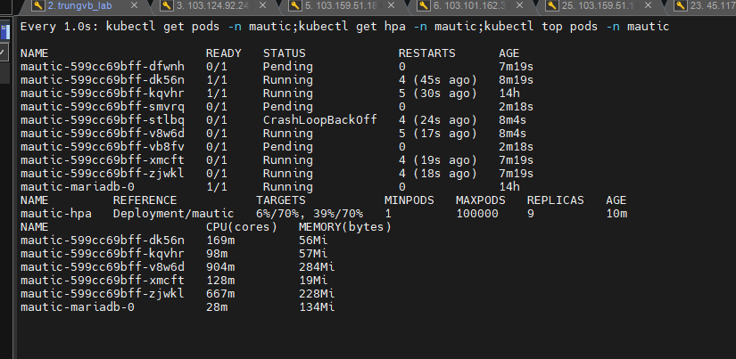

# Tài liệu backup, restore, kiểm thử các trường hợp lỗi K8s

## I. Backup PVC/PV

Persistent Volume trong K8s là 1 trong những thành phần cần được backup thường xuyên do chứa dữ liệu chính của ứng dụng cũng như có thể là nhiều thông tin về cấu hình khác.

Trong cluster K8s này, chúng ta sử dụng Longhorn để quản lý PV/PVC, do đó tính năng backup/restore cũng sẽ được khai thác từ volume controller này.

Chi tiết xem tại: [Longhorn backup](https://github.com/shaidoka/thuctap-NhanHoa/blob/main/k8s/K8s_Storage/K8s_Storage_Longhorn_Backup.md)

## II. Backup etcd

Etcd là cơ sở dữ liệu chính và duy nhất của K8s, nơi đây lưu trữ mọi thông tin về các đối tượng đang hoạt động trong cluster, nhờ đó nếu có backup thì ta có thể dễ dàng restore lại tình trạng cluster khi có sự cố xảy ra.

### 1. Tạo pod bất kỳ cho việc kiểm thử

Đầu tiên, tạo 1 pod bất kỳ ra để kiểm thử backup/restore etcd

```sh
k create ns test-backup-restore-etcd
k -n test-backup-restore-etcd run my-nginx --image=nginx --restart=Always 
```


### 2. Backup etcd

Thực hiện lệnh sau để backup lại etcd vào file etcd-2023-17-07

```sh
etcdctl snapshot save /home/ubuntu/yaml-files/etcd/backup_etcd/etcd-2023-17-07
```

Kiểm tra lại các bản backup bằng lệnh sau

```sh
ETCDCTL_API=3 etcdutl --write-out=table snapshot status /home/ubuntu/yaml-files/etcd/backup_etcd/etcd-2023-17-07
```


### 3. Xóa pod tạo ở bước 1

```sh
k delete pod my-nginx -n test-backup-restore-etcd
```

```sh
k get pods -n test-backup-restore-etcd
```


### 4. Restore etcd

Restore etcd có hơi phức tạp hơn backup 1 chút, tuy nhiên ta chỉ cần làm theo các bước sau là được:
- Dùng etcdctl để restore etcd-data từ file snapshot đã backup ở bước trên
- Stop tất cả các instance của kube-api-server trên K8s cluster
- Thay thế etcd-data hiện tại bằng data từ bản backup
- Restart các service của k8s
- Kiểm tra tính toàn vẹn dữ liệu

**Restore etcd data**

Chúng ta sẽ dùng file backup ở bước trước để restore, nhưng có điểm khác là restore sẽ ra local file chứ không phải restore thẳng vào etcd cluster

Câu lệnh restore như sau:

```sh
mkdir restore_etcd
etcdutl snapshot restore etcd-2023-17-07 --data-dir /home/ubuntu/yaml-files/etcd/restore_etcd/
```

**Stop các control plane instance**

Để restore etcd thì ta phải stop lại tất cả các instance của kube-api-server, restore etcd ở tất cả các etcd instance sau đó start tất cả kube-api-server.

Việc dừng kube-api-server không phải là stop lại pod của apiServer, do các thành phần trong control plane đều được triển khai dưới dạng Static Pods. Chúng không được quản lý bởi bất kỳ loại Replication Controller nào cả, mà ở dạng "tĩnh" trong file yaml ở /etc/kubernetes/manifests/ trên master node:


Các file cấu hình này được đọc và xử lý bởi kubelet chạy trên các master node. Do đó để stop/delete các static pod này ta đơn giản chỉ cần move chúng ra khỏi thư mục mặc định. Kubelet sẽ scan định kỳ để tìm kiếm sự thay đổi và apply nó. Khi ta remove file khỏi thư mục thì tương ứng kubelet sẽ remove pod đi và ngược lại.

Ta sẽ tạo thư mục /k8s-backup để move các file yaml ra đó, sau khi restore etcd xong ta sẽ move lại để restore service

```sh
mkdir /k8s-backup
mv /etc/kubernetes/manifests/*.yaml /k8s-backup/
```

**Lưu ý:** Thực hiện lệnh trên ở tất cả các node master

Tiếp theo ta sẽ thay thế dữ liệu của etcd hiện tại với dữ liệu từ bản backup (thực hiện trên tất cả master node)

```sh
mv /var/lib/etcd/member /var/lib/etcd/member.bak
mv /home/ubuntu/yaml-files/etcd/restore_etcd/member /var/lib/etcd/
chown -R root:root /var/lib/etcd/member
```

**Start lại các control plane instance**

Chúng ta chỉ đơn giản move lại các file yaml đã backup ở thư mục /k8s-backup về lại thư mục /etc/kubernetes/manifests/

```sh
mv /k8s-backup/*.yaml /etc/kubernetes/manifests/
systemctl restart docker
```

Kiểm tra pods lúc nãy ta xóa đã được khôi phục chưa:


Done!

### 5. Use case

Vậy khi nào ta cần restore etcd?

Thông thường thì khi 1 pod hay 1 resource nào đó lỗi trong cluster K8s, ta chỉ cần đơn thuần restart hoặc tạo lại nó là được, PV hay PVC thì không bị ảnh hưởng bởi vấn đề này, khi tạo lại pod thì nó sẽ tự động mount volume.

Việc restore etcd chỉ nên được thực hiện khi có 1 lỗi xảy ra trên các pod hệ thống (kube-system) mà không thể khôi phục được. Hoặc khi node master down mà ta lại không có node master dự phòng trong cluster (số node master nên là số lẻ)

Không chỉ node master, ngay cả khi toàn bộ cluster down (server dedi down) thì ta cũng có thể cài đặt 1 cluster mới, restore etcd và sử dụng tiếp tục hoàn toàn bình thường.

## III. Kiểm thử performance

### 1. Không tải

Cluster ở trạng thái tối thiểu các thành phần, chỉ bao gồm các pod:
- Pod liên quan đến hệ thống như kube-system, ingress, flannel
- Pod controller và các thành phần của Longhorn storage
- Pod Prometheus + Grafana + Alertmanager phục vụ cho giám sát
- Pod mautic

Với số lượng trên, khi không phải chịu tải thì đây là lượng tài nguyên mà cluster sử dụng:


### 2. Tải cao

Để kiểm tra cluster chịu được tối đa tải là bao nhiêu, ta tạo thêm HPA cho pod mautic:

```sh
apiVersion: autoscaling/v2
kind: HorizontalPodAutoscaler
metadata:
  name: mautic-hpa
spec:
  scaleTargetRef:
    apiVersion: apps/v1
    kind: Deployment
    name: mautic
  minReplicas: 1
  maxReplicas: 100000
  metrics:
  - type: Resource
    resource:
      name: cpu
      target:
        type: Utilization
        averageUtilization: 70
  - type: Resource
    resource:
      name: memory
      target:
        type: Utilization
        averageUtilization: 70
```

Giờ ta sẽ kiểm tra bằng công cụ ```ab benchmarking```

```sh
ab -n 1000000 -c 1000 http://k8s.mautic.baotrung.xyz/
```

Sau khoảng 5 phút thì số pods tăng khoảng 10 pod như thế này:



Vấn đề là mautic khá nặng, do đó cluster không đủ tài nguyên để cấp phát cho cả 10 pod, vì vậy mà nhiều pod không được schedule tới node. 

Điều này có thể được giải thích dễ dàng vì trong spec của pod mautic, ta đã chỉ định request ```memory``` là ```2Gi```, trong khi 1 node worker chỉ có 6 GiB RAM, do đó 2 pods mautic sẽ có thể được schedule vào 1 node, sau khi cộng thêm vài pods phụ trợ khác trong node thì lượng tài nguyên còn lại không đủ để allocate tiếp 1 pod mautic vào.

=> Vậy tối đa với cluster hiện tại chỉ schedule được 6 pods mautic

Kể cả các pod được schedule cũng không phản hồi do thiếu tài nguyên (mặc dù tổng tài nguyên mà cluster sử dụng chỉ khoảng 50% CPU và 50% RAM).

Thử 1 bài test nhẹ hơn:

```sh
ab -n 100000 -c 100 http://k8s.mautic.baotrung.xyz/
```


Ứng dụng vẫn hoạt động nhưng phản hồi khá chậm, thường mất từ 5-20s cho mỗi request


Tiếp tục giảm lượng request:

```sh
ab -n 10000 -c 10 http://k8s.mautic.baotrung.xyz/
```


=> Ứng dụng chạy ổn định ở số lượng pod là 3-4

