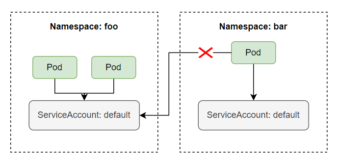
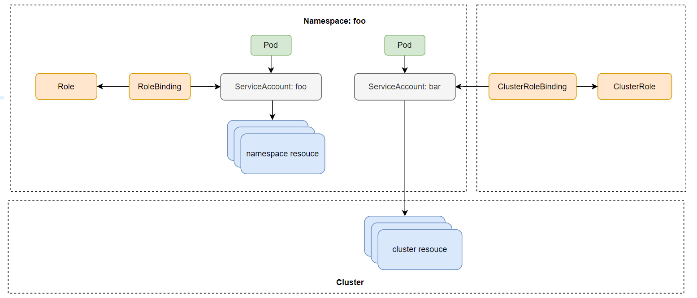
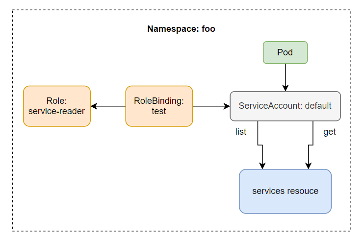
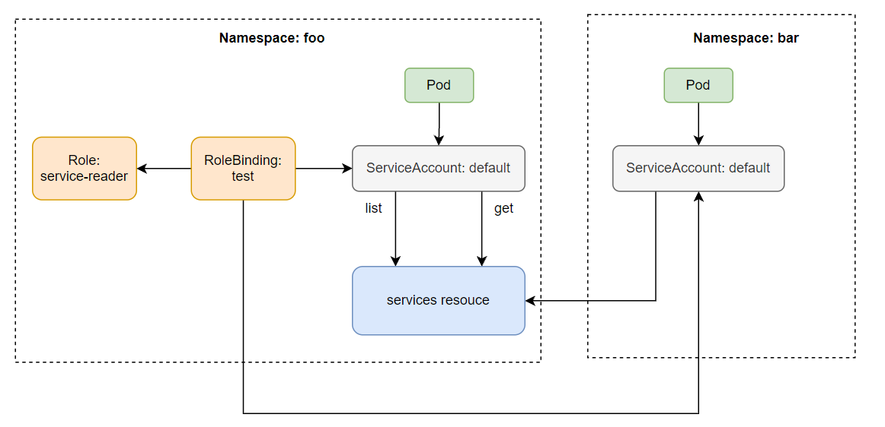
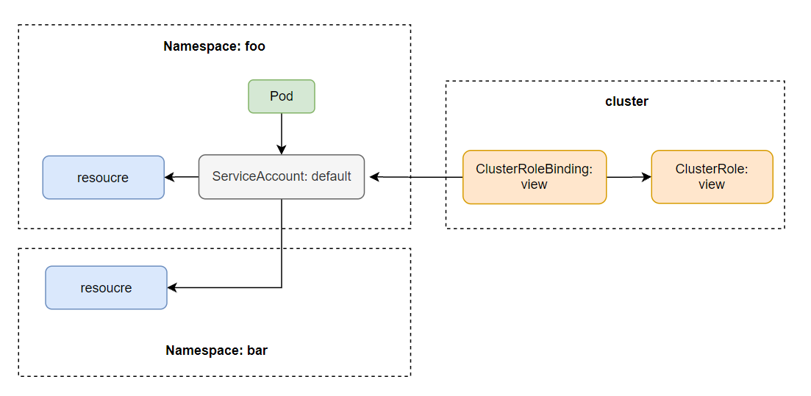

# ServiceAccount và Role Based Access Control: security kubernetes API server

## Cách kubernetes API server thực hiện authentication

Ở bài viết về API server, ta đã biết API server có thể được config với một hay nhiều authentication plugins, khi 1 request đi tới API server nó sẽ đi qua hết các authen plugins này. Những plugin này sẽ phân tách những thông tin cần thiết như username, user id, group mà client thực hiện request thuộc về.

### Client

Có 2 loại client được API server phân biệt rõ ràng:
- Humans (users)
- Pod (ứng dụng chạy bên trong container)

Đối với user, thường sử dụng kubectl hoặc thực hiện một HTTP request với token để authentication tới API server. Còn đối với Pod, thì sẽ sử dụng ServiceAccount để authentication tới API server. Ở bài này chúng ta sẽ nói về cách Pod authentication tới API server

### Groups

Cả users và ServiceAccounts đều thuộc một hoặc nhiều group, group được dùng để grant permissions của tất cả user và ServiceAccounts nằm trong nó một lúc, thay vì phải grant permissions của từng user riêng lẻ.

Group này được phân tách ra bằng authentication plugin cùng với thông tin về username và userid, có 4 group mặc định là:
- system:unauthenticated - được gán cho user không authenticated thành công
- system:authenticated - được gán cho user authenticated thành công
- system:serviceaccounts - group cho toàn bộ ServiceAccounts
- system:serviceaccounts: ```<namespace>``` - group cho toàn bộ ServiceAccounts trong một namespace

### ServiceAccounts

Như chúng ta đã nói, ServiceAccount sẽ được tự động mount vào bên trong container của Pod ở folder ```/var/run/secrets/kubernetes.io/serviceaccount```. Gồm 3 file là ca.crt, namespace, token.

File token này là file sẽ chứa thông tin về Pod client, khi ta dùng nó để thực hiện request tới server, API server sẽ tách thông tin từ trong token này ra. Và ServiceAccount username của chúng ta sẽ có dạng như sau ```system:serviceaccount:<namespace>:<service account name>```, với ```system:serviceaccount:<namespace>``` là group và ```<service account name>``` là tên của ServiceAccount được sử dụng.

Sau khi lấy được thông tin trên thì server sẽ truyền ServiceAccount username này tới authorization plugins, để xem ServiceAccount này có được quyền thực hiện action hiện tại lên trên API server hay không.

ServiceAccount thực chất chỉ là một resource để ứng dụng bên trong container sử dụng cho việc authenticated tới API server. Ta có thể list ServiceAccount bằng lệnh

```sh
kubectl get sa
```

Và ServiceAccount này là một namespace resource, nghĩa là nó chỉ có phạm vi trong namespace mà thôi. Mỗi NS sẽ có 1 SA tên là default được tự động tạo ra khi NS được tạo. Một SA có thể được sử dụng bởi nhiều Pod bên trong cùng 1 namespace.



### Sử dụng ServiceAccount để pull image từ private container registry

Để sử dụng private container image như khi làm dự án thực tế, thì để tải được image từ private registry về, ở trong config của Pod, ta phải khai báo thêm trường **imagePullSecrets** như sau:

```sh
apiVersion: apps/v1
kind: Deployment
...
  spec:
    imagePullSecrets:
      - name: <secret-name>
    containers:
      - name: background-consume-queue
        image: registry.kala.ai/web-crm/background-consume-queue
...
```

Trường imagePullSecrets name sẽ chứa Secret name mà ta sử dụng để pull image từ private registry về. Secret name này được tao bằng cách sử dụng câu lệnh sau:

```sh
kubectl create secret docker-registry <secret-name> --docker-server=<your-name> --docker-password=<you-password>
```

Với ```<secret-name>``` là tên của secret, docker-server là server registry, nếu sử dụng ```hub.docker.com``` thì server registry là ```docker.io```, docker-username là username dùng để login vào docker hub, docker-password là password của user tương ứng trên docker hub.

Vật nếu muốn pull image từ private registry thì mỗi khi viết config ta phải thêm trường imagePullSecrets, ta có thể dùng ServiceAccount để tối giản bước này. Khi một Pod được tạo, ServiceAccount tên là default sẽ tự động được gán cho mỗi Pod.

```sh
kubectl get pods <pod-name> -o yaml

apiVersion: v1
kind: Pod
metadata:
  creationTimestamp: "2021-10-14T07:42:11Z"
  ...
spec:
  ...
  schedulerName: default-scheduler
  securityContext: {}
  serviceAccount: default # here
  serviceAccountName: default # here
  ...
```

Ta thấy trường serviceAccount sẽ được tự động gán cho Pod với giá trị là ServiceAccount default. Ta thử xem config của 1 ServiceAccount

```sh
kubectl describe sa default

Name:                default
Namespace:           default
Labels:              <none>
Annotations:         <none>
Image pull secrets:  <none>
Mountable secrets:   default-token-tnbgw
Tokens:              default-token-tnbgw
Events:              <none>
```

Ta có thể thấy thuộc tính ```Image pull secret``` của SA, trường này có ý nghĩa tương tự như ```imagePullSecret``` bên trong config của pod, vậy những gì ta cần làm là cập nhật lại trường imagePullSecrets của default ServiceAccount, và ServiceAccount này sẽ tự động được gán vào trong pod, và ta không cần khai báo trường ```imagePullSecrets``` trong mỗi config của Pod nữa, ta cập nhật trường ```imagePullSecrets``` của SA như sau:

```sh
kubectl patch sa default --type json -p '[{"op":"replace","path":"/imagePullSecrets[0].name", "value": "my-secret"}]'
```

Vậy là tất cả Pod trong default namespace có thể pull được image từ private registry mà ta không cần khai báo imagePullSecrets khi viết config cho Pod.

### Tạo ServiceAccount

ServiceAccount là một resource của K8s, vậy nên ta có thể tạo và xóa nó như các resource khác một cách bình thường, kể cả nếu có xóa default ServiceAccount thì khi tạo Pod nó sẽ báo lỗi là không tìm thấy ServiceAccount để gán vào Pod thôi, và K8s sẽ tự tạo lại 1 SA mới để pod có thể được tạo như bình thường.

Hoặc ta cũng có thể tạo 1 SA khác và chỉ định Pod sử dụng SA mới này thay vì dùng default SA. Để tạo SA, ta chỉ cần gõ:

```sh
kubectl create sa bar
```

```sh
kubectl describe sa bar

Name:                bar
Namespace:           default
Labels:              <none>
Annotations:         <none>
Image pull secrets:  <none>
Mountable secrets:   bar-token-ndvtr
Tokens:              bar-token-ndvtr
Events:              <none>
```

Ở trên khi ta describe một SA thì thấy nó có một trường tên là **Mountable secrets**, đây là tên của Secret được gán cho SA, khi một SA được tạo ra thì nó cũng sẽ tạo ra một Secret cho ta

```sh
kubectl get secret

NAME                 TYPE                                 DATA
bar-token-ndvtr      kubernetes.io/service-account-token  3
default-token-4fsjr  kubernetes.io/service-account-token  3
```

```sh
kubectl describe secret bar-token-ndvtr

Name:         bar-token-ndvtr
Namespace:    default
...
ca.crt:     1066 bytes
namespace:  7 bytes
token:      ...
...
```

Khi ta describe secret được tạo ra bởi SA, ta sẽ thấy nó chứa 3 file, là 3 file mà sẽ được mount vào bên trong container của Pod ở folder ở ```/var/run/secrets/kubernetes.io/serviceaccount```

Để sử dụng ServiceAccount khác default bên trong pod thì ta chỉ định ở trường ```spec.serviceAccountName```

```sh
apiVersion: apps/v1
kind: Deployment
...
  spec:
    serviceAccountName: bar
    containers:
      - name: background-consume-queue
        image: registry.kala.ai/web-crm/background-consume-queue
...
```

Tuy nhiên 1 vấn đề đặt ra, nếu ta không bật Role Based Access Control authorization plugin thì nó sẽ có quyền thưc hiện mọi hành động lên API server, nghĩa là một ứng dụng trong container có thể sử dụng SA để authenticate tới API server và thực hiện mọi hành động, vì nó có đủ quyền. Để ngăn chặn việc đó, ta cần kích hoạt Role Based Access Control authorization plugin.

## Role Based Access Control

Kể từ version 1.8.0 thì RBAC đã được enable theo mặc định, và ta có thể tạo role và gán với từng user nhất định, chỉ cho phép một SA thực hiện những hành động mà ta cho phép, theo **Principle of Least Privilege**

### Action

Các action ta có thể thực hiện tới API server là HEAD, GET, POST, PUT, WATCH, DELETE. Và những action này sẽ tương ứng với một verb mà ta sử dụng khi định nghĩa role.

|Action|Verb|
|:-|:-|
|HEAD, GET|get|
|POST|create|
|PUT|update|
|PATCH|patch|
|DELETE|delete|

### RBAC resource

RBAC sẽ có các resource như sau:
- Roles: định nghĩa verb nào có thể được thực hiện lên trên namespace resource
- ClusterRoles: định nghĩa verb nào có thể được thực hiện lên trên cluster resource
- RoleBindings: gán Roles tới SA
- ClusterRoleBindings: gán ClusterRoles tới SA

Điểm khác nhau của Roles và ClusterRoles là Roles có ý nghĩa đối với namespace resource, nghĩa là nó sẽ thuộc về một namespace nào đó, và chỉ định nghĩa role cho SA trong 1 namespace. Trong khi ClusterRoles thì thuộc về toàn cụm.



### Tạo Role và RoleBinding

Bây giờ ta sẽ thực hành tạo Role và ClusterRole để hiểu rõ hơn về lý thuyết. Trước tiên ta tạo 2 namespace:

```sh
kubectl create ns foo
kubectl create ns bar
kubectl run test --image=luksa/kubectl-proxy -n foo
kubectl run test --image=luksa/kubectl-proxy -n bar
```

Truy cập vào pod vào thực hiện request

```sh
kubectl exec -it test -n foo -- sh
curl localhost:8001/api/v1/namespaces/foo/services

{
  "kind": "Status",
  "apiVersion": "v1",
  "metadata": {},
  "status": "Failure",
  "message": "services is forbidden: User \"system:serviceaccount:foo:default\" cannot list resource \"services\" in API group \"\" in the namespace \"foo\"",
  "reason": "Forbidden",
  "details": {
    "kind": "services"
  },
  "code": 403

```

Ta sẽ thấy là RBAC được enable thì SA bây giờ không có quyền gì cả. Để cho phép default SA ở namespace foo có thể list được service trong namespace foo, thì ta cần phải tạo 1 Role và dùng RoleBinding để gán quyền cho default SA này. Tạo 1 file tên là service-reader-role.yaml với config như sau:

```sh
apiVersion: rbac.authorization.k8s.io/v1
kind: Role
metadata:
  namespace: foo
  name: service-reader
rules:
  - apiGroups: [""]
    verbs: ["get", "list"]
    resources: ["services"]
```

```sh
kubectl apply -f service-reader-role.yaml -n foo
```

Ở file config trên, thuộc tính apiGroups ta sẽ chỉ định nhóm của API ta muốn thực hiện hành động lên nó, với ```""``` có nghĩa là core API Group **/v1** path, nếu ta muốn thực hiện hành động lên deployment thì ta sẽ chỉ định apiGroups là **apps/v1**. Trường verb chỉ định action ta có thể thực hiện api group trên, trường resources ta chỉ định là Service resources. Khi ta tạo Role xong, ta cần bind nó tới SA bằng câu lệnh sau:

```sh
kubectl create rolebinding test --role=service-reader-role --serviceaccount=foo:default -n foo
```

Hoặc file config như sau:

```sh
apiVersion: rbac.authorization.k8s.io/v1
kind: RoleBinding
metadata:
  name: test
  namespace: foo
roleRef:
  apiGroup: rbac.authorization.k8s.io
  kind: Role
  name: service-reader
subjects:
  - kind: ServiceAccount
    name: default
    namespace: foo
```



Bây giờ thì khi ta có thể gọi API list service bên trong Pod được rồi

```sh
# Ở trong pod
curl localhost:8001/api/v1/namespaces/foo/services

{
  "kind": "ServiceList",
  "apiVersion": "v1",
  "metadata": {
    "resourceVersion": "3435513"
  },
  "items": []
}
```

Ta cũng có thể sử dụng RoleBinding ở namespace này cho SA ở một namespace khác. Bằng cách thêm SA vào trường subjects của RoleBinding.

```sh
k edit rolebinding test -n foo
...
subjects:
...
- kind: ServiceAccount
  name: default
  namespace: bar
```

Khi ta thêm subject trên thì bây giờ SA ở namespace bar có thể đọc được service ở namespace foo. Mô hình như sau:



### ClusterRole và ClusterRoleBinding

Đối với ClusterRole, ta thường cung cấp cho SA các quyền truy cập tài nguyên như node, PV,... liên quan đến Cluster. Ở trong pod hiện tại, khi ta thực hiện API request để list PV thì ta sẽ gặp lỗi như sau:

```sh
curl localhost:8001/api/v1/persistentvolumes

{
  "kind": "Status",
  "apiVersion": "v1",
  "metadata": {},
  "status": "Failure",
  "message": "persistentvolumes is forbidden: User \"system:serviceaccount:foo:default\" cannot list resource \"persistentvolumes\" in API group \"\" at the cluster scope",
  "reason": "Forbidden",
  "details": {
    "kind": "persistentvolumes"
  },
  "code": 403
}
```

Để thực hiện action này, ta phải tạo ClusterRole, tạo file tên là pv-reader-role.yaml với config như sau:

```sh
apiVersion: rbac.authorization.k8s.io/v1
kind: ClusterRole
metadata:
  name: pv-reader
rules:
  - apiGroups: [""]
    verbs: ["get", "list"]
    resources: ["persistentvolumes"]
```

Config của ClusterRole cũng giống như Role, ta chỉ cần thay thông số kind từ ```Role``` sang ```ClusterRole``` và không cần chỉ định namespace.

```sh
kubectl apply -f pv-reader-role.yaml
```

Sau đó ta tạo ClusterRoleBinding:

```sh
kubectl create clusterrolebinding pv-test --clusterrole=pv-reader --serviceaccount=foo:default
```

Hoặc file config

```sh
apiVersion: rbac.authorization.k8s.io/v1
kind: ClusterRoleBinding
metadata:
  name: pv-test
roleRef:
  apiGroup: rbac.authorization.k8s.io
  kind: ClusterRole
  name: pv-reader
subjects:
  - kind: ServiceAccount
    name: default
    namespace: foo
```

Bây giờ thì ta đã có thể gọi tới API server để list PV

```sh
curl localhost:8001/api/v1/persistentvolumes

{
  "kind": "PersistentVolumeList",
  "apiVersion": "v1",
  "metadata": {
    "resourceVersion": "3442040"
  },
  "items": [
    {
      "metadata": {
        "name": "pvc-eb273dad-453b-42a7-b681-614758719672",
        "uid": "2fdf97be-580e-4f99-b5e0-d9645c516b51",
...
```


### ClusterRole và ClusterRoleBinding mặc định

K8s có 1 số ClusterRole và ClusterRoleBinding mặc định, ta có thể list nó ra bằng câu lệnh

```sh
kubectl get clusterroles
kubectl get clusterrolebinding
```

### Truy cập non-resource URLs với system:discovery

Kubernetes API server sẽ được chia làm 2 loại chính là: các URL liên quan tới resource và những URL không liên quan tới resource (được gọi là non-resource URLs). Resource URLs là các URL sẽ liệt kê resource và thực hiện các thao tác lên resource, còn các non-resource URLs thì sẽ không có tương tác nào liên quan trực tiếp tới các resource hết, ví dụ như là URL dùng để list các URL mà API server hỗ trợ.

Đối với non-resource URLs thì kể cả client authenticated hoặc unauthenticated đều truy cập được những non-resource URLs này, role này được định nghĩa trong **system:discovery** ClusterRole và ClusterRoleBinding.

Ta xem thử config của system:discovery

```sh
kubectl get clusterrole system:discovery -o yaml

apiVersion: rbac.authorization.k8s.io/v1
kind: ClusterRole
metadata:
  annotations:
    rbac.authorization.kubernetes.io/autoupdate: "true"
  creationTimestamp: "2023-05-06T03:06:01Z"
  labels:
    kubernetes.io/bootstrapping: rbac-defaults
  name: system:discovery
  resourceVersion: "71"
  uid: 3a8077df-2098-4ffe-8f38-4fb6ca180e8f
rules:
- nonResourceURLs:
  - /api
  - /api/*
  - /apis
  - /apis/*
  - /healthz
  - /livez
  - /openapi
  - /openapi/*
  - /readyz
  - /version
  - /version/
  verbs:
  - get
```

### Liệt kê toàn bộ resource trong một namespace với view Clusterrole

**view** ClusterRole sẽ định nghĩa toàn bộ role cho phép chúng ta có thể list toàn bộ resource bên trong một namespace. Ta coi thử config của **view**:

```sh
kubectl get clusterrole view -o yaml

aggregationRule:
  clusterRoleSelectors:
  - matchLabels:
      rbac.authorization.k8s.io/aggregate-to-view: "true"
apiVersion: rbac.authorization.k8s.io/v1
kind: ClusterRole
metadata:
  annotations:
    rbac.authorization.kubernetes.io/autoupdate: "true"
  creationTimestamp: "2023-05-06T03:06:01Z"
  labels:
    kubernetes.io/bootstrapping: rbac-defaults
    rbac.authorization.k8s.io/aggregate-to-edit: "true"
  name: view
  resourceVersion: "361"
  uid: dec4463d-c09d-4969-926d-203ff1fe245c
rules:
- apiGroups:
  - ""
  resources:
  - configmaps
  - endpoints
  - persistentvolumeclaims
  - persistentvolumeclaims/status
  - pods
  - replicationcontrollers
  - replicationcontrollers/scale
  - serviceaccounts
...
```

Để sử dụng **view** ClusterRole thì chỉ cần tạo ClusterRoleBinding cho nó

```sh
kubectl create clusterrolebinding view --clusterrole=view --serviceaccount=foo:default
```

Và vì nó là ClusterRole, nên SA có thể list các resource khác namespace được, nhưng không thể list Cluster Resource

```sh
curl localhost:8001/api/v1/namespaces/foo/pods
```



### Update resource với edit ClusterRole

**edit** ClusterRole sẽ kế thừa toàn bộ role của **view** và bên cạnh đó nó còn định nghĩa thêm role để thực hiện verb create, update, patch, delete tất cả các resource bên trong một namespace, ngoại trừ Secret, Role, RoleBinding

### Toàn quyền trên namespace với admin ClusterRole

**admin** ClusterRole cho phép ta có toàn quyền trên một namespace, kể cả edit Secret, Role, RoleBinding, ngoại trừ ResourceQuotas. Điểm khác nhau giữa **edit** và **admin**.

### Toàn quyền trên cluster với cluster-admin ClusterRole

Không thiếu 1 cái quyền gì.

### system:* ClusterRole

Khi ta liệt kê ClusterRole ra ta sẽ thấy có nhiều ClusterRole mặc định, trong đó có nhiều ClusterRole với prefix là ```system:```, đây là những ClusterRole được k8s components sử dụng. Ví dụ ```system:kube-scheduler``` được sử dụng bởi Scheduler.

