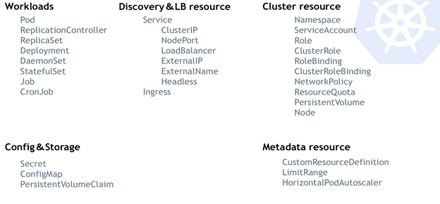
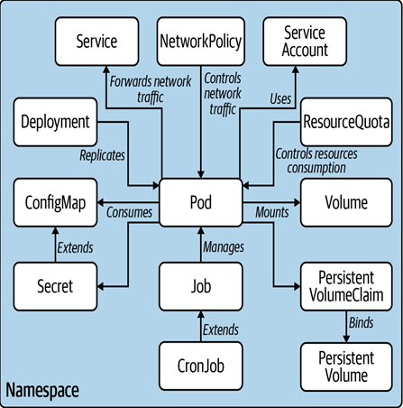

# Resource trong Kubernetes

**Resource:** Được hiểu là một loại tài nguyên được K8s quản lý như namespace, pods, volume, serviceaccount, configMap, secret,...

Resource có loại có sẵn (còn gọi là native), tức là cài đặt K8s là nó có luôn rồi. Có loại resource tạo mới bằng kỹ thuật CRD (CustomResourceDefinition), thường được sử dụng trong các ứng dụng Operator.

Nếu phân chia resource thành nhóm chức năng thì chúng ta có thể chia thành các nhóm sau



Thực ra việc chia nhóm chức năng như trên cũng không được trực quan cho lắm. Vì đôi khi chả biết resource kia sẽ được sử dụng như thế nào, trong trường hợp nào. Có một cách phân nhóm khác dễ hình dung hơn là chia theo phạm vi namespace:



Hình trên chỉ là trích dẫn những resource tiêu biểu trong phạm vi namespace, còn muốn biết chính xác các resource đang có trong Kubernetes thì bạn có thể sử dụng lệnh

```sh
kubectl api-resource --namespaced=true
```

Trong hình trên, pod là trung tâm kết nối mọi resource khác, trong phạm vi của resource thì pod là ứng dụng chạy trong một vùng không gian riêng. Pod và container khá giống nhau, thực tế K8s không làm việc trực tiếp với container, mà thay vào đó K8s bao bọc một hoặc một vài container vào trong một cấu trúc gọi là Pod.

Điều này có ý nghĩa là cụm K8s chỉ tồn tại khi đảm bảo các Pod tồn tại. Nhưng ở giai đoạn chuyển tiếp, các ứng dụng mới được containerize (đóng gói vào container) thì khả năng thích nghi trên môi trường K8s là rất thấp (cụ thể là chạy application trong container). Đủ các thứ bất lợi như: process ghi log ra file thay vì ghi ra stdout/stderr, hardcode các tham số/biến thay vì sử dụng biến môi trường, chạy nhiều process và listen trên nhiều port trong một container,... Vì vậy, thay vì cố gắng tích hợp thật nhiều thứ vào K8s thì hãy làm sao để Pod có thể chạy mượt mà trên K8s trước.

Đứng ở góc độ của đội phát triển phần mềm, bạn cần phải biết, hiểu và vận dụng linh hoạt toàn bộ các resource trong phạm vi của namespace

**Tóm lại:**
- Để sử dụng thành thạo K8s thì cần nắm được resource có sẵn
- Cần nắm chắc các resource trong phạm vi của namespace để triển khai được ứng dụng lên K8s
- Mọi resource trong K8s đều hướng tới việc phục vụ Pod, nên hãy cố gắng tìm hiểu và thành thạo Pod trước khi tìm hiểu các resource khác