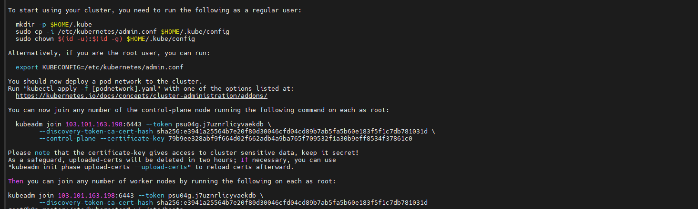
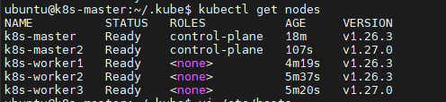
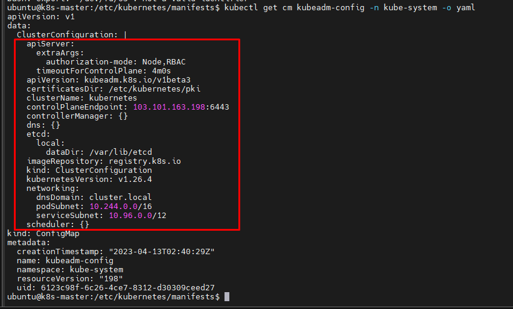
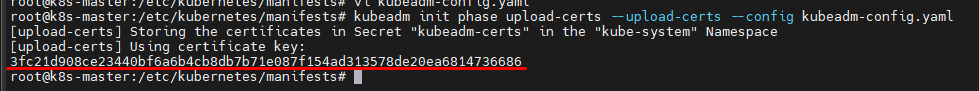
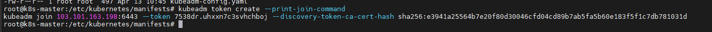

# Scale up cluster k8s cài đặt bằng Kubeadm

Ở bài trước ta đã cài đặt Cluster K8s 1 node master và 2 node worker bằng kubeadm.

Để scale up một K8s cluster bằng Kubeadm, ta cần thực hiện các bước sau

## I. Thêm các node worker

Việc thêm node worker khá đơn giản, vì vậy ta có thể làm bất kỳ lúc nào

Đầu tiên, cài đặt kubeadm như đã giới thiệu ở bài viết trước.

Join worker mới bằng lệnh ```kubeadm join```

```sh
kubeadm join 103.159.51.184:6443 --token m2e0gd.gzord6x8p9pcm2he --discovery-token-ca-cert-hash sha256:bc003be68066139719bfca1e70a3d527993aeb980d7fa905e9e213c12fb79b28
```

**Lưu ý:** token và giá trị băm của ca cert đã được khởi tạo khi ta sử dụng ```kubeadm init``` lúc cài đặt master hoặc sử dụng lệnh ```sudo kubeadm token create --print-join-command```. Token này sẽ expire sau 24h nên 

## II. Thêm các node master

Để sử dụng nhiều hơn 1 node master, ta cần thiết và nên cài đặt Load Balancer cho các node này.

### 1. Cài đặt bộ cân bằng tải sử dụng HAProxy

Thay đổi hostname cho LB

```sh
hostnamectl set-hostname k8s-loadbalancer
```

Chỉnh sửa file hosts

```sh
echo << EOF > /etc/hosts
127.0.0.1       localhost k8s-master
103.159.51.184       k8s-master
103.101.162.38       k8s-master2
103.159.51.229       k8s-worker1
103.159.51.165       k8s-worker2
103.101.162.159      k8s-worker3
103.101.163.198      k8s-loadbalancer
EOF
```

Cài đặt HAProxy

```sh
apt-get update -y && apt-get upgrade -y
apt-get install haproxy
```

Chỉnh sửa file cấu hình HAProxy tại ```/etc/haproxy/haproxy.cfg```

```sh
global
  log /dev/log  local0
  log /dev/log  local1 notice
  stats socket /var/lib/haproxy/stats level admin
  chroot /var/lib/haproxy
  user haproxy
  group haproxy
  daemon

defaults
  log global
  mode  http
  option  httplog
  option  dontlognull
        timeout connect 5000
        timeout client 50000
        timeout server 50000

frontend kubernetes
    bind 103.101.163.198:6443
    option tcplog
    mode tcp
    default_backend kubernetes-master-nodes

backend kubernetes-master-nodes
    mode tcp
    balance roundrobin
    option tcp-check
    server k8s-master 103.159.51.184:6443 check fall 3 rise 2
    server k8s-master2 103.101.162.38:6443 check fall 3 rise 2

listen stats
    bind 103.101.163.198:8080
    mode http
    stats enable
    stats uri /
    stats realm HAProxy\ Statistics
    stats auth admin:haproxy
```

Start dịch vụ

```sh
systemctl start haproxy
```

### 2. Cài đặt node master

Trong bài viết trước, chúng ta đã cài đặt cluster k8s bằng kubeadm mà không có 1 stable control plane endpoint. Do đó, để có thể cài đặt cluster mới với nhiều hơn 1 node master và cả load balancer, ta phải thực hiện reset toàn bộ cluster.

Trên mọi node, thực hiện lệnh (bỏ qua bước này nếu cài mới cluster)

```sh
kubeadm reset
```

Giờ ta thực hiện ```kubeadm init``` để khởi tạo lại cluster

```sh
kubeadm init --apiserver-advertise-address 103.159.51.184 --pod-network-cidr=10.244.0.0/16 --control-plane-endpoint "103.101.163.198:6443" --upload-certs
```



Lúc này ta đã có thể sử dụng ```kubeadm join``` như output trên màn hình để join master/worker vào cluster.

### 3. Join node vào cluster

Sau khi thực hiện các bước cài đặt ban đầu, các node sau đó có thể được join vào cluster bằng token và key đã được cấp

- Với node master:

```sh
kubeadm join 103.101.163.198:6443 --token psu04g.j7uznrlicyvaekdb \
        --discovery-token-ca-cert-hash sha256:e3941a25564b7e20f80d30046cfd04cd89b7ab5fa5b60e183f5f1c7db781031d \
        --control-plane --certificate-key 79b9ee328abf9f664d02f662adb4a9ba765f709532f1a30b9eff8534f37861c0
```

- Với node worker:

```sh
kubeadm join 103.101.163.198:6443 --token psu04g.j7uznrlicyvaekdb \
        --discovery-token-ca-cert-hash sha256:e3941a25564b7e20f80d30046cfd04cd89b7ab5fa5b60e183f5f1c7db781031d
```

Kiểm tra:

```sh
kubectl get nodes
```



Tuy nhiên, do token join node chỉ có hiệu lực trong 1h, do đó ta cần biết cách tạo lại token này như nào

### 4. Cách tạo token join node master

Để tạo 1 token join node master, ta cần lấy được file config của cluster, upload control plane certificate, khởi tạo 1 join command và kết hợp chúng lại thành 1 join command đầy đủ.

Đầu tiên, hãy lấy thông tin configuation của cluster (thực hiện trên node master có sẵn)

```sh
kubectl get cm kubeadm-config -n kube-system -o yaml
```



Copy nội dung cấu hình trong thuộc tính ```ClusterConfiguration```, sau đó paste vào 1 file mới có tên ```kubeadm-config.yaml```

```sh
vi kubeadm-config.yaml
```

```sh
apiServer:
  extraArgs:
    authorization-mode: Node,RBAC
  timeoutForControlPlane: 4m0s
apiVersion: kubeadm.k8s.io/v1beta3
certificatesDir: /etc/kubernetes/pki
clusterName: kubernetes
controlPlaneEndpoint: 103.101.163.198:6443
controllerManager: {}
dns: {}
etcd:
  local:
    dataDir: /var/lib/etcd
imageRepository: registry.k8s.io
kind: ClusterConfiguration
kubernetesVersion: v1.26.4
networking:
  dnsDomain: cluster.local
  podSubnet: 10.244.0.0/16
  serviceSubnet: 10.96.0.0/12
scheduler: {}
```

Ta tiếp tục dùng lệnh sau để tạo certificate

```sh
kubeadm init phase upload-certs --upload-certs --config kubeadm-config.yaml
```



Như đã biết, ta dùng lệnh sau để lấy được join command

```sh
kubeadm token create --print-join-command
```



OK, giờ chỉ cần thực hiện lệnh join trên node master mới thôi

```sh
<basic join command> --control-plane --certificate-key <ceritifcate-key>
```

Ví dụ

```sh
kubeadm join 103.101.163.198:6443 --token 7538dr.uhxxn7c3svhchboj --discovery-token-ca-cert-hash sha256:e3941a25564b7e20f80d30046cfd04cd89b7ab5fa5b60e183f5f1c7db781031d --control-plane --certificate-key 3fc21d908ce23440bf6a6b4cb8db7b71e087f154ad313578de20ea6814736686
```