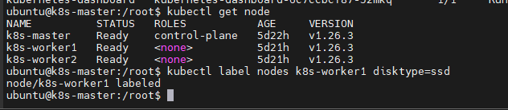
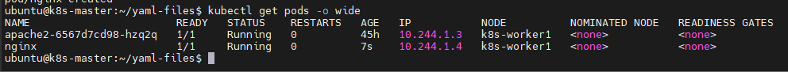
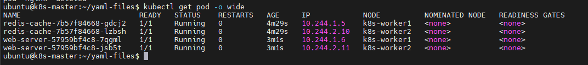

# Phân bổ Pod vào Node

Ta có thể ràng buộc một Pod chỉ có thể chạy trên (các) Node cụ thể hoặc ưu tiên (prefer) chạy trên các node cụ thể. Có nhiều cách để thực hiện việc này và các phương pháp đều sử dụng **label selector** để thực hiện lựa chọn. Nói chung những ràng buộc như vậy là không cần thiết vì scheduler sẽ tự động thực hiện việc đặt pod hợp lý (ví dụ: rải đều pod trên các node, không đặt pod trên node không có đủ tài nguyên rảnh rỗi,...) nhưng có một số trường hợp ta có thể muốn kiểm soát nhiều hơn về node nơi pod sẽ chạy, chẳng hạn như để dảm bảo rằng một pod sẽ chạy trên một máy có gắng SSD hoặc đưa các pod từ 2 service khác nhau có giao tiếp nhiều với nhau vào cùng một vùng khả dụng (availability zone)

## nodeSelector

```nodeSelector``` là dạng ràng buộc lựa chọn node đơn giản nhất được khuyến cáo. ```nodeSelector``` là một trường của PodSpec. Nó chỉ định một bản đồ (map) của các cặp key-value. Để pod đủ điều kiện chạy trên một node thì node đó phải có từng cặp key-value được chỉ định làm label (nó cũng có thêm các label bổ sung khác). Cách sử dụng phổ biến nhất là một cặp key-value

Ví dụ về cách sử dụng ```nodeSelector``` như dưới đây:

### Bước 0: Điều kiện tiên quyết

Ví dụ này giả định rằng ta có hiểu biết cơ bản về các pod K8s và ta đã thiết lập một K8s cluster

### Bước 1: Gắn label vào node

Chạy lệnh ```kubectl get node``` để lấy tên của các node trong cluster

Chọn một node muốn thêm label, sau đó chạy lệnh ```kubectl label nodes <node-name> <label-key>=<label-value>``` để thêm label vào node đã chọn. Ví dụ: nếu tên node là 'k8s-worker1' và label mong muốn là 'disktype=ssd' thì ta có thể chạy lệnh 

```sh
kubectl label nodes k8s-worker1 disktype=ssd
```



Ta có thể kiểm tra rằng nó đã hoạt động bằng cách chạy lệnh ```kubectl get nodes --show-labels``` và xem node đã có label mới thêm vào hay chưa. Ta cũng có thể sử dụng lệnh ```kubectl describe node "nodename"``` để xem danh sách đầy đủ các label của node đã cho

!()(./images/Scheduler_2.png)

### Bước 2: Thêm trường nodeSelector vào cấu hình pod

Lấy bất kỳ file cấu hình pod nào ta muốn chạy và thêm phần ```nodeSelector``` vào đó. VD:

```sh
apiVersion: v1
kind: Pod
metadata:
  name: nginx
  labels:
    env: test
spec:
  containers:
    - name: nginx
      image: nginx
```

Sau đó thêm ```nodeSelector``` vào như sau:

```sh
apiVersion: v1
kind: Pod
metadata:
  name: nginx
  labels:
    env: test
spec:
  containers:
  - name: nginx
    image: nginx
    imagePullPolicy: IfNotPresent
  nodeSelector:
    disktype: ssd
```

Khi ta chạy lệnh ```kubectl apply -f nginx-app.yml```, pod sẽ được lập lịch trên node mà ta đã gắn label. Ta có thể kiểm tra nó đã hoạt động bằng cách chạy lệnh ```kubectl get pods -o wide``` và xem node mà pod được phân bổ vào



**Một số label được tích hợp sẵn cho node**

Ngoài các label ta **gắn vào**, các node cũng sẽ được điền sẵn với một tập các label tiêu chuẩn. Các label này là:
- [kubernetes.io/hostname](https://kubernetes.io/docs/reference/kubernetes-api/labels-annotations-taints/#kubernetes-io-hostname)
- [failure-domain.beta.kubernetes.io/zone](https://kubernetes.io/docs/reference/kubernetes-api/labels-annotations-taints/#failure-domainbetakubernetesiozone)
- [failure-domain.beta.kubernetes.io/region](https://kubernetes.io/docs/reference/kubernetes-api/labels-annotations-taints/#failure-domainbetakubernetesioregion)
- [topology.kubernetes.io/zone](https://kubernetes.io/docs/reference/kubernetes-api/labels-annotations-taints/#topologykubernetesiozone)
- [topology.kubernetes.io/region](https://kubernetes.io/docs/reference/kubernetes-api/labels-annotations-taints/#topologykubernetesiozone)
- [beta.kubernetes.io/instance-type](https://kubernetes.io/docs/reference/kubernetes-api/labels-annotations-taints/#beta-kubernetes-io-instance-type)
- [node.kubernetes.io/instance-type](https://kubernetes.io/docs/reference/kubernetes-api/labels-annotations-taints/#nodekubernetesioinstance-type)
- [kubernetes.io/os](https://kubernetes.io/docs/reference/kubernetes-api/labels-annotations-taints/#kubernetes-io-os)
- [kubernetes.io/arch](https://kubernetes.io/docs/reference/kubernetes-api/labels-annotations-taints/#kubernetes-io-arch)

## Cách ly/giới hạn Node

Việc thêm label vào các đối tượng Node cho phép nhắm mục tiêu pod đến các node hoặc nhóm node cụ thể. Điều này có thể được sử dụng để đảm bảo pod cụ thể chỉ chạy trên các node có thuộc tính cách ly (isolation), bảo mật (security) hoặc quy định (regulatory) nhất định.

Khi sử dụng label cho mục đích này, ta nên chọn các key cho label là không thể bị sửa đổi bởi kubelet process trên node. Việc này ngăn một node đã bị xâm nhập (compromised) sử dụng thông tin xác thực (credential) của kubelet của nó để thiết lập các label đó trên chính bản thân đối tượng Node và gây ảnh hưởng đến scheduler để lập lịch workload vào node bị xâm phạm (compromised)

Admission plugin ```NodeRestriction``` ngăn kubelet thiết lập hoặc sửa đổi các label có tiền tố ```node-restriction.kubernetes.io/```. Để sử dụng tiền tố label đó cho mục đích cô lập node:
- Đảm bảo ta đang sử dụng [Node authorizer](https://kubernetes.io/docs/reference/access-authn-authz/node/) và đã bật [admission plugin NodeRestriction](https://kubernetes.io/docs/reference/access-authn-authz/admission-controllers/#noderestriction)
- Thêm label với tiền tố ```node-restriction.kubernetes.io/``` vào các đối tượng Node và sử dụng các label đó trong node selector. Ví dụ: ```example.com.node-restriction.kubernetes.io/fips=true``` hoặc ```example.com.node-restriction.kubernetes.io/pci-dss=true```

## Affinity và anti-affinity

```nodeSelector``` cung cấp một cách đơn giản để ràng buộc các pod vào các node có label cụ thể. Tính năng affinity/anti-affinity mở rộng đáng kể loại ràng buộc mà ta có thể thể hiện. Những cải tiến đó bao gồm:
- Ngôn ngữ affinity/anti-affinity dễ hiểu hơn. Ngôn ngữ này cung cấp nhiều quy tắc khớp (match) hơn bên cạnh các quy tắc khớp (match) chính xác được tạo bằng toán tử logic AND;
- Ta có thể sử dụng quy tắc "mềm"/"tùy chọn" chứ không phải là yêu cầu cứng (như của ```nodeSelector```), vì vậy nếu scheduler không thể thỏa mãn nó thì pod sẽ vẫn được lập lịch;
- Ta có thể ràng buộc dựa trên label của pod khác đang chạy trên node (hoặc topological domain khác), chứ không chỉ ràng buộc dựa trên label của chính bản thân node, điều này cho phép các quy tắc về việc pod nào có thể và không thể ở cùng nơi (co-located - nghĩa là cùng chạy trên 1 node)

Tính năng affinity bao gồm 2 loại là ```node affinity``` và ```inter-pod affinity/anti-affinity```
- ```node affinity``` giống như ```nodeSelector``` hiện có (nhưng với 2 lợi ích đầu tiên được liệt kê ở trên)
- ```Inter-pod affinity/anti-affinity``` ràng buộc dựa trên pod label chứ không phải node label (như được mô tả trong mục thứ 3 được liệt kê ở trên)

### Node affinity

Node affinity về mặt khái niệm là tương tự như ```nodeSelector``` - nó cho phép ta ràng buộc node nào mà pod của ta đủ điều kiện được lập lịch dựa trên các label của node.

Hiện có 2 loại ```node affinity``` được gọi là ```requiredDuringSchedulingIgnoredDuringExecution``` và ```preferredDuringSchedulingIgnoredDuringExecution```. Ta có thể coi chúng là "cứng" và "mềm" tương ứng, theo nghĩa là quy tắc đầu tiên (cứng) chỉ định các quy tắc phải được pod thỏa mãn để được lập lịch trên node (giống như ```nodeSelector``` nhưng sử dụng cú pháp rõ ràng hơn), trong khi quy tắc thứ 2 (mềm) chỉ định các tùy chọn mà scheduler sẽ cố gắng thực thi nhưng sẽ không đảm bảo.

Phần "IgnoreredDuringExecution" trong tên gọi có nghĩa là, tương tự như cách ```nodeSelector``` hoạt động, nếu các label trên một node thay đổi lúc runtime sao cho các quy tắc affinity trên một pod không còn được thỏa mãn nữa thì pod đó sẽ vẫn tiếp tục chạy trên node.

Trong tương lai, K8s dự định cung cấp ```requiredDuringSchdulingRequiredDuringExecution``` sẽ giống như ```requiredDuringSchedulingIgnoredDuringExecution``` ngoại trừ việc nó sẽ thu hồi các pod khỏi node không còn thỏa mãn yêu cầu về node affinity của pod.

Như vậy, một ví dụ về ```requiredDuringSchedulingIgnoredDuringExecution``` sẽ là *chỉ chạy pod trên các node có CPU Intel* và ví dụ về ````preferredDuringSchedulingIgnoredDuringExecution``` sẽ là *cố gắng chạy các pod này trong vùng XYZ bị lỗi, nhưng nếu không bị, hãy cho phép một số pod chạy ở nơi khác*

Node affinity được chỉ định thông qua trường ```nodeAffinity``` của trường ```affinity``` trong PodSpec

Dưới đây là một ví dụ về pod sử dụng node affinity:

```sh
apiVersion: v1
kind: Pod
metadata:
  name: with-node-affinity
spec:
  affinity:
    nodeAffinity:
      requiredDuringSchedulingIgnoredDuringExecution:
        nodeSelectorTerms:
        - matchExpressions:
          - key: kubernetes.io/e2e-az-name
            operator: In
            values:
            - e2e-az1
            - e2e-az2
      preferredDuringSchedulingIgnoredDuringExecution:
      - weight: 1
        preference:
          matchExpressions:
          - key: another-node-label-key
            operator: In
            values:
            - another-node-label-value
  containers:
  - name: with-node-affinity
    image: k8s.gcr.io/pause:2.0
```

Quy tắc về node affinity trên cho biết pod chỉ có thể được đặt trên node có label với key là ```kubernetes.io/e2e-az-name``` và có value là ```e2e-az1``` hoặc ```e2e-az2```. Ngoài ra, trong số các node đáp ứng tiêu chí đó, node nào có label với key là ```another-node-label-key``` và có value là ```another-node-label-value``` sẽ được ưu tiên hơn.

Ta có thể thấy toán tử ```In``` được sử dụng trong ví dụ trên. Cú pháp của node affinity mới hỗ trợ các toán tử sau: ```In```, ```NotIn```, ```Exists```, ```DoesNotExist```, ```Gt```, ```Lt```. Ta có thể sử dụng ```NotIn``` và ```DoesNotExist``` để đạt được hành vi node anti-affinity hoặc sử dụng **node taint** để từ chối pod khỏi các node cụ thể.

Nếu ta chỉ định cả ```nodeSelector``` và ```nodeAffinity``` thì **cả hai đều phải thỏa mãn** để pod được lập lịch trên node ứng viên

Nếu ta chỉ định nhiều ```nodeSelectorTerms``` được liên kết với các loại ```nodeAffinity``` thì pod có thể được lập lịch trên node nếu **một trong các** ```nodeSelectorTerms``` được thỏa mãn.

Nếu ta chỉ định nhiều ```matchExpression``` được liên kết với ```nodeSelecorTerms``` thì pod chỉ có thể được lập lịch trên node **nếu tất cả** các ```MatchExpressions``` đều được thỏa mãn

Nếu ta xóa hay thay đổi label của node nơi pod được lập lịch thì pod sẽ không bị xóa. Nói cách khác, lựa chọn affinity chỉ hoạt động tại thời điểm lập lịch cho pod.

Trường ```weight``` trong ```preferredDuringSchedulingIgnoredDuringExecution``` nằm trong phạm vi 1-100. Đối với mỗi node đáp ứng tất cả các yêu cầu lập lịch (yêu cầu tài nguyên, biểu thức affinity RequiredDuringScheduling,...) thì scheduler sẽ tính tổng bằng cách lặp qua các phần tử của trường này và cộng thêm ```weight``` vào tổng nếu node khớp ```MatchExpressions``` tương ứng. Điểm này sau đó được kết hợp với điểm của các chức năng ưu tiên khác cho node. Node có tổng điểm cao nhất sẽ được ưu tiên nhất.

### Inter-pod affinity và anti-affinity

Inter-pod affinity và anti-affinity cho phép ta giới hạn node nào mà pod đủ điều kiện được lập lịch dựa trên các **label của các pod đã chạy trên node** thay vì dựa trên label của node

Các quy tắc có dạng "pod này nên (hoặc, trong trường hợp anti-affinity là không nên) chạy trên node X nếu node X đó đã chạy một hoặc nhiều pod đáp ứng quy tắc Y". Y được thể hiện dưới dạng một LabelSelector với danh sách namespace được liên kết tùy chọn; không giống như các node bởi vì các pod là tài nguyên có namespace (và do đó các label trên các pod được ngầm định là có namespace - nghĩa là thuộc về 1 namespace nào đó), một label selector trên các label của pod phải chỉ định namespace nào mà selector sẽ áp dụng. Về mặt khái niệm thì X là một topology domain giống như node, rack, cloud provider zone, cloud provider region,.... Ta thể hiện nó bằng cách sử dụng ```topologyKey``` là key cho label của node mà hệ thống sử dụng để biểu thị topology domain đó; ví dụ, hãy xem các label key được liệt kê ở trên **Các label được tích hợp sẵn cho node**

**Lưu ý:** Inter-pod và anti-affinity yêu cầu 1 lượng xử lý đáng kể và có thể làm chậm các cluster lớn. Pod anti-affinity yêu cầu các node phải được gắn nhãn nhất quán, nói cách khác, mọi node trong cluster phải có một label phù hợp match với topologyKey. Nếu 1 trong số chúng thiếu label topologyKey được chỉ định thì có thể dẫn đến hành vi không mong muốn

Giống như node affinity, hiện tại có 2 loại pod affinity và anti-affinity được gọi là ```requireDuringSchedulingIgnoredDuringExecution``` và ```preferredDuringSchedulingIgnoredDuringExecution``` biểu thị các yêu cầu "cứng" và "mềm". Xem mô tả trong phần node affinity trước đó. 

Ví dụ về affinity ```requiredDuringSchedulingIgnoredDuringExecution" sẽ là "đặt cùng vị trí các pod của service A và B trong cùng 1 zone vì chúng giao tiếp rất nhiều với nhau" và ví dụ về "preferredDuringSchedulingIgnoredDuringExecution" sẽ là "trải đều các pod từ service này trên phạm vi zone" (một yêu cầu cứng sẽ không phù hợp vì ta có thể có nhiều pod hơn zone)

Inter-pod affinity được chỉ định thông qua trường ```podAffinity``` của trường ```affinity``` trong PodSpec. Và inter-pod anti-affinity được chỉ định thông qua trường ```podAntiAffinity``` của trường ```affinity``` trong PodSpec

**Ví dụ về Pod sử dụng pod affinity**

```sh
apiVersion: v1
kind: Pod
metadata:
  name: with-pod-affinity
spec:
  affinity:
    podAffinity:
      requiredDuringSchedulingIgnoredDuringExecution:
      - labelSelector:
          matchExpressions:
          - key: security
            operator: In
            values:
            - S1
        topologyKey: failure-domain.beta.kubernetes.io/zone
    podAntiAffinity:
      preferredDuringSchedulingIgnoredDuringExecution:
      - weight: 100
        podAffinityTerm:
          labelExpressions:
          - key: security
            operator: In
            values:
            - S2
          topologyKey: failure-domain.beta.kubernetes.io/zone
  containers:
  - name: with-pod-affinity
    image: k8s.gcr.io/pause:2.0
```

Affinity trên pod này xác định 1 quy tắc pod affinity và 1 uy tắc pod anti-affinity. Trong ví dụ này, ```podAffinity``` là ```requiredDuringSchedulingIgnoredDuringExecution``` trong khi ```podAntiAffinity``` là ```preferredDuringSchedulingIgnoredDuringExecution```. Quy tắc pod affinity nói rằng pod có thể được lập lịch trên một node chỉ khi node đó nằm trong cùng một zone với ít nhất 1 pod đã-đang chạy có label với key "sercurity" và value "S1" (chính xác hơn, pod đủ điều kiện để chạy trên node N nếu node N có label với key ```failure-domain.beta.kubernetes.io/zone``` và một số value V sao cho có ít nhất 1 node trong cluster với key ```failure-domain.beta.kubernetes.io/zone``` và value V đang chạy một pod có label với key "security" và value "S1")

Quy tắc pod anti-affinity nói rằng pod không thể được lập lịch trên một node nếu node đó nằm trong cùng zone với pod có label với key "security" và value "S2". Hãy xem [tài liệu thiết kế](https://git.k8s.io/community/contributors/design-proposals/scheduling/podaffinity.md) để biết thêm nhiều ví dụ về pod affinity và anti-affinity cho cả ```requiredDuringSchedulingIgnoredDuringExecution``` và ```preferredDuringSchedulingIgnoredDuringExecution```.

Các toán tử hợp lệ cho pod affinity và anti-affinity là ```In```, ```NotIn```, ```Exists```, ```DoesNotExist```

Về nguyên tắc, ```topologyKey``` có thể là bất kỳ label key hợp lệ nào. Tuy nhiên, vì lý do hiệu suất và bảo mật, có một số hạn chế đối với topologyKey:
- Đối với pod affinity, không được phép (not allow) sử dụng ```topologyKey``` trống (empty) trong cả ```requiredDuringSchedulingIgnoredDuringExecution``` và ```preferredDuringSchedulingIgnoredDuringExecution```
- Đối với pod anti-affinity, ```topologyKey``` trống cũng không được phép  trong cả ```requiredDuringSchedulingIgnoredDuringExecution``` và ```PriorityDuringSchedulingIgnoredDuringExecution```
- Đối với pod affinity ```requiredDuringSchedulingIgnoredDuringExecution```, ```LimitPodHardAntiAffinityTopology``` admission controller đã được giới thiệu để giới thiệu để giới hạn ```topologyKey``` trong ```kubernetes.io/hostname```. Nếu ta muốn dùng nó cho các topology tùy biến thì ta có thể sửa đổi admission controller hoặc chỉ cần vô hiệu hóa nó.
- Ngoại trừ các trường hợp trên, ```topologyKey``` có thể là bất kỳ label key hợp lệ nào

Ngoài ```labelSelector``` và ```topologyKey```, ta có thể tùy chọn chỉ định một danh sách ```namespace``` chứa các namepsace mà ```labelSelector``` phải khớp với (```namespace``` được cấu hình ở cùng cấp độ như định nghĩa của ```labelSelector``` và ```topologyKey```). Nếu bị bỏ qua hoặc để trống, nó sẽ mặc định là namespace hoặc pod nơi có định nghĩa affinity/anti-affinity

Tất cả các ```matchExpressions``` được liên kết với ```requiredDuringSchedulingIgnoredDuringExecution``` affinity và anti-affinity phải được thỏa mãn cho pod được lập lịch trên một node

**Các trường hợp sử dụng thực tế hơn**

Inter-pod affinity và anti-affinity thậm chí có thể hữu ích hơn khi chúng được sử dụng với tài nguyên cấp cao hơn như ReplicaSets, StatefulSets, Deployments,.... Ta có thể dễ dàng cấu hình một tập hợp các workload nên được đặt cùng nơi (co-located) trong cùng topology được xác định, ví dụ: cùng 1 node

**Luôn luôn đặt cùng nơi trong cùng node**

Trong một cluster có 3 node, một ứng dụng web có cache trong bộ nhớ như redis. Ta muốn các web-server được đặt cùng nơi (co-located) với bộ nhớ cache càng nhiều càng tốt.

Bên dưới là đoạn mã yaml của redis deployment đơn giản với 3 replica và label selector ```app=store```. Deployment đã cấu hình ```PodAntiAffinity``` để đảm bảo scheduler không đặt cùng nơi (co-located) các bản sao trên một node duy nhất.

```sh
apiVersion: apps/v1
kind: Deployment
metadata:
  name: redis-cache
spec:
  selector:
    matchLabels:
      app: store
  replicas: 3
  template:
    metadata:
      labels:
        app: store
    spec:
      affinity:
        podAntiAffinity:
          requiredDuringSchedulingIgnoredDuringExecution:
          - labelSelector:
              matchExpressions:
              - key: app
                operator: In
                values:
                - store
            topologyKey: "kubernetes.io/hostname"
      containers:
      - name: redis-server
        image: redis:3.2-alpine
```

Đoạn mã yaml dưới đây của webserver deployment có cấu hình ```podAntiAffinity``` và ```podAffinity```. Điều này thông báo cho scheduler rằng tất cả các bản sao của nó sẽ được đặt cùng vị trí (co-located) với các pod có label selector ```app=store```. Điều này cũng sẽ đảm bảo rằng mỗi bản sao của webserver sẽ không nằm cùng vị trí trên một node duy nhất

```sh
apiVersion: apps/v1
kind: Deployment
metadata:
  name: web-server
spec:
  selector:
    matchLabels:
      app: web-store
  replicas: 3
  template:
    metadata:
      labels:
        app: web-store
    spec:
      affinity:
        podAntiAffinity:
          requiredDuringSchedulingIgnoredDuringExecution:
          - labelSelector:
              matchExpressions:
              - key: app
                operator: In
                values:
                - web-store
            topologyKey: "kubernetes.io/hostname"
        podAffinity:
          requiredDuringSchedulingIgnoredDuringExecution:
          - labelSelector:
              matchExpressions:
              - key: app
                operator: In
                values:
                - store
            topologyKey: "kubernetes.io/hostname"
      containers:
      - name: web-app
        image: nginx:1.16-alpine
```

Nếu ta tạo 2 deployment như trên thì pod sẽ được schdule như sau:

|node-1|node-2|node-3|
|:-|:-|:-|
|webserver-1|webserver-2|webserver-3|
|cache-1|cache-2|cache-3|

Như ta thấy, tất cả 3 bản sao của ```webserver``` đều được đặt co-located như mong đợi

Kiểm tra bằng ```kubectl get pod -o wide```



**Không bao giờ đặt cùng nơi trong cùng node**

Ví dụ trên sử dụng quy tắc ```podAntiAffinity``` với ```topologyKey: "kubernetes.io/hostname"``` để triển khai redis cluster sao cho không có 2 instance cùng nằm trên một host. Xem [hướng dẫn ZooKeeper](https://kubernetes.io/docs/tutorials/stateful-application/zookeeper/#tolerating-node-failure) để biết ví dụ về cấu hình Statefulset với anti-affinity để tính khả dụng cao, sử dụng kỹ thuật tương tự

## nodeName

```nodeName``` là dạng ràng buộc lựa chọn node đơn giản nhất nhưng do những hạn chế của nó nên thường không được sử dụng. ```nodeName``` là một trường của PodSpec. Nếu nó không trống (non-empty) thì scheduler sẽ đặt pod lên node có tên được chỉ định. Do đó, nếu ```nodeName``` được cung cấp trong PodSpec, nó sẽ được ưu tiên hơn các phương pháp ở trên để lựa chọn node.

Một số hạn chế của ```nodeName``` có thể kể đến như:
- Nếu node có tên không tồn tại thì pod sẽ không được chạy và trong một số trường hợp có thể tự động bị xóa
- Nếu node có tên không có tài nguyên để chứa pod thì pod sẽ bị lỗi và lý do của nó sẽ cho biết tại sao, ví dụ: OutOfmemory hoặc OutOfcpu
- Tên node trong môi trường đám mây không phải lúc nào cũng có thể dự đoán được hoặc ổn định

Dưới đây là một ví dụ về file cấu hình pod sử dụng trường ```nodeName```:

```sh
apiVersion: v1
kind: Pod
metadata:
  name: nginx
spec:
  containers:
  - name: nginx
    image: nginx
  nodeName: kube-01
```

Pod trên sẽ chạy trên node có tên là kube-01