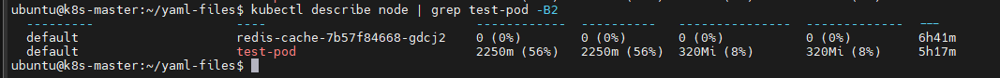

# Pod Overhead

Khi ta chạy pod trên node, chính pod sẽ chiếm 1 lượng tài nguyên hệ thống. Lượng tài nguyên bị chiếm này sẽ được cộng với các tài nguyên cần thiết để chạy (các) container bên trong Pod. **Pod Overhead** là một tính năng để hạch toán các tài nguyên được sử dụng bởi hạ tầng Pod trên nền của các yêu cầu (request) & giới hạn (limit) của container.

Trong K8s, Pod overhead (chi phí hoạt động của pod) được thiết lập tại thời điểm đăng ký tùy theo chi phí (overhead) liên kết với RuntimeClass của Pod

Khi Pod Overhead được bật, chi phí (overhead) sẽ được cộng thêm vào ngoài tổng số yêu cầu tài nguyên của container khi lập lịch cho pod. Tương tự, Kubelet sẽ bao gồm Pod overhead khi xác định kích thước Pod cgroup và khi thực hiện xếp hạng thu hồi/trục xuất Pod

## Kích hoạt Pod Overhead

Ta cần đảm bảo rằng [feature gate](https://kubernetes.io/docs/reference/command-line-tools-reference/feature-gates/) ```PodOverhead``` được bật (theo mặc định từ 1.18) trên cluster và ```RuntimeClass``` được sử dụng để định nghĩa trường ```overhead```

## Ví dụ sử dụng

Để sử dụng tính năng PodOverhead, ta cần một RuntimeClass có định nghĩa trường ```overhead```. Ví dụ, ta có thể sử dụng định nghĩa RuntimeClass sau đây với container runtime ảo hóa sử dụng khoảng ```120MiB``` mỗi Pod cho máy ảo và HĐH khách (guest):

```sh
kind: RuntimeClass
apiVersion: node.k8s.io/v1
metadata:
    name: kata-fc
handler: kata-fc
overhead:
    podFixed:
        memory: "120Mi"
        cpu: "250m"
```

Các workload (cụ thể là pod) được tạo ra có tham chiếu đến RuntimeClass handler ```kata-fc``` sẽ tính đến các chi phí (overhead) bộ nhớ và cpi khi tính toán quota tài nguyên, lập lịch node cũng như xác định kích thước pod cgroup

Ví dụ ```test-pod``` bên dưới tham chiếu đến ```kata-fc``` runtimeClass ở trên

```sh
apiVersion: v1
kind: Pod
metadata:
  name: test-pod
spec:
  runtimeClassName: kata-fc
  containers:
  - name: busybox-ctr
    image: busybox
    stdin: true
    tty: true
    resources:
      limits:
        cpu: 500m
        memory: 100Mi
  - name: nginx-ctr
    image: nginx
    resources:
      limits:
        cpu: 1500m
        memory: 100Mi
```

Tại thời điểm đăng ký, RuntimeClass admission controller cập nhật PodSpec của workload để bao gồm cả ```overhead``` như được mô tả trong RuntimeClass. Nếu PodSpec đã có định nghĩa trường này (```overhead```) thì pod sẽ bị từ chối (do bị mâu thuẫn?). Trong ví dụ trên, do ta chỉ tham thiếu đến tên RuntimeClass ```kata-fc``` nên admission controller sẽ sửa đổi Pod để thêm vào trường ```overhead```

Sau khi RuntimeClass admission controller chỉnh sửa đặc tả Pod, ta có thể kiểm tra cập nhật

```sh
kubectl get pod test-pod -o jsonpath='{.spec.overhead}'
```

Đầu ra sẽ có dạng

```sh
{"cpu":"250m","memory":"120Mi"}
```

Nếu ta có định nghĩa ResourceQuota thì tổng yêu cầu của các container cũng như ```overhead``` sẽ được tính đến

Khi kube-scheduler quyết định node nào sẽ chạy pod mới, nó sẽ xem xét ```overhead``` của các container trong đó. Trong ví dụ trên, scheduler sẽ cộng các yêu cầu và overhead lại, sau đó tìm một node có sẵn ```2,25``` CPU (250m + 500m + 1500m) và 320 MiB (120Mi + 100Mi + 100Mi) bộ nhớ để chạy Pod.

Khi một Pod được lập lịch tới một node, kubelet trên node đó sẽ tạo một cgroup mới cho Pod. Chính bên trong Pod này, container runtime bên dưới sẽ tạo ra các container cho Pod.

Nếu tài nguyên có 1 giới hạn (limit) được định nghĩa cho mỗi container (Guaranteed QoS hoặc Burstable QoS với các giới hạn được xác định), kubelet sẽ thiết lập giới hạn trên cho cgroup của pod được liên kết với tài nguyên đó (```cpu.cfs_quota_us``` cho CPU và ```memory.limit_in_bytes``` cho bộ nhớ). Giới hạn trên này dựa trên tổng các giới hạn của các container cộng với ```overhead``` được định nghĩa trong PodSpec.

Đối với CPU, nếu Pod là *Guaranteed QoS* hoặc *Burstable QoS*, kubelet sẽ thiết lập ```cpu.shares``` dựa trên tổng số yêu cầu của container cộng với ```overhead``` được xác định trong PodSpec.

Xem lại ví dụ trên, kiểm tra các yêu cầu của container cho workload:

```sh
kubectl get pod test-pod -o jsonpath='{.spec.containers[*].resources.limits}'
```

Ta được kết quả với tổng số yêu cầu là ```2000m``` CPU và ```20MiB``` bộ nhớ:

```sh
{"cpu":"500m","memory":"100Mi"} {"cpu":"1500m","memory":"100Mi"}
```

Kiểm tra cái này so với những gì được quan sát bởi node:

```sh
kubectl describe node | grep test-pod -B2
```

Đầu ra cho thấy ```2250m``` CPU và ```320MiB``` bộ nhớ được yêu cầu, bao gồm cả PodOverhead



## Khả năng quan sát

```kube_pod_overhead``` metric là số liệu có sẵn trong ```kube-state-metrics``` để giúp xác định khi nào PodOverhead được sử dụng và để giúp quan sát sự ổn định của workload đang chạy với một Overhead được xác định trước. Chức năng này không có sẵn trong phiên bản 1.9 của kube-state-metrics nhưng dự kiến được phát hành trong bản tiếp theo. Người dùng sẽ cần xây dựng các kube-state-metrics từ người tại thời điểm này.