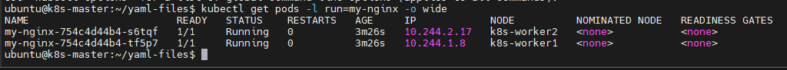
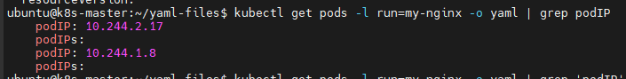
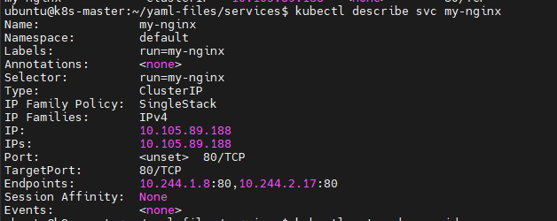
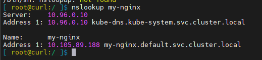

# Kết nối Ứng dụng với Service

## Mô hình K8s để kết nối các Container

Giả sử ta đã có 1 ứng dụng chạy liên tục đã được nhân rộng và ta muốn expose nó ra network. Trước khi trao đổi về cách tiếp cận của K8s về Networking, ta cần xem lại cách làm việc thông thường của Networking trong Docker.

Mặc định, Docker sử dụng **host-private networking** (mạng của máy host), nên các container chỉ có thể giao tiếp được với nhau nếu tất cả đều ở trên cùng 1 máy. Để cho các container có thể giao tiếp trên các node khác nhau, chúng phải được gán Port trên địa chỉ IP của node thì mới được forward (chuyển tiếp) hoặc proxy đến container. Điều này rõ ràng có nghĩa là các container phải phối hợp (điều phối) với nhau để xác định port nó sử dụng một cách cẩn thận hoặc port có thể được gán tự động (để giảm thiểu rủi ro xung đột so với gán thủ công).

Việc điều phối các port giữa nhiều developer hoặc nhiều team là rất khó trong phạm vi lớn và khiến cho user dễ gặp các vấn đề liên quan đến cluster nằm ngoài khả năng kiểm soát của họ. K8s giả định rằng các pod có thể giao tiếp được với nhau mà không cần quan tâm đang chạy trên host nào. K8s gán cho mọi pod địa chỉ IP dùng riêng cho cluster nên ta không cần phải tạo kết nối giữa các pod hay ánh xạ port của container với port của máy host. Điều này có nghĩa là các container bên trong 1 pod đều có thể giao tiếp được với các port của nhau trên localhost và tất cả các pod trong 1 cluster có thể thấy nhau mà không cần NAT.

Phần còn lại của bài viết này sẽ trình bày về cách ta có thể chạy các services đáng tin cậy trên mô hình network như vậy.

## Expose pod ra cluster

Chúng ta đã thực hiện việc này trong các ví dụ trước nhưng giờ ta làm lại và tập trung vào khía cạnh networking. Tạo 1 nginx pod và lưu ý rằng nó có đặc tả cho port của container.

```sh
apiVersion: apps/v1
kind: Deployment
metadata:
  name: my-nginx
spec:
  selector:
    matchLabels:
      run: my-nginx
  replicas: 2
  template:
    metadata:
      labels:
        run: my-nginx
    spec:
      containers:
      - name: my-nginx
        image: nginx
        ports:
        - containerPort: 80
```

```sh
kubectl get pods -l run=my-nginx -o wide
```



```sh
kubectl get pods -l run=my-nginx -o yaml | grep podIP
```



Ta có thể SSH vào bên trong bất kỳ node nào trong cluster và chạy lệnh ```curl``` cả 2 địa chỉ IP trên.

Lưu ý rằng các container không sử dụng port 80 của node cũng như không có bất kỳ NAT rule đặc biệt nào để route traffic đến Pod. Điều này có nghĩa là ta có thể chạy nhiều nginx pod trên cùng 1 node, tất cả đều sử dụng cùng ```containerPort``` và truy cập chúng từ bất kỳ pod hoặc node nào trong cluster bằng cách sử dụng địa chỉ IP. Cũng giống như Docker, các port có thể được công khai (publish) ra cho interface của máy host (Node) nhưng nhu cầu như vậy đã không còn cần thiết nữa vì mô hình networking của K8s đã đủ đáp ứng hầu hết các nhu cầu.

## Tạo Service

Như vậy là ta đã có các pod chạy nginx trong 1 không gian địa chỉ phẳng (flat), trên toàn cluster. Theo lý thuyết, ta có thể nói chuyện trực tiếp với các Pod này nhưng điều gì sẽ xảy ra khi 1 Node die? Các pod cũng sẽ bị die theo và Deployment sẽ tạo ra các Pod mới có địa chỉ IP khác. Đây chính là vấn đề mà Services sẽ giải quyết.

Một Service trong K8s là 1 khái niệm trừu tượng định nghĩa 1 tập các pod logic chạy ở đâu đó trong cluster, tất cả đều cung cấp cùng 1 chức năng giống nhau. Khi được tạo ra, mỗi Service sẽ được gán 1 IP duy nhất (gọi là ```clusterIP```). Địa chỉ IP này sẽ được gắn liền với vòng đời của Service và sẽ không thay đổi khi Services vẫn còn sống. Các Pod có thể được cấu hình để giao tiếp với Services và biết được kết nối đến Services sẽ được tự động cân bằng tải đến 1 pod nào đó là thành viên của Services.

Ta có thể tạo 1 Services cho 2 bản sao nginx ở trên bằng lệnh ```kubectl expose```:

```sh
kubectl expose deployment/my-nginx
```

Hoặc expose bằng cách tạo Service như sau:

```sh
apiVersion: v1
kind: Service
metadata:
  name: my-nginx
  labels:
    run: my-nginx
spec:
  ports:
  - port: 80
    protocol: TCP
  selector:
    run: my-nginx
```

Đặc tả trên sẽ tạo ra 1 Services nhắm đến mục tiêu là port TCP 80 trên bất kỳ pod nào có label là ```run: my-nginx``` và expose nó ra trên 1 Services Port (```targetPort```: là port của container tiếp nhận traffic, trong khi ```port```: là port của Service, có thể là bất kỳ port nào để các pod khác sử dụng khi muốn truy cập đến Services)

Như đã đề cập trước đây, 1 Services được chống lưng bởi 1 nhóm các pod, các pod này được expose thông qua ```endpoints``` (của service). Selector của Services sẽ đánh giá liên tục (kiểm tra, dò quét các Pod hiện có và mới thêm, bị xóa bớt,...) và kết quả sẽ được ```POST``` đến 1 Endpoint object (cũng có tên là ```my-nginx```, endpoint object này được tự động tạo ra khi tạo Service vì Service quản lý các endpoint). Khi 1 pod die, nó sẽ tự động bị xóa khỏi Endpoint và Pod mới khớp với Selector của Services sẽ được tự động thêm vào Endpoint.

Kiểm tra các endpoint và lưu ý rằng địa chỉ IP là trùng với Pod được tạo ra ở bước trước

```sh
kubectl describe svc my-nginx
```



Xem endpoint:

```sh
kubectl get ep my-nginx
```

Đầu ra có dạng:

```sh
NAME       ENDPOINTS                      AGE
my-nginx   10.244.1.8:80,10.244.2.17:80   15m
```

## Truy cập đến Service

K8s hỗ trợ 2 chế độ (mode) chính cho việc tìm kiếm Services: **biến môi trường** và **DNS**. Biến môi trường hoạt động được liền còn DNS thì cần phải cài thêm **CoreDNS addon** (được cài mặc định khi triển khai k8s v1.26 bằng kubeadm).

Nếu không muốn sử dụng biến môi trường và chỉ muốn dùng DNS thì ta có thể đặt thuộc tính ```enableServiceLinks``` thành ```false```

### 1. Biến môi trường

Khi 1 pod chạy trong 1 node, kubelet sẽ thêm vào 1 tập các biến môi trường cho mỗi Service đang hoạt động (active). Điều này gây ra vấn đề về thứ tự (**ordering problem**: service có trước hay replica có trước?). Để biết tạo sao, ta kiểm tra môi trường của các nginx pod trong ví dụ trước

```sh
kubectl exec my-nginx-754c4d44b4-s6tqf -- printenv | grep SERVICE
```

Kết quả có dạng:

```sh
MY_SERVICE_PORT=tcp://10.100.83.6:80
MY_SERVICE_PORT_80_TCP_PROTO=tcp
KUBERNETES_SERVICE_HOST=10.96.0.1
KUBERNETES_SERVICE_PORT=443
MY_SERVICE_SERVICE_HOST=10.100.83.6
APACHE2_SERVICE_PORT=5555
MY_SERVICE_SERVICE_PORT=80
MY_SERVICE_PORT_80_TCP=tcp://10.100.83.6:80
KUBERNETES_SERVICE_PORT_HTTPS=443
MY_SERVICE_PORT_80_TCP_PORT=80
MY_SERVICE_PORT_80_TCP_ADDR=10.100.83.6
APACHE2_SERVICE_HOST=10.110.187.74
```

Các thông tin về Services mà ta tạo ở phần bên trên không hề xuất hiện ở trong những biến môi trường kia. Đó là bởi vì ta đã tạo ra các replicas trước khi tạo ra Services. Một điểm bất lợi khác của cách này (tạo replicas trước khi tạo services) là Scheduler **có thể** đặt cả 2 Pod trên cùng 1 máy, sẽ làm cho toàn bộ dịch vụ bị die nếu máy die.

Ta có thể thực hiện đúng bằng cách kill cả 2 pod và đợi cho Deployment tái tạo lại. Lần này thì Services sẽ tồn tại trước các replicas. Cách này (tạo service trước khi tạo replicas) cho phép trải rộng các pod của Service ra ở cấp độ Scheduler (nghĩa là Scheduler sẽ đặt các Pod trên các máy khác nhau nếu cấu hình đúng) đồng thời đảm bảo các biến môi trường là chính xác:

```sh
kubectl scale deployment my-nginx --replicas=0
kubectl scale deployment my-nginx --replicas=2
```

```sh
kubectl exec my-nginx-754c4d44b4-q2z5z -- printenv | grep SERVICE
```

Đầu ra:

```sh
MY_NGINX_SERVICE_HOST=10.105.89.188
KUBERNETES_SERVICE_PORT_HTTPS=443
KUBERNETES_SERVICE_HOST=10.96.0.1
MY_NGINX_SERVICE_PORT=80
KUBERNETES_SERVICE_PORT=443
```

### 2. DNS

K8s cung cấp 1 addon DNS service cho cluster để tự động gán tên DNS cho các Services. Ta có thể kiểm tra xem nó đã chạy trên cluster:

```sh
kubectl get services kube-dns --namespace=kube-system
```


Phần còn lại của phần này sẽ giả định rằng ta có 1 Service với địa chỉ IP cố định (```my-nginx```) và DNS Server đã gán tên cho IP đó. Ở đây, ta sử dụng addon CoreDNS cho cluster (tên ứng dụng là ```kube-dns```), do đó ta có thể giao tiếp với Service từ bất kỳ Pod nào trong cluster bằng các phương thức chuẩn (ví dụ: ```gethostbyname()```). Nếu CoreDNS không chạy, ta có thể kích hoạt nó bằng cách tham khảo [CoreDNS Installation](https://kubernetes.io/docs/tasks/administer-cluster/coredns/#installing-coredns)

Hãy chạy ứng dụng ```curl``` để test:

```sh
kubectl run curl --image=radial/busyboxplus:curl -i --tty
```

Sau đó chạy lệnh ```nslookup my-nginx```



## Bảo mật Service

Đến giờ thì ta chỉ truy cập được nginx server từ bên trong cluster. Trước khi expose Services ra internet, ta cần phải đảm bảo các kênh giao tiếp là an toàn. Để đạt được điều này, ta cần:
- Một Self-signed certificates cho HTTPS
- Một nginx server được cấu hình để sử dụng certificate đó
- Một ```Secret``` để làm cho certificate đó có thể truy cập bởi các Pod

Ta sử dụng các lệnh sau để tạo cert và key

```sh
# Tạo cặp key public-private
openssl req -x509 -nodes -days 365 -newkey rsa:2048 -keyout /tmp/nginx.key -out /tmp/nginx.crt -subj "/CN=my-nginx/O=my-nginx"
# Chuyển key thành dạng mã hóa base64
cat /tmp/nginx.crt | base64
cat /tmp/nginx.key | base64
```

**Lưu ý:** Nếu bị lỗi **Can't load /root/.rnd into RNG** thì ta vào file ```/etc/ssl/openssl.cnf``` và comment dòng ```RANDFILE               = $ENV::HOME``` lại.

Sử dụng đầu ra từ các lệnh bên trên để tạo file yaml như sau (giá trị mã hóa base64 phải đặt trên 1 dòng):

```sh
apiVersion: "v1"
kind: "Secret"
metadata:
  name: "nginxsecret"
  namespace: "default"
type: kubernetes.io/tls
data:
  tls.crt: <cert_base64>
  tls.key: <key_base64>
```

```sh
kubectl apply -f nginxsecrets.yaml
```

Tạo file config cho nginx để sử dụng SSL

```sh
cat << EOF > default.conf
server {
        listen 80 default_server;
        listen [::]:80 default_server ipv6only=on;

        listen 443 ssl;

        root /usr/share/nginx/html;
        index index.html;

        server_name localhost;
        ssl_certificate /etc/nginx/ssl/tls.crt;
        ssl_certificate_key /etc/nginx/ssl/tls.key;

        location / {
                try_files $uri $uri/ =404;
        }
}
EOF
```

Tạo configmap để mount vào container

```sh
kubectl create configmap nginxconfigmap --from-file=default.conf
```

Giờ ta chỉnh sửa các nginx replicas để khởi động https server sử dụng certificate trong Secret và Services để expose ra cả 2 port 80 và 443:

```sh
apiVersion: v1
kind: Service
metadata:
  name: my-nginx
  labels:
    run: my-nginx
spec:
  type: NodePort
  ports:
  - port: 8080
    targetPort: 80
    protocol: TCP
    name: http
  - port: 443
    protocol: TCP
    name: https
  selector:
    run: my-nginx
---
apiVersion: apps/v1
kind: Deployment
metadata:
  name: my-nginx
spec:
  selector:
    matchLabels:
      run: my-nginx
  replicas: 1
  template:
    metadata:
      labels:
        run: my-nginx
    spec:
      volumes:
      - name: secret-volume
        secret:
          secretName: nginxsecret
      - name: configmap-volume
        configMap:
          name: nginxconfigmap
      containers:
      - name: nginxhttps
        image: bprashanth/nginxhttps:1.0
        ports:
        - containerPort: 443
        - containerPort: 80
        volumeMounts:
        - mountPath: /etc/nginx/ssl
          name: secret-volume
        - mountPath: /etc/nginx/conf.d
          name: configmap-volume
```

```sh
kubectl apply -f nginx-secure-app.yaml
```

Các điểm cần lưu ý trong file yaml trên:
- Nó chứa đặc tả cho cả Deployment và Services
- Nginx server có http traffic trên cổng 80 và https trên cổng 443 và nginx services expose cả 2 port này
- Mỗi container truy cập vào key thông qua 1 volume được mount tại ```/etc/nginx/ssl```. Đây là thiết lập trước khi nginx server khởi động.

Tại thời điểm này, ta có thể kết nối đến nginx server từ bất kỳ node nào:

```sh
kubectl get pods -l run=my-nginx -o yaml | grep -i podIP
```

```sh
curl -k https://10.244.1.15
```

Lưu ý tham số ```-k``` trong lệnh curl, do ta không biết bất kỳ điều gì về các pod đang chạy nginx tại thời điểm sinh ra certificate nên ta cần phải báo cho curl bỏ qua trường hợp CNAME không khớp (mismatch). Bằng cách tạo 1 Services, chúng ta link CNAME được sử dụng trong certificate với tên DNS thật sự được sử dụng bởi các pod trong quá trình tìm kiếm Services. Giờ ta test từ 1 pod (để đơn giản ta sử dụng lại Secret, pod chỉ cần sử dụng file ```nginx.crt``` để truy cập đến Services)

```sh
apiVersion: apps/v1
kind: Deployment
metadata:
  name: curl-deployment
spec:
  selector:
    matchLabels:
      app: curlpod
  replicas: 1
  template:
    metadata:
      labels:
        app: curlpod
    spec:
      volumes:
      - name: secret-volume
        secret:
          secretName: nginxsecret
      containers:
      - name: curlpod
        command:
        - sh
        - -c
        - while true; do sleep 1; done
        image: radial/busyboxplus:curl
        volumeMounts:
        - mountPath: /etc/nginx/ssl
          name: secret-volume
```

```sh
kubectl apply -f ./curlpod.yaml
kubectl get pods -l app=curlpod
```

```sh
kubectl exec curl-deployment-1515033274-1410r -- curl https://my-nginx --cacert /etc/nginx/ssl/tls.crt
```

## Expose Service

Với 1 số phần của ứng dụng, ta có thể muốn expose 1 Services ra 1 địa chỉ IP bên ngoài. K8s hỗ trợ 2 cách: ```NodePort``` và ```LoadBalaner```. Service đã tạo ra trong phần trước sử dụng ```NodePort``` vì vậy bản sao nginx https đã có thể phục vụ internet nếu node của ta có thêm 1 địa chỉ IP public

```sh
kubectl get svc my-nginx -o yaml | grep nodePort -C 5
```

Đầu ra:

```sh
  ipFamilies:
  - IPv4
  ipFamilyPolicy: SingleStack
  ports:
  - name: http
    nodePort: 32546
    port: 8080
    protocol: TCP
    targetPort: 80
  - name: https
    nodePort: 31753
    port: 443
    protocol: TCP
    targetPort: 443
  selector:
    run: my-nginx
```

Bây giờ ta tạo lại Services sử dụng cloud LoadBalaner bằng cách thay đổi trường ```Type``` trong đặc tả của service ```my-nginx``` từ ```NodePort``` thành ```LoadBalaner```

```sh
kubectl edit svc my-nginx
kubectl get svc my-nginx
```