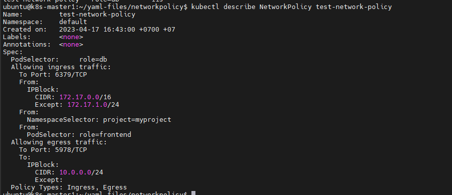

# Chính sách Network

Network policy (chính sách mạng) là 1 đặc tả về cách nhóm các pod được phép giao tiếp với nhau và với network endpoint khác.

Tài nguyên ```NetworkPolicy``` sử dụng label để lựa chọn các pod và định nghĩa các rule để xác định traffic nào được cho phép đi đến các pod được lựa chọn đó.

## Prerequisite

Chính sách Network được triển khai bởi network plugin. Vì vậy ta cần phải sử dụng 1 giải pháp mạng có hỗ trợ ```NetworkPolicy```. Việc chỉ tạo ra tài nguyên ```NetworkPolicy``` mà không có 1 controller nào để triển khai nó sẽ không có tác dụng nào.

## Các Pod bị cô lập và không bị cô lập

Theo mặc định, các pod là không bị cô lập (non-isolated), chúng chấp nhận traffic từ bất kỳ nguồn nào.

Các pod bị cô lập (isolated) bằng cách có 1 ```NetworkPolicy``` lựa chọn chúng. Khi có bất kỳ ```NetworkPolicy``` nào trong 1 namespace lựa chọn 1 pod nào đó, pod đó sẽ từ chối bất kỳ kết nối nào không được cho phép bởi NetworkPolicy đó. (Các pod khác trong namespace không được lựa chọn bởi bất kỳ NetworkPolicy nào sẽ tiếp tục chấp nhận tất cả traffic).

Các chính sách network không xung đột, chúng là hỗ trợ cho nhau. Nếu bất kỳ chính sách nào (hoặc nhiều chính sách cùng) lựa chọn 1 pod thì pod đó sẽ bị giới hạn bởi những gì được cho phép bởi tổ hợp các quy tắc in/out (ingress/egress rule) của các chính sách đó. Do vậy, thứ tự đánh giá không ảnh hưởng đến kết quả của chính sách.

## Tài nguyên ```NetworkPolicy```

Ví dụ về 1 NetworkPolicy như sau:

```sh
apiVersion: networking.k8s.io/v1
kind: NetworkPolicy
metadata:
  name: test-network-policy
  namespace: default
spec:
  podSelector:
    matchLabels:
      role: db
  policyTypes:
  - Ingress
  - Egress
  ingress:
  - from:
    - ipBlock:
        cidr: 172.17.0.0/16
        except:
        - 172.17.1.0/24
    - namespaceSelector:
        matchLabels:
          project: myproject
    - podSelector:
        matchLabels:
          role: frontend
    ports:
    - protocol: TCP
      port: 6379
  egress:
  - to:
    - ipBlock:
        cidr: 10.0.0.0/24
    ports:
    - protocol: TCP
      port: 5978
```

Giải thích:
- **Các trường bắt buộc:** Giống như các cấu hình K8s khác, NetworkPolicy cần các trường ```apiVersion```, ```kind```, và ```metadata```. Để biết thông tin tổng quan về cách làm việc với file cấu hình
- **spec:** Đặc tả của NetworkPolicy chứa tất cả thông tin cần thiết để định nghĩa NetworkPolicy trong namespace.
- **podSelector:** Mỗi NetworkPolicy bao gồm 1 ```podSelector``` để lựa chọn nhóm các pod để áp dụng các policy. Ví dụ trên sẽ lựa chọn các pod có label ```role=db```. Một ```podSelector``` rỗng sẽ lựa chọn tất cả các pod trong namespace.
- **policyTypes:** Mỗi NetworkPolicy bao gồm 1 danh sách ```policyTypes``` có thể là ```Ingress```, ```Egress``` hoặc cả 2. Trường ```policyTypes``` cho biết 1 policy nào đó sẽ được áp dụng cho các traffic ingress hoặc các traffic egress hoặc cả 2. Nếu không chỉ định giá trị cho trường ```policyTypes``` trong 1 NetworkPolicy thì mặc định ```Ingress``` sẽ luôn luôn được thiết lập và ```Egress``` sẽ chỉ được thiết lập nếu NetworkPolicy có bất kỳ ```egress``` rule nào.
- **ingress:** Mỗi NetworkPolicy có thể bao gồm 1 danh sách các ```ingress``` rules được cho phép. Mỗi rule cho phép traffic khớp nội dung của cả 2 trường ```from``` và ```port``` sẽ được đi qua. Policy trong ví dụ trên chỉ chứa 1 rule sẽ khớp với traffic trên port tcp 6379 đến từ 1 trong 3 nguồn. Nguồn đầu tiên được xác định thông qua ```ipBlock```, nguồn thứ 2 thông qua ```namespaceSelector```, nguồn thứ 3 thông qua ```podSelector```.
- **egress:** Mỗi NetworkPolicy có thể bao gồm 1 danh sách các ```egress``` rules được cho phép. Mỗi rule cho phép traffic khớp cả 2 trường ```to``` và ```port``` được đi qua. Policy trong ví dụ trên chỉ chứa 1 rule sẽ khớp với traffic trên port tcp 5978 đi ra bất kỳ đích nào trong dãy ```10.0.0.0/24```

Vì vậy, ý nghĩa của file cấu hình trên sẽ là:
- Cô lập các pod có label ```role=db``` trong namepsace ```default``` cho cả ingress và egress traffic (nếu chúng chưa được cách ly)
- Các ingress rule sẽ cho phép các kết nối đi đến tất cả các pod trong namespace ```default``` với label ```role=db``` trên cổng TCP 6379 từ:
   - Bất kỳ pod nào trong namespace ```default``` có label ```role=frontend```
   - Bất kỳ pod nào trong namespace có label ```project=myproject```
   - Các địa chỉ IP trong dãy ```172.17.0.0-172.17.0.255``` và ```172.17.2.0-172.17.255.255``` (nghĩa là tất cả IP trong ```172.17.0.0/16``` ngoại trừ ```172.17.1.0/24```)
- Các Egress rule cho phép kết nối từ bất kỳ pod nào trong namespace ```default``` với label ```role=db``` đi đến CIDR 10.0.0.0/24``` trên cổng TCP 5978

## Hành vi của ```to``` và ```from``` selector

Có 4 loại Selector có thể được sử dụng trong ```ingress``` ```from``` hoặc ```egress``` ```to```:
- **podSelector:** sẽ lựa chọn các pod cụ thể trong cùng namespace với ```NetworkPolicy``` và sẽ được cho phép như là nguồn của ```ingress``` hoặc đích của ```egress```.
- **namespaceSelector:** sẽ lựa chọn namespace trong đó tất cả các pod sẽ được cho phép như là nguồn của ```ingress``` hoặc đích của ```egress```
- **namespaceSelector** và **podSelector**: 1 mục ```to```/```from``` có thể có cả 2 thuộc tính này để lựa chọn 1 pod bên trong 1 namespace nào đó. Cần cẩn thận khi sử dụng policy này với cú pháp yaml cho chính xác.

VD:

```sh
ingress:
- from:
  - namespaceSelector:
      matchLabels:
        user: alice
    podSelector:
      matchLabels:
        role: client
```

Ví dụ trên chỉ có 1 thành phần ```from``` (1 dấu gạch đầu dòng) cho phép các kết nối từ các pod trong label ```role=client``` trong namespace với label ```user=alice```. Tuy nhiên policy dưới đây:

```sh
ingress:
- from:
  - namespaceSelector:
      matchLabels:
        user: alice
  - podSelector:
      matchLabels:
        role: client
```

Policy trên chứa 2 thành phần (2 dấu gạch đầu dòng) trong nội dung của ```from```, cho phép các kết nối từ các pod với label ```role=client``` trong local namespace (cùng namespace với NetworkPolicy) hoặc từ bất kỳ pod nào trong namespace ```user=alice```. Ta có thể sử dụng ```kubectl describe``` để thấy cách K8s diễn giải policy



- **ipBlock:** sẽ lựa chọn 1 dãy các IP CIDR để cho phép như là nguồn của Ingress hoặc đích của Egress. Các địa chỉ IP này thường là các địa chỉ IP bên ngoài cluster vì các địa chỉ IP của pod là tạm thời và không thể đoán được.

Cơ chế Ingress và Egress của cluster thường yêu cầu **re-write** địa chỉ IP nguồn hoặc đích của gói tin. Trong trường hợp điều này xảy ra, K8s không định nghĩa nó sẽ xảy ra trước hay sau khi xử lý NetworkPolicy và có thể hoạt động khác nhau đối với các kết hợp khác nhau của network plugin, nhà cung cấp đám mây hoặc cách triển khai Services,...

Trong trường hợp của Ingress, điều này có nghĩa là trong một số trường hợp ta có thể lọc gói tin đi vào dựa trên địa chỉ IP gốc thật sự trong khi với các trường hợp khác thì "IP nguồn" mà NetworkPolicy thao tác có thể là địa chỉ IP của ```LoadBalancer``` hoặc IP của Node (mà pod đang chạy),...

Đối với Egress, điều này có nghĩa là các kết nối từ các pod đến địa chỉ IP của Services sẽ được rewrite lại thành địa chỉ IP bên ngoài cluster có thể hoặc không phải tuân theo các chính sách dựa trên ```ipBlock```

## Chính sách mặc định

Mặc định, nếu không có policy nào tồn tại trong namespace thì tất cả các Ingress và Egress traffic đều được cho phép đi vào và ra khỏi Pod trong namespace đó. Ví dụ sau cho phép ta thay đổi chính sách mặc định trong namespace đó

### 1. Mặc định cấm tất cả Ingress traffic

Ta có thể tạo ra 1 policy cô lập "default" cho 1 namespace bằng cách tạo ra 1 ```NetworkPolicy``` để lựa chọn tất cả pod nhưng không cho phép bất kỳ Ingress traffic nào đi đến pod đó.

```sh
apiVersion: networking.k8s.io/v1
kind: NetworkPolicy
metadata:
  name: default-deny-ingress
spec:
  podSelector: {}
  policyTypes:
  - Ingress
```

Cấu hình trên dảm bảo rằng thậm chí các pod không được lựa chọn bởi bất kỳ NetworkPolicy nào khác cũng sẽ bị cô lập (nghĩa là cấm các traffic đi đến pod). Policy trên không thay đổi hành vi cô lập mặc định của egress traffic.

### 2. Mặc định cho phép tất cả Ingress traffic

Nếu ta muốn cho phép tất cả traffic đi đến tất cả các pod trong 1 namespace (thậm chí nếu có các policy đã được thêm vào làm cho một số pod bị đối xử như là "bị cô lập"), ta có thể tạo ra 1 policy để cho phép tất cả traffic trong namespace đó.

```sh
apiVersion: networking.k8s.io/v1
kind: NetworkPolicy
metadata:
  name: allow-all-ingress
spec:
  podSelector: {}
  ingress:
  - {}
  policyTypes:
  - Ingress
```

### 3. Mặc định cấm tất cả Egress traffic

Ta có thể tạo ra 1 policy cô lập Egress mặc định cho 1 namespace bằng cách tạo ra 1 NetworkPolicy lựa chọn tất cả các pod nhưng không cho phép bất kỳ egress traffic nào đi ra từ các pod này.

```sh
apiVersion: networking.k8s.io/v1
kind: NetworkPolicy
metadata:
  name: default-deny-egress
spec:
  podSelector: {}
  policyTypes:
  - Egress
```

Cấu hình trên đảm bảo rằng thậm chí các pod không được lựa chọn bởi bất kỳ NetworkPolicy nào khác cũng sẽ bị cấm các Egress traffic. Policy trên không thay đổi hành vi cô lập mặc định của ingress traffic.

### 4. Mặc định cho phép tất cả Egress traffic

Nếu ta cho phép tất cả traffic đi ra từ tất cả các pod trong 1 namespace (thậm chí nếu có các policy đã được thêm vào làm cho một số pod bị đối xử như là "bị cô lập"), ta có thể tạo ra 1 policy để cho phép tất cả egress traffic trong namespace đó:

```sh
apiVersion: networking.k8s.io/v1
kind: NetworkPolicy
metadata:
  name: allow-all-egress
spec:
  podSelector: {}
  egress:
  - {}
  policyTypes:
  - Egress
```

### 5. Mặc định cấm tất cả Ingress và Egress trafic

Ta có thể tạo ra 1 default policy cho 1 namespace để ngăn tất cả Ingress và Egress traffic bằng cách tạo ra NetworkPolicy sau trong namespace đó:

```sh
apiVersion: networking.k8s.io/v1
kind: NetworkPolicy
metadata:
  name: default-deny-all
spec:
  podSelector: {}
  policyTypes:
  - Ingress
  - Egress
```

Cấu hình trên đảm bảo rằng thậm chí các pod không được lựa chọn bởi bất kỳ NetworkPolicy nào khác cũng sẽ không được cho phép Ingress và Egress traffic.