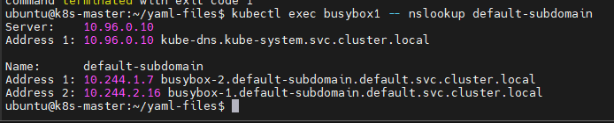

# DNS cho Services và Pods

Chức năng DNS trong K8s sẽ lập lịch để chạy pod (gọi là **DNS Pod** để thực hiện chức năng DNS) và Service (gọi là **DNS Service** để cung cấp dịch vụ DNS cho cluster) trên cluster, đồng thời cấu hình kubelet để báo cho các container (của các pod khác) sử dụng địa chỉ IP của DNS Services khi muốn phân giải tên DNS.

### 1. Ai nhận được tên DNS?

Mọi Services được định nghĩa trong cluster (bao gồm cả chính DNS Server) được gán 1 tên DNS. Mặc định, danh sách tìm kiếm DNS của client Pod sẽ bao gồm namespace của chính client pod và domain mặc định của cluster.

Ví dụ giả sử 1 Services tên là ```foo``` trong namespace ```bar```. Các Pod đang chạy trong namespace ```bar``` có thể tìm kiếm Services này đơn giản bằng cách thực hiện 1 truy vấn DNS cho ```foo```. Các pod khác đang chạy trong namespace khác có thể tìm kiếm Services này bằng cách thực hiện truy vấn DNS ```foo.bar```

Chi tiết trong phần bên dưới sẽ giải thích các loại record và layout được hỗ trợ. Bất kỳ layout hoặc tên truy vấn (query) nào xảy ra được xem là cài đặt chi tiết cho DNS và có thể thay đổi mà không cảnh báo.

## Services

### 1. A/AAAA records

Một **"normal"** (không phải headless) Services sẽ được gán 1 DNS A hoặc AAAA record (tùy thuộc vào IPv4 hay IPv6) cho tên (name) theo định dạng ```my-svc.my-namespace.svc.cluster-domain.example```. Nó sẽ phân giải thành cluster IP của Services.

**"Headless"** (không có cluster IP) Services cũng sẽ được gán 1 DNS A hoặc AAAA record (tùy vào IPv4 và IPv6) cho tên (name) theo định dạng ```my-svc.my-namespace.svc.cluster-domain.example```. Tuy nhiên, không giống như Normal Services, nó sẽ phân giải thành 1 tập các địa chỉ IP của các Pod được lựa chọn bởi Services. Các client được mong đợi sẽ sử dụng tập kết quả này theo thuật toán **round-robin** chuẩn để lựa chọn.

### 2. SRV records

SRV Records được tạo ra cho **named Port** (port được đặt tên), nó là 1 phần của **Normal** hoặc **Headless Services**:
- Đối với mỗi named port thì SRV record sẽ có định dạng ```_my-port-name._my-port-protocol.my-svc.my-namespace.svc.cluster-domain.example```
- Đối với 1 Services thông thường, nó sẽ phân giải thành Port number và domain name: ```my-svc.my-namespace.svc.cluster-domain.example```
- Đối với Headless Services, nó sẽ phân giải thành nhiều kết quả, mỗi kết quả cho 1 pod đứng sau Services và chứa port number cũng như tên domain của pod theo định dạng ```auto-generated-name.my-svc.my-namespace.svc.cluster-domain.example```.

## Pods

### 1. Trường hostname và subdomain của Pod

Hiện tại, khi 1 pod được tạo ra, hostname của nó chính là giá trị của trường ```metadata.name```.

Đặc tả của pod có 1 trường tùy chọn ```hostname```, cũng có thể được sử dụng để chỉ định hostname cho Pod. Khi được chỉ định thì nó sẽ ghi đè lên tên của Pod (trường ```metadata.name```) để trở thành hostname của Pod. Ví dụ 1 Pod có trường ```hostname``` được thiết lập là ```my-host``` thì hostname của Pod đó sẽ là ```my-host```.

Đặc tả của Pod cũng có 1 trường tùy chọn khác là ```subdomain``` có thể được sử dụng để chỉ định subdomain (tên miền con) của nó. Ví dụ 1 pod có trường ```hostname``` được thiết lập là ```foo``` và trường ```subdomain``` được thiết lập là ```bar``` trong namespace ```my-namespace``` sẽ có tên miền tiêu chuẩn FQDN là ```foo.bar.my-namespace.svc.cluster-domain.example```

Ví dụ:

```sh
apiVersion: v1
kind: Service
metadata:
  name: default-subdomain
spec:
  selector:
    name: busybox
  clusterIP: None
  ports:
  - name: foo
    port: 1234
    targetPort: 1234
---
apiVersion: v1
kind: Pod
metadata:
  name: busybox1
  labels:
    name: busybox
spec:
  hostname: busybox-1
  subdomain: default-subdomain
  containers:
  - image: busybox:1.28
    command:
      - sleep
      - "3600"
    name: busybox
---
apiVersion: v1
kind: Pod
metadata:
  name: busybox2
  labels:
    name: busybox
spec:
  hostname: busybox-2
  subdomain: default-subdomain
  containers:
  - image: busybox:1.28
    command:
      - sleep
      - "3600"
    name: busybox
```

Nếu có tồn tại 1 Headless Services trong cùng namespace với pod và có tên giống với tên subdomain thì DNS Server của cluster cũng sẽ trả lại 1 A hoặc AAAA record cho hostname tiêu chuẩn của pod. Ví dụ giả sử 1 pod có hostname là ```busybox-1``` và subdomain là ```default-subdomain``` và 1 Headless Services có tên là ```default-subdomain``` trong cùng namespace thì Pod sẽ thấy FQDN của chính nó là ```busybox-1.default-subdomain.my-namespace.svc.cluster-domain.example```. DNS sẽ trả lại 1 A hoặc AAAA record cho tên đó trỏ về địa chỉ IP của Pod. Cả 2 pod ```busybox1``` và ```busybox2``` đều có A hoặc AAAA record của riêng nó.

Endpoint object có thể chỉ định ```hostname``` cho bất kỳ địa chỉ endpoint nào cùng với địa chỉ IP của nó.

Ta kiểm tra FQDN của pod bằng lệnh ```kubectl exec <pod_name> -- nslookup <service_name>```

```sh
kubectl exec busybox1 -- nslookup default-subdomain
```



Kiểm tra  FQDN của service bằng lệnh ```kubectl get svc <service-name> -o jsonpath='{.spec.clusterIP}' && echo " <service-name>.<namespace>.svc.cluster.local"```

```sh
kubectl get svc default-subdomain -o jsonpath='{.spec.clusterIP}' && echo " default-subdomain.default.svc.cluster.local"
```

Đầu ra:

```sh
None default-subdomain.default.svc.cluster.local
```

### 2. DNS policy của Pod

DNS policy có thể được thiết lập cho mỗi pod. Hiện tại K8s hỗ trợ các DNS policy cho pod như bên dưới, các policy này có thể được chỉ định bằng trường ```dnsPolicy``` của đặc tả Pod.
- ```Default```: Pod thừa kế cấu hình phân giải tên từ node mà pod đang chạy.
- ```ClusterFirst```: Bất kỳ truy vấn DNS nào không khớp với hậy tố (suffix) domain của cluster đã được cấu hình, ví dụ ```www.kubernetes.io```, sẽ được chuyển tiếp (forward) cho upstream nameserver được thừa kế từ node (nghĩa là truy vấn không nằm trong cùng tên domain của cluster sẽ được chuyển dns server của node). Cluster admin có thể cấu hình thêm **stub-domain** và upstream DNS servers.
- ```ClusterFirstWithHostNet```: Đối với các pod sử dụng hostNetwork, ta có thể thiết lập DNS policy của nó thành ```ClusterFirstWithHostNet```
- ```None```: cho phép Pod bỏ qua thiết lập DNS từ K8s. Tất cả thiết lập DNS được hỗ trợ thông qua trường ```dnsConfig``` trong đặc tả của Pod.

Ví dụ: 1 pod của DNS policy được thiết lập là ```ClusterFirstWithHostNet``` bởi vì nó có trường ```hostNetwork``` được thiết lập là true

```sh
apiVersion: v1
kind: Pod
metadata:
  name: busybox
  namespace: default
spec:
  containers:
  - image: busybox:1.28
    command:
      - sleep
      - "3600"
    imagePullPolicy: IfNotPresent
    name: busybox
  restartPolicy: Always
  hostNetwork: true
  dnsPolicy: ClusterFirstWithHostNet
```

### 3. Cấu hình DNS cho Pod

Cấu hình DNS của Pod cho phép ta kiểm soát thiết lập DNS cho Pod.

Trường ```dnsConfig``` là tùy chọn và nó có thể hoạt động với bất kỳ thiết lập ```dnsPolicy``` nào. Tuy nhiên, khi trường ```dnsPolicy``` của Pod được thiết lập là ```none``` thì ta phải xác định giá trị cho trường ```dnsConfig```

Bên dưới là các thuộc tính ta có thể sử dụng cho ```dnsConfig```:
- ```nameservers```: danh sách các địa chỉ IP sẽ được sử dụng như là DNS server cho Pod. Có thể thiết lập tối đa 3 IP. Khi giá trị ```dnsPolicy``` được thiết lập là ```none``` thì danh sách này phải bao gồm ít nhất 1 địa chỉ IP nếu không thì thuộc tính này là tùy chọn. Các Server được liệt kê sẽ được kết hợp với nameservers cơ sở (base) được sinh ra từ DNS policy đã được cấu hình, trong đó các địa chỉ IP trùng lặp đã bị xóa.
- ```searches```: danh sách tìm kiếm domain DNS phục vụ cho việc tìm kiếm hostname của Pod. Thuộc tính này là tùy chọn. Khi được chỉ định thì danh sách được cung cấp sẽ được trộn vào trong danh sách tìm kiếm tên domain cơ sở được sinh ra từ DNS policy đã được cấu hình. Các tên domain bị trùng lặp sẽ bị xóa. K8s cho phép nhiều nhất 6 search domain
- ```options```: danh sách các object tùy chọn nơi mỗi object có thể có 1 thuộc tính ```name``` (bắt buộc) và 1 thuộc tính ```value``` (tùy chọn). Nội dung trong thuộc tính này sẽ được trộn vào các tùy chọn được sinh ra từ DNS policy đã được cấu hình. Các mục (entry) trùng lặp sẽ bị xóa.

Dưới đây là ví dụ về pod có thiết lập DNS tùy biến:

```sh
apiVersion: v1
kind: Pod
metadata:
  namespace: default
  name: dns-example
spec:
  containers:
  - name: test
    image: nginx
  dnsPolicy: "None"
  dnsConfig:
    nameservers:
    - 1.2.3.4
    searches:
    - ns1.svc.cluster-domain.example
    - my.dns.search.suffix
    options:
    - name: ndots
      value: "2"
    - name: edns0
```

Khi Pod trên được tạo ra thì container ```test``` sẽ lấy các giá trị sau cho file ```/etc/resolv.conf``` của nó:

```sh
nameserver 1.2.3.4
search ns1.svc.cluster-domain.example my.dns.search.suffix
options ndots:2 edns0
```

Đối với IPv6, đường dẫn search và nameserver nên được thiết lập như sau:

```sh
kubectl exec -it dns-example -- cat /etc/resolv.conf
```

Đầu ra có dạng:

```sh
nameserver fd00:79:30::a
search default.svc.cluster-domain.example svc.cluster-domain.example cluster-domain.example
options ndots:5
```