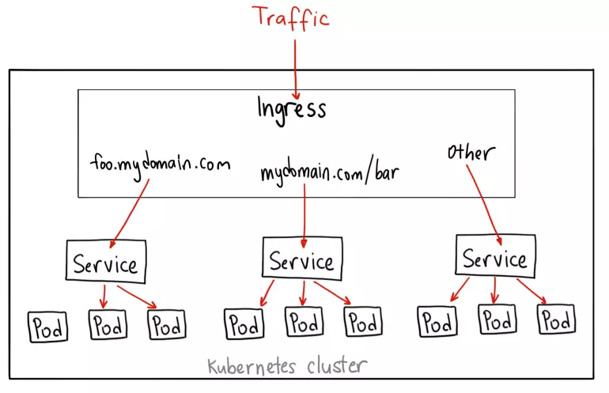

# Tóm tắt về Service

## 1. Service

Các pod trong kubernetes có thể thay đổi do nhiều nguyên nhân khác nhau, điều này khiến cho các client bên ngoài hoặc bên trong cluster gặp khó khăn khi muốn giao tiếp với ứng dụng trong pod.

Service ra đời để giải quyết vấn đề trên. Service sẽ tạo ra 1 endpoint tương ứng với mỗi pod và được quản lý bởi kube-apiserver, do đó ngay cả khi pod thay đổi thì service vẫn có thể biết pod ở đâu để giao tiếp.

### a. VirtualIP và Service Proxy

**Chế độ User space proxy:** Với mỗi service, kube-proxy sẽ mở 1 port ngẫu nhiên trên local node (gọi là proxy port). Traffic khi đi đến ```clusterIP``` sẽ được các iptables rule chuyển hướng đến proxy port. Chúng sau đó lại được phân phối đến một trong các pod backend của Service (được khai báo thông qua Endpoint). Backend được lựa chọn thông qua thuật toán round-robin


**Chế độ iptables proxy:** Với mỗi service, kube-proxy sẽ tạo các iptables rule để chuyển hướng traffic đến ```clusterIP``` và ```port``` của Service. Đối với mỗi Endpoint, kube-proxy lại tạo thêm các iptables rule để chuyển hướng traffic từ Service đến Pod. Backend được lựa chọn ngẫu nhiên.


**Chế độ IPVS proxy:** cơ chế hoạt động gần như tương đồng iptables proxy mode, kube-proxy tạo ra các IPVS rule sử dụng **hook** và **netfilter**, nhưng dùng **hash table** như cấu trúc dữ liệu bên dưới để lưu trữ thông tin về máy chủ và trạng thái kết nối của request. Vì IPVS mode hoạt động ở kernel space nên nó có thể xử lý request 1 cách nhanh chóng và hiệu quả hơn so với iptables mode. IPVS mode lựa chọn backend theo 1 trong các thuật toán: round-robin, least-connection, destination-hashing, source-hashing, shortest expected delay, never queue.

### b. ServiceType

Đây là cách mà ta sẽ expose Service ra bên ngoài cluster:
- expose Service ra 1 địa chỉ IP của mỗi Node tại 1 port tĩnh. Một service loại ```clusterIP``` sẽ được tự động tạo ra. Ta có thể giao tiếp với Service từ bên ngoài thông qua ```<NodeIP>:<NodePort>```
- ```LoadBalancer```: expose Service ra bên ngoài sử dụng 1 bộ cân bằng tải. ```NodePort``` và ```ClusterIP``` Service sẽ được tự động tạo ra ở nơi mà traffic của bộ cân bằng tải được route về
- ```ExternalName```: ánh xạ Services với nội dung của trường ```externalName``` bằng cách trả về giá trị ```CNAME``` record mà không cần phải cài đặt hay proxy gì thêm


## 2. Service Topology

Topology cho phép một service route traffic dựa trên Node topology của cluster.

Ví dụ: Một service có thể chỉ định rằng traffic được ưu tiên route đến các endpoint nằm trên cùng 1 node với client hoặc trong cùng 1 vùng khả dụng 

## 3. DNS cho Services và Pods

Mọi Service và Pod được định nghĩa trong cluster đều được gán 1 tên DNS.

Ví dụ giả sử 1 Services tên là ```foo``` trong namespace ```bar```. Các pod cùng namespace sẽ tìm kiếm Service này bằng cách truy vấn đến tên DNS ```foo```, trong khi các pod khác namespace sẽ truy vấn đến ```foo.bar```

## 4. Ingress

Việc sử dụng Service loại NodePort có thể giúp định hướng traffic từ bên ngoài cluster vào pod được, tuy nhiên cũng còn 1 số hạn chế nhất định như việc phải sử dụng dải port từ 30000-32767.

Ingress giúp ta route các traffic http và https từ bên ngoài cluster đến các service bên trong cluster. Việc route traffic được định nghĩa bởi các rule trong spec của Ingress.



## 5. EndpointSlices

EndpointSlice cung cấp 1 cách đơn giản để theo dõi các endpoint trong Kubernetes cluster. Chúng cung cấp một giải pháp thay thế linh hoạt và có khả năng mở rộng hơn so với Endpoints.

