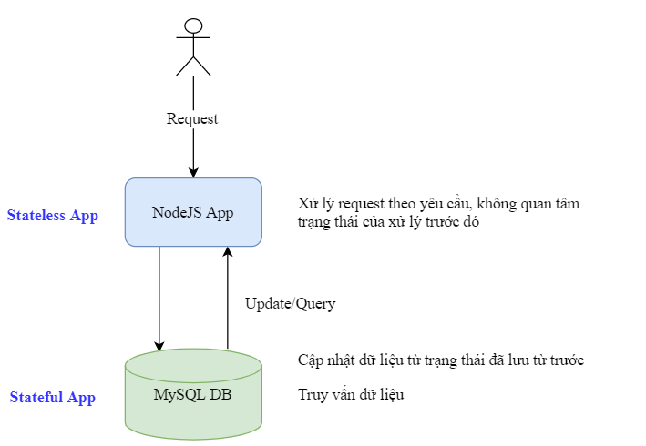
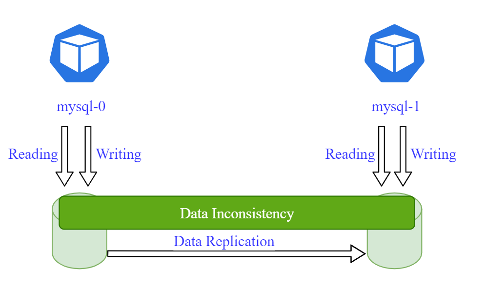
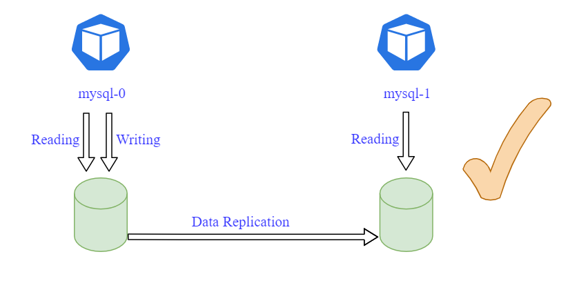
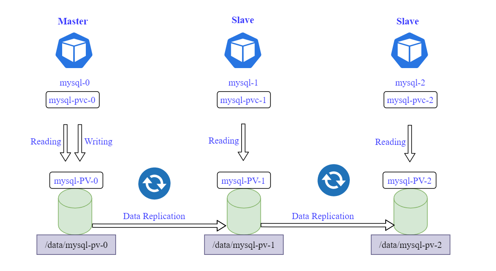
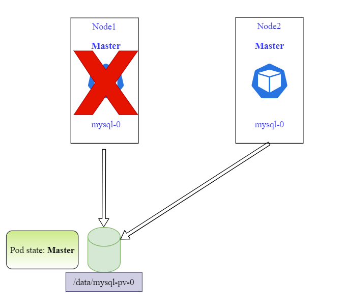
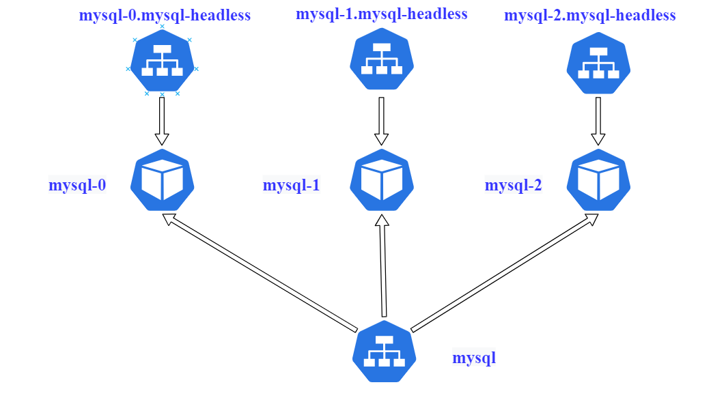
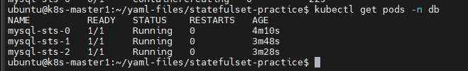
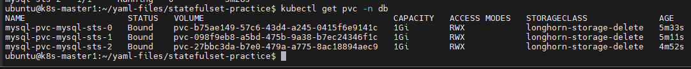

# Kubernetes StatfulSet

## I. Các khái niệm

### 1. Stateful và stateless

Các ứng dụng có thể được chia làm 2 loại là **stateful application** và **stateless application**. Điểm khác nhau cơ bản và rõ ràng nhất đó là các ứng dụng stateless không lưu trạng thái xử lý trước đó, mọi request tới đều được xử lý như một yêu cầu hoàn toàn mới, không liên quan gì tới các xử lý trước đó.

Các ứng dụng **stateful** thường thấy như các loại database (MySQL, ElasticSearch,...) là các ứng dụng mà lưu trữ dữ liệu mà nó xử lý để theo dõi. Các dữ liệu này thường được lưu ở các hệ thống lưu trữ (chẳng hạn Pesistent Storage)

Hãy nhìn ví dụ dưới đây



Như trong ví dụ trên, ta có một ứng dụng nodejs xử lý yêu cầu của client. Mỗi khi có request tới, nó thực hiện các nghiệp vụ của nó và lưu trạng thái vào Databasae. Khi có yêu cầu sửa/xóa dữ liệu thì nó đơn giản là forward yêu cầu đó để database xử lý, bân thân nó không lưu dữ liệu => stateless app

Database xử lý thêm/sửa/xóa dữ liệu thì các thay đổi đó được lưu lại. Ví dụ một bản ghi đã bị xóa thì lần xử lý sau sẽ không còn bản ghi đó nữa => stateful app

### 2. Sự khác nhau giữa StatefulSet và Deployment

Về **Deployment**:
- Các pod của Deployment là hoàn toàn giống nhau và có thể thay thế lẫn nhau về chức năng. Nghĩa là khi 1 pod lỗi thì hoàn toàn có thể thay thế một pod mới để tiếp tục xử lý
- Deployment trước tiên sẽ sinh ra các ReplicaSet, sau đó ReplicaSet sẽ tạo ra các pod theo thứ tự ngẫu nhiên. Tên pod cũng theo format tên của ReplicaSet + mã hash random gán vào đuôi mỗi pod.
- Có thể tạo một Service để Load balancing tới tất cả các Pod cho các request tới ứng dụng
- Các pod của Deployment cũng có thể bị xóa theo thứ tự bất kỳ, hoặc xóa đồng thời nhiều pod (trong trường hợp scale down deployment)

Với **StatfulSet**:
- Các Pod của StatefulSet không thể được tạo hay xóa cùng lúc. Nó sẽ được tạo tuần tự.
- Các Pod của StatefulSet không hoàn toàn giống nhau. Trên thực nó đều có các định danh riêng. Có dạng pod-0, pod-1,... của statefulset.
- Các Pod được tạo với các mô tả giống nhau (specification) nhưng không thể thay thế lẫn nhau
- Khi 1 pod bị lỗi nó sẽ được thay thế bằng 1 pod mới cùng định danh (ví dụ pod-1 sẽ được thay thế bằng pod-1 cùng tên)

### 3. Mở rộng ứng dụng database

Để giải thích cho việc sử dụng StatefulSet, ta xem xét bài toán cần mở rộng một ứng dụng database như sau. Ta đang có 1 pod mysql-0 cho ứng dụng database. Pod này làm đồng thời nhiệm vụ read/write dữ liệu vào database, dữ liệu này được lưu trên disk thông qua Persistent Volume.

Lúc này ta mong muốn add thêm 1 pod cho ứng dụng này, thì ta không thể làm theo cách trên được vì lúc đó cả 2 pod sẽ cùng đọc ghi chung 1 dữ liệu cùng 1 lúc và dẫn tới không đồng bộ dữ liệu



Vấn đề trên sẽ được giải quyết khi 1 pod read/write và 1 pod chỉ read



Một điều quan trọng nữa với Statefulset là các Pod của nó không sử dụng chung phần lưu trữ. Mỗi pod sẽ có phân vùng lưu trữ khác nhau dù dữ liệu chúng lưu trữ là như nhau (cùng được replicate từ bản chính ra):



Mỗi pod sẽ có phân vùng lưu trữ riêng của nó để lưu trữ dữ liệu. Dữ liệu trên mỗi Pod sẽ được liên tục đồng bộ để đảm bảo là chúng luôn giống hệt nhau.

Một điểm nữa là khi pod bị xóa hay crash, dữ liệu của nó không bị mất đi mà vẫn được lưu trên các volume của nó (tạo bởi PV/PVC)

### 4. Trạng thái Pod trong StatefulSet

Mỗi pod đều có trạng thái của nó: Master hay Slave. Thông tin trạng thái của pod được lưu trển PV của pod và do đó trường hợp pod bị crash thì dữ liệu đó không bị ảnh hưởng.

Lấy ví dụ pod mysql-0 bị crash thì hệ thống sẽ tạo ra một pod mới vẫn lấy tên là mysql-0 để thay thế pod cũ và nó sẽ lấy thông tin trạng thái của nó (đang là master) và tiếp tục xử lý dữ liệu.


Để đảm bảo được việc giữ trạng thái của Pod trong quá trình này thì phải đảm bảo các storage sử dụng cho các Pod là có thể truy cập được từ mọi worker node. Do đó khi Pod có thể được gán vào node khác so với ban đầu thì nó vẫn attach được PV cũ của nó.



Ví dụ dùng NFS storage class là một loại remote storage để sử dụng được trong trường hợp này.

### 5. Định danh Pod trong StatefulSet

Tên pod trong deployment được tạo với random hash trong khi Pod của StatefulSet được tạo với thứ tự cố định: **statefulset-(order_number)**. Như ví dụ bên trên ta tạo một StatefulSet cho ứng dụng mysql với relicas=3 ta có các Pod lần lượt là mysql-0 (master), mysql-1 (slave), mysql-2 (slave),

**Thứ tự tạo Pod của StatefulSet:** Các pod của StatefulSet sẽ được tạo theo đúng thứ tự tên của nó. Pod sau sẽ không được tạo cho tới khi Pod trước đó đã up và running. Nếu việc Pod trước đó bị failed hay ở trạng thái Pending, thì các Pod sau đó của StatefulSet cũng sẽ không được tạo.

**Thứ tự xóa Pod của StatefulSet:** Việc xóa Pod của StatefulSet cũng phải xóa tuần tự, nhưng ngược lại với thứ tự tạo. Việc xóa có thể xảy ra khi xóa StatefulSet hay scale down số lượng pod. Nếu pod trước chưa được xóa thành công thì pod sau cũng sẽ không được xóa, cơ chế này nhằm bảo vệ dữ liệu và trạng thái của ứng dụng.

### 6. Pod Endpoint

Khi tạo StatefulSet và có định nghĩa ServiceName trong cấu hình của StatefulSet thì Kubernetes sẽ tạo cho chúng ta các bản ghi DNS cho từng pod tương ứng theo format như sau: ```(PodName).(ServiceName).(NameSpace).svc.(ClusterName)```. Ngoài ra ta cũng có thể tạo service dạng ClusterIP nhưng set giá trị ```clusterIP: none``` để tạo 1 headless service cho ứng dụng.



## Thực hành cài đặt 1 cụm Database MySQL bằng statefulset

Ở phần này ta sẽ demo bằng việc cài đặt cụm MySQL trên K8s. Phần lưu trữ sẽ dùng PV/PVC để mount vào các pod, do đó cần cài đặt sẵn storage class để sử dụng.

Namespace sử dụng trong phần này là ```db```

```sh
kubectl create ns db
```

### 1. Tạo secret để cấu hình password cho database

Tạo 1 file Secret ```mysql-secret.yaml``` như sau:

```sh
apiVersion: v1
kind: Secret
metadata:
  name: mysql-password
type: opaque
stringData:
  MYSQL_ROOT_PASSWORD: NH_ToBeTheBest
```

Trong đó password dùng để connect tới DB, ta áp dụng secret trên và nhớ sử dụng namespace chúng ta muốn

```sh
kubectl -n db apply -f mysql-secret.yaml
```

### 2. Cài đặt và cấu hình Storage Class 

Tạo storage class theo hướng dẫn từ bài viết trước


### 3. Cấu hình StatefulSet để cài MySQL

Ta tạo file manifest ```mysql-sts.yaml``` để khai báo cấu hình statefulset như sau:

```sh
apiVersion: apps/v1
kind: StatefulSet
metadata:
  name: mysql-sts
spec:
  selector:
    matchLabels:
      app: mysql
  serviceName: "mysql-svc"
  replicas: 3
  template:
    metadata:
      labels:
        app: mysql
    spec:
      terminationGracePeriodSeconds: 10
      containers:
      - name: mysql
        image: mysql:5.7
        args:
          - "--ignore-db-dir=lost+found"
        ports:
        - containerPort: 3306
        volumeMounts:
        - name: mysql-pvc
          mountPath: /var/lib/mysql
        env:
          - name: MYSQL_ROOT_PASSWORD
            valueFrom:
              secretKeyRef:
                name: mysql-password
                key: MYSQL_ROOT_PASSWORD
  volumeClaimTemplates:
  - metadata:
      name: mysql-pvc
    spec:
      accessModes: ["ReadWriteOnce"]
      storageClassName: "longhorn-storage-delete"
      resources:
        requests:
          storage: 1Gi
```

Trong đó:
- ```name: mysql-sts```: Pod được tạo ra sẽ có format là ```mysql-sts-(index)```.
- ```serviceName: "mysql-svc```: Việc khai báo serviceName này sẽ tạo ra các bản ghi DNS riêng cho từng pod theo format ```(PodName).(ServiceName).(NameSpace).svc.(CluserName)```. Ví dụ ```mysql-sts-0.mysql-svc.db.svc.cluster.local```
- Phần cấu hình sotrage ta sử dụng storage class ```longhorn-storage-delete``` với dung lượng yêu cầu cho mỗi PVC là 1 GiB và mode là ```RWO```
- Các giá trị khác gần như tương tự so với Deployment

```sh
kubectl -n db apply -f mysql-sts.yaml
```

Lúc này pod sẽ được tạo tuần tự:



Mỗi pod đều được gắn vs 1 pvc:



Lưu ý dù ta có khai báo tham số ```serviceName: "mysql-svc"``` nhưng việc này chỉ giúp tạo cho ta bản ghi DNS chứ không tạo ra service có tên là ```mysql-svc```

### 4. Tạo Service cho ứng dụng

Ở bài này ta không tạo service dạng LoadBalancer cho ứng dụng mà dùng ```headless service``` (service không có clusterIP). Tạo file cấu hình như sau:

```sh
apiVersion: v1
kind: Service
metadata:
  name: mysql-svc
  labels:
    app: mysql
spec:
  ports:
  - port: 3306
  clusterIP: None
  selector:
    app: mysql
```

Sau đó apply vào hệ thống

```sh
kubectl -n db apply -f mysql-service-headless
```

### 5. Cài MySQL Client để test kết nối

Tạo file manifest ```mysql-client.yaml``` để khai báo mysql client với nội dung như sau:

```sh
apiVersion: v1
kind: Pod
metadata:
  name: mysql-client
spec:
  containers:
  - name: mysql-container
    image: alpine
    command: ['sh', '-c', "sleep infinitively"]
    imagePullPolicy: IfNotPresent
```

Tạo pod trên bằng câu lệnh:

```sh
kubectl -n db apply -f mysql-client.yaml
```

Sau khi tạo xong Pod thì ta kết nối vào trong pod để cài đặt MySQL client

```sh
kubectl -n db exec --stdin --tty mysql-client -- sh
```

Cài đặt mysql-client

```sh
apk add mysql-client
```

Đứng từ Pod Mysql client này ta có thể kết nối tới mysql db bằng forrmat lệnh ```mysql -u root -p -h <host_server_name>``` trong đó ```<host_server_name>``` là tên của mysql. Với cấu hình cài đặt bên trên thì cú pháp là

```sh
stateful_name-ordinal_number.(serviceName).(namespace).svc.(clusterName)
```

Ví dụ: ```mysql-sts-0.my-svc.db.svc.cluster.local```

Như vậy ta sẽ connect vào db và tạo một database mới

```sh
mysql -u root -p -h mysql-sts-0.mysql-svc.db.svc.cluster.local
```


Có thể thấy, dữ liệu của 3 pod trong statefulset là khác nhau, statefulset sẽ không đồng bộ dữ liệu cho chúng ta như deployment