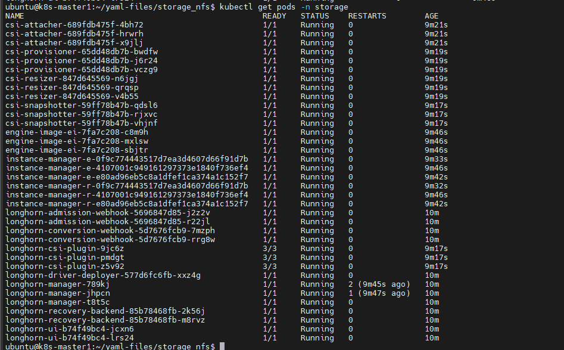
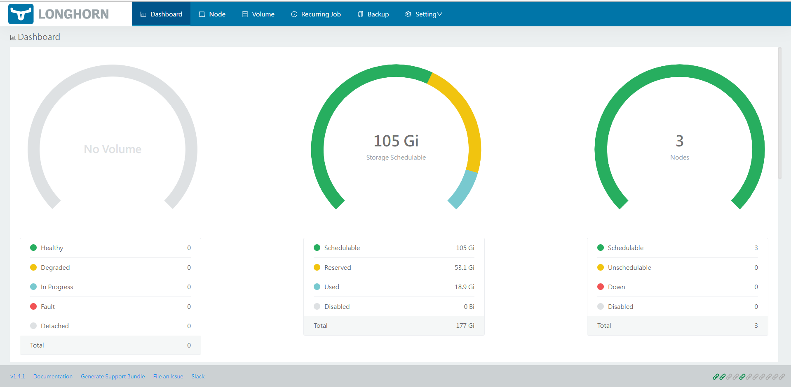
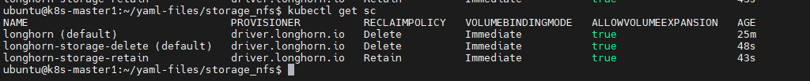
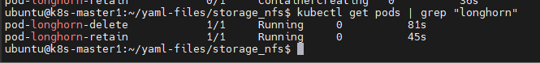

# Cài đặt Storage cho K8s dùng longhorn

Ý tưởng cài đặt longhorn như sau:
- Cấu hình cho longhorn biết thư mục mặc định lưu data của longhorn sẽ được dùng ở đâu trên worker node
- Longhorn sẽ chạy trên tất cả các Worker node thỏa mãn điều kiện là có phân vùng lưu trữ như cấu hình bên trên
- Mỗi Worker Node sẽ được coi là 1 Node của longhorn, trên mỗi node này có thể có 1 hoặc nhiều Disk mà ta có thể cấu hình thêm sau khi đã cài đặt longhorn

Ta sẽ có 2 phần:
- Longhorn storage: là storage quản lý thiết bị lưu trữ, nó có vai trò giống như NFS Server
- Longhorn storage class: là một object trên K8s đảm nhiệm việc nhận các yêu cầu tạo Volume trên K8s (PV/PVC) sau đó kết nối với longhorn storage để tạo ra phân vùng lưu trữ trên thiết bị lưu trữ

Các bước thực hiện:
- Chuẩn bị phân vùng lưu trữ dữ liệu trên các Worker Node
- Cài đặt longhorn storage trên K8s dùng helm chart
- Cài đặt longhorn storage class trên K8s
- Kiểm thử tạo PV/PVC và tạo Pod dùng longhorn storage class

## Cài đặt longhorn storage

### 1. Chuẩn bị phân vùng lưu trữ

Ta sẽ cài đặt thư mục mặc định lưu dữ liệu của longhorn là ```/data/longhorn-storage/```, do đó cần tạo thư mục nào trên tất cả Worker Node:

```sh
mkdir -p /data2/longhorn-storage
```

### 2. Cài đặt longhorn storage

Đầu tiên ta cài đặt helm như giới thiệu ở bài trước, sau đó khai báo repo và download helm chart của longhorn về

```sh
helm repo add longhorn https://charts.longhorn.io
helm repo update
helm search repo longhorn
helm pull longhorn/longhorn --version 1.4.1
tar -xzf longhorn-1.4.1.tgz
```

Copy file value ra ngoài và chỉnh sửa 1 vài thông số được liệt kê ở dưới đây

```sh
cd longhorn
cp values.yaml ../values-longhorn.yaml
```

```sh
service:
  ui:
    #type: ClusterIP
    type: NodePort
    nodePort: 30888
  manager:
    type: ClusterIP
    
defaultDataPath: /data/longhorn-storage/
replicaSoftAntiAffinity: true
storageMinimalAvailablePercentage: 15
upgradeChecker: false
defaultReplicaCount: 2
backupstorePollInterval: 500
nodeDownPodDeletionPolicy: do-nothing
guaranteedEngineManagerCPU: 15
guaranteedReplicaManagerCPU: 15

ingress:  
  enabled: true
  ingressClassName: longhorn-storage-ingress
  host: longhorn-ui.baotrung.xyz

namespaceOverride: "storage"
```

Ta cài thêm ```open-iscsi``` cho các Worker Node để nó có thể mount được phân vùng từ longhorn storage

```sh
yum -y install iscsi-initiator-utils
```

Cài đặt longhorn-storage (quá trình cài đặt và tạo container sẽ tốn vài phút đến vài chục phút)

```sh
helm install longhorn-storage -f values-longhorn.yaml longhorn -n storage
kubectl get pods -n storage
```



Truy cập dashboard thông qua ```<node_IP>:30888```



### 3. Cài đặt longhorn storage class trên K8s

Tới đây ta sẽ tạo 2 storage class tương ứng là delte và retain reclaim policy. Tạo 2 file config như sau:

```sh
cat << EOF > longhorn-storageclass-delete.yaml
kind: StorageClass
apiVersion: storage.k8s.io/v1
metadata:
  name: longhorn-storage-delete
  annotations:
    storageclass.kubernetes.io/is-default-class: "true"
provisioner: driver.longhorn.io
allowVolumeExpansion: true
reclaimPolicy: Delete
volumeBindingMode: Immediate
parameters:
  numberOfReplicas: "2"
  staleReplicaTimeout: "2880"
  fromBackup: ""
  fsType: "ext4"
EOF
```

```sh
cat << EOF > longhorn-storageclass-retain.yaml
kind: StorageClass
apiVersion: storage.k8s.io/v1
metadata:
  name: longhorn-storage-retain
provisioner: driver.longhorn.io
allowVolumeExpansion: true
reclaimPolicy: Retain
volumeBindingMode: Immediate
parameters:
  numberOfReplicas: "2"
  staleReplicaTimeout: "2880"
  fromBackup: ""
  fsType: "ext4"
EOF
```

```sh
kubectl apply -f longhorn-storageclass-delete.yaml
kubectl apply -f longhorn-storageclass-retain.yaml
```



### 4. Kiểm thử tạo PV/PVC vào tạo Pod dùng loghorn storage class

Tương ứng với mỗi storage class, ta sẽ tạo 1 pod và 1 pvc cho chúng

```sh
cat << EOF > longhorn-pvc-delete.yaml
apiVersion: v1
kind: PersistentVolumeClaim
metadata:
  name: longhorn-pvc-delete
spec:
  accessModes:
    - ReadWriteMany
  storageClassName: longhorn-storage-delete
  resources:
    requests:
      storage: 2Gi
EOF
```

```sh
cat << EOF > longhorn-pvc-retain.yaml
apiVersion: v1
kind: PersistentVolumeClaim
metadata:
  name: longhorn-pvc-retain
spec:
  accessModes:
    - ReadWriteMany
  storageClassName: longhorn-storage-retain
  resources:
    requests:
      storage: 2Gi
EOF
```

```sh
cat << EOF > test-pod-longhorn-delete.yaml
kind: Pod
apiVersion: v1
metadata:
  name: pod-longhorn-delete
spec:
  volumes:
    - name: longhorn-pvc-delete
      persistentVolumeClaim:
        claimName: longhorn-pvc-delete
  containers:
  - name: my-container
    volumeMounts:
    - name: longhorn-pvc-delete
      mountPath: /var/simple
    image: alpine
    command: ["/bin/sh"]
    args: ["-c", "while true; do date >> /var/simple/file.txt; sleep 5; done"]
EOF
```

```sh
cat << EOF > test-pod-longhorn-retain.yaml
kind: Pod
apiVersion: v1
metadata:
  name: pod-longhorn-retain
spec:
  volumes:
    - name: longhorn-pvc-retain
      persistentVolumeClaim:
        claimName: longhorn-pvc-retain
  containers:
  - name: my-container
    volumeMounts:
    - name: longhorn-pvc-retain
      mountPath: /var/simple
    image: alpine
    command: ["/bin/sh"]
    args: ["-c", "while true; do date >> /var/simple/file.txt; sleep 5; done"]
EOF
```

```sh
kubectl apply -f longhorn-pvc-delete.yaml
kubectl apply -f longhorn-pvc-retain.yaml
```


```sh
kubectl apply -f test-pod-longhorn-delete.yaml
kubectl apply -f test-pod-longhorn-retain.yaml
```



Done!

**Note:** Để uninstall longhorn cài đặt với helm, trước hết ta cần dùng lệnh sau

```sh
kubectl -n longhorn-system edit settings.longhorn.io deleting-confirmation-flag
```