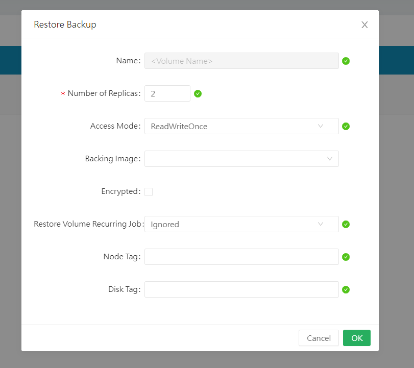

# Longhorn backup

## I. Cài đặt Backup Target cho Longhorn

Một trong những tính năng chính của Longhorn là hỗ trợ volume backup, phát triển dựa trên CSI volume snapshot API. Longhorn có thể sử dụng cả S3 hoặc NFS external storage để làm backup target. 

Tính năng này cũng không chỉ giới hạn ở S3 hay NFS, các công cụ backup của bên thứ 3 mà có thể truy nhập K8s API và quản lý volume snapshot có thể dễ dàng tích hợp với Longhorn, nhưng chúng ta sẽ không đề cập đến chúng ở trong bài viết này.

Để cài đặt MinIO, hãy tham khảo trong bài viết [này](https://github.com/shaidoka/thuctap-NhanHoa/blob/main/k8s/K8s_Monitor/K8s_Monitor_Prometheus_Grafana.md#c%C3%A0i-%C4%91%E1%BA%B7t-minio)

Chúng ta sẽ tạo 1 user và bucket cho những backup này sử dụng công cụ command line của Minio là [mc](https://github.com/minio/mc)

Hãy bắt đầu cấu hình mc alias cần thiết để truy nhập Minio, cũng như là bucket, folder:

```sh
k exec pod/minio-65954bbb-sjg68 -it -n minio -- /bin/bash
```

```sh
#mc alias for Minio Root user
mc alias set mycloudbackup http://10.96.6.92:9000 admin <admin_password>

#Bucket and folder
mc mb mycloudbackup/cloudbackups
mc mb mycloudbackup/cloudbackups/longhorn
```

Giờ ta tạo user mà sẽ sử dụng để truy nhập vào bucket và cũng như định nghĩa quyền của nó, nhờ đó giới hạn chỉ cho phép user này có quyền đối với bucket chỉ định và thành phần ở trong đó

```sh
mc admin user add mycloudbackup cloudbackupsuser <user_password>

cat > /tmp/rancher-backups-policy.json <<EOF
{
  "Version": "2012-10-17",
      "Statement": [
    {
      "Action": [
        "s3:PutBucketPolicy",
        "s3:GetBucketPolicy",
        "s3:DeleteBucketPolicy",
        "s3:ListAllMyBuckets",
        "s3:ListBucket"
      ],
      "Effect": "Allow",
      "Resource": [
        "arn:aws:s3:::cloudbackups"
      ],
      "Sid": ""
    },
    {
      "Action": [
        "s3:AbortMultipartUpload",
        "s3:DeleteObject",
        "s3:GetObject",
        "s3:ListMultipartUploadParts",
        "s3:PutObject"
      ],
      "Effect": "Allow",
      "Resource": [
        "arn:aws:s3:::cloudbackups/*"
      ],
      "Sid": ""
    }
  ]
}
EOF

mc admin policy create mycloudbackup rancher-backups-policy /tmp/rancher-backups-policy.json

mc admin policy attach mycloudbackup rancher-backups-policy --user cloudbackupsuser
```

Giờ ta đã sẵn sàng để cấu hình backup target của Longhorn

Đầu tiên, ta phải tạo secret mà sẽ giữ creadentials và endpoint để truy cập MinIO. Secret phải nằm trong cùng namespace của longhorn.

Do chúng ta sử dụng Opaque secret nên sẽ cầng convert chúng sang base64

```sh
echo -n cloudbackupsuser | base64

echo -n <user_password> | base64

echo -n http://10.96.6.92:9000 | base64
```

Định nghĩa Secret dựa trên các thông tin vừa có được:

```sh
apiVersion: v1
kind: Secret
metadata:
  name: minio-secret
  namespace: storage
type: Opaque
data:
  AWS_ACCESS_KEY_ID: Y2xvdWRiYWNrdXBzdXNlcg==
  AWS_SECRET_ACCESS_KEY: MDQzNTYyNjUzM2FA
  AWS_ENDPOINTS: aHR0cDovLzEwLjk2LjYuOTI6OTAwMA==
  #AWS_CERT: your base64 encoded custom CA certificate goes here
```

Giờ chúng ta sẽ chỉ định backup target endpoint URL theo format sau:

```sh
s3://bucket_name@region/folder
```

Tuy vậy trong môi trường test thì ta không sử dụng regions, nhưng cũng không thể để trống được, nếu không thì URL parser sẽ lỗi. Do đó hãy viết bừa 1 cái gì đó vào, như thế này chẳng hạn

```sh
s3://cloudbackups@dummyregion/longhorn
```


Nếu có bất kỳ cấu hình lỗi nào thì nó sẽ được hiển thi lên UI. Một số lỗi thường gặp bao gồm:
- Không đúng định dạng mã hóa base64 trong secret (hãy nhớ luôn dùng tùy chọn ```-n``` khi sử dụng lệnh echo để tránh kết quả trả về bị thêm carriage return)
- Target URL không đúng
- Lỗi ở MinIO server: sai bucket, thiếu quyền,...
- Lỗi khi đăng tải tệp tin lớn do sử dụng nginx ingress mà có giá trị (mặc định) của ```client_max_body_size``` là 1 MiB

## II. Tạo backup

Việc backup trong Longhorn thực hiện khá đơn giản, hãy test 1 chút bằng cách tạo 1 pod mysql và PVC như sau:

```sh
apiVersion: v1
kind: Secret
metadata:
  name: mautic-mysql-password
type: opaque
stringData:
  MYSQL_ROOT_PASSWORD: 0435626533a@
---
apiVersion: apps/v1
kind: StatefulSet
metadata:
  name: mautic-mysql-sts
spec:
  selector:
    matchLabels:
      app: mautic-mysql
  serviceName: "mautic-mysql-svc"
  replicas: 1
  template:
    metadata:
      labels:
        app: mautic-mysql
    spec:
      terminationGracePeriodSeconds: 10
      containers:
      - name: mysql
        image: mysql:5.7
        args:
          - "--ignore-db-dir=lost+found"
        ports:
        - containerPort: 3306
        volumeMounts:
        - name: mautic-mysql-pvc
          mountPath: /var/lib/mysql
        env:
          - name: MYSQL_ROOT_PASSWORD
            valueFrom:
              secretKeyRef:
                name: mautic-mysql-password
                key: MYSQL_ROOT_PASSWORD
  volumeClaimTemplates:
  - metadata:
      name: mautic-mysql-pvc
    spec:
      accessModes: ["ReadWriteOnce"]
      storageClassName: "longhorn"
      resources:
        requests:
          storage: 1Gi
```

Kết nối vào tạo 1 cái gì đó


Lên UI thực hiện backup


Thêm label


OK


## III. Restore

Longhorn có thể dễ dàng restore volume từ các bản backup. Khi ta khôi phục 1 bản backup, nó tạo 1 volume cùng tên với volume mặc định. Nếu 1 volume với cùng tên với bản backup đã tồn tại, bản backup này sẽ không được restore

Lưu ý rằng, chức năng restore ở hình bên dưới đây:


Chức năng này là tạo ra 1 PVC mới với dữ liệu và tên trùng với bản backup, chứ không phải là restore đè vào PVC cùng tên hiện đang tồn tại (như đã nói bên trên). Chức năng này sinh ra khi PVC bị lỗi và không thể dùng được nữa, ta có thể restore PVC này từ bản backup rồi gắn lại vào pods để sử dụng.

## IV. Restore volume của StatefulSet

Longhorn hỗ trợ backup/restore, và 1 trong những use case là cho tính năng này là restore dữ liệu của K8s StatefulSet, thứ mà cần khôi phục volume cho mỗi replica mà được backup.

Để khôi phục, làm theo những chỉ dẫn dưới đây. Ví dụ dưới đây sử dụng STS với 1 volume gắn vào mỗi pod và có 2 replica

1. Kết nối vào Longhorn UI. Vào ```Backup``` tab, chọn tên của STS volume. Click vào dropdown menu ở phía bên phải của bản backup và chọn restore. Đặt tên volume sao cho sau đó dễ dàng tham chiếu cho PV

Làm bước này với mỗi volume ta cần restore

Ví dụ, nếu khôi phục 1 STS với 2 replica mà có tên ```pvc-01a``` và ```pvc-02b```, việc khôi phục sẽ là

|Backup Name|Restored Volume|
|:-|:-|
|pvc-01a|statefulset-vol-0|
|pvc-02b|statefulset-vol-1|

2. Trong K8s, tạo 1 PV cho mỗi Longhorn volume mà được tạo. Đặt tên volume sao cho sau đó dễ dàng tham chiếu cho PVC. Dung lượng ```storage```, ```numberOfReplicas```, ```storageClassName```, và ```volumeHandle``` phải được thay thế cho phù hợp.

Trong ví dụ dưới đây, chúng ta sẽ tham chiếu ```statefulset-vol-0``` và ```statefulset-vol-1``` ở Longhorn và sử dụng ```longhorn``` làm storageClassName

```sh
apiVersion: v1
kind: PersistentVolume
metadata:
  name: statefulset-vol-0
spec:
  capacity:
    storage: <size> # phải khớp với dung lượng của longhorn volume
  volumeModes:
    - ReadWriteOnce
  persistentVolumeReclaimPolicy: Delete
  csi:
    driver: driver.longhorn.io
    fsType: ext4
    volumeAttributes:
      numberOfReplicas: <replicas> # phải khớp với giá trị của Longhorn volume
      staleReplicaTimeout: '30' # minutes
    volumeHandle: statefulset-vol-0 # phải khớp tên volume ở Longhorn
    storageClassName: longhorn
---
apiVersion: v1
kind: PersistentVolume
metadata:
  name: statefulset-vol-0
spec:
  capacity:
    storage: <size> # phải khớp với dung lượng của longhorn volume
  volumeModes:
    - ReadWriteOnce
  persistentVolumeReclaimPolicy: Delete
  csi:
    driver: driver.longhorn.io
    fsType: ext4
    volumeAttributes:
      numberOfReplicas: <replicas> # phải khớp với giá trị của Longhorn volume
      staleReplicaTimeout: '30' # minutes
    volumeHandle: statefulset-vol-1 # phải khớp tên volume ở Longhorn
    storageClassName: longhorn
```

3. Tạo PVC ở cùng namespace với STS. Tên của PVC phải thỏa mãn định dạng sau:

```sh
<name of Volume Claim Template>-<name of StatefulSet>-<index>
```

StatefulSet pod được đánh chỉ mục 0. Trong ví dụ dưới đây, tên của ```Volume Claim Template``` là ```data```, tên của STS là ```webapp```, và có 2 replicas, index lần lượt là ```0``` và ```1```

```sh
apiVersion: v1
kind: PersistentVolumeClaim
metadata:
  name: data-webapp-0
spec:
  accessModes:
  - ReadWriteOnce
  resources:
    requests:
      storage: <size> # phải khớp với dung lượng chỉ định trước đó
  storageClassName: longhorn
  volumeName: statefulset-vol-0
---
apiVersion: v1
kind: PersistentVolumeClaim
metadata:
  name: data-webapp-1
spec:
  accessModes:
  - ReadWriteOnce
  resources:
    requests:
      storage: <size>
  storageClassName: longhorn
  volumeName: statefulset-vol-1
```

4. Tạo ```StatefulSet```

```sh
apiVersion: apps/v1
kind: StatefulSet
metadata:
  name: webapp # match this with the PersistentVolumeClaim naming scheme
spec:
  selector:
    matchLabels:
      app: nginx
  serviceName: "nginx"
  replicas: 2
  template:
    metadata:
      labels:
        app: nginx
    spec:
      containers:
      - name: nginx
        image: registry.k8s.io/nginx-slim:0.8
        ports:
        - containerPort: 80
          name: web
        volumeMounts:
        - name: data
          mountPath: /usr/share/nginx/html
  volumeClaimTemplates:
  - metadata:
      name: data # match this with the PersistentVolumeClaim naming scheme
    spec:
      accessModes: [ "ReadWriteOnce" ]
      storageClassName: longhorn
      resources:
        requests:
          storage: <size> # must match size from earlier
```

Ta có thể thực hiện restore, tạo PV/PVC trên giao diện của Longhorn như sau:





Giờ ta tạo statefulset thôi

```sh
kaf mysql-sts
```

**Lưu ý:** Do PV thuộc loại RWO nên pod và volume phải cùng 1 node!!


## V. Snapshot

Về cơ bản thì tính năng snapshot của Longhorn không có gì khác biệt nhiều so với backup, chỉ là backup thì khi restore ta sẽ tạo ra 1 volume với tên và dữ liệu tương ứng. Trong khi với snapshot thì volume được chỉ định sẽ được quay về trạng thái trùng khớp hoàn toàn với bản snapshot này.

Để tạo Snapshot, ta chọn ```Take Snapshot``` ở 1 trong 2 vị trí sau đều được:


Khi đó sẽ có 1 bản snapshot được tạo ra như thế này:


Tuy nhiên, để Revert 1 volume về bản snapshot nào đó, ta sẽ cần phải detach volume đó, và attach lại với mode ```maintenance``` được bật.


Click vào bản snapshot và click vào ```Revert``` là xong.