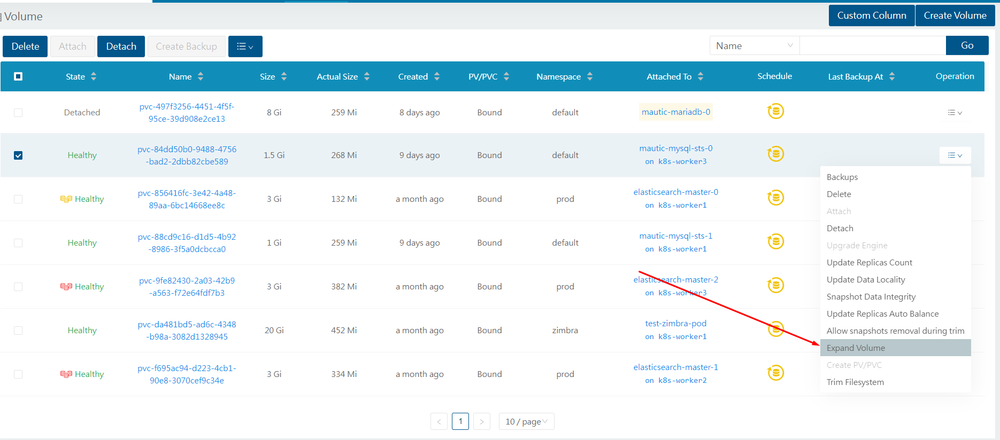

# Expand a Longhorn volume

Việc mở rộng volume của longhorn phải trải qua 2 giai đoạn. Đầu tiên, Longhorn resize block device, sau đó nó sẽ mở rộng filesystem

Từ phiên bản v1.4.0, Longhorn hỗ trợ online expansion. Longhorn có thể trực tiếp mở rộng 1 attached volume mà không bị giới hạn nào cả, kể cả việc volume đang được sử dụng (read/write) hay đang rebuild đi chăng nữa

**Prerequisite:**
- Mở rộng offline hỗ trợ từ phiên bản v0.8.0
- Mở rộng online hỗ trợ từ phiên bản v1.4.0

## Mở rộng Longhorn volume

Có 2 cách để mở rộng 1 longhorn volume: với PVC và với Longhorn UI

### 1. Thông qua PVC

Phương thức này có thể áp dụng nếu:
- PVC được cấp động (dynamically provisioned) bởi Kubernetes với Longhorn StorageClass
- Trường ```allowVolumeExpansion``` phải là ```true``` trong StorageClass tương ứng

Phương thức này được khuyến kích nếu nó có thể sử dụng, vì PVC và PV sẽ được cập nhật tự động và mọi thứ được giữ tính liên tục sau khi mở rộng

Cách sử dụng: Tìm PVC tương ứng với Longhorn voluem và sửa tham số ```spec.resources.requests.storage```:

```sh
apiVersion: v1
kind: PersistentVolumeClaim
metadata:
  annotations:
    kubectl.kubernetes.io/last-applied-configuration: |
      {"apiVersion":"v1","kind":"PersistentVolumeClaim","metadata":{"annotations":{},"name":"longhorn-simple-pvc","namespace":"default"},"spec":{"accessModes":["ReadWriteOnce"],"resources":{"requests":{"storage":"1Gi"}},"storageClassName":"longhorn"}}
    pv.kubernetes.io/bind-completed: "yes"
    pv.kubernetes.io/bound-by-controller: "yes"
    volume.beta.kubernetes.io/storage-provisioner: driver.longhorn.io
  creationTimestamp: "2019-12-21T01:36:16Z"
  finalizers:
  - kubernetes.io/pvc-protection
  name: longhorn-simple-pvc
  namespace: default
  resourceVersion: "162431"
  selfLink: /api/v1/namespaces/default/persistentvolumeclaims/longhorn-simple-pvc
  uid: 0467ae73-22a5-4eba-803e-464cc0b9d975
spec:
  accessModes:
  - ReadWriteOnce
  resources:
    requests:
      storage: 1Gi
  storageClassName: longhorn
  volumeMode: Filesystem
  volumeName: pvc-0467ae73-22a5-4eba-803e-464cc0b9d975
status:
  accessModes:
  - ReadWriteOnce
  capacity:
    storage: 1Gi
  phase: Bound
```

### 2. Thông qua Longhorn UI

Rất đơn giản, chỉ việc chọn ```Expand Volume``` và nhập vào dung lượng **requests**



## Mở rộng Filesystem

Longhorn sẽ cố gắng mở rộng filesystem chỉ khi:
- Dung lượng được mở rộng phải lớn hơn dung lượng hiện tại
- Có Linux filesystem trong Longhorn volume
- Filesystem sử dụng trong Longhorn volume thuộc loại ```ext4``` hoặc ```xfs```
- Longhorn volume đang sử dụng block device frontend

## Các trường hợp khác

### Xử lý volume revert

Nếu 1 volume được revert đến 1 snapshot mà có dung lượng nhỏ hơn dung lượng hiện tại, frontend của volume sẽ vẫn giữ dung lượng được mở rộng. Nhưng dung lượng filesystem sẽ trở về cùng với dung lượng của bản snapshot. Trong trường hợp này, ta cần phải xử lý filesystem 1 cách thủ công như sau:

1. Gắn volume vào node bất kỳ

2. Truy nhập vào node đó, mở rộng filesystem

Nếu filesystem là ```ext4```, volume sẽ cần phải **mounted** và **unmounted** 1 lần trước khi resize filesystem thủ công. Nếu không, thực thi ```resize2fs``` sẽ trả về kết quả lỗi:

```sh
resize2fs: Superblock checksum does not match superblock while trying to open ......
Couldn't find valid filesystem superblock.
```

Hãy làm theo các bước sau:

```sh
mount /dev/longhorn/<volume name> <arbitrary mount directory>
umount /dev/longhorn/<volume name>
mount /dev/longhorn/<volume name> <arbitrary mount directory>
resize2fs /dev/longhorn/<volume name>
umount /dev/longhorn/<volume name>
```

3. Nếu filesystem là ```xfs```, ta có thể trực tiếp mount và mở rộng filesystem

```sh
mount /dev/longhorn/<volume name> <arbitrary mount directory>
xfs_growfs <the mount directory>
umount /dev/longhorn/<volume name>
```

### Volume được mã hóa

Longhorn không thể xử lý mở rộng **online** cho volume được mã hóa tự động trừ khi ta kích hoạt feature gate ```CSINodeExpandSecret```

Nếu ta không thể kích hoạt nó nhưng vẫn muốn làm online expansion, ta có thể:
- Login vào node mà volume mã hóa được gắn vào
- Thực thi ```cryptsetup resize <volume name>```. Passphrase mà lệnh này cần là trường ```CRYPTO_KEY_VALUE``` của secret tương ứng
- Mở rộng filesystem

### RWX volume

Hiện tại, Longhorn không thể mở rộng filesystem cho RWX volume. Ta có thể mở rộng nó thủ công bằng cách:
1. Mở rộng block device của RWX volume thông qua PVC hoặc UI
2. Tìm kiếm pod quản lý chia sẻ của RWX volume sau đó thực thi lệnh mở rộng filesystem. Pod quản lý chia sẻ thường tên là ```share-manager-<volume-name>

```sh
kubectl -n storage exec -it <the share manager pod> -- resize2fs /dev/longhorn/<volume name>
```

