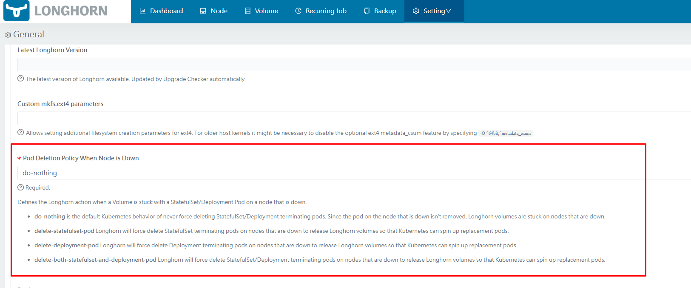

# Chuyện gì xảy ra nếu Node chứa PVC down bất chợt?

Bài viết này sẽ mô tả chính xác điều gì xảy ra nếu 1 K8s node bị down đột ngột, khi đó PVC sẽ như nào và quá trình khôi phục như thế nào.

Đầu tiên, sau 1 phút mà k8s node down, nếu ta sử dụng lệnh ```kubectl get nodes``` sẽ thấy trạng thái của node dow là ```NotReady```

Sau khoảng 5 phút, trạng thái của tất cả các pods trên node sẽ là ```Unknown``` hoặc ```NodeLost```.

Statefulset có danh tính không đổi, do đó K8s sẽ không buộc delete pod này. Trong khi đó Deployment thì ngược lại, tuy vậy, đối với Read-Write-Once (RWO) storage, nó lại không thể gắn đến 2 nodes ở cùng 1 thời điểm. Do đó mà pod mới tạo bởi deployment sẽ không thể start được vì RWO volume đang gắn với pod cũ, trên node lỗi.

Trong cả 2 trường hợp của sts và deploy được nói ở trên, K8s sẽ tự động trục xuất pod ở trên node lỗi, sau đó cố gắng **tạo lại 1 pod mới với volume cũ**. Vì pod cũ bị kẹt ở trạng thái ```Terminating``` và volume gắn với nó lại không thể được nhả ra, pod mới theo đó sẽ kẹt ở trạng thái ```ContainerCreating``` (nếu không có can thiệp của admin hay phần mềm quản lý storage)

## Chính sách xóa pod của Longhorn khi node down

Longhorn cung cấp 1 tùy chọn giúp người dùng tự động buộc xóa ```terminating``` pod của STS/Deploy trên node mà bị down. Sau khi force deleteing, K8s sẽ gỡ Longhorn volume và nhờ vậy quá trình tạo pod mới có thể được diễn ra trơn tru.

Tùy chọn nói trên có thể tìm thấy ở Longhorn UI trong phần Settings



## Điều gì xảy ra khi 1 K8s node lỗi được khôi phục trở lại ?

Nếu node lỗi trở lại online trong khoảng 5-6p, K8s sẽ restart pod, unmount, và remount những volume mà không cần re-attaching hay xóa bỏ VolumeAttachment.

Vì hệ thống quản lý volume có thể bị down khi 1 node nào đó down, việc remount trực tiếp này có thể không hoạt động nếu nó không còn tồn tại trên node.

Trong trường hợp này, Longhorn sẽ detach và re-attach những volume này để khôi phục hệ thống quản lý volume, nhờ vậy mà pod có thể remount/reuse volume an toàn.

Nếu node không hoạt động trở lại sau 5-6 phút, K8s sẽ cố gắng xóa tất cả pod không giao tiếp được dựa trên cơ chế trục xuất pod và những pod này sẽ ở trạng thái ```Terminating```. 

Sau đó nếu node này được khôi phục, K8s sẽ restart những pod terminating đó, detach volume, chờ cho đến khi VolumeAttachment cũ được làm sạch, và sử dụng lại những volume đó (re-attach và re-mount). Thông thường thì những bước này sẽ mất khoảng 1-7 phút.

Trong trường hợp này, việc detach và re-attach đã được bao gồm sẵn trong thủ tục khôi phục của K8s. Kể từ đó, không còn bước nào cần thực hiện nữa và Longhorn volume sẽ khả dụng sau những bước trên.

**Lưu ý: Bài viết này chỉ giúp bạn hiểu thêm về quá trình mà Longhorn và K8s hoạt động khi có node down, toàn bộ các bước kể trên đều được thực hiện tự động**

