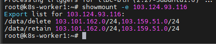
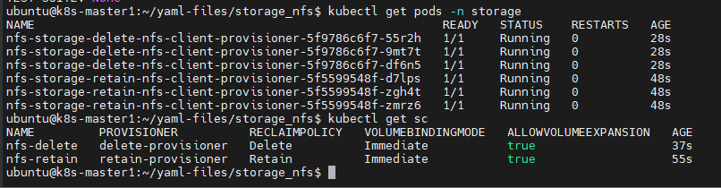

# Cài đặt Storage cho K8s dùng NFS

Trong bài này sẽ hướng dẫn cài đặt cấu hình storage class NFS sử dụng **helm**

Một lưu ý là reclaim policy có 2 loại là ```delete``` và ```retain```:
- ```delete```: khi xóa 1 PVC trên K8s thì hệ thống cũng tự động xóa PV tương ứng và đồng thời hỗ trợ xóa luôn phân vùng lưu trên thiết bị lưu trữ mà gán với PV đó
- ```retain```: ngược lại, khi xóa PVC thì phân vùng lưu dữ liệu trên thiết bị lưu trữ sẽ không tự động bị xóa

## Cài đặt NFS storage cho K8s

Trong môi trường production thì một số loại storage đã hỗ trợ NFS server, nghĩa là có thể output ra cho bạn một phân vùng share để sử dụng. Việc quản lý lỗi, quản lý tính sẵn sàng sẽ được thực hiện trên thiết bị Storage này. Nhưng nếu bạn cài đặt NFS Server để share cho K8s sử dụng thì lúc đó sẽ là một node chạy single và được coi là dead-point vì khi server này down thì sẽ ảnh hưởng toàn bộ dịch vụ. Tuy vậy, trong môi trường lab của bài này thì sẽ cài đặt 1 NFS server để sử dụng.

### 1. Cài đặt NFS Server

Việc cài đặt này khá đơn giản, NFS server trong bài này sử dụng bản phân phối CentOS 7

```sh
yum update -y
yum install -y nfs-utils
```

```sh
mkdir -p /data/delete
mkdir -p /data/retain
```

```sh
chmod -R 755 /data
chown -R nfsnobody:nfsnobody /data
```

```sh
systemctl enable rpcbind --now
systemctl enable nfs-server --now
systemctl enable nfs-lock --now
systemctl enable nfs-idmap --now
```

Cấu hình file ```/etc/exports``` để share quyền cho các node theo format sau mục đích là để cho phép các node trong dải ip worker vào 2 thư mục trên

```sh
/data/retain    103.159.51.0/24(rw,sync,no_root_squash,no_all_squash)
/data/delete    103.159.51.0/24(rw,sync,no_root_squash,no_all_squash)
/data/retain    103.101.162.0/24(rw,sync,no_root_squash,no_all_squash)
/data/delete    103.101.162.0/24(rw,sync,no_root_squash,no_all_squash)
```

```sh
exportfs -a
systemctl restart rpcbind
systemctl restart nfs
```

### 2. Cài đặt NFS Client trên K8s Node

Cần phải cài đặt NFS client trên tẩ cả các worker để khi tạo pod trên node đó có thể sử dụng NFS Storage Class thì node đó có thể mount được phân vùng NFS đã được share bởi NFS server.

```sh
apt-get install nfs-common -y
```



## Cài đặt NFS Storage Class trên K8s

### 1. Cài đặt Helm

```sh
curl -fsSL -o get_helm.sh https://raw.githubusercontent.com/helm/helm/main/scripts/get-helm-3
sudo chmod 700 get_helm.sh
./get_helm.sh
```

Do Helm sẽ mặc định dùng chung config của kubectl nếu có, nên ở bước này không cần cấu hình gì thêm cả.

### 2. Cài đặt NFS Storage

Download helm chart nfs-client-provisioner về để cài offline

```sh
helm repo add stable https://charts.helm.sh/stable
helm search repo nfs-client-provisioner
helm pull stable/nfs-client-provisioner --version 1.2.11
tar -xzf nfs-client-provisioner-1.2.11.tgz
```

Trước khi cài đặt cần thay đổi tham số mặc định của helm chart này. Ta sẽ tạo 2 storage class khác nhau tương ứng với reclaim policy là **delete** và **retain**. Tạo file value cho storage class như sau:

```sh
cp nfs-client-provisioner/values.yaml values-nfs-delete.yaml
cp nfs-client-provisioner/values.yaml values-nfs-retain.yaml
```

Thay đổi các tham số trong file **values-nfs-delete.yaml** như sau:

```sh
replicaCount: 3
server: 103.124.93.116
path: /data/delete
provisionerName: nfs-storage-delete-provisioner
name: nfs-delete
reclaimPolicy: Delete
archiveOnDelete: false
```

Thay đổi các tham số trong file **values-nfs-retain.yaml** như sau:

```sh
replicaCount: 3
server: 103.124.93.116
path: /data/retain
provisionerName: nfs-storage-retain-provisioner
name: nfs-retain
reclaimPolicy: Retain
archiveOnDelete: true
```

Giờ ta cài đặt 2 storage class này, sử dụng 1 namespace riêng để dễ quản lý

```sh
kubectl create namespace "storage"
helm install nfs-storage-retain --namespace storage -f values-nfs-retain.yaml nfs-client-provisioner
helm install nfs-storage-delete --namespace storage -f values-nfs-delete.yaml nfs-client-provisioner
```



### 3. Kiểm tra nfs-storageclass bằng cách tạo thử pvc

Giờ tạo một PVC xem nfs-storageclass nó có tự động sinh ra PV cho mình không. 

Tạo file config cho PVC có recliam policy là delete như sau, lưu ý tham số **storageClassName: nfs-delete** được gán đúng với tên storage class đã tạo ở bước trước:

```sh
cat << EOF > test-pvc-delete.yaml
apiVersion: v1
kind: PersistentVolumeClaim
metadata:
  name: test-pvc-delete
spec:
  storageClassName: nfs-delete
  accessModes:
    - ReadWriteOnce
  resources:
    requests:
      storage: 10Mi
EOF
```

```sh
kubectl apply -f test-pvc-delete.yaml
```

*Đến đây thì kẹt ko rõ vì sao :(( Có vẻ như nfs-client-provisioner đã ko còn hỗ trợ nữa*