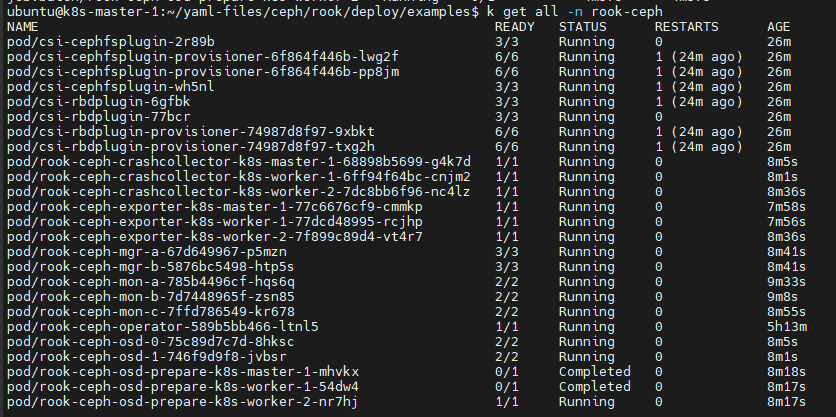
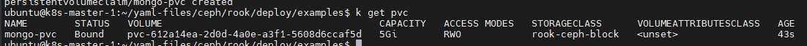

# How to setup a CEPH cluster under K8s using Rook

[Rook](https://rook.io/) là 1 công cụ điều phối storage mà cung cấp 1 giải pháp cloudnative, mã nguồn mở cho nhiều loại storage provider khác nhau. Rook sử dụng sức mạnh của K8s để biến 1 storage system thành những self-mananging service mà cung cấp 1 trải nghiệm thông suốt và tiết kiệm cho K8s và triển khai.

Ceph là 1 giải pháp distributed storage có tính mở rộng rất cao, nó hỗ trợ object, block, và file storage. Ceph clusters được thiết kế để chạy trên bất kỳ phần cứng nào sử dụng thuật toán CRUSH (Controlled Replication Under Scalable Hashing)

Một lợi ích chính của triển khai này là bạn sẽ có 1 giải pháp storage có tính mở rộng cao của Ceph mà không phải cấu hình nó thủ công sử dụng Ceph command line, Rook sẽ lo phần đó cho bạn.
K8s applications có thể sau đó mount block devices và filesystems từ Rook cho PV/PVC.

Trong hướng dẫn này, bạn sẽ thiết lập 1 cụm Ceph sử dụng Rook và sử dụng nó để lưu trữ dữ liệu cho 1 MongoDB database.

### Prerequisites

- Bài viết này sẽ giả định là bạn đã có sẵn 1 cụm Kubernetes, gồm ít nhất là 3 node, với mỗi node có ít nhất 2 vCPUS và 4GB RAM
- Bài viết này sử dụng Rook v1.14, hỗ trợ K8s v1.25 đến v1.30
- Công cụ commandline để tương tác với k8s là **kubectl** đã được cài đặt
- Mỗi node cũng cần có thêm 1 ổ cứng 100GB để sử dụng cho CEPH

## Bước 1: Thiết lập Rook

Sau khi hoàn thành các bước bên trên, bạn đã sẵn sàng để thiết lập Rook.

Trong phần này, bạn sẽ clone Rook repository và deploy Rook operator trên K8s cluster. 1 Rook operator là 1 container mà tự động bootstraps storage cluster và giám sát storage daemons để đảm bảo cụm storage hoạt động ổn định.

Trước khi bắt đầu deploy Rook, đầu tiên bạn cần LVM package trên tất cả nodes của bạn vì nó được yêu cầu bởi Ceph.

```sh
apt-get update -y && apt-get install lvm2 -y
```

Giờ, hãy clone Rook repository:

```sh
git clone --single-branch --branch master https://github.com/rook/rook.git
```

Lệnh này sẽ clone Rook repository từ GitHub và tạo 1 folder tên ```rook```. Hãy đi đến thư mục ceph với lệnh sau:

```sh
cd rook/deploy/examples/
```

Tiếp đến bạn sẽ phải tạo tài nguyên chung mà cần thiết để khởi chạy operator và ceph cluster. Hãy thực hiện lệnh sau:

```sh
kubectl create -f crds.yaml -f common.yaml
```

Tài nguyên mà bạn vừa tạo hầu hết là CustomResourceDefinitions (CRDs), chúng định nghĩa các tài nguyên mới mà operator sẽ sử dụng như ServiceAccount, Role, RoleBinding, ClusterRole, và ClusterRoleBinding.

**Lưu ý:** File manifest này sẽ giả định bạn triển khai tất cả Rook operator và Ceph daemons trong 1 namesspace. Nếu bạn muốn triển khai chúng trên nhiều namespace khác nhau, hãy đọc file ```common.yaml``` để được hướng dẫn chi tiết.

Sau khi common resources được tạo, bước tiếp theo là tạo Rook operator. Hãy thực hiện lệnh sau:

```sh
kubectl create -f operator.yaml
```

Sau đó, bạn có thể kiểm tra trạng thái của rook-ceph để đảm bảo là nó đã hoạt động, lưu ý rằng quá trình này có thể mất vài phút:

```sh
kubectl get pod -n rook-ceph
```

## Bước 2: Tạo Ceph Cluster

Bây giờ, bạn đã thành công thiết lập Rook trên K8s cluster của mình, bạn sẽ cần tiếp tục tạo 1 Ceph cluster bên trong K8s cluster và đảm bảo là nó hoạt động trơn tru.

Đầu tiên hãy xem qua các thành phần quan trọng nhất của Ceph và chức năng của nó:

- **Ceph Monitors**: hay còn được gọi là MONs, chúng chịu trách nhiệm duy trì các ánh xạ của cluster cần thiết cho Ceph daemons cho việc định vị lẫn nhau. Thường thì sẽ có nhiều MON hoạt động để tăng tính tin cậy và sẵn sàng của dịch vụ storage
- **Ceph Managers**: hay còn được gọi là MGRs, là runtime daemons chịu trách nhiệm cho việc theo dõi runtime metrics và trạng thái hiện tại của Ceph Cluster. Chúng chạy cùng MONs để cung cấp thêm khả năng giám sát, cũng như 1 giao diện để cho các hệ thống giám sát và quản lý bên ngoài
- **Ceph Object Store Devices**: còn được gọi là OSDs, chúng chịu trách nhiệm lưu trữ dữ liệu trên local filesystem và cung cấp truy nhập đến chúng thông qua network. Những OSDs này thường gắn liền với 1 physical disk của cụm. Ceph clients giao tiếp với OSDs một cách trực tiếp

Để tương tác được với dữ liệu trên Ceph storage, 1 client sẽ đầu tiên phải liên lạc với Ceph Monitors để thu thập thông tin về phiên bản hiện tại của *cluster map*. Cluster map chứa thông tin về vị trí của storage dữ liệu và cluster topology. Ceph clients sau đó sử dụng cluster map để quyết định OSD nào chúng cần để tương tác.

Rook cho phép Ceph storage chạy trên K8s cluster. Tất cả các thành phần này chạy trên Rook cluster và sẽ trực tiếp tương tác với Rook agents. Điều này cung cấp 1 trải nghiệm mượt mà cho người quản trị Ceph cluster nhờ giấu đi các thành phần như placement groups và storage maps trong khi vẫn cung cấp các tùy chọn thiết lập nâng cao.

Giờ bạn đã có hiểu biết phần nào về việc Ceph là cái gì rồi, hãy thiết lập Ceph cluster thôi.

Bạn có thể hoàn thành thiết lập bằng cách chạy lệnh create với file cấu hình mặc định, hoặc tự viết cho mình 1 file cấu hình riêng. File cấu hình mặc định sử dụng tốt cho hầu hết các trường hợp và cũng cung cấp documentation rất tốt cho từng tham số tùy chọn trong đó.

Hãy cùng tìm hiểu về 1 số thành phần đáng chú ý. Đầu tiên, tệp cấu hình định nghĩa cách mà Ceph cluster sẽ được triển khai. Trong ví dụ này, bạn sẽ deploy 3 Ceph MONs và bật Ceph dashboard.

```sh
apiVersion: ceph.rook.io/v1
kind: CephCluster
metadata:
  name: rook-ceph
  namespace: rook-ceph
```

Sau đó, ```spec``` key định nghĩa mô hình mà K8s sẽ sử dụng để deploy Ceph cluster. Bạn sẽ định nghĩa image version mà bạn muốn sử dụng, cũng như là có cho phép Ceph version đã ngừng hỗ trợ được sử dụng hay không:

```sh
spec:
  cephVersion:
    image: quay.io/ceph/ceph:v18.2.4
    allowUnsupported: false
```

Sau đó, đặt đường dẫn dữ liệu, đây là nơi tệp cấu hình sẽ được lưu trữ sử dụng ```dataDirHostPath```:

```sh
dataDirHostPath: /var/lib/rook
```

Tiếp đến, bạn chỉ định có muốn skip upgrade checks hay không:

```sh
skipUpgradeChecks: false
continueUpgradeAfterChecksEvenIfNotHealthy: false
```

Bạn cấu hình số lượng Ceph MONs sử dụng ```mon``` key. Bạn cũng sẽ cho phép chúng deploy trên cùng 1 node hay không bằng cấu hình sau:

```sh
mon:
    count: 3
    allowMultiplePerNode: false
```

Tùy chọn cho Ceph Dashboard nằm dưới ```dashboard``` key. Điều này cho phép bạn tùy chỉnh có deploy Ceph dashboard hay không, cũng như port, prefix cho nó khi sử dụng reverse proxy:

```sh
dashboard:
    enabled: true
    # serve the dashboard under a subpath (useful when you are accessing the dashboard via a reverse proxy)
    # urlPrefix: /ceph-dashboard
    # serve the dashboard at the given port.
    # port: 8443
    # serve the dashboard using SSL
    ssl: false
```

Bạn cũng có thể bật giám sát cho cụm bằng ```monitoring``` key (điều này sẽ tạo exporter cho Prometheus, tức là Prometheus phải được cài đặt sẵn trong cụm):

```sh
monitoring:
    enabled: false
    rulesNamespace: rook-ceph
```

RBD hay RADOS (Reliable Autonomic Distributed Object Store) block device, là block device mà cho phép thin-provisioned và có thể resize của Ceph mà lưu trữ dữ liệu trên nhiều nodes.

RBD images có thể được chia sẻ bất đồng bộ giữa 2 Ceph cluster bằng cách bật ```rbdMirroring```. Trong khi chúng ta làm việc với 1 cluster trong hướng dẫn này thì tùy chọn này là không cần thiết. Hãy thiết lập số lượng workers thành 0 như dưới đây:

```sh
rbdMirroring:
  workers: 0
```

Bạn có thể bật crash collector cho Ceph daemons:

```sh
crashCollector:
  disable: false
```

Cleanup policy chỉ quan trọng nếu bạn muốn xóa cụm của mình. Bạn có thể để trống nó cũng được:

```sh
cleanupPolicy:
  deleteDataDirOnHosts: ""
removeOSDsIfOutAndSafeToRemove: false
```

```storage``` key cho phép bạn định nghĩa các tùy chọn cho storage của cụm. Ví dụ như node và device nào sẽ được sử dụng, kích thước databasae, hay bao nhiêu OSDs sẽ được tạo mỗi device:

```sh
storage:
  useAllNodes: true
  useAllDevices: true
  config:
    # metadataDevice: "md0" # specify a non-rotational storage so ceph-volume will use it as block db device of bluestore.
    # databaseSizeMB: "1024" # uncomment if the disks are smaller than 100 GB
    # journalSizeMB: "1024"  # uncomment if the disks are 20 GB or smaller
```

Bạn có thể sử dụng ```disruptionManagement``` key để quản lý daemon disruptions trong khi upgrade hoặc fencing:

```sh
disruptionManagement:
  managePodBudgets: false
  osdMaintenanceTimeout: 30
  manageMachineDisruptionBudgets: false
  machineDisruptionBudgetNamespace: openshift-machine-api
```

Trên đây là những cấu hình mà mình cho là đáng chú ý. Sau khi đã chỉnh sửa theo ý muốn, hãy lưu và thoát file.

Tiếp theo, hãy áp dụng file cluster:

```sh
kubectl apply -f cluster.yaml
```

Hãy kiểm tra và chắc chắn là tất cả pods đều đã running (quá trình deploy có thể tốn vài phút):

```sh
kubectl get pods -n rook-ceph
```

Sau khi tất cả hoạt động, bạn đã hoàn thành setup Ceph cluster và có thể tiếp tục bằng cách tạo storage block



## Bước 3: Tạo Block Storage

Block storage cho phép 1 pod có thể mount storage. Trong phần này, bạn sẽ tạo 1 storage block mà sau đó sử dụng cho ứng dụng của bạn.

Trước khi Ceph có thể cung cấp storage cho cụm, nó cần phải tạo 1 ```storageclass``` và 1 ```cephblockpool```. Điều này sẽ cho phép K8s có thể kết hợp với Rook khi tạo Persistent volumes:

```sh
kubectl apply -f csi/rbd/storageclass.yaml
```

Sau khi thành công deploy ```storageclass``` và ```cephblockpool```, bạn sẽ tiếp tục định nghĩa PersistentVolumeClaim (PVC) cho ứng dụng. 1 PVC là 1 tài nguyên được sử dụng để yêu cầu không gian lưu trữ từ cluster.

Một PVC có thể được định nghĩa như sau:

```sh
apiVersion: v1
kind: PersistentVolumeClaim
metadata:
  name: mongo-pvc
spec:
  storageClassName: rook-ceph-block
  accessModes:
  - ReadWriteOnce
  resources:
    requests:
      storage: 5Gi
```

Đầu tiên, bạn cần đặt 1 ```apiVersion```, ở đây ```v1``` là phiên bản ổn định để sử dụng. Sau đó bạn cần xác định loại tài nguyên sẽ sử dụng thông qua ```kind``` (trong trường hợp này là ```PersistentVolumeClaim```).

```spec``` key định nghĩa mô hình mà K8s sẽ sử dụng để tạo PVC. Ở đây bạn cần chọn storage class bạn đã tạo trước đó: ```rook-ceph-block```. Bạn có thể định nghĩa access mode và giới hạn tài nguyên của Claim. ```ReadWriteOnce``` (RWO) có nghĩa là volume chỉ có thể được mount bởi pod ở cùng node với volume.

Giờ bạn đã sẵn sàng để tạo PVC:

```sh
kubectl apply -f pvc-rook-ceph-block.yaml
```

Kiểm tra lại trạng thái của PVC với lệnh

```sh
kubectl get pvc
```



## Bước 4: Tạo 1 MongoDB deployment với rook-ceph-block

Sau khi đã có storage lưu trữ dữ liệu, hãy tạo 1 application để sử dụng nó, trong trường hợp này sẽ là 1 database MongoDB.

File cấu hình sẽ cần 1 vài thông tin như sau:

- 1 container deployment dựa trên phiên bản image mới nhất của mongo
- 1 PV để lưu trữ dữ liệu của database
- 1 service để expose MongoDB trên port ```31017```

```sh
cat << EOF >> mongo.yaml
apiVersion: apps/v1
kind: Deployment
metadata:
  name: mongo
spec:
  selector:
    matchLabels:
      app: mongo
  template:
    metadata:
      labels:
        app: mongo
    spec:
      containers:
      - image: mongo:latest
        name: mongo
        ports:
        - containerPort: 27017
          name: mongo
        volumeMounts:
        - name: mongo-persistent-storage
          mountPath: /data/db
      volumes:
      - name: mongo-persistent-storage
        persistentVolumeClaim:
          claimName: mongo-pvc
---
apiVersion: v1
kind: Service
metadata:
  name: mongo
  labels:
    app: mongo
spec:
  selector:
    app: mongo
  type: NodePort
  ports:
    - port: 27017
      nodePort: 31017
EOF
```

Lưu ý rằng, cách triển khai service sử dụng NodePort này chỉ nên dùng cho mục đích kiểm thử. Hãy áp dụng file manifest vừa tạo:

```sh
kubectl apply -f mongo.yaml
```

Để kiểm tra xem pod mongodb đã tạo thành công hay chưa, hãy sử dụng

```sh
kubectl get pods
```

Output sẽ tương tự như thế này

```sh
NAME                    READY   STATUS    RESTARTS   AGE
mongo-5858fdd58-2n4hj   1/1     Running   0          92s
```

Để kiểm tra insert dữ liệu vào database, cách nhanh nhất là truy cập vào pod và sử dụng MongoDB shell:

```sh
kubectl exec -it mongo-5858fdd58-2n4hj -- mongosh
```

Chuyển đổi sang database test

```sh
use test
```

Thêm dữ liệu vào database

```sh
db.test.insertOne( {name: "test", number: 10  })
```

Kiểm tra dữ liệu vừa tạo

```sh
db.getCollection("test").find()
```

Kết quả trả về chính là object mà bạn vừa thêm vào database, nó sẽ được bảo toàn bên dưới Ceph volume. Một trong những lợi thế lớn nhất của kiểu triển khai này là **dynamic provisioning**, điều này có nghĩa là bạn chỉ cần yêu cầu tài nguyên lưu trữ và Ceph sẽ tự động cung cấp nó cho bạn.

Giờ, hãy xóa pod mongo vừa tạo đi để xác minh rằng dữ liệu lưu trong PV được bảo toàn ngay cả khi ứng dụng không còn nữa

```sh
kubectl delete pod -l app=mongo
```

Deployment sẽ tự động tạo lại 1 pod mongodb mới, sau đó chúng ta có thể thực hiện lại các bước bên trên để kiểm tra dữ liệu trong database.

Như vậy là bạn đã hoàn tất thiết lập 1 cụm Rook-Ceph trên K8s giúp bạn lưu trữ dữ liệu của ứng dụng và chia sẻ chúng giữa các pods mà không phải sử dụng external storage hay cung cấp storage 1 cách thủ công.

## Tổng kết

Sau bài viết này, bạn có thể đã biết thêm những thuật ngữ hữu ích và trở nên quen thuộc hơn với mô hình hoạt động của rook, ceph, hay cả k8s nữa. Nếu bạn có hứng thú với Rook, hãy xem qua [Rook documentation](https://rook.github.io/docs/rook/latest/Getting-Started/intro/) chính thức của họ để hiểu hơn về cách cấu hình cũng như những công cụ xoay quanh.

Ceph không chỉ cung cấp block storage, bạn cũng có thể tìm hiểu thêm về cách về [shared file systems](https://github.com/rook/rook/blob/master/Documentation/Storage-Configuration/Shared-Filesystem-CephFS/filesystem-storage.md) nếu bạn muốn mount cùng 1 volume cho nhiều pods khác nhau.

Cuối cùng, đừng quên ghé thăm [Wiki Nhân Hòa](wiki.nhanhoa.com) để đón đọc nhiều bài viết thú vị hơn nữa.

Chúc bạn luôn may mắn và thành công trong công việc!