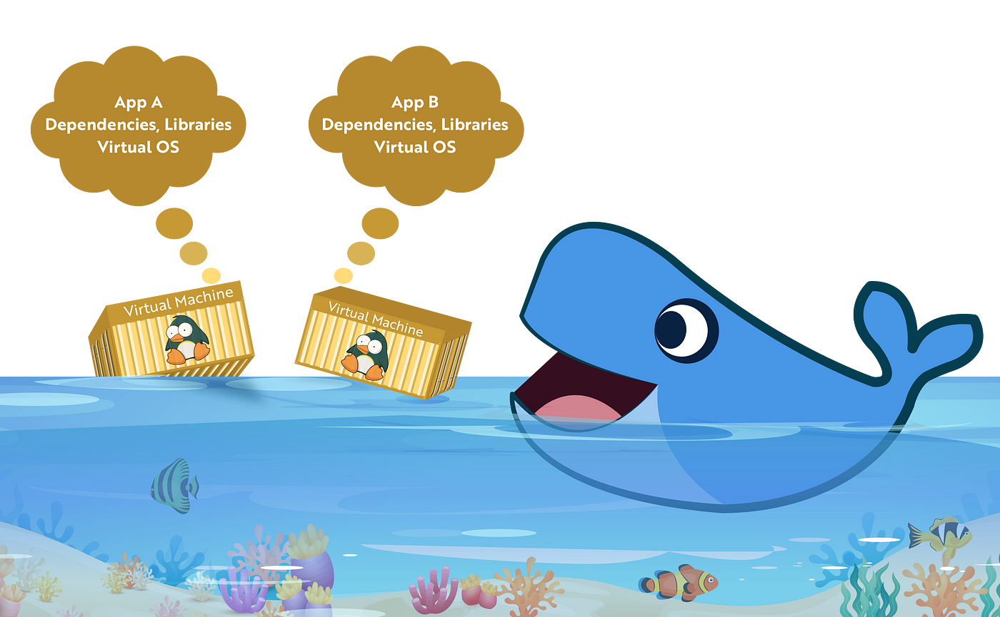
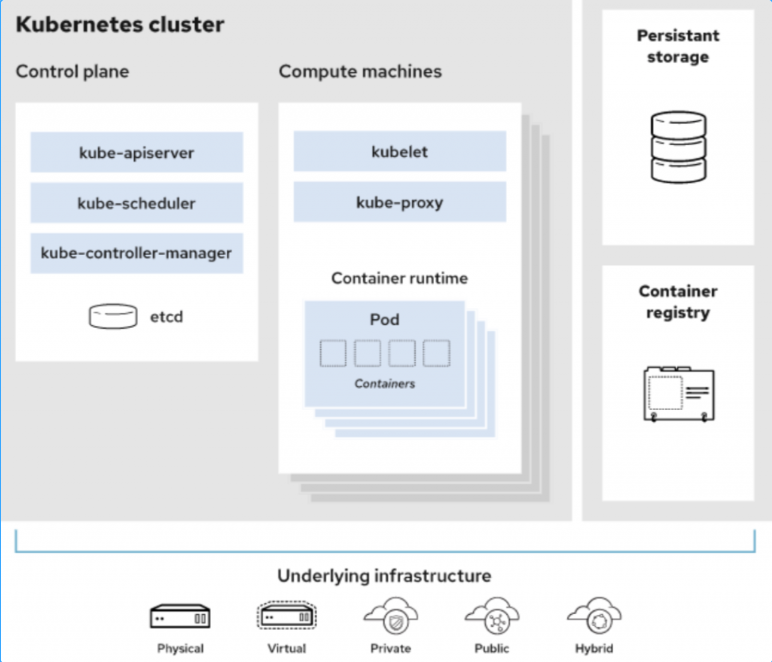

# Kubernetes

## Lịch sử ra đời

**2003-2004: Sự ra đời của Borg System**
- Google giới thiệu Borg System vào khoảng năm 2003. Nó được bắt đầu như 1 project nhỏ với 3-4 người kết hợp với search engine mới của Google. Borg là 1 hệ thống quản lý cụm nội bộ quy mô lớn, thứ mà chạy hàng trăm đến hàng nghìn jobs, từ hàng nghìn ứng dụng khác nhau, trải rộng trên nhiều cluster, mỗi chúng lại bao gồm đến hàng vạn hệ thống lớn nhỏ

**2013: Từ Borg đến Omega**
- Tiếp nối Borge, Google giới thiệu hệ thống quản lý cụm Omega, 1 giải pháp linh hoạt và scalable cho các cụm compute lớn

**2014: Google giới thiệu Kubernetes (K8s)**
- Vào giữa năm 2014, Google lần đầu tiên giới thiệu Kubernetes như 1 phiên bản mã nguồn mở của Borg
- 7 tháng 7: Chính thức ra mắt, Kubernetes lần đầu được commit lên github
- 10 tháng 7: Microsoft, RedHat, IBM, Docker gia nhận Kubernetes community

**2015: Năm của Kube v1.0 và CNCF**
- K8s v1.0 ra đời. Cùng với đó, Google hợp tác với Linux Foundation để tạo nên Cloud Native Computing Foundation (CNCF). Mục tiêu của CNCF là xây dựng một hệ sinh thái ổn định để thúc đẩy cộng đồng xoay quanh một loạt các project chất lượng cao mà điều phối container là 1 phần của kiến trúc vi dịch vụ
- Kubecon 2015 ở San Francisco với sự tham gia của các chuyên gia về công nghệ

**2016: Kubernetes thực sự được biết đến rộng rãi**
- Sự ra mắt của Helm, Minikube, Kubeadm,...
- Kubecon 2016 ở EU có khoảng 500 người tham dự
- Pokemon GO: 1 dự án rất nổi tiếng hoạt động trên nền tảng K8s
- CloudNativeCon và K8scon ở Seattle với khoảng 1000 người tham dự

**2017: Năm của tích hợp và hỗ trợ doanh nghiệp**
- Github chính thức chạy trên K8s, triển khai trên metal cloud
- Oracle ra mắt bộ cài K8s cho Oracle cloud và ra mắt phiên bản K8s cho Oracle Linux
- Docker hoàn toàn hỗ trợ K8s
- Sự tích hợp của K8s vào 2 nền tảng Cloud Native khổng lồ là AKS (Azure) và AWS (Amazon)
- Kubecon ở Bắc Mĩ với hơn 4100 khách mời

**2018:**
- Tiếp tục là các ông lớn tích hợp K8s vào Cloud: DigitalOcean, GKE (Google), EKS (Amazon
)

## Containers và Virtual Machines

Container là giải ảo hóa, giúp giải quyết vấn đề làm sao để chuyển giao phần mềm một cách đáng tin cậy (không phát sinh lỗi) giữa các môi trường máy tính khác nhau. Chẳng hạn như giữa máy tính của lập trình viên với máy của tester, giữa môi trường staging (môi trường tiền thực tế) với môi trường thực tế hay thậm chí giữa máy chủ riêng đặt tại trung tâm dữ liệu với máy ảo trên Cloud

Container giải quyết vấn đề trên bằng cách tạo ra một môi trường bị cô lập (isolated) chứa mọi thứ mà phần mềm cần để có thể chạy được bao gồm mã nguồn, các thư viện runtime, các thư viện hệ thống, các công cụ hệ thống,... (gọi là sự phụ phuộc hoặc các phụ thuộc) mà không bị các yếu tố liên quan đến môi trường hệ thống làm ảnh hưởng tới cũng như không làm ảnh hưởng tới các phần còn lại của hệ thống

Thông thường các container cho người dùng sự cải thiện về hiệu suất. Bằng cách tránh các hệ điều hành riêng biệt và thay vì sử dụng một share core, người dùng có thể tối đa hóa CPU, dung lượng lưu trữ và hiệu quả bộ nhớ




## K8s là gì ?

Kubernetes hay K8s là một nền tảng điều phối container mã nguồn mở. Ta có thể dùng Kubernetes để tự động hóa nhiều quy trình thủ công liên quan đến việc deploy, quản lý và mở rộng các ứng dụng trong container. Nói cách khác, ta có thể tập hợp các nhóm host đang chạy Linux container với nhau. Từ đó, Kubernetes có thể giúp dễ dàng quản lý các nhóm đó một cách hiệu quả nhất.



Mỗi node là một môi trường Linux/Windows, đó có thể là một máy vật lý hay máy ảo. Mỗi node sẽ chạy các pod được tạo từ những container.

Control plane có nhiệm vụ duy trì trạng thái mong muốn của cluster. Chẳng hạn như ứng dụng đang chạy hay container image đang được sử dụng. Còn compute machine sẽ chạy các ứng dụng và workload.

Kubernetes control plane nhận các lệnh từ người quản trị và chuyển tiếp các lệnh đó đến compute machine. Việc này sẽ hoạt động với vô số dịch vụ để tự động quyết định node phù hợp nhất cho task. Tiếp đến, nó sẽ phân bổ tài nguyên và chỉ định các pod trong node để hoàn thành công việc được yêu cầu.

Trạng thái mong muốn của một cluster sẽ xác định các ứng dụng hoặc workload nên chạy. Cùng với đó là quyết định những image nào sẽ sử dụng, các tài nguyên nào nên được cung cấp và nhiều chi tiết cấu hình khác.

Xét về cơ sở hạ tầng, có rất ít thay đổi với cách ta quản lý container. Quyền kiểm soát container chỉ xảy ra ở một cấp độ cao hơn, giúp kiểm soát tốt hơn mà không cần phải quản lý vi mô từng container hay node riêng biệt.

Công việc của ta liên quan đến việc cấu hình Kubernetes, xác định node, pod và container bên trong chúng. Còn Kubernetes sẽ xử lý việc sắp xếp các container.

Ta có thể tự do lựa chọn nơi sử dụng Kubernetes. Có thể là trên bare metal server, máy ảo, nhà cung cấp public cloud/private cloud hay môi trường hybrid cloud. Một trong những ưu điểm chính của Kubernetes là nó có thể hoạt động trên nhiều cơ sở hạ tầng khác nhau.

## Các khái niệm cơ bản

### 1. Node

Node là thành phần của phần cứng. Một node có thể là một máy ảo host bởi nhà cung cấp cloud, hay là một máy vật lý trong các data center. Tuy nhiên, để nghĩ về node một cách đơn giản hơn, ta có thể xem nó như các tài nguyên CPU/RAM được sử dụng bởi Kubernetes cluster, thay vì chỉ là các máy đơn lẻ. Sở dĩ vì các pod không bị giới hạn với bất kỳ máy nhất định nào, tại mọi thời điểm. Do đó, chúng sẽ di chuyển trên tất cả tài nguyên có sẵn để đạt được trạng thái mong muốn của ứng dụng.

Có 2 loại node khác nhau là worker và master:

Master node: đóng vai trò là control của cụm cluster, máy điều khiển các kubernetes node. Đây là nơi tất cả các nhiệm vụ được giao
Worker node: các máy này thực hiện các tác vụ được yêu cầu, là nơi khởi chạy trực tiếp của các ứng dụng, Kubernetes master điều khiển chúng.

### 2. Cluster

Một cluster là một chuỗi các node được liên kết với nhau.

Bằng cách kết hợp với nhau, những node này có thể tổng hợp tài nguyên của chúng. Từ đó làm cho cluster mạnh hơn nhiều so với những máy riêng lẻ. Kubernetes di chuyển các pod xung quanh cluster khi những node được thêm hay xóa

Một cluster có thể chứa nhiều node worker, và phải có ít nhất một node master.

### 3. Pod

Pod là đơn vị nhỏ nhất để schedule, deploy và cô lập runtime của một hoặc nhiều container liên quan tới nhau. Các container trong cùng một pod sẽ luôn được schedule trên cùng một node và cùng nhau chia sẻ tài nguyên. Nếu node đó đột nhiên dừng hoạt động, các Pod nằm trên Node đó sẽ được schedule lại trên một Node khác trong Cluster. Application của bạn sẽ chạy trong Pod, nhưng thực tế bạn sẽ không truy cập trực tiếp vào Pod mà thay vào đó sẽ sử dụng một object khác gọi là Service

Hiểu đơn giản, Pod là 1 cấp độ cao hơn của Container, nó thể chứa nhiều container cùng xử lý 1 loại công việc. Các container sẽ có chung một địa chỉ IP, chia sẻ cùng 1 volume.

### 4. ReplicaSets / Replication Controller

Trong thực tế, các Pod khi được chạy trên các cluster Kubernetes hoàn toàn có thể bị lỗi, đột tử với nhiều lý do khác nhau. Với Replication Controller, nó sẽ đảm bảo tạo lại Pod mới thay thế khi Pod cũ lỗi (hay các node cũ lỗi). Một cách đầy đủ hơn, Replication Controller sẽ duy trì số Pod đang chạy với số lượng được chỉ định trước (ít hơn thì tạo thêm pod mới, thừa thì xóa bớt pod đi)

### 5. Deployment

Deployment cao hơn 1 bước nữa, nó quản lý các ReplicaSets, số lượng, phiên bản, số lượng Pods trong ReplicaSets. Ngoài ra, Deployment còn có cơ chế giúp người quản lý hệ thống dễ dàng cập nhật, rollback phiên bản của ứng dụng (phiên bản container chạy trong các Pod).

### 6. Service

Các Pod sẽ có IP, hostname riêng chứa các container của ứng dụng. Client có thể kết nối đến các Pod để tương tác bằng IP hay hostname tương ứng. Tuy nhiên, có một vấn đề là các Pod có thể bị crash hay lỗi bất ngờ, khi Replication Controller tạo lại Pod mới thay thế thì các thông số như địa chỉ IP, hostname cũng thay đổi. Hơn nữa một ứng dụng triển khai trên Kubenetes có nhiều Pod chạy cùng lúc, client không nên và cũng không cần thiết lưu trữ 1 tá các địa chỉ IP, hostname của các Pod

Do đó Kubernetes Service ra đời cho phép tạo một điểm truy cập duy nhất đến các Pod cung cấp cùng 1 dịch vụ. Mỗi Service có địa chỉ IP và port không đổi. Client có thể mở các kết nối đến IP và port của service, sau đó chúng sẽ được điều hướng đến các Pod để xử lý

## Thực hành với Minikube

Minikube là một công cụ cho phép bạn xây dựng một K8s cục bộ. Minikube sẽ chạy một cụm K8s bao gồm 1 node trên server hoặc máy tính cá nhân

Minikube là một công cụ hoàn hảo để người dùng có thể học, làm quen và phát triển trên môi trường K8s

Hướng dẫn này sử dụng bản phân phối là Ubuntu 20.04

### 1. Thiết lập hostname

Sử dụng lệnh sau đây để đặt hostname cho server

```sh
hostnamectl set-hostname minikube.baotrung.xyz
```

Hostname nên được thiết lập đầy đủ cả hostname và domain name

Cấu hình hostname trong file /etc/hosts

```sh
[IP_Address] <host.domain> <host>
```

Restart lại server để nhận đầy đủ hostname đã thiết lập

### 2. Cài đặt docker

Thực hiện cài đặt 

```sh
apt install -y docker.io
```

Sau khi cài đặt có thể kiểm tra version bằng lệnh

```sh
docker version
```

### 3. Cài đặt kubectl

Download bản mới nhất bằng lệnh

```sh
curl -LO "https://dl.k8s.io/release/$(curl -L -s https://dl.k8s.io/release/stable.txt)/bin/linux/amd64/kubectl"
```

Cài đặt kubectl với lệnh sau

```sh
sudo install -o root -g root -m 0755 kubectl /usr/local/bin/kubectl
```

Kiểm tra bằng lệnh

```sh
kubectl version
```

### 4. Cài đặt conntrack với lệnh sau

Conntrack hay connection tracking cho phép kernel theo dõi tất cả các kết nối hay phiên làm việc của mạng logic. NAT nhờ những thông tin này để biên dịch tất cả các gói tin với cùng phương thức, và iptables nhờ đó có thể hoạt động như 1 stateful firewall

```sh
apt-get install -y conntrack
```

### 5. Cài đặt Minikube

Download file cài đặt và cấp quyền thực thi bằng lệnh

```sh
curl -Lo minikube https://storage.googleapis.com/minikube/releases/latest/minikube-linux-amd64 && chmod +x minikube
```

Tiến hành cài đặt minikube

```sh
sudo mkdir -p /usr/local/bin/
sudo install minikube /usr/local/bin/
```

Chạy minikube trên server với lệnh

```sh
minikube start --network-plugin=cni --vm-driver=docker --force
```

Kiểm tra trạng thái 

```sh
minikube status
```

hoặc 

```sh
kubectl get pods -A
```

### 6. Cài đặt calico

Thực hiện lệnh cài đặt

```sh
kubectl apply -f https://raw.githubusercontent.com/projectcalico/calico/master/manifests/calico.yaml
```

Kiểm tra kết quả

```sh
kubectl get pods -l k8s-app=calico-node -A
```

### 7. Các lệnh kiểm tra trạng thái

Kiểm tra trạng thái minikube

```sh
minikube status
```

Kiểm tra thông tin k8s cluster

```sh
kubectl cluster-info
```

Để kiểm tra log quá trình cài đặt

```sh
minikube logs
```

### 8. Deployment và Service demo

Tạo file ```nginx-deployment.yaml``` với nội dung sau:

```sh
apiVersion: apps/v1
kind: Deployment
metadata:
  name: nginx-deployment
  labels:
    app: nginx
spec:
  replicas: 1
  selector:
    matchLabels:
      app: nginx
  template:
    metadata:
      labels:
        app: nginx
    spec:
      containers:
      - name: nginx
        image: nginx:1.14.2
        ports:
        - name: http
          containerPort: 80
```

Và file ```nginx-service.yaml``` như sau:

```sh
apiVersion: v1
kind: Service
metadata:
  labels:
    app: nginx
  name: nginx-svc
spec:
  ports:
  - port: 80
    protocol: TCP
    targetPort: 80
  selector:
    app: nginx
  type: NodePort
```

Áp dụng:

```sh
kubectl apply -f nginx-deployment.yaml
kubectl apply -f nginx-service.yaml
```

Lấy IP và port để truy cập service:

```sh
minikube service nginx-svc
```

Curl đến service:

```sh
curl http://192.168.49.2:32178
```