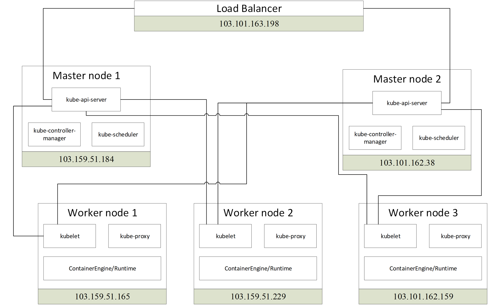
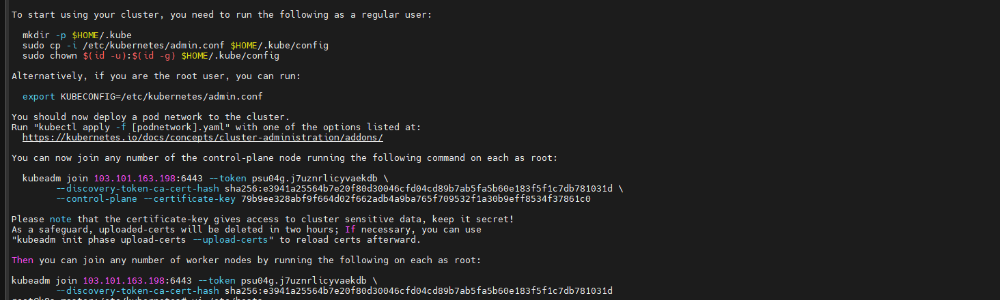
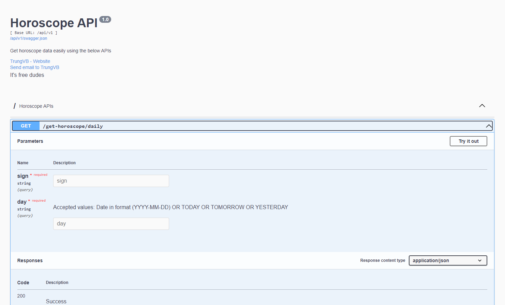
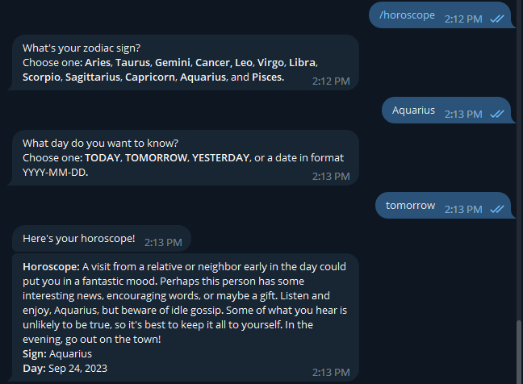

# Kubernetes - Training buổi 2

Trước khi bắt đầu, hãy chắc chắn là bạn đã đọc và hiểu những gì được truyền tải trong buổi 1

[K8s - Training buổi 1](https://github.com/shaidoka/thuctap-NhanHoa/blob/main/k8s/K8s_Training/K8s_Training_1.md)

## Nội dung

Trong buổi training lần này, chúng ta sẽ tìm hiểu các nội dung sau đây:

I. Mô hình và cách xây dựng 1 cụm k8s HA gồm >=2 node master và >=2 node worker

II. Quy trình triển khai ứng dụng lên k8s

III. Autoscaling

## I. Xây dựng cụm k8s 

### Mô hình tổng quan



**Lưu ý:**
- Với mục đích tìm hiểu và kiểm thử thì sử dụng 2 hay 3 worker node đều được
- OS sử dụng trong bài này là Ubuntu 18.04, có thể sử dụng Ubuntu 20.04 cũng được, không khuyến khích 22.04

### Xây dựng hệ thống

#### 1. Cài đặt bộ cân bằng tải sử dụng HAProxy

Thay đổi hostname cho LB

```sh
hostnamectl set-hostname k8s-loadbalancer
```

Chỉnh sửa file hosts (**chỉnh sửa IP cho phù hợp**)

```sh
echo << EOF > /etc/hosts
127.0.0.1       localhost k8s-loadbalancer
103.159.51.184       k8s-master1
103.101.162.38       k8s-master2
103.159.51.229       k8s-worker1
103.159.51.165       k8s-worker2
103.101.162.159      k8s-worker3
103.101.163.198      k8s-loadbalancer
EOF
```

Cài đặt HAProxy

```sh
apt-get update -y && apt-get upgrade -y
apt-get install haproxy
```

Chỉnh sửa file cấu hình HAProxy tại ```/etc/haproxy/haproxy.cfg``` (**chỉnh sửa IP cho phù hợp**)

```sh
global
  log /dev/log  local0
  log /dev/log  local1 notice
  stats socket /var/lib/haproxy/stats level admin
  chroot /var/lib/haproxy
  user haproxy
  group haproxy
  daemon

defaults
  log global
  mode  http
  option  httplog
  option  dontlognull
        timeout connect 5000
        timeout client 50000
        timeout server 50000

frontend kubernetes
    bind 103.101.163.198:6443
    option tcplog
    mode tcp
    default_backend kubernetes-master-nodes

backend kubernetes-master-nodes
    mode tcp
    balance roundrobin
    option tcp-check
    server k8s-master1 103.159.51.184:6443 check fall 3 rise 2
    server k8s-master2 103.101.162.38:6443 check fall 3 rise 2

listen stats
    bind 103.101.163.198:8080
    mode http
    stats enable
    stats uri /
    stats realm HAProxy\ Statistics
    stats auth admin:haproxy
```

Start dịch vụ

```sh
systemctl start haproxy
```

#### 2. Bước chuẩn bị trên các node

**Các bước sau làm trên cả 5 node (thay đổi IP cho phù hợp)**

- Update và upgrade package của Ubuntu

```sh
apt-get update -y && apt-get upgrade -y
apt-get -y install vim curl wget 
apt-get -y install byobu
```

- Tắt swap

```sh
swapoff -a
```

- Mở ```/etc/fstab``` và đóng dòng mount fstab lại (nếu có)

- Kiểm tra lại bằng lệnh ```free -hm```

- Khai báo các node trong file hosts và đặt hostname cho node

```sh
cat << EOF > /etc/hosts
127.0.0.1       localhost k8s-master1
103.159.51.184       k8s-master1
103.159.51.229       k8s-worker1
103.159.51.165       k8s-worker2
103.101.162.159       k8s-worker3
103.101.162.38       k8s-master2
103.101.163.198       k8s-loadbalancer
EOF
```

```sh
hostnamectl set-hostname k8s-master1
```

- Khởi động lại node

```sh
init 6
```

#### 3. Cài đặt docker và các thành phần cần thiết của K8s

Trên tất cả các node sẽ phải có các thành phần: docker, kubelet, kubeadm và kubectl. Trong đó:
- ```docker```: môi trường chạy các container
- ```kubeadm```: được sử dụng để thiết lập cụm cluster cho K8s. Các tài liệu chuyên môn gọi kubeadm là một bootstrap (bootstrap tạm hiểu là 1 tool đóng gói để tự động làm việc gì đó)
- ```kubelet```: là thành phần chạy trên các host, có nhiệm vụ kích hoạt các pod và container trong cụm cluster của K8s
- ```kubectl```: là công cụ cung cấp CLI để tương tác với K8s

Đầu tiên, cài đặt Docker trên tất cả các node

```sh
apt-get -y install docker.io
```

Cài đặt các thành phần của K8s trên tất cả các node

```sh
apt-get update && apt-get install -y apt-transport-https

curl -s https://packages.cloud.google.com/apt/doc/apt-key.gpg | apt-key add

cat <<EOF >/etc/apt/sources.list.d/kubernetes.list
deb http://apt.kubernetes.io/ kubernetes-xenial main
EOF

apt-get update  -y
apt-get install -y kubelet kubeadm kubectl
```

**Lưu ý:** Trước khi cài đặt ta **có thể** dùng lệnh ```apt-cache madison kubeadm``` để kiểm tra các phiên bản khả dụng trước khi cài đặt nó.

Đánh dấu không update các package liên quan đến kubernetes

```sh
apt-mark hold kubelet
apt-mark hold kubeadm
apt-mark hold kubectl
```

#### 4. Khởi tạo cluster

Thiết lập cluster:
- Đứng trên node ```k8s-master1``` thực hiện lệnh dưới để thiết lập cluster **(thay đổi IP cho phù hợp)**

```sh
kubeadm init --apiserver-advertise-address 103.159.51.184 --pod-network-cidr=10.244.0.0/16 --control-plane-endpoint "103.101.163.198:6443" --upload-certs
```

Trong đó:
- ```103.159.51.184```: là IP của node k8s-master
- ```103.101.163.198```: là IP của loadbalancer
- ```--apiserver-advertise-address```: là địa chỉ của node k8s-master, địa chỉ này cần truyền thông được với các node còn lại của cụm cluster. Trong ví dụ này node k8s master có địa chỉ là 103.159.51.184
- ```--pod-network-cidr```: là dải địa chỉ mạng phụ thuộc mà công nghệ network sẽ sử dụng khi kết hợp với K8s, trong hướng dẫn này sử dụng flannel và flannel sử dụng dải 10.244.0.0/16
- ```--control-plane-endpoint```: khai báo địa chỉ của loadbalancer để các master node kết nối đến

Sau khi thực hiện các bước cài đặt ban đầu, các node sau đó có thể được join vào cluster bằng token và key đã được cấp



Lệnh join node thường có dạng như sau: **(LƯU Ý LÀ NÓ CÓ DẠNG NHƯ DƯỚI ĐÂY THÔI, AE PHẢI COPY LỆNH CHÍNH XÁC Ở ĐẦU RA CỦA LỆNH KHỞI TẠO CLUSTER THÌ MỚI ĐƯỢC)**

- Với node master:

```sh
kubeadm join 103.101.163.198:6443 --token psu04g.j7uznrlicyvaekdb \
        --discovery-token-ca-cert-hash sha256:e3941a25564b7e20f80d30046cfd04cd89b7ab5fa5b60e183f5f1c7db781031d \
        --control-plane --certificate-key 79b9ee328abf9f664d02f662adb4a9ba765f709532f1a30b9eff8534f37861c0
```

- Với node worker:

```sh
kubeadm join 103.101.163.198:6443 --token psu04g.j7uznrlicyvaekdb \
        --discovery-token-ca-cert-hash sha256:e3941a25564b7e20f80d30046cfd04cd89b7ab5fa5b60e183f5f1c7db781031d
```

- Tạo user ```ubuntu``` để thực hiện cấu hình cho K8s. Nếu có user trước đó rồi thì không cần thực hiện bước này

```sh
useradd ubuntu
```

- Nhập thông tin và mật khẩu cho user ```ubuntu```, sau đó phân quyền sudoer bằng lệnh dưới

```sh
echo "ubuntu ALL=(ALL) NOPASSWD: ALL" >> /etc/sudoers
```

- Chuyển sang user ubuntu để thực hiện

```sh
su ubuntu
mkdir -p $HOME/.kube
sudo cp -i /etc/kubernetes/admin.conf $HOME/.kube/config
sudo chown $(id -u):$(id -g) $HOME/.kube/config
```

- Sử dụng thủ thuật dưới để thao tác lệnh trong K8s được thuận lợi hơn nhờ việc tự động hoàn thiện lệnh mỗi khi thao tác

```sh
echo "source <(kubectl completion bash)" >> ~/.bashrc
```

Cài đặt Pod Network
- Đứng trên node K8s-master1 cài đặt Pod network
- K8s có nhiều lựa chọn cho giải pháp network để kết nối các container, trong hướng dẫn này chúng ta sử dụng flannel

```sh
kubectl apply -f https://raw.githubusercontent.com/coreos/flannel/master/Documentation/kube-flannel.yml
```

#### 5. Cài đặt helm

Helm là một trình quản lý gói và công cụ quản lý ứng dụng cho K8s, nó đóng gói nhiều tài nguyên K8s vào một đơn vị triển khai logic duy nhất được gọi là Chart. Bên trong của Chart sẽ có phần chính là các template, là định nghĩa các tài nguyên sẽ triển khai lên K8s. Nhờ helm ta có thể đơn giản hóa quá trình cài đặt của rất nhiều thành phần trong K8s.

```sh
curl -fsSL -o get_helm.sh https://raw.githubusercontent.com/helm/helm/main/scripts/get-helm-3
sudo chmod 700 get_helm.sh
./get_helm.sh
```

#### 6. Cài đặt metrics server

Metrics server là một add-ons, chứ nó không có sẵn trong K8s cluster của ta, nếu ta muốn sử dụng được tính năng autoscaling, ta cần phải cài đặt metrics server này vào.

```sh
kubectl apply -f https://github.com/kubernetes-sigs/metrics-server/releases/latest/download/components.yaml
```

Kubelet certificate cần phải được ký bởi cluster CA, hoặc tắt nó đi bằng cách

```sh
kubectl edit deployment metrics-server -n kube-system
```
Sau đó tìm đến ```.spec.template.spec.containers[].args[]``` và thêm tham số sau vào ```--kubelet-insecure-tls```

Kiểm tra đã cài đặt thành công chưa bằng lệnh

```sh
kubectl top node
```

#### 7. Cài đặt nginx ingress controller

Trong các môi trường cloud truyền thống, nơi mà network load balancer là khả dụng, 1 tệp cấu hình trong K8s có thể cung cấp 1 điểm kết nối để giao tiếp đến Ingress-Nginx Controller với client bên ngoài, và, trực tiếp đối với các ứng dụng bên trong cluster. Môi trường bare-metal lại thiếu đi đối tượng này, do đó nó cần được setup khác đi một chút để có thể cung cấp 1 access point hoạt động tương tự ra các client bên ngoài.

Cài đặt nginx ingress controller:

```sh
kubectl apply -f https://raw.githubusercontent.com/kubernetes/ingress-nginx/controller-v1.8.0/deploy/static/provider/cloud/deploy.yaml
```

Cài đặt metalLB:

```sh
kubectl apply -f https://raw.githubusercontent.com/metallb/metallb/v0.13.9/config/manifests/metallb-native.yaml
```

Lệnh trên sẽ deploy MetalLB vào cluster dưới namespace ```metallb-system```. Các thành phần trong file manifest này bao gồm:
- ```metallb-system/controller``` deployment. Đây là 1 controller toàn cluster sử dụng để xử lý phân phối IP address
- ```metallb-system/speaker``` daemonset. Đây là 1 thành phần mà đưa ra protocol mà bạn sử dụng để giúp service reachable
- Các service account cho controller và speaker, cùng với quyền RBAC mà các thành phần này cần để hoạt động

MetalLB cần 1 pool địa chỉ IP để sử dụng cho ```ingress-nginx``` service. Pool này có thể chỉ định thông qua ```IPAddressPool``` object ở trong cùng namespace với MetalLB controller. 

Tạo 1 object với kind IPAddressPool như sau **(IP ở đây phải là IP nơi mà ingress controller được đặt)**

```sh
apiVersion: metallb.io/v1beta1
kind: IPAddressPool
metadata:
  name: default
  namespace: metallb-system
spec:
  addresses:
  - 103.159.51.184
  autoAssign: true
---
apiVersion: metallb.io/v1beta1
kind: L2Advertisement
metadata:
  name: default
  namespace: metallb-system
spec:
  ipAddressPools:
  - default
```

```sh
kubectl apply -f ipaddresspool.yaml
```

## II. Quy trình triển khai ứng dụng lên k8s

### 1. Pull code và build image

Máy chủ sử dụng để build image cho ứng dụng là **CentOS 7**, ae có thể sử dụng distro nào cũng được, nhưng tập lệnh sẽ khác đôi chút

Update OS

```sh
yum update -y
```

Cài đặt gói cần thiết

```sh
yum install yum-utils -y
```

Thêm repo docker

```sh
yum-config-manager \
--add-repo \
https://download.docker.com/linux/centos/docker-ce.repo
```

Download docker

```sh
yum install docker-ce docker-ce-cli containerd.io -y
```

Khởi động docker

```sh
systemctl enable docker --now
```

Link tham khảo: [Tìm hiểu về Docker](https://wiki.nhanhoa.com/kb/tim-hieu-co-ban-ve-docker-phan-2/)

**Trước khi thực hiện bước tiếp theo, hãy lên [Docker Hub](https://hub.docker.com/) đăng ký 1 tài khoản**

Đăng nhập vào docker

```sh
docker login
```

Cài đặt github CLI + Pull code

```sh
curl -OL https://github.com/cli/cli/releases/download/v1.14.0/gh_1.14.0_linux_amd64.rpm
yum localinstall gh_1.14.0_linux_amd64.rpm
# Login vào github
gh auth login
gh repo clone shaidoka/horoscope-project
```

Thêm Dockerfile vào repo:

```sh
cd horoscope-project
touch Dockerfile
```

```sh
cat << EOF > Dockerfile
FROM python:3.6-slim
RUN apt update
WORKDIR /app
ADD requirements.txt /app/requirements.txt
RUN pip install -r /app/requirements.txt
ADD . /app
ENV PORT 5000
EOF
```

Thực hiện build images:

```sh
docker build -t horoscope-image .
```

Tag image: **(Thay đổi tên user đúng với tài khoản của mn)**

```sh
docker tag horoscope-image shaidoka/horoscope-api:v1
```

Sau đó push lên registry:

```sh
docker push shaidoka/horoscope-api:v1
```

### 4. Triển khai lên k8s

Tạo và apply deployment với nội dung như sau **(có thể sửa image thành image mn vừa pushm không thì sử dụng image em đã build sẵn cũng được)**:

```sh
apiVersion: apps/v1
kind: Deployment
metadata:
  name: horoscope-app
  labels:
    app: horoscope-app
spec:
  replicas: 2
  selector:
    matchLabels:
      app: horoscope-app
  template:
    metadata:
      labels:
        app: horoscope-app
    spec:
      containers:
        - name: horoscope-app
          image: shaidoka/horoscope-image:v1
          imagePullPolicy: Always
          command: ["python", "/app/main.py"]
          resources:
            # Specifying the resourses that we might need for our application
            requests:
              memory: "128Mi"
              cpu: "100m"
            limits:
              memory: "256Mi"
              cpu: "300m"
          ports:
            - containerPort: 5000
```

*Lệnh apply là ```kubectl apply -f <tên-file-yaml>```*

Tạo vào apply service như sau:

```sh
apiVersion: v1
kind: Service
metadata:
  name: horoscope-service
spec:
  selector:
    app: horoscope-app
  type: ClusterIP
  ports:
  - name: http
    port: 80
    targetPort: 5000
```

Tạo và apply ingress như sau:

```sh
apiVersion: networking.k8s.io/v1
kind: Ingress
metadata:
  name: horoscope-ingress
spec:
  ingressClassName: nginx
  rules:
  - host: horoscope.baotrung.xyz
    http:
      paths:
      - backend:
          service:
            name: horoscope-service
            port:
              name: http
        path: /
        pathType: Prefix
```

Done! Giờ trỏ domain và truy cập web vừa tạo:



## III. Autoscaling

Ưu điểm lớn nhất mà K8s có là mức độ linh hoạt, đặc biệt là trong việc auto scaling của nó.

Có 2 phương pháp scaling (pod/cluster) là **horizontal scaling** và **vertical scaling**:
- **Horizontal scaling** là cách scale mà ta sẽ tăng số lượng worker (application) đang xử lý công việc hiện tại ra nhiều hơn. Ví dụ ta đang có 2 pod để xử lý tích điểm cho client khi client tạo deal thành công, khi số lượng client tăng đột biến, 2 pod không thể xử lý kịp, ta sẽ scale số lượng pod lên thành 4 chẳng hạn.
- **Vertical scaling** là cách scale thay vì tăng số lượng worker, ta sẽ tăng lượng tài nguyên của pod đó lên, như là tăng số CPU và RAM của pod. Ví dụ ta có một model để train AI, việc train này không thể tách ra 1 model khác để tăng tốc độ train được, mà ta chỉ có thể tăng CPU và memory cho model đó, lúc này ta sẽ cần đến Vertical scaling.

### 1. Horizontal Pod Autoscaling

#### Kịch bản thử nghiệm

Để kiểm thử tính năng auto-scaling theo chiều ngang của K8s, chúng ta sẽ thực hiện theo quy trình sau:
- Tạo deployment nodejs với replicas lớn hơn hoặc bằng 2 (đã thực hiện ở phần trước).
- Trên một máy chủ khác nằm ngoài cụm, sử dụng công cụ kiểm tra hiệu năng website là ab. Thực hiện 100000 request, số lượng request đồng thời là 10000 đến website. Sau khi benchmark xong, ghi lại kết quả.
- Tạo 1 tài nguyên HPA với min và max replicas lần lượt là 1 và 10 (chi tiết ở phần sau).
- Giữ nguyên khoảng 5 phút, theo dõi sự đổi số lượng replicas. Kết quả dự đoán: số lượng replicas giảm còn 1. Kết quả này cho thấy HPA đã scale down deployment để hạn chế tài nguyên dư thừa.
- Tiếp tục sử dụng ab. Thực số lượng request và request đồng thời tương tự như bước 2. Sau khi benchmark xong, ghi lại kết quả, so sánh với kết quả của bước 2. Kết quả mong muốn: thời gian mỗi request giảm

#### Thực hiện

**Bước 1:** Trên 1 server không nằm trong cụm, tải và thực hiện benchmarking

```sh
yum install ab -y
ab -n 100000 -c 10000 http://horoscope.baotrung.xyz/
```

Ghi lại kết quả!

**Bước 2:** Tạo và apply HPA với cấu hình như sau:

```sh
apiVersion: autoscaling/v2
kind: HorizontalPodAutoscaler
metadata:
  name: horoscope-hpa
spec:
  scaleTargetRef:
    apiVersion: apps/v1
    kind: Deployment
    name: horoscope-app
  minReplicas: 1
  maxReplicas: 10
  metrics:
  - type: Resource
    resource:
      name: cpu
      target:
        type: Utilization
        averageUtilization: 50
  - type: Resource
    resource:
      name: memory
      target:
        type: Utilization
        averageUtilization: 50
```

**Bước 3:** Tiếp tục sử dụng ab để request đến website

```sh
ab -n 100000 -c 10000 http://horoscope.baotrung.xyz/
```

Ghi lại kết quả và so sánh với kết quả ở bước 1!

### 2. Vertical Pod Autoscaling (Phần này không cần lab cũng được)

#### Kịch bản thử nghiệm

Kịch bản kiểm thử:
- Đảm bảo đã xóa HPA ở lần kiểm thử trước
- Tạo VPA 
- Dùng ab đẩy request vào website
- Theo dõi tài nguyên sử dụng của pods
- Theo dõi log của Updater

#### Thực hiện

**Bước 1:** Hãy chắc chắn là đã xóa HPA ở bước trước đi:

```sh
kubectl delete hpa horoscope-hpa
```

**Bước 2:** Giờ tạo và apply VPA với cấu hình như sau:

```sh
apiVersion: "autoscaling.k8s.io/v1"
kind: VerticalPodAutoscaler
metadata:
  name: horoscope-vpa
spec:
  targetRef:
    apiVersion: "apps/v1"
    kind: Deployment
    name: horoscope-app
  resourcePolicy:
    containerPolicies:
      - containerName: '*'
        minAllowed:
          cpu: 100m
          memory: 50Mi
        maxAllowed:
          cpu: 1500m
          memory: 1280Mi
        controlledResources: ["cpu", "memory"]
```

**Bước 3:** Dùng ab thực hiện request đến website:

```sh
ab -n 100000 -c 10000 http://nodejs.baotrung.xyz/
```

**Bước 4:** Kiểm tra mức độ sử dụng cpu và memory:

```sh
kubectl top pods
```

Có thể kiểm tra thêm logs của Updater

```sh
kubectl logs -f vpa-updater-599cfb6c8f-jlltj -n kube-system
```

## Bonus

Để sử dụng API đã tạo ở trong bài này, chúng ta có thể tạo 1 con bot telegram và đẩy nó lên k8s

Tạo 1 file ```horo_telegram_bot.py``` với nội dung như sau: **(nhớ sửa lại BOT_TOKEN)**

```sh
import os
import telebot
import requests

BOT_TOKEN = '<paste_bot_token_here>'

bot = telebot.TeleBot(BOT_TOKEN)

# Initialize an empty dictionary to store conversation states
conversation_states = {}

def get_daily_horoscope(sign: str, day: str) -> dict:
  """Get daily horoscope for a zodiac sign.
  Keyword arguments:
  sign: str - Zodiac sign
  day: str - Date in format (YYYY-MM-DD) or TODAY/TOMORROW/YESTERDAY
  Return: dict - JSON data
  """
  url = "http://horoscope.baotrung.xyz/api/v1/get-horoscope/daily"
  params = {"sign": sign, "day": day}
  response = requests.get(url, params)
  return response.json()

@bot.message_handler(commands=['horoscope'])
def sign_handler(message):
  # After receiving horoscope command, store the state
  conversation_states[message.chat.id] = 'AWAITING_ZODIAC_SIGN'
  text = "What's your zodiac sign?\nChoose one: *Aries*, *Taurus*, *Gemini*, *Cancer,* *Leo*, *Virgo*, *Libra*, *Scorpio*, *Sagittarius*, *Capricorn*, *Aquarius*, and *Pisces*."
  sent_msg = bot.send_message(message.chat.id, text, parse_mode="Markdown")
  bot.register_next_step_handler(sent_msg, day_handler)

def day_handler(message):
  # Before handling zodiac sign, check the state
  if conversation_states.get(message.chat.id) == 'AWAITING_ZODIAC_SIGN':
    sign = message.text
    text = "What day do you want to know?\nChoose one: *TODAY*, *TOMORROW*, *YESTERDAY*, or a date in format YYYY-MM-DD."
    sent_msg = bot.send_message(message.chat.id, text, parse_mode="Markdown")
    bot.register_next_step_handler(sent_msg, fetch_horoscope, sign.capitalize())
    conversation_states[message.chat.id] = 'AWAITING_DAY'

def fetch_horoscope(message, sign):
  # Before fetching the horoscope, check the state
  if conversation_states.get(message.chat.id) == 'AWAITING_DAY':
    day = message.text
    horoscope = get_daily_horoscope(sign, day)
    data = horoscope["data"]
    parts = data.split(" - ", 1)
    horoscope_message = f'*Horoscope:* {parts[1]}\n*Sign:* {sign}\n*Day:* {parts[0]}'
    bot.send_message(message.chat.id, "Here's your horoscope!")
    bot.send_message(message.chat.id, horoscope_message, parse_mode="Markdown")
    del conversation_states[message.chat.id]  # Reset the state

@bot.message_handler(commands=['start', 'hello'])
def send_welcome(message):
  bot.reply_to(message, "Hello World!")

@bot.message_handler(func=lambda msg: True)
def echo_all(message):
  bot.reply_to(message, message.text)

bot.infinity_polling()
```

Tạo và apply deployment như sau:

```sh
apiVersion: apps/v1
kind: Deployment
metadata:
  name: my-deployment
spec:
  replicas: 1
  selector:
    matchLabels:
      app: my-app
  template:
    metadata:
      labels:
        app: my-app
    spec:
      containers:
      - name: python
        image: python:3.9.6
        command: ["/bin/bash", "-c"]
        args:
          - |
            pip install pyTelegramBotAPI requests
            python /scripts/telegram-bot.py
        volumeMounts:
        - name: script-volume
          mountPath: /scripts
      volumes:
      - name: script-volume
        configMap:
          name: script-python-bot
```

Done!

