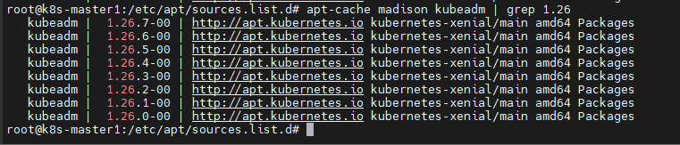
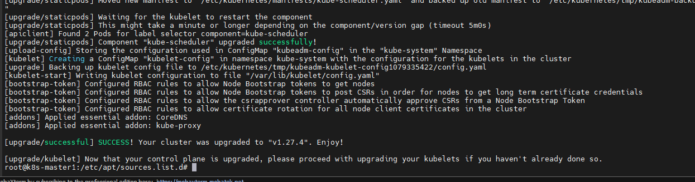
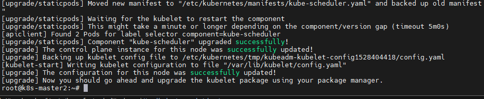

# Upgrading kubeadm clusters

Bài viết này mô tả cách thức nâng cấp 1 k8s cluster được tạo với kubeadm từ 1.25.x lên 1.26.x và từ 1.26.x lên 1.26.y (y > x). Không thể bỏ qua MINOR versions khi nâng cấp được, hãy lưu ý điều này.

Luồng upgrade được tóm tắt như thế này:
1. Upgrade 1 control plane node
2. Upgrade thêm các control plane node khác
3. Upgrade worker nodes

## Trước khi bắt đầu

- Hãy chắc chắn là bạn biết điểm khác nhau giữa 2 phiên bản cũ và mới
- Cluster nên sử dụng 1 static control plane và etcd pods hoặc external etcd
- Hãy chắc chắn là đã backup các thành phần quan trọng, như app-level state lưu trữ trong database. ```kubeadm upgrade``` không làm ảnh hưởng đến workloads mà chỉ liên quan đến các thành phần bên trong của k8s, nhưng backup luôn không thừa
- Swap luôn phải được tắt đi

### Thông tin thêm

- Hướng dẫn bên dưới đề cập đến thời điểm cần drain node trong quá trình upgrade. Nếu ta thực hiện minor version upgrade, đầu tiên ta phải drain node mà ta muốn upgrade. Trong trường hợp là node control plane, chúng có thể đang chạy CoreDNS Pods hoặc các workload quan trọng khác.
- Tất cả container được khởi động lại sau khi upgrade, vì mã băm của spec của container bị thay đổi
- Để verify rằng kubelet service đã khởi động lại thành công sau khi kubelet được nâng cấp, ta có thể sử dụng ```systemctl status kubelet``` hoặc xem service logs với ```journalctl -xeu kubelet```
- Việc sử dụng cờ ```--config``` của ```kubeadm upgrade``` với kubeadm configuration API types với mục đích cấu hình lại cluster khoong được khuyến kích và có thể dẫn đến kết quả không mong muốn

## Xác định version cần upgrade đến

Tìm kiếm chính xác phiên bản mới nhất của K8s v1.26:

```sh
apt update
apt-cache madison kubeadm
```



=> Version mới nhất của v1.26 là 1.26.7-00

## Upgrading control plane nodes

Thủ tục upgrade trên control plane nên được thực thi từng node một. Chọn 1 control plane node mà bạn muốn nâng cấp. Nó phải có tệp ```/etc/kubernetes/admin.conf```.

### Sử dụng "kubeadm upgrade"

**Với control plane node đầu tiên**

- Upgrade kubeadm

```sh
apt-mark unhold kubeadm && \
apt-get update && apt-get install -y kubeadm=1.27.4-00 && \
apt-mark hold kubeadm
```

- Verify việc tải thành công và đúng version

```sh
kubeadm version
```

- Verify upgrade plan

```sh
kubeadm upgrade plan
```

Lệnh trên kiểm tra rằng cluster của bạn có thể được upgrade, và thu thập phiên bản mà bạn có thể upgrade đến. Nó cũng cho thấy 1 bảng trạng thái các phiên bản cấu hình thành phần.

**Lưu ý:** kubeadm upgrade cũng tự động renew chứng chỉ mà nó quản lý trên node này

**Lưu ý 2:** Nếu ```kubeadm upgrade plan``` cho thấy bất kỳ thành phần cấu hình mà cần thiết upgrade thủ công, người sử dụng phải cung cấp 1 config file với cấu hình thay thế cho ```kubeadm upgrade apply``` thông qua cờ ```--config```. Thất bại khi làm điều này sẽ khiến ```kubeadm upgrade apply``` exit với lỗi và không thực hiện upgrade

- Chọn phiên bản cần upgrade lên, và chạy lệnh tương ứng. Ví dụ

```sh
sudo kubeadm upgrade apply v1.27.4
```

Khi lệnh trên hoàn thành, ta sẽ thấy thông báo tương tự như sau

```sh
[upgrade/successful] SUCCESS! Your cluster was upgraded to "v1.26.7". Enjoy!

[upgrade/kubelet] Now that your control plane is upgraded, please proceed with upgrading your kubelets if you haven't already done so.
```



- Upgrade thủ công CNI plugin (optional). Container Network Interface của bạn sẽ có hướng dẫn upgrade của chính nó. Hãy kiểm tra ở trong link [này](https://v1-26.docs.kubernetes.io/docs/concepts/cluster-administration/addons/) để biết thêm thông tin chi tiết. Các bước này sẽ không cần phải làm trên các node control plane khác nếu CNI quản lý bởi DaemonSet.

**Với các control plane nodes còn lại**

Tương tự với node control plane đầu tiên nhưng sử dụng

```sh
sudo kubeadm upgrade node
```

Thay vì

```sh
sudo kubeadm upgrade apply
```



Ngoài ra thì **không cần** dùng ```kubeadm upgrade plan``` và upgrade CNI nữa.

### Drain node

Chuẩn bị cho việc bảo trì và khiến nó unschedulable và trục xuất hết workloads ra:

```sh
kubectl drain <node-to-drain> --ignore-daemonsets
```

### Upgrade kubelet và kubectl

- Upgrade kubelet và kubectl:

```sh
apt-mark unhold kubelet kubectl && \
apt-get update && apt-get install -y kubelet=1.26.x-00 kubectl=1.26.x-00 && \
apt-mark hold kubelet kubectl
```

- Restart kubelet

```sh
sudo systemctl daemon-reload
sudo systemctl restart kubelet
```

### Uncordon node

Đưa node trở lại sử dụng (schedulable) với lệnh uncordon

```sh
kubectl uncordon <node-to-uncordon>
```

## Upgrading worker nodes

Thủ tục để upgrade worker nodes nên được thực hiện từng node một, hoặc là 1 ít node một, miễn là vẫn đảm bảo tài nguyên cần thiết để workload vẫn chạy được bình thường.

- Ugrade kubeadm:

```sh
apt-mark unhold kubeadm && \
apt-get update && apt-get install -y kubeadm=1.27.4-00 && \
apt-mark hold kubeadm
```

- Chạy ```kubadm upgrade```: với worker node thì lệnh này upgrade kubelet configuation của node đó

```sh
sudo kubeadm upgrade node
```

- Drain node: Chuẩn bị để maintenance node bằng cách khiến nó unschedulable và trục xuất hết workloads ra

```sh
kubectl drain <node-to-drain> --ignore-daemonsets --delete-emptydir-data --force
```

- Upgrade kubelet và kubectl

```sh
apt-mark unhold kubelet kubectl && \
apt-get update && apt-get install -y kubelet=1.27.4-00 kubectl=1.27.4-00 && \
apt-mark hold kubelet kubectl
```

```sh
sudo systemctl daemon-reload
sudo systemctl restart kubelet
```

- Uncordon node

```sh
kubectl uncordon <node-to-uncordon>
```

**Lưu ý:** Đối với Windows worker nodes thì làm theo hướng dẫn [này](https://v1-26.docs.kubernetes.io/docs/tasks/administer-cluster/kubeadm/upgrading-windows-nodes/)

## Verify trạng thái của cluster

Sau khi kubelet được cập nhật ở mọi node, hãy verify lại rằng tất cả node đã khả dụng trở lại:

```sh
kubectl get nodes
```

Status là ```Ready``` là được, và hãy chắc chắn version của tất cả node đồng bộ nhau.

## Khôi phục từ trạng thái thất bại

Nếu ```kubeadm upgrade fail``` và không thể roll back, ví dụ do 1 shutdown không đoán trước khi đang thực hiện upgrade, ta có thể chạy lại lệnh đó 1 lần nữa. Lệnh này sau cùng sẽ chắc chắn rằng state của node là state mà ta mong muốn

Để khôi phục từ 1 bad state, ta có thể chạy ```kubeadm upgrade apply --force``` mà không thay đổi version mà cluster đang chạy

Trong quá trình upgrade, kubeadm ghi những backup folder sau ở ```/etc/kubernetes/tmp```
- ```kubeadm-backup-etcd-<date>-<time>```
- ```kubeadm-backup-manifests-<date>-<time>```

```kubeadm-backup-etcd``` chứa 1 backup của local etcd member data của node hiện hiện tại. Trong trường hợp 1 etcd upgrade failure và nếu rollback tự động không hoạt động, nội dung của những folder này có thể được khôi phục thủ công trong ```/var/lib/etcd```. Trong trường hợp external etcd được sử dụng, folder backup này sẽ rỗng.

```kubeadm-backup-manifests``` chứa 1 bản backup của static Pod manifest files của control plane Node hiện tại. Trong trường hợp 1 upgrade failure và nếu rollbackup tự động không hoạt động, nội dung của folder này có thể sử dụng để khôi phục thủ công vào ```/etc/kubernetes/manifests```. Nếu vì vài lý do nào mà không có sự khác biệt giữa trước và sau khi upgrade, backup file này sẽ không được ghi.

## Cách thức hoạt động

```kubeadm upgrade apply``` thực hiện các việc sau:
- Kiểm tra rằng cluster của bạn đang trong trạng thái có thể upgrade
   - API server là reachable
   - Tất cả nodes đều ở trạng thái ```Ready```
   - Control plane node đang hoạt động tốt
- Thực thi chính sách lệch phiên bản
- Đảm bảo control plane images là khả dụng hoặc khả dụng để pull
- Khởi tạo các thay thế hoặc/và sử dụng bản ghi đè mà người dùng cung cấp nếu các cấu hình thành phần cần cập nhật phiên bản
- Upgrade các thành phần của control plane hoặc rollback nếu bất kỳ thành phần nào fail
- Áp dụng ```CoreDNS``` mới và ```kube-proxy``` manifests và chắc chắn rằng tất cả RBAC rule cần thiết đã được tạo
- Tạo chứng chỉ và key mới cho API server và backup các file cũ nếu chúng sẽ hết hạn trong khoảng 180 ngày

```kubadm upgrade node``` thực hiện các điều sau trên control plane nodes:
- Fetches kubeadm ```ClusterConfiguration``` từ cluster
- Tùy chọn backup chứng chỉ của kube-apiserver
- Upgrade static Pod manifests cho các thành phần của control plane
- Upgrade kubelet configuration cho node này

```kubeadm upgrade node``` thực hiện các bước sau trên worker nodes:
- Fetches kubeadm ```ClusterConfiguration` từ cluster
- Upgrade kubelet configuration cho node này